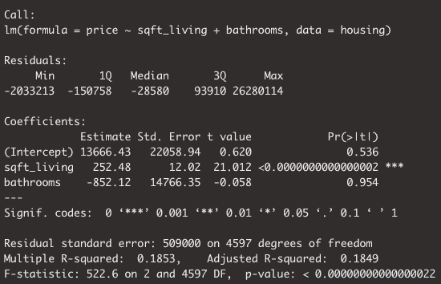
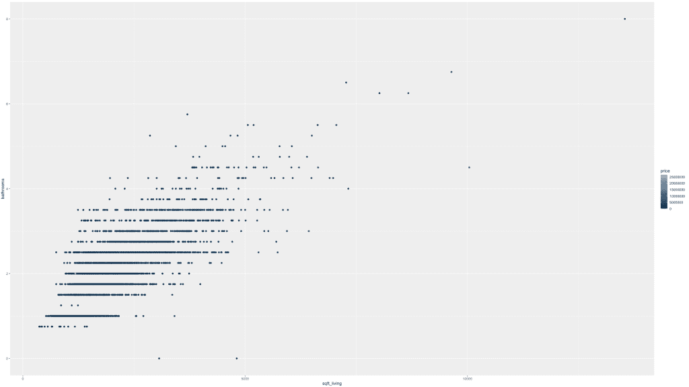
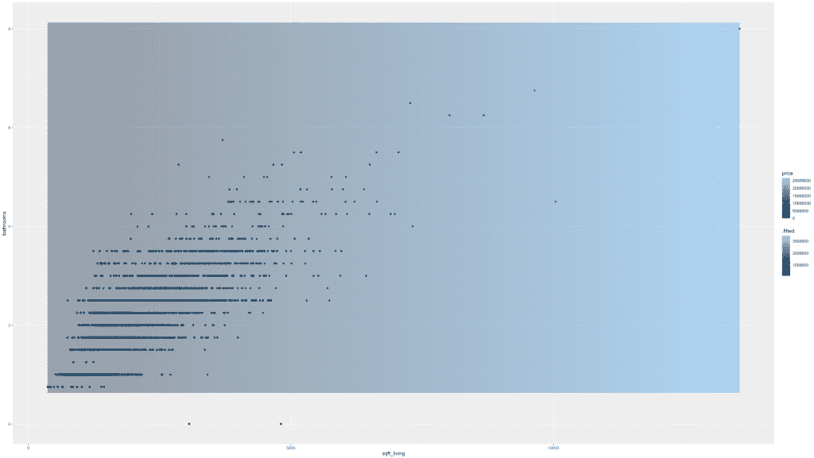

# 使用热图可视化多元线性回归

> 原文：<https://towardsdatascience.com/visualizing-multiple-linear-regression-with-heatmaps-3f69f1652fc4?source=collection_archive---------35----------------------->


图片来自 [Pixabay](https://pixabay.com/?utm_source=link-attribution&utm_medium=referral&utm_campaign=image&utm_content=1430105) 的 [DavidRockDesign](https://pixabay.com/users/DavidRockDesign-2595351/?utm_source=link-attribution&utm_medium=referral&utm_campaign=image&utm_content=1430105)

# 介绍

不管你对数据科学和统计世界有多了解，在某个时候，你可能至少听说过回归。作为多元回归快速课程的前奏，您应该对简单线性回归有所了解。如果你不是，你可以从这里开始！否则，让我们开始多元线性回归。

我们在简单线性回归和多元线性回归之间的区别仅仅是帮助我们理解因变量的解释变量的数量。

多元线性回归是数据科学家非常流行的统计技术，也是数据科学家使用的许多更复杂方法的基础。

# 多元线性回归

在我关于简单线性回归的[帖子](/build-evaluate-and-interpret-your-own-linear-regression-model-in-minutes-e6a3e8253501)中，我给出了使用一个数字变量——平方英尺来预测房价的例子。

这篇文章与我的另一篇关于多元线性回归的文章非常接近，区别在于解释因变量的变量的数据类型。那篇[帖子](/multiple-regression-a-primer-on-parallel-slopes-models-137d114e314e)用一个数字&一个分类变量解释了多元线性回归；也称为平行斜坡模型。

下面我们将介绍的内容将让我们深入了解一个多元线性回归模型，在该模型中，我们使用多个数字变量来解释我们的因变量，以及我们如何有效地利用热图进行可视化。尽情享受吧！

# 让我们建立一个回归模型

类似于我们在前面提到的文章中所构建的，我们将创建一个线性回归模型，其中我们添加了另一个数字变量。

我们正在处理的数据集是西雅图房价数据集。数据集的记录级别是按房屋和详细价格、平方英尺数、床位数、浴室数等。

在这篇文章中，我们将尝试通过数据集中其他数值变量的函数来解释价格。

说到这里，让我们开始吧。与其他帖子类似，我们使用`sqft_living`来预测`price`，只是这里我们将添加另一个变量:`bathrooms`。

```
fit <- lm(price ~  sqft_living + bathrooms,    
          data = housing)
summary(fit)
```



回归模型中包含各种数字解释变量在语法上和数学上都很简单。

# 可视化限制

虽然从技术上讲，您可以将数字变量一个接一个地分层到同一个模型中，但这很快就会变得难以可视化和理解。

在我们的模型中，我们需要评估三个独立的维度。

接下来，我们将回顾不同的方法来可视化越来越复杂的模型。

# 打开热图

我们可视化的目的是理解给定变量之间的相互关系。对于两个数值变量，简单的散点图是非常直观的选择。目前，我们包括第三个变量，事情有点混乱。

我们将回顾的第一个选项是热图。这种覆盖散点图的可视化形式很好地传达了我们的模型输出如何随着解释变量组合的变化而变化。

首先，我们需要创建一个网格，将两个变量的所有独特组合结合起来。这将是关键，因为我们希望对我们的模型如何随解释变量变化有一个详尽的了解。

一旦我们做到了这一点，我们就可以给它们中的每一个分配预测，给我们一个清晰的指示，表明我们对数值变量的所有潜在组合的预测。

下面我将使用 table 函数来了解值的范围，以便创建序列，如您在下面的代码中所见。或者，您也可以将给定变量的所有唯一出现的情况传递给 expand.grid 函数，比如 so `data.frame(table(housing$sqft_living))[1]`。

我们使用 expand.grid 创建一个包含各种变量组合的数据框架。

```
table(housing$bathrooms)
table(housing$sqft_living)all_combinations <- expand.grid(sqft_living = seq(370, 13540, by = 10), bathrooms = seq(0.75, 8, by = 0.25))
```

现在我们有了数据框架，让我们使用`broom`的`augment`函数生成预测。

```
combos_aug <- augment(fit, newdata = all_combinations)
```

让我们开始视觉化。

```
housing %>%
ggplot(aes(x = sqft_living, y = bathrooms))+
  geom_point(aes(color = price))
```



在这里，我们看到了解释变量之间的分散，颜色梯度分配给因变量价格。

让我们添加我们的瓷砖。我们看到与上面相同的代码，我们只是现在包含了带有模型预测的`geom_tile`函数，`.fitted`。

```
housing %>%
ggplot(aes(x = sqft_living, y = bathrooms))+
  geom_point(aes(color = price))+
  geom_tile(data = combos_aug, 
            aes(fill = .fitted), alpha = 0.5)
```



如您所见，我们可以看到一个更明显的梯度在 x 轴上穿过`sqft_living`。也就是说，我们还可以看到 y 轴上`bathrooms`的一些梯度。同样，我们可以看到，在图表的右下方，点颜色渐变所显示的价格要暗得多/低得多。

# 结论

创建一个包含大量不同解释变量的模型非常容易。这是否会对给定的变量产生更深的理解是个问题。虽然这是一个简单的例子，但我希望它能对你理解一些更复杂的多元线性回归模型有所帮助。

在这篇文章中，我们讨论了以下内容:

*   多元线性回归定义
*   构建 mlr 模型
*   可视化/解释限制
*   将热图与散点图结合使用

如果这有帮助，请随时查看我在[datasciencelessons.com](http://datasciencelessons.com)的其他帖子。祝数据科学快乐！