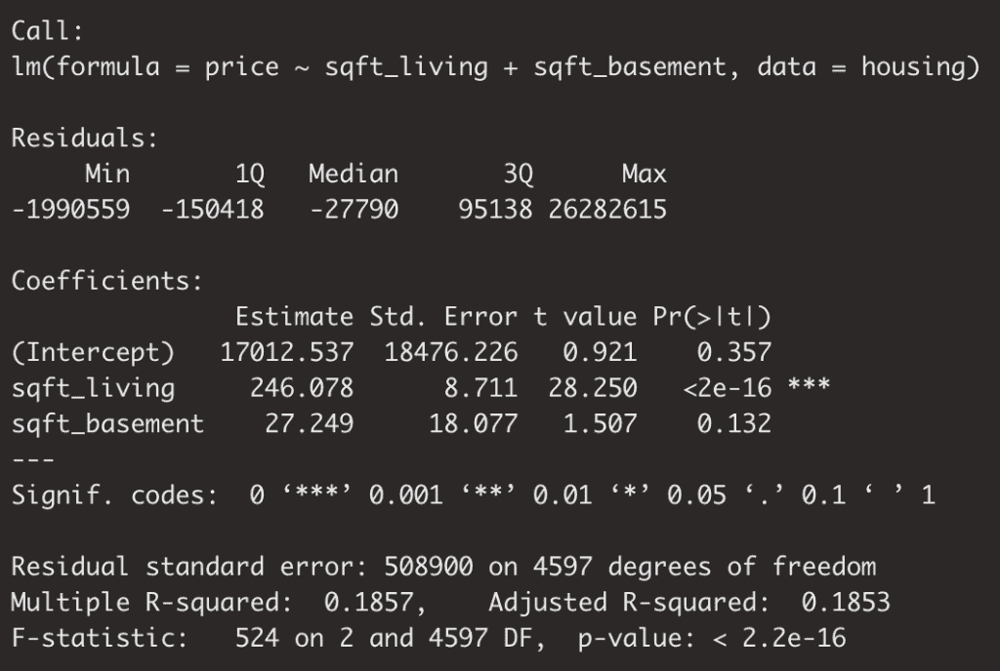
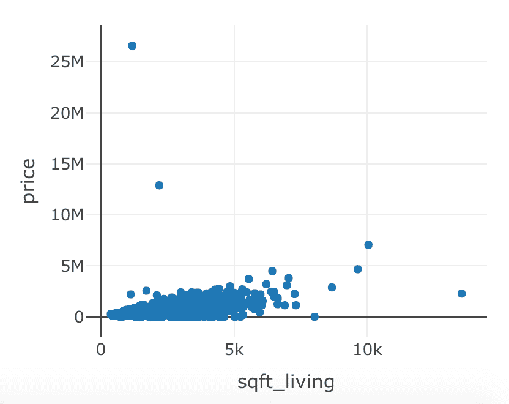
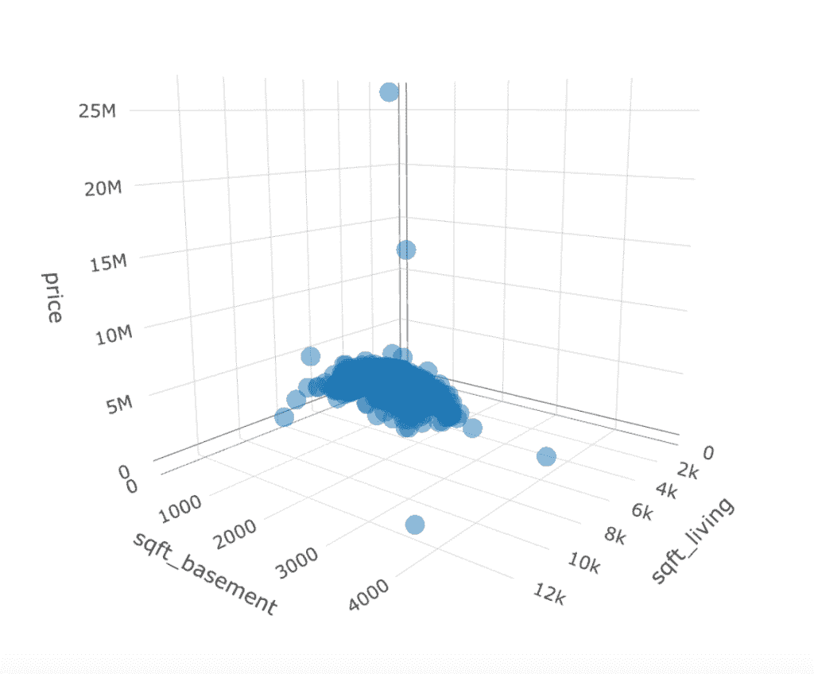
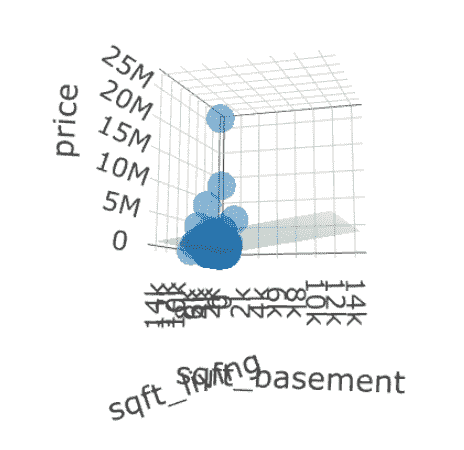

# 三维可视化多元回归

> 原文：<https://towardsdatascience.com/visualizing-multiple-regression-in-3d-a1e7aba7a007?source=collection_archive---------30----------------------->

## 如何更好地理解高维数据集？


图片由 [Mediamodifier](https://pixabay.com/users/Mediamodifier-1567646/?utm_source=link-attribution&utm_medium=referral&utm_campaign=image&utm_content=2140601) 来自 [Pixabay](https://pixabay.com/?utm_source=link-attribution&utm_medium=referral&utm_campaign=image&utm_content=2140601)

# 介绍

不管你是否接触过数据科学&统计学，至少，你很可能听说过回归。在本帖中，我们将讨论多元回归，作为前兆，你肯定希望对简单的线性回归有所了解。如果你不熟悉，你可以[从这里开始](/build-evaluate-and-interpret-your-own-linear-regression-model-in-minutes-e6a3e8253501)！否则，让我们开始多元线性回归。我最近谈到了用热图可视化多元线性回归，如果你已经读过这篇文章，请随意跳到这篇文章的建模部分，在那里我们将构建我们的新模型，并介绍`plotly`包和三维可视化。如果你还没有读过，这是另一个可视化[多元回归](/visualizing-multiple-linear-regression-with-heatmaps-3f69f1652fc4?source=your_stories_page---------------------------)的有用方法。

# 多元线性回归

我们在简单线性回归和多元线性回归之间的区别仅仅是帮助我们理解因变量的解释变量的数量。

多元线性回归是数据科学家非常流行的统计技术，也是数据科学家使用的许多更复杂方法的基础。

在我关于简单线性回归的文章中，我给出了一个用一个数字变量——平方英尺来预测房价的例子。

这篇文章是我们探索线性回归不同实现的系列文章的一部分。在我们探索[平行斜坡模型](/multiple-regression-a-primer-on-parallel-slopes-models-137d114e314e)的帖子中，我们创建了一个模型，在这个模型中，我们使用平方英尺来预测价格，以及它是否是一个滨水房产。这里我们将做一些类似的事情，但是我们将使用多个数字输入来创建我们的模型。

# 让我们开始建模

类似于我们在前面提到的文章中所构建的，我们将创建一个线性回归模型，其中我们添加了一个新的数值变量。

我们正在处理的数据集是西雅图房价数据集。数据集的记录级别是按房屋和详细价格、平方英尺数、床位数、浴室数等。

在这篇文章中，我们将尝试通过数据集中其他数值变量的函数来解释价格。

说到这里，让我们开始吧。与我们之前构建的类似，我们使用`sqft_living`来预测`price`，只是这里我们将添加另一个变量:`sqft_basement`

```
fit <- lm(price ~  sqft_living + sqft_basement,    
          data = housing)
summary(fit)
```



回归模型中包含各种数字解释变量在语法上和数学上都很简单。

# 可视化限制

虽然从技术上讲，您可以将数字变量一个接一个地分层到同一个模型中，但这很快就会变得难以可视化和理解。

在我们的模型中，我们需要能够评估三个独立的维度。

正如我之前提到的，这里我们将使用`plotly`的 3d 绘图工具来加深理解。

让我们和`plot_ly`一起玩吧！

让我们首先可视化`sqft_living`和`price`来熟悉语法。

```
plot_ly(data = housing, x = ~sqft_living, y = ~price, opacity = 0.5) %>%
  add_markers()
```



如你所见，语法与 ggplot 没有太大的不同。首先指定数据，然后跳入美学，而不必明确声明它们是美学。上图是一个简单的二维散点图。

让我们在三维空间中想象一下！

```
plot_ly(data = housing, z = ~price, x = ~sqft_living, y = ~bathrooms, opacity = 0.5) %>%
  add_markers()
```



类似于我们之前所做的，我们只是将`price`移动到 z 轴，现在包括了`sqft_basement`。这个绘图工具的有趣之处在于它不是静态的，你可以点击并拖动旋转你观察绘图的角度。显然这里你只是看到了一个截图，但是让它在你自己的机器上运行来体验一下`plotly`的全部灵活性。当您在 RStudio 中运行这个命令时，您的`Viewer`窗口将会填充这个可拖动/可移动的可视内容，这有助于解释更大维度的数据集。

# 添加平面

当从二维转移到三维时，事情就变了。如果你有线性代数的背景，这可能会引起共鸣。简单来说，如果你有一个单一的维度，那么你就有一个点。如果你有两个维度，你有一条线。如果你有三个维度…你就有一个*平面*。

考虑到这一点，让我们用一个平面来形象化我们的多元线性回归模型。

首先，我们需要创建一个矩阵，其中包含所有可能的模型输入以及每种情况下的模型预测。

下面我为我们的`x`和`y`创建一个向量。然后我们将它们传递给`outer`函数，在这里我们声明将它们传递给通过拟合我们的模型定义的线性回归函数的操作。

```
x <- seq(370, 15000, by = 10)
y <- seq(0, 15000, by = 10)plane <- outer(x, y, function(a, b){fit$coef[1] + 
    fit$coef[2]*a + fit$coef[3]*b})
```

现在我们有了我们的飞机，让我们把它添加到我们的视觉。

```
plot_ly(data = housing, z = ~price, x = ~sqft_living, y = ~sqft_basement, opacity = 0.5) %>%
  add_markers() %>%
  add_surface(x = ~x, y = ~y, z = ~plane, showscale = FALSE)
```



再说一次，你必须自己跳进去和`plotly`一起玩。

你做到了！您已经将一个平面添加到您的 3D 散点图中，该平面代表我们的回归公式与不同输入`sqft_lot` & `sqft_basement`之间的关系，但是我们仍然有一个问题…这如何帮助我们？

你曾经在你的 2D 散点图上加过回归线吗？如果是，意图是什么？

你可以在你的图中添加一条线来表示“最佳拟合”是什么样子，但是对于给定的`x`值，我们可以预测`y`，这也是很有用的。飞机给了我们这一切。对于`x`和`y`的给定值，`z`是什么？

# 结论

我们在短时间内做了很多工作。多元线性回归模型会很快变得越来越复杂。我希望将此功能添加到您的工具集中，您将能够更好地理解您正在处理的数据和模型。给一个模型加载我们能接触到的每一个变量并不是非常困难，但是它确实提出了这样一个问题:它是否解决了我们的目标。它是否有助于我们在参与建模过程时开始获得的那种理解？

在短短的几分钟内，我们讲述了:

*   多元线性回归定义
*   构建 mlr 模型
*   可视化/解释限制
*   使用 3D 绘图和平面来解释我们的数据和模型

如果这有帮助，请随时查看我在 datasciencelessons.com 的其他帖子。祝数据科学快乐！