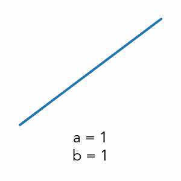
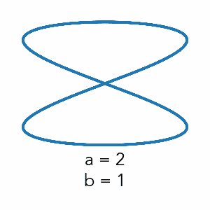
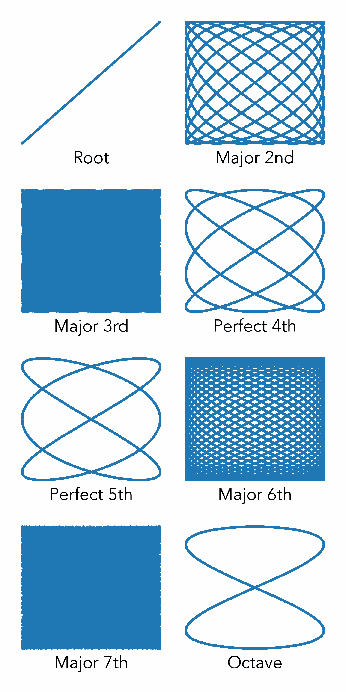
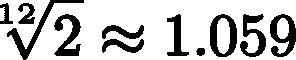
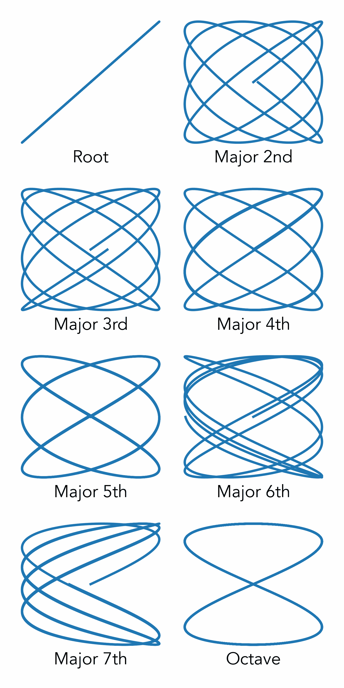

# 用李萨如曲线可视化音乐音程

> 原文：<https://towardsdatascience.com/visualizing-musical-intervals-with-lissajous-curves-351248ee30ff?source=collection_archive---------47----------------------->

## 可视化确定完美/不完美的音乐音程

照片由[马尔特·温根](https://unsplash.com/@maltewingen?utm_source=unsplash&utm_medium=referral&utm_content=creditCopyText)在 [Unsplash](https://unsplash.com/s/photos/music?utm_source=unsplash&utm_medium=referral&utm_content=creditCopyText) 上拍摄

我喜欢音乐——弹吉他总能让我从日常生活中的压力中解脱出来。音乐最神奇的一面是，多个独立的音符是如何组合成一个和弦的——这个和弦比单个部分的总和还要大。但是是什么让某些和弦听起来和谐而其他的不和谐呢？最终，它归结为和弦中音符频率的比率。为了看到这一点，我们可以使用一个叫做[李萨如曲线](https://en.wikipedia.org/wiki/Lissajous_curve)的函数。

# **李萨如曲线**

以朱尔斯·安托万·李萨如命名的李萨如曲线由以下参数方程定义:

使用上述等式绘制的曲线对 *a* 和 *b* 的值非常敏感，本质上是一种不协调的度量。比率 *a/b* 也在视觉上对应于李萨如曲线中的叶片数。此外，当这个比例不合理时，图将出现旋转。让我们看看如何使用它来可视化不同的和弦音程。

# **在 Python 中定义函数**

对于这个分析，我们将用 Python 创建可视化，所以首先我们应该导入相关的包:

如果你使用 Jupyter 来生成你的动画，你需要添加行`%matplotlib notebook`来使用交互式后端。

现在，我们可以为我们的李萨如曲线定义函数——我们将使用简化形式的方程，其中系数 *A* 和 *B* 都将设置为 1，我们将设置𝛿 = 0，因此在 *x* 项中没有偏移。

在我们的函数中，输入`t`将是我们传递给`sin`和`cos`的时间值数组，而`a`和`b`将是我们之前讨论过的常数，它们代表了不协调的度量。

让我们对常规参数进行一些调整——我们将移除四个轴棘并更改绘图的字体属性:

我以前写过一篇文章[在这里](/intro-to-dynamic-visualization-with-python-animations-and-interactive-plots-f72a7fb69245)关于 Python 动画情节的基础，但是我们将快速浏览这里的所有步骤。首先，我们要创建一个空图，并创建一个对该图的变量引用，然后我们可以使用它在动画过程中更新数据。

现在，我们需要创建动画函数——该函数将索引`i`作为输入，并在每次调用时使用该信息更新绘图。在我们的例子中，我们将改变基于`i`的值绘制的时间间隔，这样不和谐和“不稳定”的图将随着时间范围的变化而发生视觉变化。在下面的代码中，我已经将 *a* 和 *b* 的值都设置为等于 1。

在上面的例子中，在第一次迭代中，我们绘制从 0 到 8π的`t`值，随后的迭代从 8π到 16π，依此类推。我们实际上是在绘制一个时间尺度，并在更新动画时滑动整个时间尺度。

最后，我们可以用下面的代码调用动画:

`frames` —我们使用`range(10)`来传递来自[0，9]的值列表

`interval` —我们将每 100 毫秒移动一次时间刻度

`repeat` —我们将不断重复播放动画

为了美观，我们将去掉 x 和 y 刻度标记，并将 x 轴标签设置为代表我们选择的 *a* 和 *b* 的值。

`xlabel`中的`\n`是一个转义换行符——通过添加这些字符，我们将在单独的行上打印出 *a* 和 *b* 的值。因为我们有一个多行轴标签，所以我们可以添加以下行来确保整个标签可见:

现在，对于 *a = b =* 1 这个简单的例子，我们得到如下结果(记住这实际上是一个动画！).

`writer` —用于创建动画的后端(为此我们使用`pillow`)

`fps` —每秒帧数(因为我们每 100 毫秒调用一次 animate，所以我们应该将这个值设为 10 来匹配)

`dpi` —用于制作动画的图像分辨率(每英寸点数)

当我们的两个频率相同时，我们得到的是一条不随时间变化的线。请记住，“看起来更简单”的数字是 *a* 和 *b* 的低整数比的结果，在这种情况下，它们都等于 1。此外，由于该比率是一个有理数，我们不希望该图随时间旋转。

音乐频率的第二个自然泛音是它的倍频，也称为八度。通过将 *a* 的值改为 2，我们得到如下动画:

由于 *a* 与 *b* 的比值现在是 2，我们的李萨如曲线中有 2 个凸角，并且由于 *a/b* 是有理数，我们没有旋转。在古希腊，毕达哥拉斯就曾使用这样的“纯音程”来调整音符，以产生一个音阶。

# **毕达哥拉斯调音**

毕达哥拉斯调音系统使用两个纯音程来确定整个音阶:八度音阶(2:1)和完美五度音阶(3:2)——你可以在本文[这里](https://en.wikipedia.org/wiki/Pythagorean_tuning)找到更多信息。通过反复应用这两个比率，我们可以生成音阶中的所有音符。举个例子:

> **从基频、八度、五度开始:**
> 
> (1/1), (3/2), (2/1)
> 
> **相对于当前五度音程寻找新的完美五度音程:**
> 
> (3/2) * (3/2) = (9/4)
> 
> **因为这个值大于我们的八度音程(2/1)，我们除以这个比率(2)使它回到我们的音程:**
> 
> (3/2) * (3/2) *(1/2) = (9/8)
> 
> **我们现在的规模是:**
> 
> (1/1), (9/8), (3/2), (2/1)
> 
> **其中(9/8)现在代表一个新音符——大调第二音符**

我们一遍又一遍地继续这个过程，直到我们生成了音阶的所有音符——只看大调音阶的音符，我们得到:

> **根:** (1/1)
> 
> **大调第二:** (9/8)
> 
> **大调第三:** (81/64)
> 
> **完美 4 档** : (4/3)
> 
> **完美 5 档** : (3/2)
> 
> **大 6:**(27/16)
> 
> **大七:** (243/128)
> 
> **八度:** (2/1)

我们可以通过使用支线剧情和绘制每个动画来可视化所有这些笔记！我们将制作如下的支线剧情:

`add_subplot(xyz)` — `x`是行数，`y`是列数，`z`是感兴趣的支线剧情(从左上角开始，逐一遍历每行)

现在，我们的动画函数必须同时更新所有的支线剧情:

勾股调音中主要音阶音程的李萨如曲线

还是那句话，上面的情节都是动画的，所以我们可以看到没有一个是“不稳定”的。然而，正如我们之前看到的，曲线的复杂性代表了整个数字比率，我们看到大 3 度和大 7 度的复杂性很高。虽然后一个音程听起来不和谐(因为它们对应于两个连续的半音)，但大三度应该不会。其实这其实是对使用毕达哥拉斯调音音阶的主要批评！大三度音是如此的不协调，以至于会导致大和弦听起来不和谐。

# **性情平等**

通常用来解决这个问题的调音系统是[十二音平等律](https://en.wikipedia.org/wiki/Equal_temperament)，其中相邻音符之间的比率不再由纯音或整数比率来定义，而是相等的。为此，我们取 2 的十二次方根，因为每 12 个半音频率加倍(八度)。

使用这个系统的结果是，因为我们不再使用纯音音程，所以我们所有的音符都只是*稍微*走调，不像毕达哥拉斯系统，在毕达哥拉斯系统中，许多音程都是完美的，一些大整数的比率会导致不和谐。然而，相对音程可以提供比毕达哥拉斯的和弦听起来不那么不和谐的和弦。

现在，让我们像对毕达哥拉斯调音一样，用平等的音律来想象大调音阶。我们需要构建大调音阶的半音如下:

> **词根:**原始频率
> 
> **大调第二:**第二半音
> 
> **大调第三:**第四**半音**
> 
> **全四度**:五度半音
> 
> **全五度**:七度半音
> 
> **大调第六:**第九半音
> 
> **大调第七:**第十一半音
> 
> **八度:**第十二个半音(或倍频)

下面是我们如何在动画函数中实现它的一个例子:

勾股调音中主要音阶音程的李萨如曲线

我们看到八度以外的所有音程现在都不稳定了！即使是平均律系统中的五度音程也不再是完美的五度——然而，我们注意到大三度现在比在毕达哥拉斯调音的情况下不那么不和谐了。这就是为什么对于像钢琴这样的乐器来说，在飞行中微调音符是不可能的(例如，在管乐器中)，同等调和的音符是更可取的。

# **结束语**

我希望这篇文章对展示我们如何使用动态 Python 可视化来判断音乐和弦中的“不和谐”有用。本文中的所有代码都可以在这个 [Github 资源库](https://github.com/venkatesannaveen/medium-articles)中找到。

我感谢任何建议或反馈！你可以在 [Twitter](https://twitter.com/naveenv_92) 上关注我，或者在 [LinkedIn](https://www.linkedin.com/in/naveenvenkatesan/) 上联系我，获取更多文章和更新。