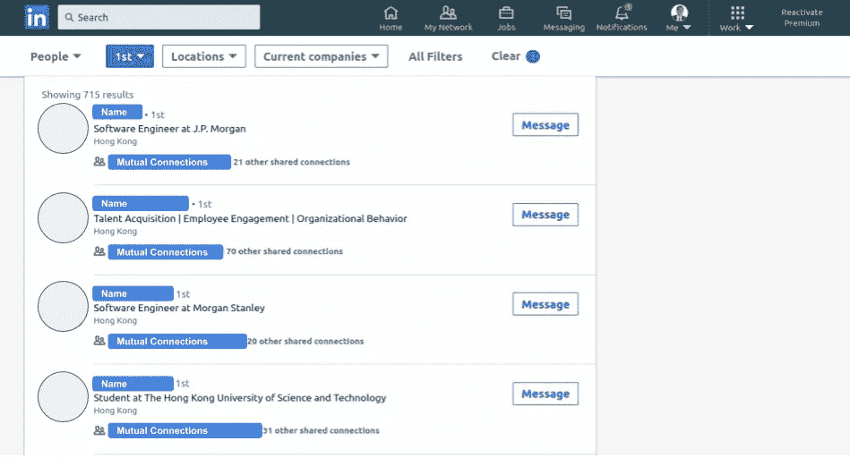
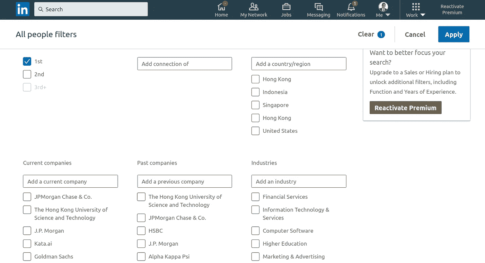
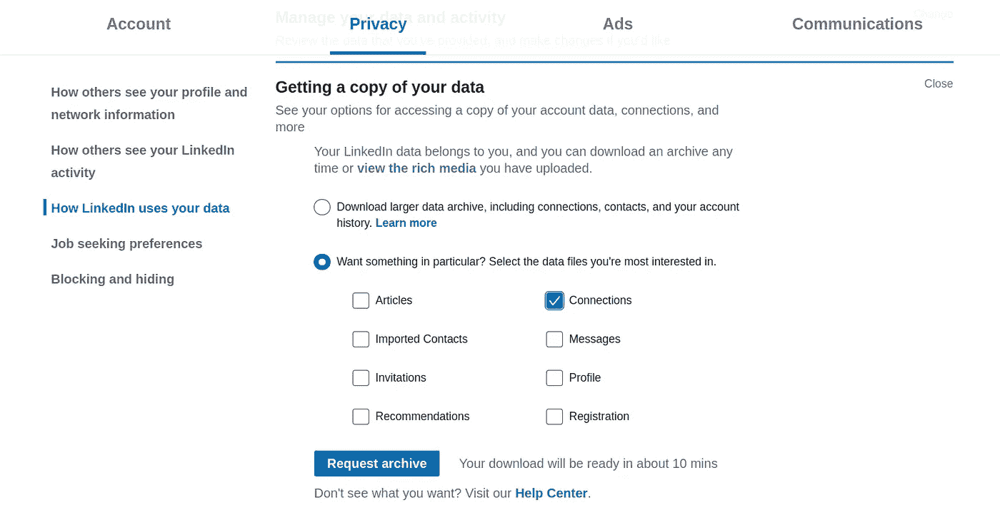
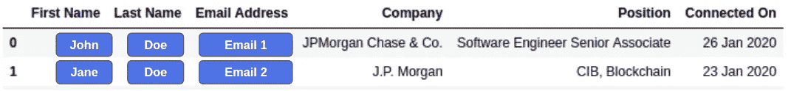
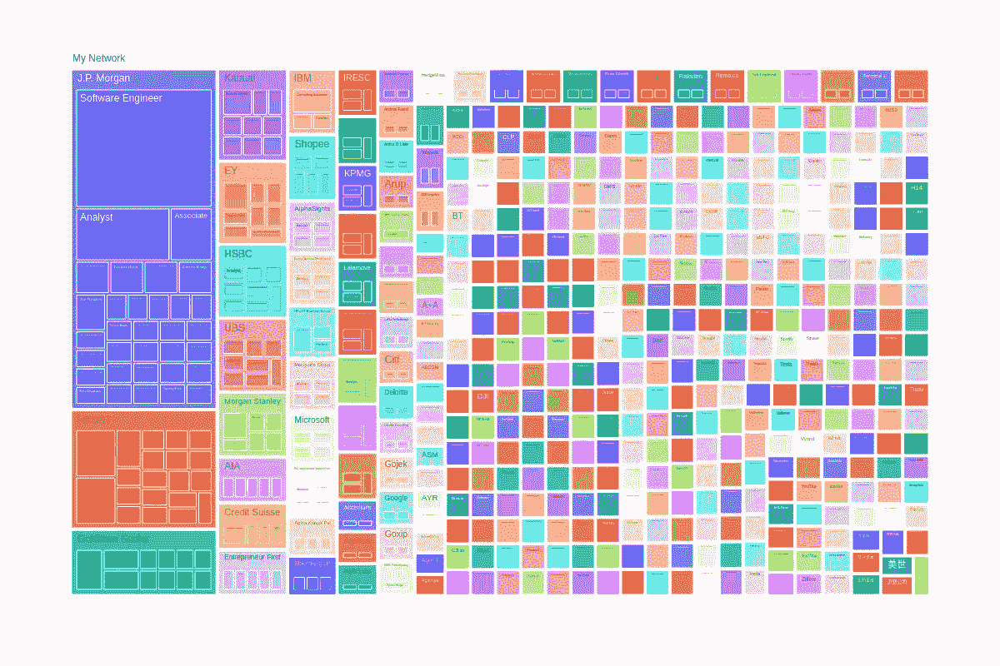
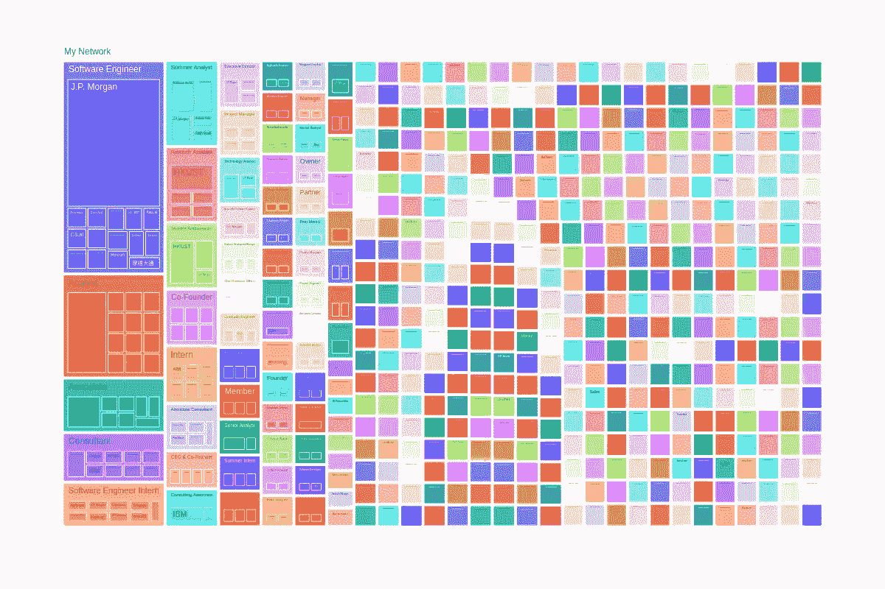

# 可视化我的 LinkedIn 网络

> 原文：<https://towardsdatascience.com/visualizing-my-linkedin-network-c4b232ab2ad0?source=collection_archive---------3----------------------->

## 一目了然地看到我的整个网络

来自金的便利，承蒙[吉菲](https://giphy.com/)

这就是我在现实生活中参加社交活动时的感受。然而，使用 LinkedIn 建立我的人际网络是一种完全不同的体验——我甚至通过给平台上的人发短信获得了一份实习工作。所以我真的很看重这个平台，非常看重。

# LinkedIn 的不足之处

但是 LinkedIn 在一个主要方面让我失望了，真的很难理解你的网络。我的意思是，LinkedIn 没有提供任何方便的统计数据或可视化工具来让你了解你的 LinkedIn 领域，这使得你很难最大限度地利用它。

在探索你自己的 LinkedIn 网络时，这几乎是最好的了。



我的网络->连接->使用过滤器搜索



用于搜索的所有过滤器

您可以使用一些过滤器，但仅此而已。你不能把你的整个网络看做一瞥或任何统计摘要，所以很难对你的数据进行理解。

我觉得可视化我的网络，将有助于我最终了解我的 LinkedIn 足迹——谁在其中，他们在哪里工作，是否多样化等等。在这成为他们平台上的一个功能之前，我希望你会受到启发，积极主动地想象你自己的网络，最终了解你网络中的 500 多个联系是由什么样的人组成的。

# 获取我的 LinkedIn 数据

如果我想可视化我的网络，第一步是获取我的网络数据。你可能认为这有一个 API，你是对的。但是 LinkedIn 的 API 使用起来并不那么简单——访问连接数据需要多个权限，这是有充分理由的。但是我所需要的可视化**我的**网络就是**我的**数据。LinkedIn 非常好，可以让下载你自己数据的过程变得相当简单——不需要 API，只需下载一个好的旧 csv 文件。



您可以在个人资料的“设置和隐私”部分找到它

# 有趣的部分到了——可视化！

所以现在数据可用了，我需要开始分析它——我的首选工具是可信赖的 [Jupyter 笔记本](https://jupyter.org/)。

这是我下载的 *Connections.csv* 文件的前几行。

```
import pandas as pd
df = pd.read_csv('Connections.csv')
df.head()
```



它列出了我的网络中每个人的电子邮件、当前职位和公司，以及他们何时成为我的网络的一部分。但是打印 csv 的行显然不是可视化或理解我的网络的最佳方式。

为了让我的整个网络一目了然，我将使用 [Plot.ly](http://plot.ly) 的树形图。

```
import plotly.express as px
px.treemap(df, path=['My Network', 'Company', 'Position'], width=1200, height=1200)
```



用 Python 中的 [Plot.ly](https://plot.ly/python/) 制作

让我们仔细看看…

我最近才发现树状图，我很高兴我发现了它们，因为它如此优雅地捕捉了 LinkedIn 网络数据。

该图将我的关系网分为一个等级结构——关系网、关系网中的公司以及在这些公司中的职位。每个区块的大小表明有多少人属于该组。因此，公司磁贴越大，它在我的网络中所占的比例就越大。公司内部的瓷砖也是如此。这让我探索我的网络构成变得如此容易和有趣。

但是我还没说完。通过切换代码中的几个参数，我可以探索以位置为中心的网络视图，而不是以前可视化的以公司为中心的视图。

```
px.treemap(df, path=['My Network', 'Position', 'Company'], width=1200, height=1200)
```



也是用 Python 中的 [Plot.ly](https://plot.ly/python) 制作的

我们可以再仔细看看。

# 解读数据

在玩了太长时间的可视化游戏后，我开始思考他们在说什么。

比较以公司和职位为中心的树形图给了我一个有趣的见解。在公司焦点中，我可以看到明显的主导公司，如摩根大通、HKUST 和高盛。但立场聚焦，显示了更民主的观点。目前有几个主要职位:软件工程师、分析师和助理——但大图显示了更多样化的存在(更多的小盒子和更少的笨重盒子)。这让我很惊讶，因为这违背了我最初的直觉“工作种类比公司少”。相反，小众角色比我预想的要多得多，它们压倒了公司的多样性(至少在我的网络中)。

就个人而言，这些树状图也让我意识到我的 LinkedIn 网络比我想象的更加多样化。看着我的推荐和我最近添加的人，我经常认为一些公司和肯定一些职业构成了我的网络的大部分。但这与事实相去甚远，因为我现在意识到，我的大部分人际网络是由公司和职业组成的，它们只包含一两个人。

本质上，这些发现是一个…

来自朋友，承蒙[吉菲](https://giphy.com/)

# 自己尝试代码

你可以修改代码，并通过直接进入活页夹环境[这里](https://mybinder.org/v2/gh/tavishcode/linkedin_analysis/60c4a66511bd6ed04d1a3bbe68b63c3898fc696d)与可视化交互。

你也可以通过[访问代码库，这里是](https://github.com/tavishcode/linkedin_analysis)。

## 如果你有任何问题、批评或赞美，请随时在推特、 [LinkedIn](https://www.linkedin.com/in/tgobindram/) 或下面联系我😄