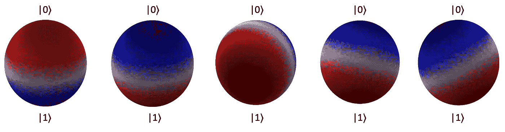
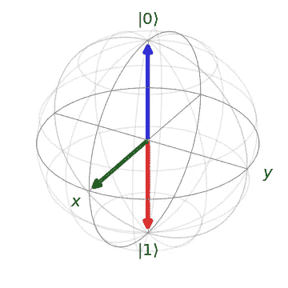
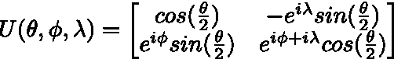
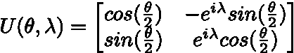
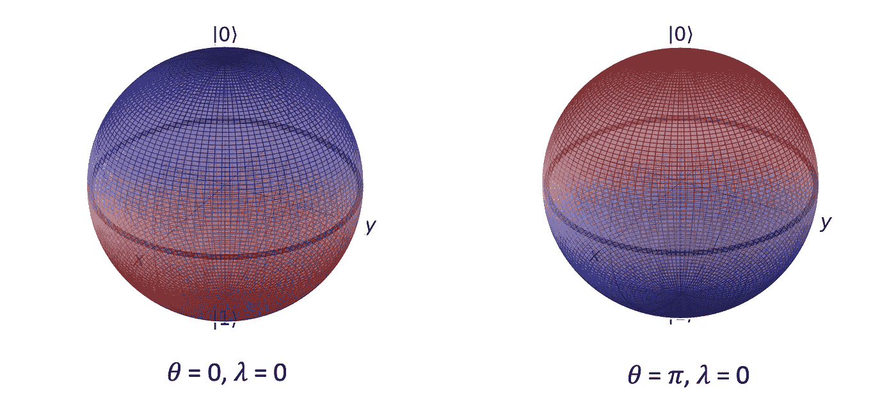
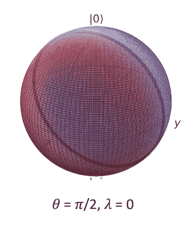
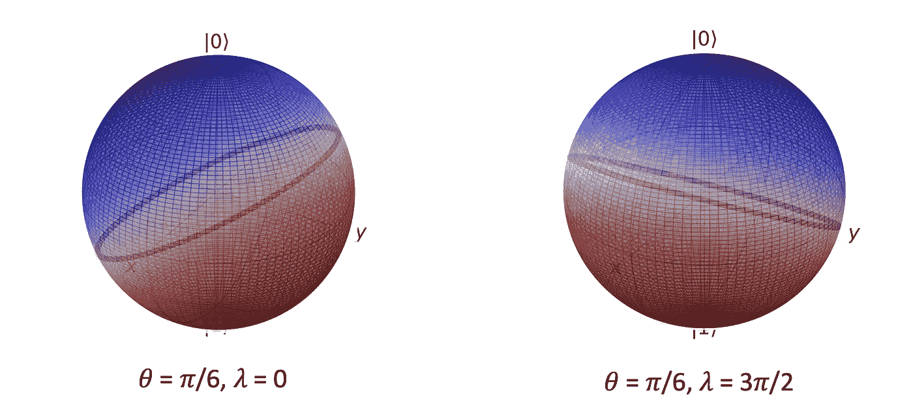
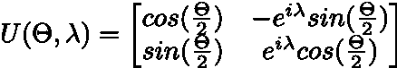
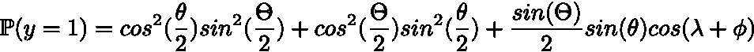
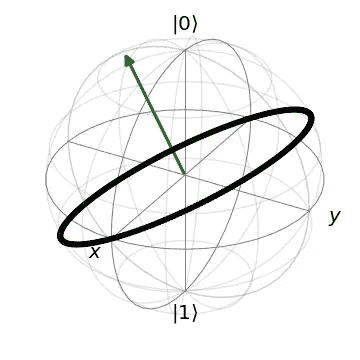

# 可视化参数化量子分类器。

> 原文：<https://towardsdatascience.com/visualizing-parameterized-quantum-classifiers-e5dfb0c584ba?source=collection_archive---------62----------------------->

## 一个量子位数据的情况。

这篇文章的目的是解释在 1 个量子位的情况下量子态的参数化二进制分类器。这个简单的例子允许我们有一些很好的可视化，甚至一些分析表达式。

第一部分将陈述结果并显示数字，而技术证明将留给第二部分。所以如果你不喜欢方程，你可以在第一部分之后停止阅读。

我鼓励每个不熟悉球坐标的人看看这里的，因为这是这篇文章的核心。

这个帖子不是对量子计算的介绍，[这里的](https://www.youtube.com/watch?v=JhHMJCUmq28)是关于它的最清晰的视频。[这里](/quantum-computing-explained-a114999299ca)是更详细的文章。

*所有的图形都是用库* [*QuTip*](http://qutip.org/docs/latest/guide/guide-bloch.html) *创建的。*

# 可视化和结果

## 布洛赫球

量子态可以表示为一个复矢量|ψ> = 𝑎|0>+𝑏|1>，比如|𝑎| + |𝑏| = 1。它也被定义为一个全局相位，我们可以用𝜃 ∈ [0，π]和ϕ∈ [0，2π]写出|ψ> = cos(𝜃/2)|0>+e^(iϕ)sin(𝜃/2)|1>。这对夫妇(𝜃，ϕ)在 R^3 的单位球面上定义了一个点，这种量子位的表示被称为布洛赫球面。

这是一个用布洛赫球表示的量子态的例子。蓝色表示状态|0 >，红色表示状态|1 >，绿色表示状态 1/√2 (|0> + |1 >)。

## 量子态的二元分类器。

正如在一个经典的分类问题中，我们假设每个量子态都与{0，1}中的标签 *y* 相关联。我们观察到一组称为训练集的状态的标签，我们希望构建一个函数来预测一个新的量子状态的标签。我们希望构造一个参数化的酉算子 *U(⍺)* 比如

*u(⍺)*|ψ(x)>=√*p(y = 0)|*0*>+*√*p(y = 1)| 1>*

通过测量量子态来估计概率。然后可以计算一个成本函数，并用经典优化器更新参数 *⍺* 。

我们不会在这篇文章中讨论这个问题，我们的目标是可视化参数化分类器在 Bloch 球上的效果。

## 分类器的基本属性

幸运的是，在一个量子位的情况下，幺正算符非常简单，可以用 3 个参数来完全表征。一般形式由下式给出。

这意味着我们只需要查看这个矩阵族就可以找到我们的候选分类器。此外，我们可以证明参数ϕ对最终概率没有影响。它把我们简化成最后的形式。

## 边框的属性

边界由一组点定义，P(y=0) = P(y=1) = 1/2。在一个量子位上的二进制分类器的情况下，这个边界是一个将布洛赫球体切割成两个相等半球的圆。一个半球包含分类为 0 的所有量子态，另一个半球包含分类为 1 的所有量子态。

## 形象化

现在让我们想象一下分类器的结果是什么样的。对于下面的每张图，我们用红色和蓝色标出了由量子模拟器计算出的分类区域。边界用黑色画，知道圆的方程式。

下面是 *𝜃 = 0* 和 *𝜃 =* π的结果，两种情况下λ = 0。完全翻转 *𝜃* 不会改变平面图(x，y)中边界的位置，但是标签会反转。

我们现在来看看λ = 0 时的 *𝜃 =* π/2。边界已经从平面(x，y)旋转到平面(y，z)。

现在，更一般的数值有 *𝜃 =* π/6，并且λ = 0，λ = 3π/2。在保持 *𝜃* 不变的同时修改λ，就像围绕 *z* 轴旋转球体。

# 数学

现在让我们详细证明我们以前见过的一切。

## 证明ϕ不影响概率。

设|ψ> =*⍺|*0

**

*u |ψ> = cos(𝜃/2)*⍺*| 0>+e^(iϕ)sin(𝜃/2】*⍺*| 1>+(-sin(𝜃/2)e^(iλ)β)|0>+e^(iϕ+iλ)cos(𝜃/2)β|1>=【cos(𝜃/2】*⍺*+(-sin(Iλ/2)e(Iλ)β)]| 0>+【e(Iε)sin(Iλ/2)】*

*我们现在取与|1 >相关的振幅的模平方。*

*而我们有*p(y = 1)= |*e^(iϕ)sin(𝜃/2)*⍺*+e^(iϕ+iλ)cos(𝜃/2)β| =*|*e^(iϕ)| |sin(𝜃/2)*⍺*+e^(iλ)cos(𝜃/2)β| =|sin(𝜃/2)*⍺*+e^(iλ)cos(𝜃/2)β|*

***因此，分类概率独立于ϕ.***

## *边界的等式。*

*让|ψ> = cos(𝜃/2)|0>+e^(iϕ)sin(𝜃/2)|1>，让我们考虑如下定义的酉 u(θ，λ)。*

**

*这就像前一段中设定的ϕ=0。*

*于是，我们知道被分类为 1 的概率是:*

**p(y = 1)=*|sin(θ/2)cos(𝜃/2)+e^(iλ+iϕ)cos(θ/2)sin(𝜃/2)|用他们的表达式替换 *⍺* 和β时。请不要把这个ϕ和上一段中的那个混淆了。*

*扩展完整的表达式给了我们*

**

*我们可以利用 cos +sin =1 的事实来简化最后两项，并且可以利用等式 sin(2*⍺*)= 2cos(*⍺)*sin(*⍺).)来简化第二项**

**

*然后我们用 sin(⍺/2) = (1-cos(⍺))/2 和 cos(⍺/2) = (1+cos(⍺))/2)和我们有*

**

***边界例如 *P(y=1)* = 1/2。因此，它的集合是(𝜃，ϕ如 cos(λ+ϕ)sin(θ)sin(𝜃)-cos(θ)cos(𝜃)= 0。***

*边界方程:*

> ***cos(λ+ϕ)sin(θ)sin(𝜃)—cos(θ)cos(𝜃)= 0***

*然后我们将证明这个方程刻画了以原点为中心的单位球面上的一个圆。*

## *球坐标中圆的方程*

*以原点为圆心的单位球面上的圆，完全可以用一个法向量来表征，如下图所示。设***×ᵤ****=*(**𝜃ᵤ，**)这个向量的坐标。*

**

*设(𝜃，ϕ)为圆的一点。与 ***x* ᵤ** 的正交性可以写成 **:***

*sin(**𝜃ᵤ**)cos(**ϕᵤ**)sin(𝜃)cos(ϕ)+sin(**𝜃ᵤ**)sin(**ϕᵤ**)sin(𝜃)sin(ϕ)+cos(**𝜃ᵤ**)cos(𝜃)= 0*

*sin(**𝜃ᵤ**)sin(𝜃)(cos(**ϕᵤ**)cos(ϕ)+sin(**ϕᵤ**)sin(ϕ))+cos(**𝜃ᵤ**)cos(𝜃)= 0*

*通过使用三角加法公式，*

*sin(𝜃ᵤ)sin(𝜃)cos(ϕᵤ+ϕ)+cos(𝜃ᵤ)cos(𝜃)= 0*

***我们最后的圆方程式是:***

> *sin(**𝜃ᵤ**)sin(𝜃)cos(**ϕᵤ**+ϕ)+cos(**𝜃ᵤ**)cos(𝜃)= 0*

***通过识别 cos(λ+ϕ)sin(θ)sin(𝜃的术语)—cos(θ)cos(𝜃)= 0**(上一段)**，我们有ϕᵤ=λ，还有𝜃ᵤ=π-θ.***

*因此，边界是一个圆，给定初始幺正参数，我们可以计算这个圆的方程。*

*这就是，一些量子分类器的可视化，以及即将出现的证据。Maria Schuld 等人在本文中对参数化量子分类器进行了全面解释。*

*欢迎分享您的反馈，您可以在 [LinkedIn](https://www.linkedin.com/in/slimane-thabet/) 上联系我，或者发布对文章的回应。*