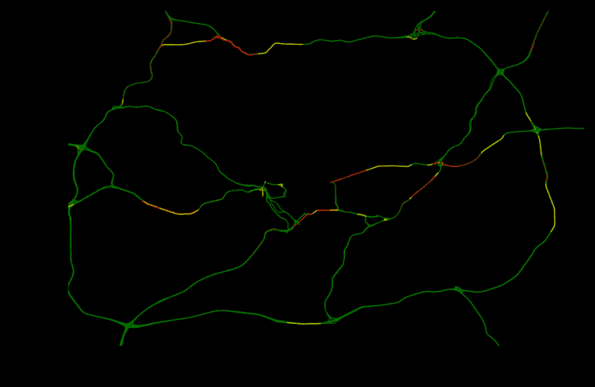

# 使用 HERE traffic api 可视化实时交通模式

> 原文：<https://towardsdatascience.com/visualizing-real-time-traffic-patterns-using-here-traffic-api-5f61528d563?source=collection_archive---------14----------------------->

虽然谷歌地图显示的是实时交通状况，但却无法访问底层的交通数据。HERE technologies 提供各种基于位置的服务，包括提供交通流量和事故信息的 REST API。

这里有一个非常强大的免费增值账户，允许多达 25 万次免费交易。然而，虽然有一些不错的开发人员文档，但缺乏关于如何准确提取交通信息并进行分析的在线教程。在本文中，我将介绍使用 python 和 xml 解析从道路网络获取交通数据的基本过程。这是 2019 年 12 月随机周四下午 1:30 至 4:30 之间 DC 高速公路交通数据的 GIF 图:



下午 1:30-4:30 的 DC 交通 gif 图显示了这里的交通流量数据。资料来源:塞犍陀·维维克

```
%matplotlib inline
from matplotlib import pyplot as plt
import numpy as np
import matplotlib.cm as cmimport requests
#import dill
from bs4 import BeautifulSoup
#from datetime import datetime
import xml.etree.ElementTree as ET
from xml.etree.ElementTree import XML, fromstring, tostringpage = requests.get('https://traffic.api.here.com/traffic/6.2/flow.xml?app_id=BLAH&app_code=BLAH2&bbox=39.039696,-77.222108;38.775208, -76.821107&responseattributes=sh,fc')
soup = BeautifulSoup(page.text, "lxml")
roads = soup.find_all('fi')
```

首先，您需要在这里注册，并生成应用 id 和应用代码凭证(上例中的 BLAH 和 BLAH 2)——这非常简单。接下来，你需要找出你想要查找交通流量的道路网络区域，你可以在谷歌地图中点击某个位置，然后右键单击“这里有什么？”这将给出稍后长坐标。这里，traffic API 需要对应于左上和右下的 2 个 lat long 对，以便给出矩形边界框内包含的道路上的交通流量信息。响应属性是将包含在 API 响应中的信息。在上面的示例中，“sh”表示 shapefile 属性，这很重要，因为它们给出了道路的几何图形，而“fc”表示函数类，对于以后仅过滤高速公路或街道等非常有用。最后一行代码给出了一个 XML 文档，其中每个孩子代表一个特定的路段，每个路段都有一个唯一的形状文件。

```
a1=[]
loc_list_hv=[]
lats=[]
longs=[]
sus=[]
ffs=[]
c=0
for road in roads:
    #for j in range(0,len(shps)):
    myxml = fromstring(str(road))
    fc=5
    for child in myxml:
        #print(child.tag, child.attrib)
        if('fc' in child.attrib):
            fc=int(child.attrib['fc'])
        if('cn' in child.attrib):
            cn=float(child.attrib['cn'])
        if('su' in child.attrib):
            su=float(child.attrib['su'])
        if('ff' in child.attrib):
            ff=float(child.attrib['ff']) if((fc<=2) and (cn>=0.7)):
        shps=road.find_all("shp")
        for j in range(0,len(shps)):
            latlong=shps[j].text.replace(',',' ').split()
            #loc_list=[]
            la=[]
            lo=[]
            su1=[]
            ff1=[]

            for i in range(0,int(len(latlong)/2)):
                loc_list_hv.append([float(latlong[2*i]),float(latlong[2*i+1]),float(su),float(ff)])
                la.append(float(latlong[2*i]))
                lo.append(float(latlong[2*i+1]))
                su1.append(float(su))
                ff1.append(float(ff))
            lats.append(la)
            longs.append(lo)
            sus.append(np.mean(su1))
            ffs.append(np.mean(ff1))
```

上面，我按照功能等级≤2(表示高速公路)过滤了所有道路，cn 表示置信度，0 表示低置信度，1 表示最高置信度。总的来说，这个 DC 高速公路系统有大约 5000 个路段。

```
fig=plt.figure()
plt.style.use('dark_background')
#plt.plot(np.linspace(0,10,10),np.linspace(0,10,10))
plt.grid(False)
for i in range(0,len(lats)):
    if(sus[i]/ffs[i]<0.25):
        plt.plot(longs[i],lats[i], c='brown',linewidth=0.5)
    elif(sus[i]/ffs[i]<0.5):
        plt.plot(longs[i],lats[i], c='red',linewidth=0.5)
    elif(sus[i]/ffs[i]<0.75):
        plt.plot(longs[i],lats[i], c='yellow',linewidth=0.5)
    else:
        plt.plot(longs[i],lats[i], c='green',linewidth=0.5)
    #print(i)
#plt.xlim(-77.055,-77.015)
#plt.ylim(38.885,38.91)
plt.axis('off')
plt.show()
```

最后，我绘制了道路上所有的交通速度，用棕色、红色、黄色、绿色表示最差到最少的交通，类似于谷歌地图。一个缺点是没有检索以前数据的选项，这都是实时的:/。

还有很多其他的服务。例如，TomTom 提供的路段数据与这里非常相似，只不过它是距离给定经度位置最近的单个路段的速度信息。但是要获得整个区域，需要熟悉缩放级别和平铺网格。对于缩放级别 0，世界显示在一个单幅图块上。在缩放级别 22，世界被分成 2^44 瓷砖。弄清楚像 DC 这样的特定位置如何对应于哪一个瓦片是一件非常头痛的事情。Waze 似乎也有一些选择来获得它的流量数据，但是你需要注册成为 Waze 的合作伙伴，这是一个完全不同的过程。

所以你去，你现在可以可视化实时交通和模式！还有很多更酷的事情可以做，例如将这与事件数据相结合，以预测交通如何基于事件而变化。或者与 fleet 或 Mapbox 等网络地图平台配合使用，让它看起来更漂亮。基于位置和交通的服务将继续存在。想想优步、Lyft、波导、亚马逊快递等。所有这些公司都需要实时位置和交通信息。在不久的将来，自动送货卡车车队可能会依靠这些信息做出明智的决定。前途无量！

[*关注我*](https://medium.com/@skanda.vivek) *如果你喜欢这篇文章——我经常写复杂系统、物理学、数据科学和社会的界面。*

*如果你还不是中会员，想支持我这样的作家，可以通过我的推荐链接随意报名:*[*https://skanda-vivek.medium.com/membership*](https://skanda-vivek.medium.com/membership)