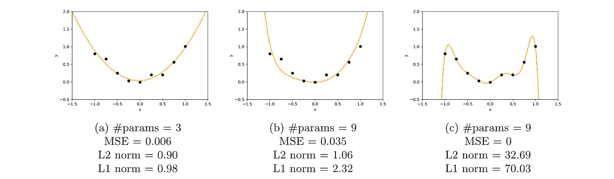

# 可视化正则化与 L1 和 L2 规范

> 原文：<https://towardsdatascience.com/visualizing-regularization-and-the-l1-and-l2-norms-d962aa769932?source=collection_archive---------13----------------------->

## 为什么最小化规范会导致正则化？

作者图片

如果你上过机器学习的入门课，你肯定遇到过过度拟合的问题，并了解过正则化和规范的概念。我经常看到纯粹通过查看公式来讨论这个问题，所以我想我会尝试使用一些直观的例子来更好地了解为什么最小化范数会导致正则化，以及 L1 和 L2 之间的差异。

## 必备知识

*   线性回归
*   梯度下降
*   对过拟合和正则化的一些理解

## 涵盖的主题

*   为什么最小化范数会诱导正则化？
*   L1 标准和 L2 标准有什么区别？

# 正规化概述

使用线性回归的例子，我们的损失由均方误差(MSE)给出:

我们的目标是尽量减少这种损失:

为了防止过度拟合，我们想要添加一个偏向不太复杂的函数。也就是**给定两个可以合理拟合我们数据的函数，我们更喜欢简单的一个**。为此，我们添加了一个正则项，通常是 L1 范数或平方 L2 范数:

因此，例如，通过将平方 L2 范数添加到损失和最小化，我们获得岭回归:

其中λ是正则化系数，它决定了我们需要多少正则化。

# 为什么最小化范数会诱导正则化？

**最小化范数有助于降低函数的“复杂性”。**从数学上讲，我们可以看到 L1 和 L2 范数都是权重大小的度量:L1 范数的绝对值之和，L2 范数的平方值之和。所以更大的权重给出了更大的范数。这意味着，简单地说，**最小化范数鼓励权重变小，这反过来给出了“更简单”的函数**。

让我们用一个例子来形象化这一点。让我们假设我们得到一些类似这样的数据:

作者图片

我们应该选择什么函数来拟合这些数据呢？有许多选择，这里有三个例子:

作者图片

这里我们有一个 2 次多项式拟合和两个不同的 8 次多项式，由以下等式给出:

前两个(是“更简单”的函数)最有可能更好地概括新数据，而第三个(更复杂的函数)显然过度拟合了训练数据。这种复杂性是如何体现在规范中的？

作者图片

我们可以看到，线[c]的均方误差为 0，但其范数相当高。相反，线[a]和[b]具有稍高的 MSE，但是它们的规范低得多:

*   线[a]具有较低的范数，因为与[c]相比，它具有明显较少的参数
*   线[b]具有较低的范数，因为尽管有相同数量的参数，它们都比[c]小得多

由此我们可以得出结论，通过将 L1 或 L2 范数添加到我们的最小化目标，我们可以鼓励具有较低权重的更简单的函数，这将具有正则化效果，并帮助我们的模型更好地推广新数据。

# L1 标准和 L2 标准有什么区别？

我们已经看到，为了降低函数的复杂性，我们可以完全去掉一些权重(将它们设置为零)，或者使所有权重尽可能小，这就是 L1 和 L2 之间的区别。

为了理解它们如何不同地操作，让我们看一看它们如何根据权重的值而变化。

作者图片

左边是给定重量 w 的 L1 和 L2 范数图，右边是相应的范数斜率图。正如我们所看到的，L1 和 L2 都随着 w 值的增加而增加。然而，当 L1 范数以恒定速率增加时，L2 范数以指数形式增加。

这很重要，因为正如我们所知，当进行梯度下降时，我们将基于损失函数的导数来更新我们的权重。因此，如果我们在损失函数中包含一个范数，范数的**导数将决定权重如何更新**。

我们可以看到， **L2 范数**随着 w 变小，范数的斜率也变小，这意味着更新也将变得越来越小。当权重接近 0 时，更新会变得非常小，几乎可以忽略不计，所以权重不太可能变成 0。

另一方面，用 **L1 范数**斜率是常数。这意味着随着 w 变小，更新不会改变，所以我们会因为权重变小而得到相同的“奖励”。因此，L1 规范更有可能将一些权重降低到 0。

## 概括一下:

*   **L1 范数将一些权重驱动到 0** ，导致权重稀疏。这对于**内存效率**或者当需要**特征选择**时是有益的(即我们只想选择某些权重)。
*   相反， **L2 规范**将**减少所有权重，但不会一直减少到 0** 。这不太节省内存，但如果我们想要/需要保留所有参数，这可能是有用的。

*觉得这个故事有帮助？考虑* [*订阅*](https://chiaracampagnola.medium.com/membership) *到媒体支持作家！*