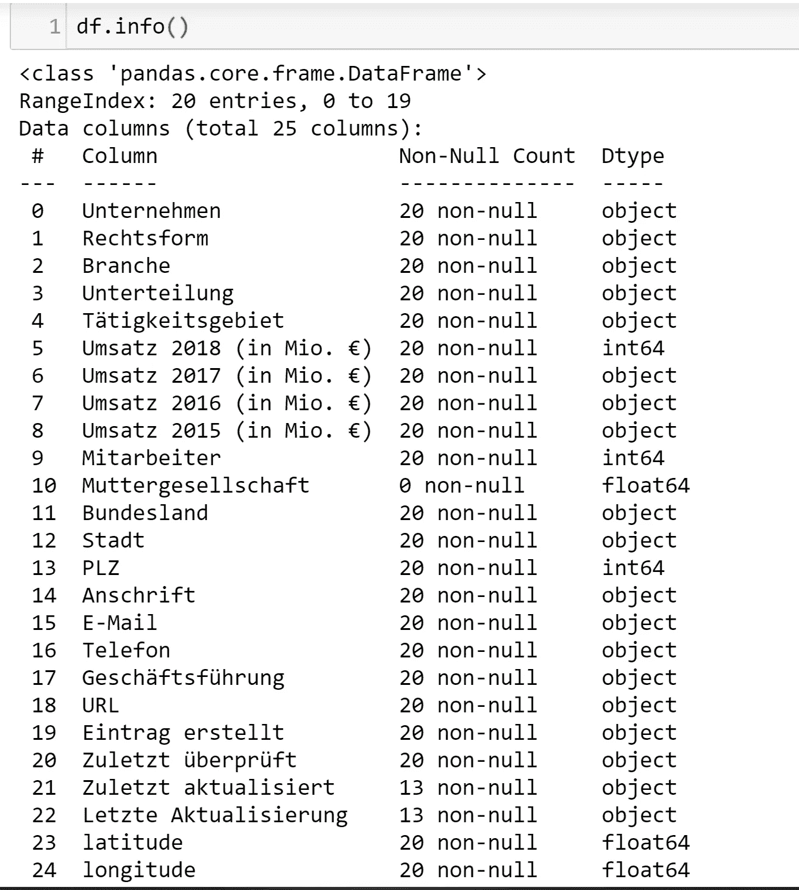

# 在 Python 的 Plotly 中可视化德国汽车供应商的收入

> 原文：<https://towardsdatascience.com/visualizing-revenues-of-german-car-suppliers-in-pythons-plotly-9c90610af4f1?source=collection_archive---------55----------------------->


初升的太阳从[升起](http://images.unsplash.com/photo-1513010963904-2fefe6a92780?ixlib=rb-0.3.5&q=80&fm=jpg&crop=entropy&cs=tinysrgb&w=1080&fit=max&s=b3fca9d9fbd9d1e9bbee5379f3e45ce3)

如今，数据无处不在，让*每个人*都能访问数据是必不可少的一步，不管他们的专业背景如何。

手动分析表格数据是极其讨厌的，肯定不会引起任何人的注意。

事情不一定要这样。

完全相同的数据可以以奇特的方式可视化，甚至非数据科学家也渴望一睹这些令人钦佩的情节。

如果每个人眼前都有一个有意义的图表，而不是枯燥的表格，那么用数据来销售一个故事就会变得容易得多。

与表格相比，拥有一个漂亮而干净的图表可以更快地浏览手头的数据，提供更好的交互机会，并且看起来非常漂亮。

让我们点燃蜡烛。

这篇文章使用了[listen campion](https://www.listenchampion.de)[，](https://www.listenchampion.de),)的一小段数据，这是一家提供特定市场列表的领先公司，对于可视化和分析目的来说是最佳的。非常感谢它的团队为我提供了这个列表，并允许发表对它的分析。

当以正确的方式可视化数据时，用数据说服人们会变得简单。我的正道是 *Python 的 Plotly* 库。与 matplotlib 相比，它的视觉效果一流，响应速度也很快，因此它是我在 Python 中实现可视化的首选库。

首先，我们必须对手头的数据有一个概念，所以让我们检查一下我们的代码片段提供了什么:



关于手头数据集的信息

令人兴奋的是，德国 20 大汽车供应商名单。二十个条目足够小，甚至对人类友好，但是，想想一个有几千个条目的列表，事情会变得很快变得很糟糕。这就是为什么 Python 和 Plotly 是分析和可视化数据的好方法。

该数据集包括公司地址、员工人数、2015 年至 2018 年的收入、首席执行官、联邦州、联系人等信息。

为了在世界地图上显示这些公司，有必要以经度-纬度格式提取它们的地理位置。幸运的是，我们有一个给定的地址，可以进一步用来获得地理坐标。因此，[谷歌地理位置 API](https://developers.google.com/maps/documentation/geolocation/intro) 来得非常方便。初次登录时，您还可以获得最初的 300 美元，这对于任何较小的项目来说都足够了。

那么，让我们得到这些地址的地理坐标(经度，纬度):

```
import googlemaps
gmaps = googlemaps.Client(MAPS_KEY)def get_coordinates(plz_string):
```
convert zip code into geo coordinates.Input:
plz_string: string with the zip code + country location, i.e. 75242 Germany, or 94086 USA
``` location = gmaps.geocode(plz_string)
   try:
      lon = location[0][“geometry”][“location”][“lng”]
      lat = location[0][“geometry”][“location”][“lat”]
   except:
      lon = None
      lat = None
      print(“Something went wrong with: {}”.format(plz_string))
   return lat, londf[‘location’] = df[“PLZ”].apply(lambda x: str(x) + “, Germany”)
df[‘lat / lon’] = df[‘location’].apply(lambda x: get_coordinates(x))
```

这太神奇了，在几分钟内，我们已经将邮政编码转换成地理坐标，这使我们能够在地图上标出确切的位置。

现在我们有了这些简洁的坐标，让我们进入这篇文章的核心，用最好的方式使用 Plotly 的功能。

我为建议和改进而高兴，也为你指出的每一个代码垃圾而高兴。

Plotly 提供了各种可以使用的地图，如 chloropleth 地图、地图框或散点图。我将利用后者。

现在的问题是，你想把公司总部的位置形象化吗？因此，我将从我们的数据中列出的他们过去两次录音(2018-2017)的收入差异入手。我还根据联邦州、公司规模或他们运营的分支机构进行了可视化。查看[我的 github，包括整个笔记本](https://github.com/lenlehm/Plotly_Vizualization)。

然而，为了简单和美观，我将只带您进行收入发展之旅。请随意实现其他版本或提出更有创意的想法来可视化该数据集。

在我向你展示情节之前，请记住，这些是汽车供应商，没有谷歌或亚马逊。他们的收入可能会让你震惊。

```
scale = 56
revenue = go.Figure()for diff in list(df[colName]):
    ## create sub dataframe containing the 16 federal states in Germany
    df_sub = df[df[colName] == diff]
    ## plot the bubbles on the map
    revenue.add_trace(go.Scattergeo(
        locationmode = 'geojson-id',
        lon = df_sub['longitude'],
        lat = df_sub['latitude'],
        name = df_sub['Unternehmen'].values[0],
        hovertemplate = "<b>{} </b><br><br>".format(df_sub['Unternehmen'].values[0]) +
                        "Rev. Difference: {}<br>".format(diff) +
                        "# Employees: {}<br>".format(df_sub["Mitarbeiter"].values[0]) ,
        marker = dict(
            ## scale the bubble size properly, to at least have a size of 5
            size = diff/scale if (diff/scale) > 6 else 7,
            line_color='rgb(40,40,40)',
            line_width=0.4,
            color = df_sub['color'],
            sizemode = 'area'
        )))## get the layout right
revenue.update_layout(
        #title_text = 'Revenue Difference [in Mio. €] from 2017 to 2018 of selected automotive suppliers',
        showlegend = True,

    geo = go.layout.Geo(
        resolution = 50,
        scope = 'europe',
        showframe = False,
        showcoastlines = True,
        landcolor = "rgb(229, 229, 229)",
        countrycolor = "white" ,
        coastlinecolor = "white",
        projection_type = 'mercator',
        ## limit our projection to Germany only
        lonaxis_range= [ 5.0, 15.0 ],
        lataxis_range= [ 47.0, 55.0 ],
        ## center the projection at Germany's center coordinates
        center = {"lat": 50.757958, "lon": 10.266271},
        domain = dict(x = [ 0, 1 ], y = [ 0, 1 ])
    )
)
## enable and disable all the configurations we do not want to display
config = dict({'scrollZoom':True, 
               'displayModeBar':False,
               'showLink':False, 
               'displaylogo': False,
               'editable': False})## Save Plot on plotly account
py.plot(revenue, filename = 'revenue difference map', auto_open=True, showLink=False, config=config)
revenue.show()## Also possible to save it as HTML and host it on github
#pio.write_html(revenue, file=’biggest firms.html’, auto_open=True)
```

现在我们已经有了一张所有 20 家公司的整洁地图，可以根据它们各自的公司名称进行过滤，如果有一条显示每家公司在记录年份的收入增长的线形曲线，那就太棒了。

要做到这一点，我们必须对我们的数据框架做一点小小的调整，将其变成不同的形状，我们将每家公司的记录年份作为 x 轴，将 2015 年至 2018 年的收入作为 y 轴。

这是在下面完成的，我们循环遍历每一家公司，并强迫它进入正确的形状。如果你是虐待狂，那么这个解决方案可能适合你，然而，聪明的人会找到更有效的方法来达到同样的结果。

```
cols = ['Unternehmen', 'Umsatz 2015 (in Mio. €)', 'Umsatz 2016 (in Mio. €)', 'Umsatz 2017 (in Mio. €)', 'Umsatz 2018 (in Mio. €)']
revenue_plot = df.loc[:, cols]
## extract all the years, cast it to int and reverse the list to get [2015, 2016, 2017, 2018]
years = [ int(ele[0]) for ele in list(filter(None, [ re.findall('\d+', string) for string in df.columns ]))][::-1]revenue_cruve = go.Figure()
for i in range(len(revenue_plot)):
    plot_df = pd.DataFrame(
        {'Company': [revenue_plot.iloc[i, 0] for j in range(len(years))],
         'Year': years,
         'Revenue': list(revenue_plot.loc[i, ["Umsatz 2015 (in Mio. €)", 'Umsatz 2016 (in Mio. €)', 'Umsatz 2017 (in Mio. €)', 'Umsatz 2018 (in Mio. €)']]) },
        columns = ['Company', 'Year', 'Revenue'])
    revenue_cruve.add_trace(go.Scatter(
                    x=plot_df['Year'],
                    y=plot_df['Revenue'],
                    name=plot_df['Company'][0],
                    text =  '<b>{}</b> <br>'.format(plot_df['Company'][0]) +
                            'Revenue {}: {} <br>'.format(plot_df['Year'][0], plot_df['Revenue'][0]) +
                            'Revenue {}: {} <br>'.format(plot_df['Year'][1], plot_df['Revenue'][1]) +
                            'Revenue {}: {} <br>'.format(plot_df['Year'][2], plot_df['Revenue'][2]) +
                            'Revenue {}: {}'.format(plot_df['Year'][3], plot_df['Revenue'][3])
    ))revenue_cruve.update_traces(mode="markers+lines",
                            hovertemplate = None                           )

revenue_cruve.update_layout(
    width = 1100,
    height = 800,
    legend_title='<b> Company </b>',

    yaxis=dict(
        title_text="Revenue in Mio. €",
        titlefont=dict(size=22),
    ),
    xaxis = dict(
        tickmode = 'linear',
        tick0 = years[0],
        dtick = 1)
)
config = dict({'scrollZoom':True, 
               'displayModeBar':False,
               'showLink':False, 
               'displaylogo': False,
               'editable': False})py.plot(revenue_cruve, filename='revenue firms curve', auto_open=True, config=config)
revenue_cruve.show()
```

现在，我们甚至有了每家公司的收入线曲线图，之后我们还可以进行筛选。这使得一切更容易分析，我们不必手动仔细检查每一行。正如你可能看到的，20 家公司会很快变得混乱不堪。减少混乱的另一个好方法是添加一个带有 Plotly 的[下拉按钮来选择感兴趣的公司。不幸的是，我还没有这样做，但这是一个很好的实践，以培养我们刚刚学到的东西。](https://plotly.com/python/dropdowns/)

可视化方法对于在公司范围内共享信息也非常方便，例如在时事通讯中。每个员工只需简单浏览一下就能获得关键信息。

就是这样，我希望你今天学到了一些新东西，这篇文章不会太无聊。无论如何，如果你有一些建议或发现错误，请让我知道。该代码可在我的 github 账户中获得。

感谢阅读！