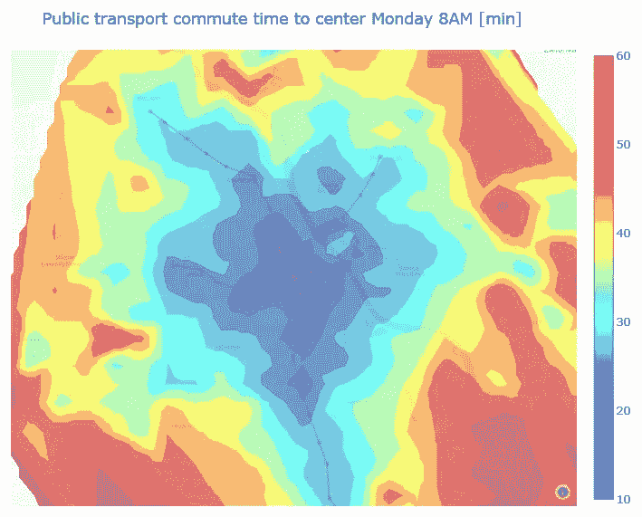

# 使用 geojson 热图可视化空间数据

> 原文：<https://towardsdatascience.com/visualizing-spatial-data-with-geojson-heatmaps-1fbe2063ab86?source=collection_archive---------22----------------------->

## 热图是一种很好的可视化方式，但在地图上绘制它们可能是一个挑战。了解如何使用 geojsoncountour 创建自定义 geojson 数据来创建身临其境的地图。


华沙房地产价格[兹罗提/平方米]

您是否曾经处理过空间数据，并面临过必须在过度拥挤的散点图或局限于行政边界(如地区)的等值线图之间做出选择的挑战？

作为一名房地产行业的数据科学家，我经常处理空间数据，但是，我一直在努力寻找可视化空间数据的最佳方式，以便能够轻松地从大型数据集中掌握关键的空间要素。

Plotly 或 Folium 提供的基本功能受到限制，所以我决定研究一下如何在地图上创建自定义热图，我想在本文中与您分享。从 2020 年 5 月起，我将致力于华沙超过 1 万个房地产报价的数据集，你可以通过下面的链接从我的 GitHub 下载。

GitHub 上有完整的代码和数据来源:[https://GitHub . com/Jan-Majewski/Project _ Portfolio/blob/master/03 _ Real _ Estate _ pricing _ in _ Warsaw/03 _ 02 _ Data _ viz ualization . ipynb](https://github.com/Jan-Majewski/Project_Portfolio/blob/master/03_Real_Estate_pricing_in_Warsaw/03_02_Data_Vizualization.ipynb)

对于交互式可视化，我推荐使用 nbviewer 链接:[https://nb viewer . jupyter . org/github/Jan-Majewski/Project _ Portfolio/blob/c 770 f 21 DC 410 b 1495 DBD F5 b 9 F4 f 443 ECD 4d 986 ba/03 _ Real _ Estate _ pricing _ in _ Warsaw/03 _ 02 _ Data _ viz ualization . ipynb](https://nbviewer.jupyter.org/github/Jan-Majewski/Project_Portfolio/blob/12a5fd122c2f64830c4ec22de04b39406f02e10b/03_Real_Estate_pricing_in_Warsaw/03_02_Data_Vizualization.ipynb)

# 1.介绍

使用的数据可以从 GitHub 下载

```
df = pd.read_excel(r"[https://raw.githubusercontent.com/Jan-Majewski/Project_Portfolio/master/03_Real_Estate_pricing_in_Warsaw/Warsaw_RE_data.xlsx](https://raw.githubusercontent.com/Jan-Majewski/Project_Portfolio/master/03_Real_Estate_pricing_in_Warsaw/Warsaw_RE_data.xlsx)")
```

由于数据的特性比这个项目所需的要多得多，所以让我们只选择关键的 8 列。

```
key_columns=['Id', 'Area', 'Price', 'latitude', 'longitude',
      'City','district']df**=**df[key_columns]df.head(10)
```


首先，让我们探索使用基本 Plotly 要素可视化空间数据的最常见方法。

## 1.1 .基本散点图框


地图上的散点图可能是可视化空间数据的最常见和最简单的方式。你得到坐标，设置一个特征为颜色，这就是你的地图。乍一看，它甚至看起来非常有效，但是如果你正在处理一个更大的数据集，它会变得过于拥挤，你实际上看不到下面的地图。

## 1.2 网格散点图框


我们可以通过舍入坐标并计算每个图块的平均值来创建网格，从而简化散布。它看起来更容易阅读，但我们也失去了很多细节。

格网图基于通过裁剪纬度和经度、创建纬度 _ 模式和经度 _ 模式要素以及对数据进行分组以创建测向图而汇总的数据。


# 2.使用 geojson 定制热图

由于对之前的结果不满意，我决定寻找基于等高线图创建热图的方法。

对我来说，最好的解决方案是一个 4 步过程:

*   在 matplotlib 中创建等高线图
*   使用 geojsoncountour 库将其转换为 geojson
*   从 geojson 提取值到 df_contour
*   使用 plotly 创建 choropleth 地图

## 2.1 用 matplotlib 计算我们的图


价格密度等值线图

我们得到了一个非常好的等高线图，现在我们需要做的就是把它转换成 geojson，这样它就可以和 plotly 兼容了。

警告！为等值线图选择边界时，请确保每个图层至少有一个数据点。如果最大值和最小值太宽或者步长太小，并且其中一个图层为空，则可能会使整个 geojson 在 plotly 中根本不出现。

## 2.2 .将等高线图转换为 geojson

要将等高线图转换为 geojson，您需要 geojsoncontour 库。

```
pip install geojsoncontour
```

## 2.3.创建 viz 之前的最后一步是将 geojson 的价格提取到 DataFrame 中

由于 plotly 需要一个数据帧，其中的值用于 geojson 中空间对象的填充颜色，我们需要通过迭代 geojson 字典中的“features”键来提取它们。该键包含一个字典列表，热图的每一层都有一个字典。该值作为“title”键存储在子字典的“properties”键中。让我们还将“id”键添加到列表中的每个字典，以将空间对象与数据帧行相匹配。

## 2.4 最终创建热图

现在我们有了创建一个漂亮的热图所需要的一切。我们来策划吧！


房地产价格密度的最终热图

我建议参考页面顶部的 nbviewer 链接，以探索缩放和深入研究最有趣的情节区域的全部可能性。

# 3.摘要

我希望本教程能帮助你使你的空间可视化更有效，更容易一目了然地抓住关键的洞察力。

这种类型的可视化适用于各种数据，其中空间要素是关键驱动因素之一。总结一下，享受一个类似的基于谷歌通勤数据的 viz。如果您对分析感兴趣，本文顶部引用的笔记本也使用 Google API 处理提取和处理驾驶时间数据。



华沙早晨通勤时间