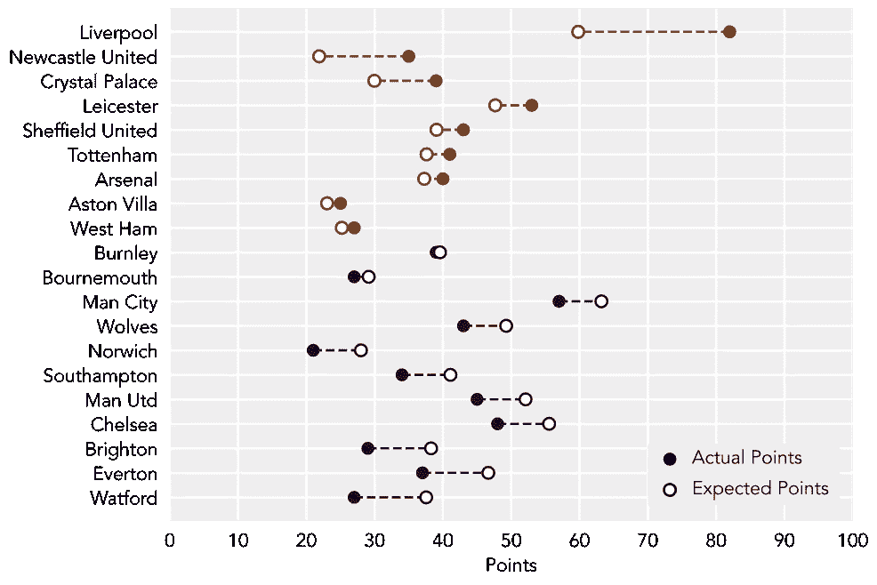
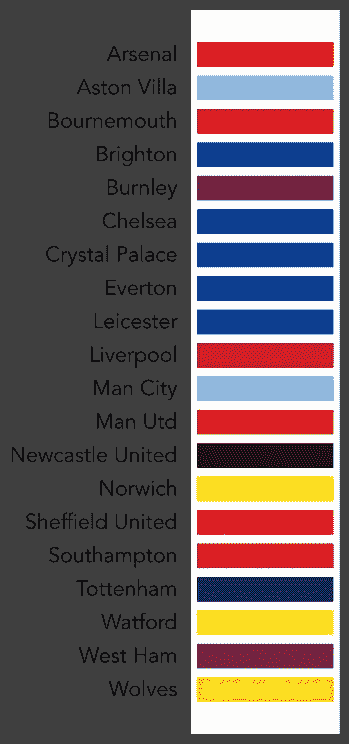
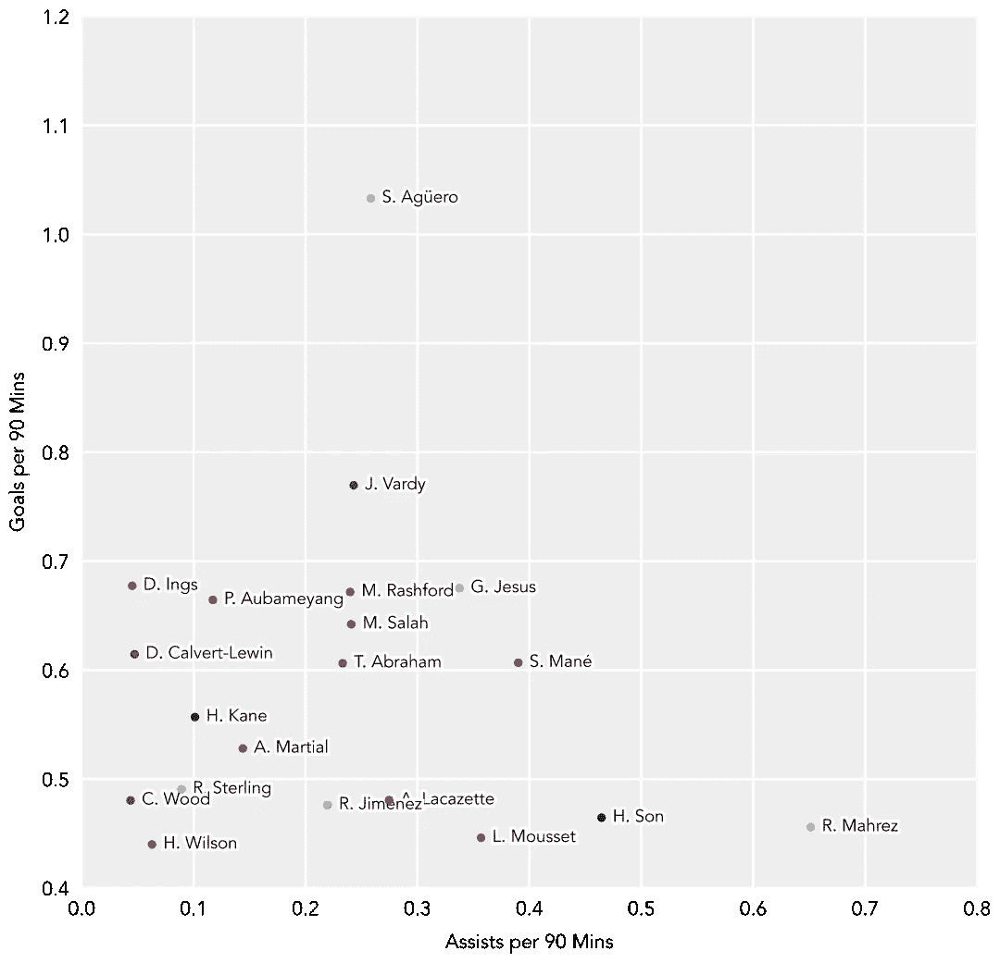
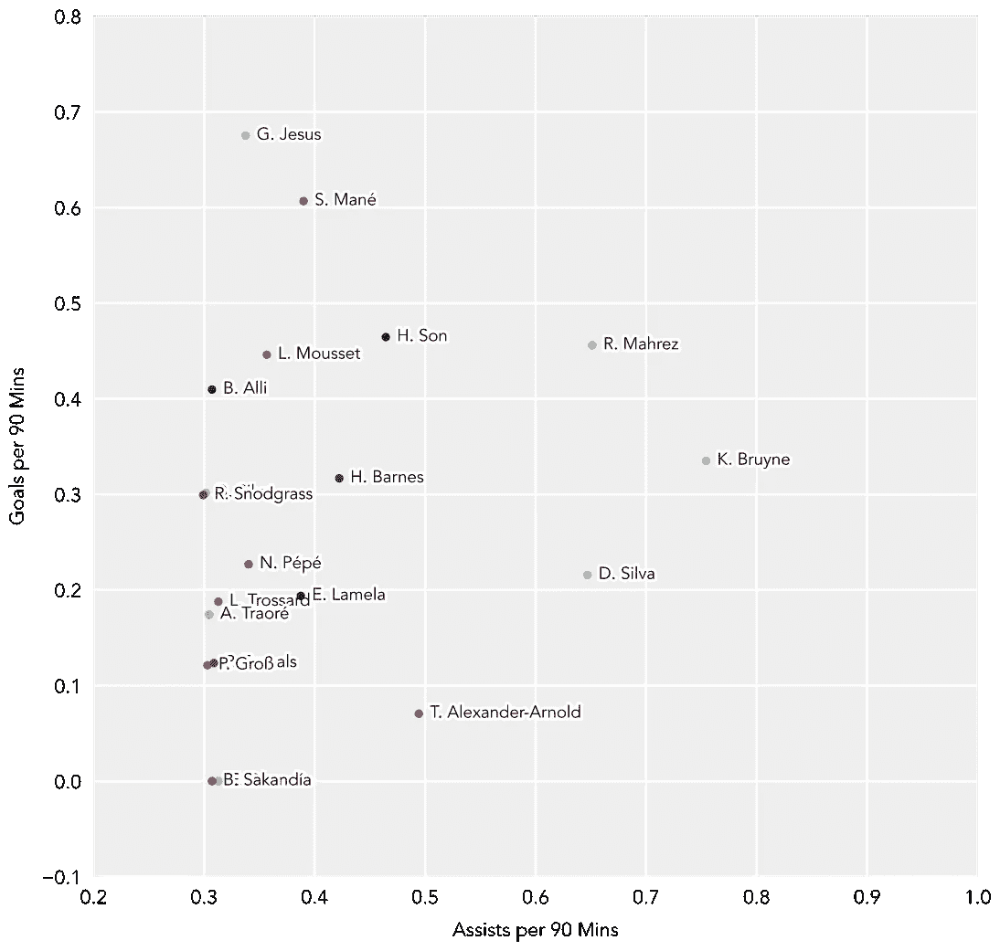
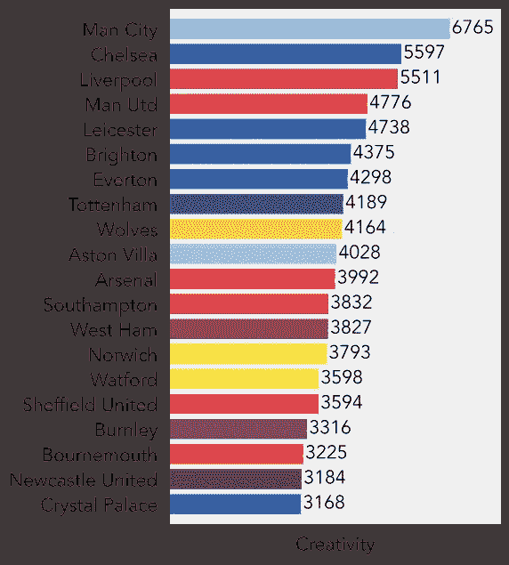
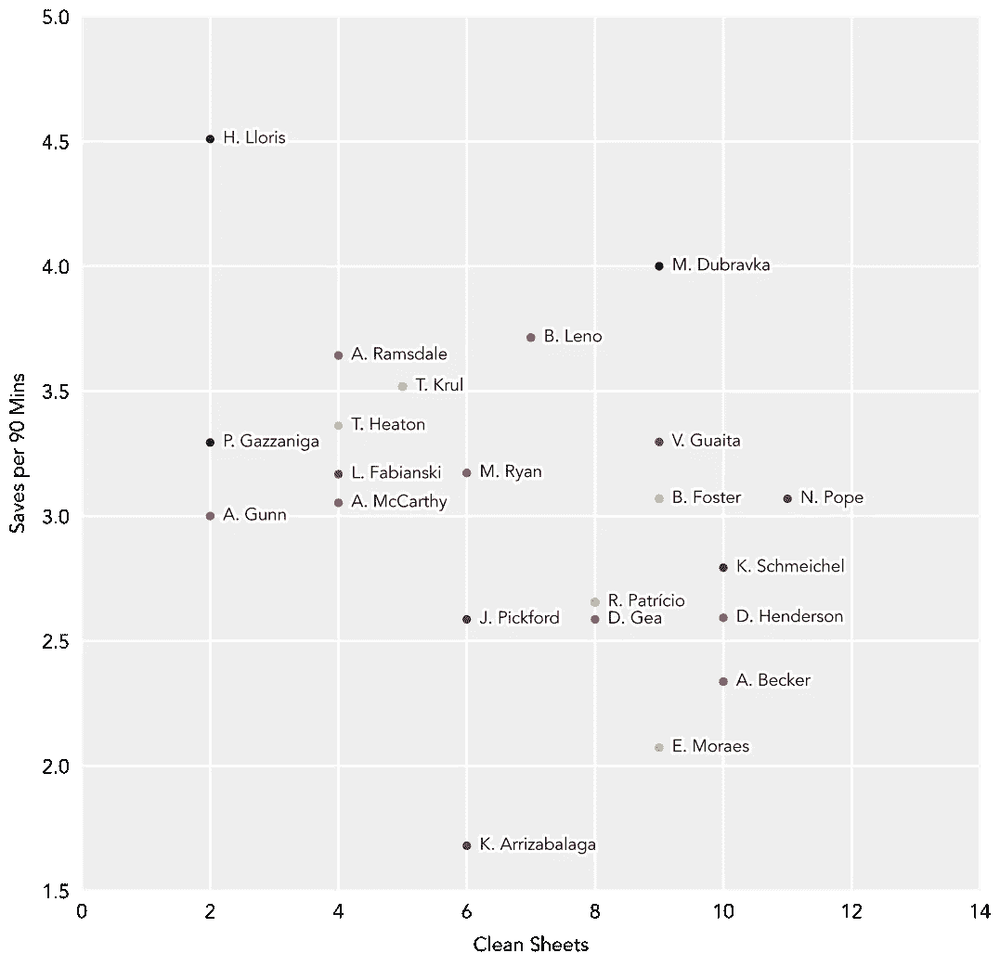

# 用 Matplotlib 和熊猫可视化 2019-20 英超联赛赛季

> 原文：<https://towardsdatascience.com/visualizing-the-2019-20-english-premier-league-season-with-matplotlib-and-pandas-fd491a07cfda?source=collection_archive---------26----------------------->

## 2019-20 英超联赛积分榜背后的统计数据是什么？


照片由 [KAKUDMI](https://unsplash.com/@kakudmi?utm_source=unsplash&utm_medium=referral&utm_content=creditCopyText) 在 [Unsplash](https://unsplash.com/s/photos/soccer?utm_source=unsplash&utm_medium=referral&utm_content=creditCopyText) 上拍摄

当我们急切地等待 6 月 17 日英超联赛赛季的重新开始时，我们可以从这个 [Kaggle 数据集](https://www.kaggle.com/idoyo92/epl-stats-20192020)来看看这个赛季迄今为止的故事。作为一名利物浦球迷，我希望本赛季在英超联赛时代第一次以冠军结束(在一个历史性的、破纪录的赛季中)。

在过去的一年里，利物浦以 25 分的领先优势高居榜首，只需要 6 分就能确保夺冠，统治了英格兰足坛。让我们看看相对于他们的预计总分，他们的表现如何。首先，我们将导入可视化所需的包:

```
# Import packages
import matplotlib as mpl
import matplotlib.pyplot as plt
import matplotlib.patheffects as pe
import pandas as pd
import numpy as np
```

稍后，我们将使用`matplotlib.patheffects`包来进行文本注释(来标记单个数据点)。

# **导入团队数据**

从 Kaggle 下载数据集后，我们将有两个数据文件:

1.  `epl2020.csv` —包含特定团队的数据，如进球、失球、成绩、积分等。
2.  `players_1920.csv` —包含特定球员的数据，包括个人进球、卡牌、助攻、扑救等。

我们的第一个可视化是查看表格中每个团队的实际积分值与他们的预期总积分(基于基于他们表现的预测)的比较。为此，我们将使用`epl2020.csv`中的团队级数据。

```
# Load team data
filename = './epl2020.csv'
data_epl = pd.read_csv(filename)
```

现在，让我们看看我们可以访问该文件中的哪些数据:

```
data_epl.columns>>> Index(['Unnamed: 0', 'h_a', 'xG', 'xGA', 'npxG', 'npxGA', 'deep', 'deep_allowed', 'scored', 'missed', 'xpts', 'result', 'date', 'wins', 'draws', 'loses', 'pts', 'npxGD', 'teamId', 'ppda_cal', 'allowed_ppda', 'matchtime', 'tot_points', 'round', 'tot_goal', 'tot_con', 'Referee.x', 'HS.x', 'HST.x', 'HF.x', 'HC.x', 'HY.x', 'HR.x', 'AS.x', 'AST.x', 'AF.x', 'AC.x', 'AY.x', 'AR.x', 'B365H.x', 'B365D.x', 'B365A.x', 'HtrgPerc', 'AtrgPerc', 'matchDay'], dtype='object')
```

那可是好多列啊！但是为了比较实际分数和预期分数，我们只需要其中的两列:`xpts`和`pts`。

# **积分总计**

由于我们加载的数据集包含每场比赛的结果，球队名称将在`teamId`列中重复多次，因此我们将所有唯一的球队名称收集到一个列表中:

```
# Get unique team names
teams = data_epl.teamId.unique()
```

现在，使用我们的独特团队列表，我们可以通过对数据帧中对应于特定团队的列求和来计算实际和预期的总积分。我们的做法如下:

```
# Get the actual and expected points for each team
actual_pts = {}
expected_pts = {}for team in teams:
  actual_pts[team] = data_epl[data_epl['teamId'] == team].pts.sum()
  expected_pts[team] = data_epl[data_epl['teamId'] == team].xpts.sum()
```

在上面的代码片段中，我们已经使用 Python 字典为预期和实际总点数创建了一个查找表，所以现在我们可以直接使用这些数据结构，以及我们的唯一团队名称列表(`teams`)来绘制我们的总点数。

我们要做的最后一件事是对数据进行数字排序——在这种情况下，我们要根据实际总点数和预期总点数之间的差异进行排序。这样做的目的是将我们的数据集分成*超额完成*(即比预期多的分数)和*未完成*的团队。为此，我们创建了一个名为`pts_difference`的新字典，并使用这些值对我们的团队列表进行排序。

```
pts_difference = {team: actual_pts[team] - expected_pts[team] for team in teams}
sorted_teams = sorted(pts_difference.keys(), key=pts_difference.get)
```

现在我们有了数据，我们可以创建我们的可视化。首先，我们将编辑一些总体绘图参数:

```
# Plot parameters
mpl.rcParams['font.family'] = 'Avenir'
mpl.rcParams['font.size'] = 16mpl.rcParams['axes.linewidth'] = 0
mpl.rcParams['axes.facecolor'] = '#ededed'mpl.rcParams['xtick.major.size'] = 0
mpl.rcParams['xtick.major.pad'] = 10
mpl.rcParams['ytick.major.size'] = 0
mpl.rcParams['ytick.major.pad'] = 10
```

现在我们可以开始拼凑我们的情节了。首先，我们想区分超水平团队和低水平团队。为此，我将使用一个名为`PuOr`的内置色图，并获得两种极端的颜色来对应超额完成(橙色)和未完成(紫色)。

```
# Create figure
fig = plt.figure(figsize=(8,6))
ax = fig.add_axes([0, 0, 1, 1])# Get colors
colors = plt.get_cmap('PuOr', 2)
```

现在，我们可以绘制我们的数据。为此，我将使用一个计数器变量`yval`来对应垂直方向上团队条目之间的间距。该变量将在循环的每次迭代中递增。在循环过程中，我们首先根据实际和预期总点数之间的差异检查使用哪种颜色。一旦我们做到这一点，我们将实际的总点数绘制成实心圆，将预期的总点数绘制成空心圆，然后用虚线将两者连接起来。

由于我们绘制数据的方式，很难使用内置的`matplotlib`图例函数。我们将使用插图自己创建一个。在这种情况下，我只是绘制一个填充和未填充的圆，并标记它们。我们通过用`fig.add_axes([x, y, width, height])`创建 axes 对象来指定图例的大小，其中`(x, y)`是左下角。

最后，我们可以更新记号和标签以对应每个团队:

```
# Add grid
ax.grid(color='white', linewidth=2)# Points labels
ax.set_xticks(np.arange(0, 110, 10))# Team labels
ax.set_yticks(np.arange(0, len(sorted_teams), 1))
ax.set_yticklabels(sorted_teams)# Set axis limits
ax.set_xlim(0, 100)# Set axis labels
ax.set_xlabel('Points')
```



纯粹基于对预期积分的预测，利物浦本赛季似乎明显超额完成了任务。事实上，如果利物浦和曼城都按照他们的预测比赛，利物浦实际上会在积分榜上排名第二！这是一个很好的例子，说明了在足球场上，不管有多少统计数据，结果最终是如何决定的。

# **评分和创意**

对于这些可视化，我们将使用来自第二个数据文件的特定于玩家的数据:

```
# Load player data
filename_players = './players_1920.csv'
data_pl = pd.read_csv(filename_players)
```

正如我们对团队数据所做的那样，让我们看看数据框中所有可用的列:

```
data_pl.columns>>> Index(['Unnamed: 0', 'assists', 'bonus', 'bps', 'clean_sheets', 'creativity', 'element', 'fixture', 'goals_conceded', 'goals_scored', 'ict_index', 'influence', 'kickoff_time', 'minutes', 'opponent_team', 'own_goals', 'penalties_missed', 'penalties_saved', 'red_cards', 'round', 'saves', 'selected', 'team_a_score', 'team_h_score', 'threat', 'total_points', 'transfers_balance', 'transfers_in', 'transfers_out', 'value', 'was_home', 'yellow_cards', 'full', 'team'], dtype='object')
```

就像我们为团队所做的一样，让我们将独特的玩家名字收集到一个列表中。玩家的名字可以在标签为`full`的栏中找到。

```
players = data_pl.full.unique()
```

在这组图像中，我们感兴趣的是球员的得分和创造力，所以我们将统计他们的进球和助攻数。由于单纯的进球和助攻数据显然会对那些没有踢过那么多比赛的球员产生偏见，我们希望每 90 分钟对这些数据进行标准化。唯一的问题是，当一名球员只打了很少几场比赛时，这个平均值就会上升——因此，为了考虑这种影响，我们将确保我们名单中的每名合格球员都至少打了 10 场比赛(900 分钟)。

像我们的团队数据一样，我们正在用每 90 分钟的平均值填充两个字典，`player_assists`和`player_goals`，只有出场超过 900 分钟的球员才被计算在内。

现在，我们需要从高到低对球员进行排序——字典本质上不包含任何排序信息，因此我们可以创建一个正确排序的球员姓名列表。在这种情况下，我们希望收集前 20 名进球者和助攻者。

```
top_players_goals = sorted(player_goals.keys(), key=player_goals.get, reverse=True)[:20]top_players_assists = sorted(player_assists.keys(), key=player_assists.get, reverse=True)[:20]
```

在上面的代码片段中，我们使用通过调用`player_goals.get`获得的值对字典的键(球员名字)进行排序。我们必须使用`reverse=True`,因为我们希望统计数据从最高到最低排序。最后，我们只将列表中的前 20 个元素作为我们的前 20 名玩家。

在我们绘图之前，我想创建一个名为`updated_names`的字典，它包含格式为“First Initial”的更短形式的玩家名字。姓氏”，所以“Sadio Mané”变成了“S. Mané”。此外，数据集不处理重音字符，因此我必须手动更改名称来解决这个问题。

现在我们可以绘制数据了！

首先，我们可以收集每个团队的团队颜色作为分散点的颜色——我从[这个网站](https://teamcolorcodes.com/soccer/premier-league-color-codes/)获得了每个团队颜色的十六进制代码。

为了看到这些颜色，我们可以为每个团队绘制一个色板图。我们首先创建一个图形，遍历每个独特的团队，并创建一个填充的多边形。然后我们增加一个计数器变量`y_val`，它向上移动下一个颜色样本。我们还对团队名称进行了排序，以便它们按字母顺序出现:

`axes.fill_between(x, y1, y2)` — `x`是要绘制的 x 值数组，`y1`是底部的 y 值，`y2`是顶部的 y 值。

现在，我们要删除 x 记号，将 y 记号改为按字母顺序排列的团队名称:

```
# Remove x-ticks
ax.set_xticks([])# Set y-ticks to team names
ax.set_yticks(np.arange(0.5, 20, 1))
ax.set_yticklabels(sorted(teams, reverse=True))
```



所以现在我们有了正确的球队颜色，我们可以回去绘制每 90 分钟的进球和助攻的图表。我们将首先使用以下代码片段绘制前 20 名进球得分者的数据:

我们找到前 20 名中每个球员的球队，并用各自的球队颜色画出一个点。然后，我们通过将 x 值偏移 0.01，将玩家的名字放在该点旁边。最后，为了提高可读性，函数`text.set_path_effects()`允许我们在每个名字周围放置一个粗的白色轮廓(前景色为`w`或白色，`linewidth`为 5)。



我们看到沙治·奥阿古路是一个多产的得分手，每 90 分钟得分超过一次，而他的曼城队友里亚德·马赫雷斯，虽然也是前 20 名得分手，但每 90 分钟的助攻数也明显高于其他人。

我们可以用下面的代码对 90 后前 20 名助教做同样的练习:



我们看到每 90 分钟的三名顶级助攻手都是曼城球员——里亚德·马赫雷斯、凯文·德·布鲁恩和戴维·席尔瓦。从前两个情节来看，曼城在球场上并不缺乏创造力。实际上，我们可以通过查看数据集中的`creativity`指标来对此进行量化。与前两个例子类似，我们可以从所有玩家数据中收集所有创造力的总和:

现在，我们可以使用下面的代码来绘制创造力值。我们使用`ax.barh(y, length)`来创建一个水平条形图——`y`的值是横条的垂直位置,`length`是特定横条的长度。



从助攻数据来看，曼城无疑拥有最高的创造力指数。这似乎表明(并且可以通过观看他们的比赛来证实)曼城的防守是薄弱环节，也是他们迄今为止总得分不足的原因。

# **守门员**

让我们看看守门员的表现——我们将创建对应于扑救和不失球的字典，并按照每 90 分钟的扑救次数进行排序(同样，我们仅限于踢了 900 分钟或更长时间的球员)。我们采用前 22 个条目，因为通过检查，在这一点之后，我们开始在我们的列表中获得外场球员:

我们这次的绘图将在 x 轴上显示干净的纸张，在 y 轴上显示每 90 分钟节省的纸张。我们使用下面的代码片段，它与我们之前在目标和辅助图中使用的代码片段非常相似:



平衡良好的球队往往会把他们的 GKs 放在这个图的右下象限——他们的防守足够稳健，他们的守门员不必面对大量的射门，所以他们不必做出太多的扑救，可以保持不失球。毫不奇怪，积分榜前三名的球队都有自己的守门员——艾利森·贝克尔(利物浦)、埃德森·莫赖斯(曼城)和卡斯帕·舒梅切尔(莱斯特)。在另一个极端，乌戈·洛里斯(托特纳姆)被迫做出名单上任何门将中最多的 90 次扑救，这也意味着最少的不失球。这表明他没有从他的防守线上得到太多的帮助，而是被迫承受许多对手进攻的冲击。

# **结束语**

我希望这篇文章是有帮助的，试图可视化数据，以了解更多关于正在进行的英超联赛赛季的故事，而不仅仅是联赛排名。这篇文章的所有分析都可以在这个 [Github 仓库](https://github.com/venkatesannaveen/medium-articles)中找到。

感谢您的阅读！我感谢任何反馈，你可以在[推特](https://twitter.com/naveenv_92)上找到我，并在 [LinkedIn](https://www.linkedin.com/in/naveenvenkatesan/) 上与我联系以获得更多更新和文章。