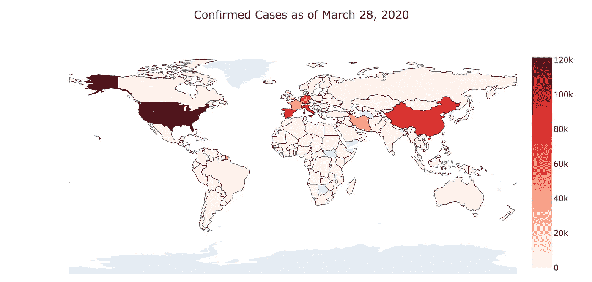

# 如何用 Choropleth 图显示疫情冠状病毒

> 原文：<https://towardsdatascience.com/visualizing-the-coronavirus-pandemic-with-choropleth-maps-7f30fccaecf5?source=collection_archive---------7----------------------->

## 关于 Choropleth 地图的介绍和教程


图片来自[皮克斯拜](https://pixabay.com/?utm_source=link-attribution&utm_medium=referral&utm_campaign=image&utm_content=4950995)的[米洛丝拉娃·克里斯诺娃](https://pixabay.com/users/MiroslavaChrienova-6238194/?utm_source=link-attribution&utm_medium=referral&utm_campaign=image&utm_content=4950995)

# 介绍

我非常支持数据可视化，因为我相信这是以简单易懂的方式说明和解释复杂信息，尤其是数字数据的最有效方法。此外，当正确执行时，可视化数据可以减少或帮助减轻数据解释中的偏差。

我最喜欢的可视化类型之一是**动画 choropleth 地图。鉴于疫情正在进行，我认为现在是展示动画 choropleth 地图威力的好时机。**

在本文中，您将了解以下内容:

1.  什么是 choropleth 地图
2.  何时以及为什么使用它们最有效
3.  Python 代码来创建您自己的 choropleth 地图，如下所示:

# Choropleth 地图

**choropleth 地图**是一种专题地图，其中区域或地区按照给定数据变量的比例进行着色。

**当您想要按区域比较所需变量时，静态 choropleth 图**最有用。例如，如果你想比较某一时刻美国各州的犯罪率，你可以用一个静态的 choropleth 来显示。

一个**动画**或**动态弦线图**类似于一个静态弦线图，除了你可以随时间按区域**比较一个变量。这增加了第三维度的信息，也是这些可视化变得如此有趣和强大的原因。**

# 可视化冠状病毒疫情

我用来创建以下可视化效果的数据是 Kaggle 的新 Corona Virus 2019 数据集，可以在这里找到。该数据集由多个来源组成，包括世界卫生组织、中华人民共和国国家卫生委员会和美国疾病控制中心。

*注意:如果这些来源中的任何一个未能提供准确和及时的数据，可视化可能会失真或不准确。*

## 静态 Choropleth

以下是截至 2020 年 3 月 28 日各国冠状病毒确诊病例总数的静态分布图。你可以看到，病例数量最多的国家包括美国、中国、意大利以及其他几个欧洲国家。



冠状病毒确诊病例的静态霍乱弧菌

创建它的代码如下:

```
**# Import libraries**
import numpy as np 
import pandas as pd 
import plotly as py
import plotly.express as px
import plotly.graph_objs as go
from plotly.subplots import make_subplots
from plotly.offline import download_plotlyjs, init_notebook_mode, plot, iplot
init_notebook_mode(connected=True)**# Read Data**
df = pd.read_csv("../input/novel-corona-virus-2019-dataset/covid_19_data.csv")**# Rename columns**
df = df.rename(columns={'Country/Region':'Country'})
df = df.rename(columns={'ObservationDate':'Date'})**# Manipulate Dataframe** df_countries = df.groupby(['Country', 'Date']).sum().reset_index().sort_values('Date', ascending=False)
df_countries = df_countries.drop_duplicates(subset = ['Country'])
df_countries = df_countries[df_countries['Confirmed']>0]**# Create the Choropleth**
fig = go.Figure(data=go.Choropleth(
    locations = df_countries['Country'],
    locationmode = 'country names',
    z = df_countries['Confirmed'],
    colorscale = 'Reds',
    marker_line_color = 'black',
    marker_line_width = 0.5,
))fig.update_layout(
    title_text = 'Confirmed Cases as of March 28, 2020',
    title_x = 0.5,
    geo=dict(
        showframe = False,
        showcoastlines = False,
        projection_type = 'equirectangular'
    )
)
```

请注意，您真正做的只是设置几个参数来引用数据集中的特定变量，如**位置**、**位置模式**和 **z** 。代码的其余部分用于更改 choropleth 地图的外观。

## 动画 Choropleth 地图

你可以看到动画的 choropleth 地图比静态地图更有效，更吸引人。在这里，我们正在查看一段时间内各国确诊的冠状病毒病例总数。你可以看到，直到最近，中国的病例数一直是最多的。

创建它的代码如下:

```
**# Manipulating the original dataframe**
df_countrydate = df[df['Confirmed']>0]
df_countrydate = df_countrydate.groupby(['Date','Country']).sum().reset_index()
df_countrydate**# Creating the visualization**
fig = px.choropleth(df_countrydate, 
                    locations="Country", 
                    locationmode = "country names",
                    color="Confirmed", 
                    hover_name="Country", 
                    animation_frame="Date"
                   )fig.update_layout(
    title_text = 'Global Spread of Coronavirus',
    title_x = 0.5,
    geo=dict(
        showframe = False,
        showcoastlines = False,
    ))

fig.show()
```

# 感谢阅读！

如果你喜欢我的工作，想支持我…

1.  支持我的最好方式就是在**Medium**这里关注我。
2.  在 **Twitter** 这里[成为第一批关注我的人之一](https://twitter.com/terence_shin)。我会在这里发布很多更新和有趣的东西！
3.  此外，成为第一批订阅我的新 **YouTube 频道** [这里](https://www.youtube.com/channel/UCmy1ox7bo7zsLlDo8pOEEhA?view_as=subscriber)！
4.  在 **LinkedIn** 上关注我[这里](https://www.linkedin.com/in/terenceshin/)。
5.  在我的**邮箱列表** [这里](https://forms.gle/UGdTom9G6aFGHzPD9)报名。
6.  看看我的网站，[**terenceshin.com**](https://terenceshin.com/)。

# 相关文章

[](/coronavirus-data-visualizations-using-plotly-cfbdb8fcfc3d) [## 使用 Plotly 实现冠状病毒数据可视化

### 新型冠状病毒 2019 数据集分析及代码

towardsdatascience.com](/coronavirus-data-visualizations-using-plotly-cfbdb8fcfc3d) [](/9-fascinating-novel-coronavirus-statistics-and-data-visualizations-710cfa039dfd) [## 9 种有趣的新型冠状病毒统计和数据可视化

### 以下是你应该知道的关于冠状病毒的知识

towardsdatascience.com](/9-fascinating-novel-coronavirus-statistics-and-data-visualizations-710cfa039dfd) 

# 资源

[](https://plotly.com/python/choropleth-maps/) [## Choropleth 地图

### 如何用 Plotly 在 Python 中制作 choropleth 地图？

plotly.com](https://plotly.com/python/choropleth-maps/) [](https://www.kaggle.com/sudalairajkumar/novel-corona-virus-2019-dataset) [## 新型冠状病毒 2019 数据集

### 新冠肺炎受影响病例的日水平信息

www.kaggle.com](https://www.kaggle.com/sudalairajkumar/novel-corona-virus-2019-dataset)