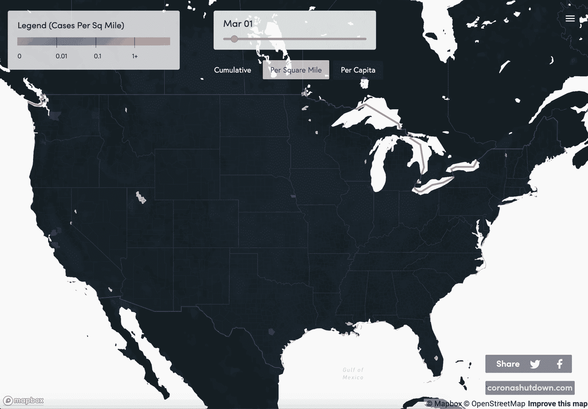
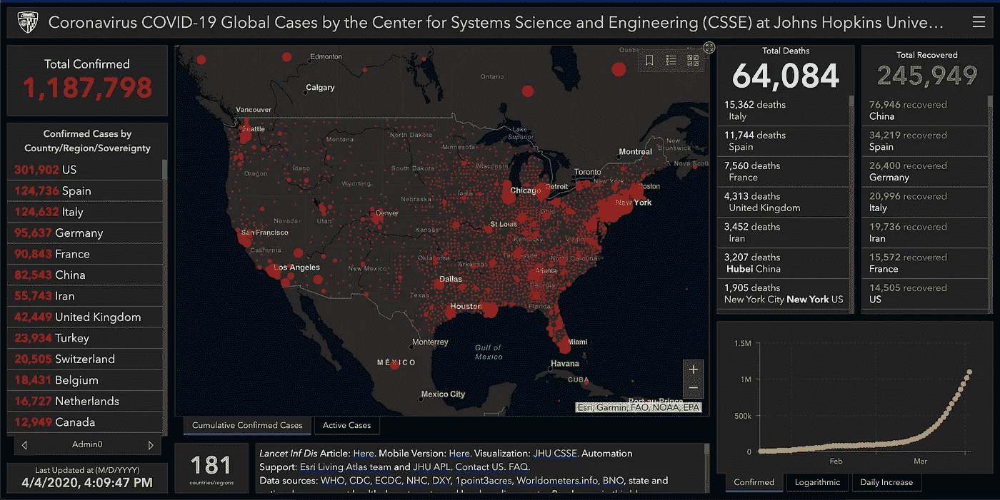
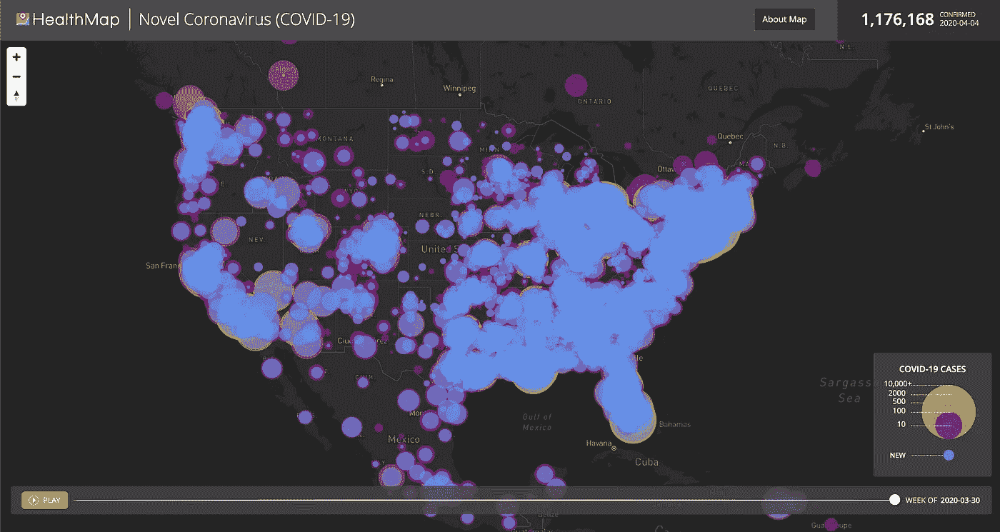
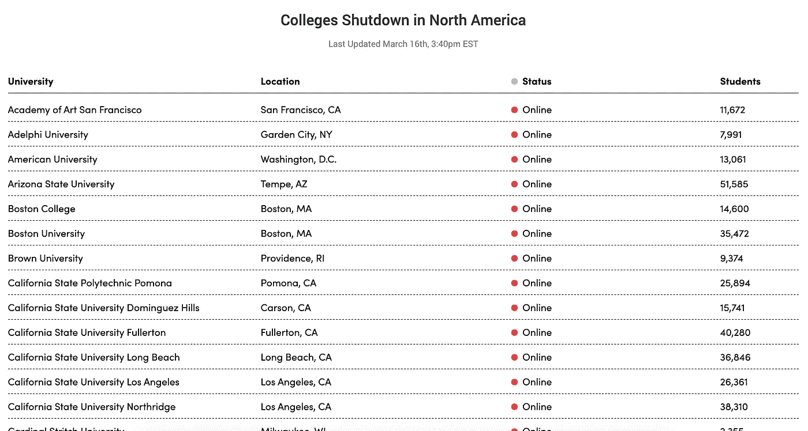
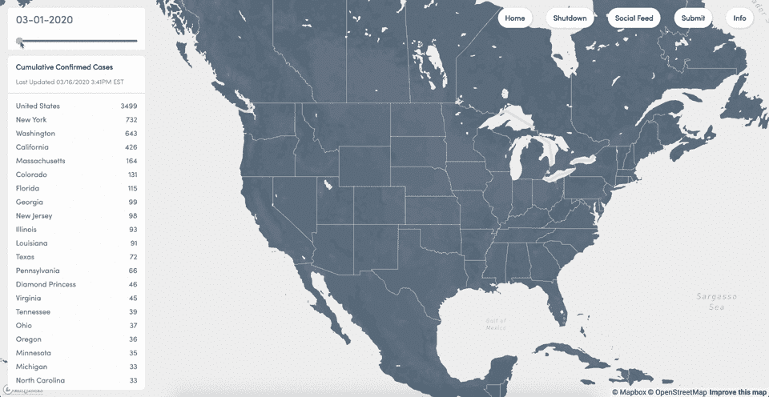
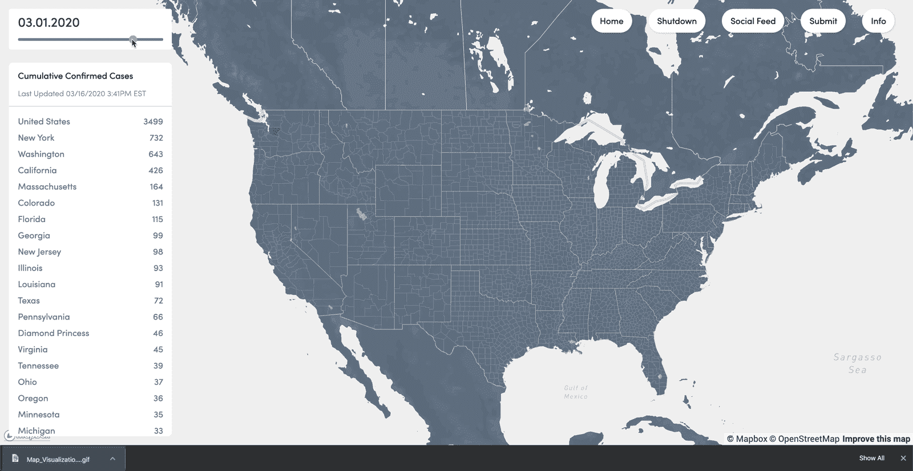
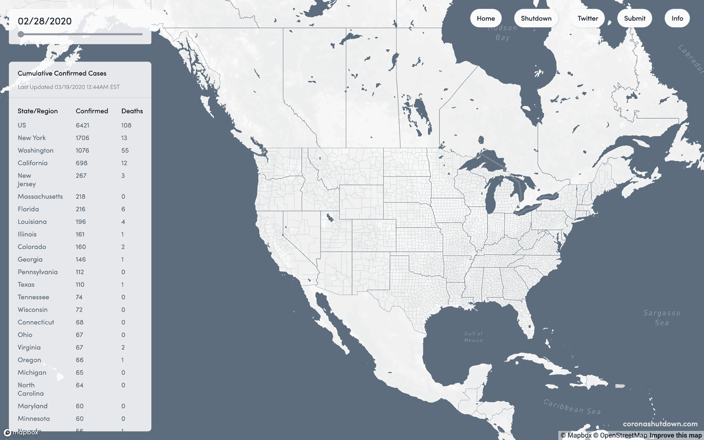
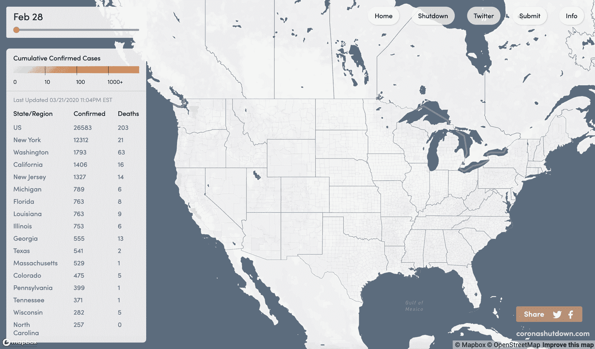
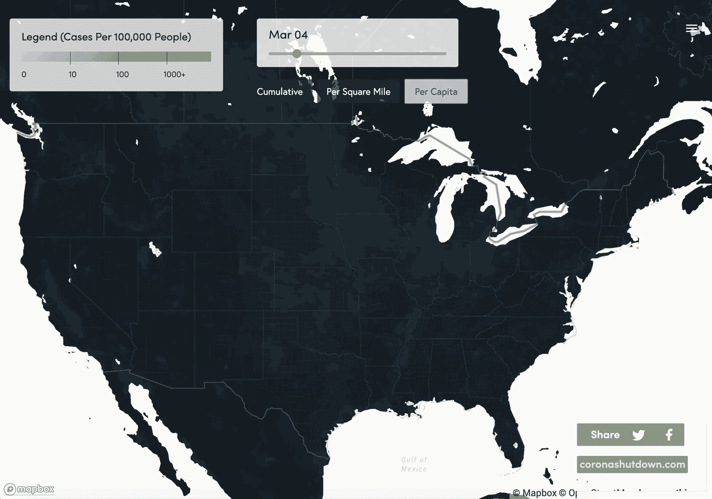

# 在美国可视化新冠肺炎

> 原文：<https://towardsdatascience.com/visualizing-the-coronavirus-spread-cef4ae0dd38?source=collection_archive---------25----------------------->

## 跟踪美国各县冠状病毒爆发的交互式 choropleth 地图和仪表板

与[陈家](https://medium.com/@starspy88)和[米兰达·朗](https://medium.com/@mirandaluongnyc)

我们最新的地图追踪证实了美国各县每平方英里的新冠肺炎病例

随着冠状病毒(新冠肺炎)爆发现已成为疫情，出现了许多工具来跟踪该病毒的新确诊病例，从在线数字地图到详细的仪表板。这些工具有助于对抗这种疫情。他们帮助公共卫生官员协调应对工作，并让公民更好地了解病毒的影响范围，以便他们能够做好相应的准备。

尽管这些地图无疑是重要的，但许多地图缺乏必要的粒度，无法将新确诊的病毒病例置于“大范围”的背景中。在像加利福尼亚这样的大州，观察全州范围内的病例对国家卫生官员来说可能是有价值的，但对州官员、地方官员或普通公民来说就没那么有帮助了。此外，由于人口密度高，病例往往偏向较大的城市地区，而不利于农村和郊区。

**我们的目标是创造几个互动的可视化场景，将疫情的方方面面融入其中。**

1.  累积地图-可视化每个县的案例总数
2.  每平方英里地图-可视化每个县每平方英里的案例
3.  人均-可视化每 100，000 人中的人均病例数

还应注意的是，由于选择性检测和无症状个体，数据无疑遗漏了许多病例。这些想象虽然不完整，但对我们理解和抗击疫情的集体努力仍然很重要。

约翰·霍普金斯大学的可视化技术过于具体，使得数据难以掌握

[health map](https://www.healthmap.org/covid-19/)的可视化过于宽泛，使得数据难以解读

考虑到这些因素，我和我的团队试图在这些现有的地图上进行构建。我们的目标是创建一组视觉效果，为普通市民和当地卫生官员更好地呈现适当规模的疫情。**我们认为，郡尺度的 choropleth 地图是准确显示美国各地新冠肺炎新增确诊病例的最佳方式。**

# 早期发展

该团队目前由来自卡内基梅隆大学和纽约大学的三名成员组成。如果你认为你能帮忙，请联系我们！

Jason Zhu——项目和设计负责人
；陈家——开发负责人
；Miranda Luong——研究设计&

在最初的地图开发之前，我们注意到许多大学生开始编制他们自己的高等教育机构和被关闭事件的列表。通过最少的开发，我们很快就建立了一个由受疫情影响的[机构](https://www.coronashutdown.com/institutions)和[事件](https://www.coronashutdown.com/events)组成的众包知识库。这项工作由社区众包，并成为产生更全面的地图兴趣的工具。例如，一个[的 reddit 帖子](https://www.reddit.com/r/nyu/comments/fhbvyw/covid19_college_shutdown_list/)在 NYU 的 subreddit 上吸引了超过 1000 个独立访客，并在 Reddit 和 Twitter 上转发。

截至 3 月 16 日，已经上线的大学初步名单。

# 初始累积地图可视化

使用 [Mapbox GL JS](https://docs.mapbox.com/mapbox-gl-js/api/?utm_medium=sem&utm_source=google&utm_campaign=sem|google|brand|chko-googlesearch-pr01-dynamicsearchcampaign-nb.broad-all-landingpage-search&utm_term=brand&utm_content=chko-googlesearch-pr01-dynamicsearchcampaign-nb.broad-all-landingpage-search&gclid=Cj0KCQjwx7zzBRCcARIsABPRscP--RhBGfeyAw-iZNsBrrAGl1mjqylMx6zinc91zO6a7Dp3EOK20KQaArmbEALw_wcB) 和[公共数据集](https://github.com/nytimes/covid-19-data)，我们开发了一个显示确诊病例的美国地图——类似于上面提到的 HealthMap 可视化。然后，我们将每个坐标标绘到相关的县上。我们认为这是一个适当的粒度——对各级政府和普通公民都有用。为了不忽略查看各州数据的重要性，我们还将美国各州的数据显示在左侧。

以公开可用的美国各县 GeoJSON 边界文件为例，我们使用 Node.js 为每个县添加属性，记录每个日期的确诊病例数。这些数据来源于 UW GitHub 知识库，其中概述了每个案例、确认日期和坐标。

我们数据可视化的初始版本

在一天多的时间里，我们能够创建一个 choropleth 地图，将每个确诊病例坐标与其相关的县进行映射。虽然还处于初级阶段，但这是我们所知的第一次在县一级成功绘制美国冠状病毒病例的努力。我们认为，由于难以找到必要的数据，以前没有这样做过。

该地图的一个缺点是，它可能会歪曲新冠肺炎是如何在美国蔓延和增长的。随着美国的测试能力刚刚开始提升，随着时间的推移，这是可视化数据的必然结果。

从右到左:我们的累积 choropleth 图的三次迭代。

# 每平方英里和人均地图可视化

随着初始地图的发布，我们开始着手解决累积氯图所呈现的一些问题。举例来说，累积地图可能会忽略新冠肺炎是如何影响农村地区的，因为它倾向于容易进行测试和人口众多的地方。

每平方英里地图

每 10 万人地图

虽然这项工作仍在进行中，但我们会邀请您在 coronashutdown.com 参观我们的可视化项目。

## 如果您想参与或有任何反馈，请联系我。

*非常感谢 Lucy Zhu 和其他人的编辑和反馈*