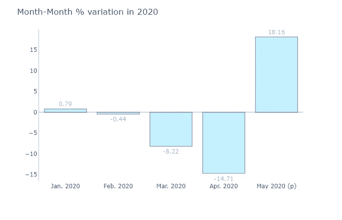
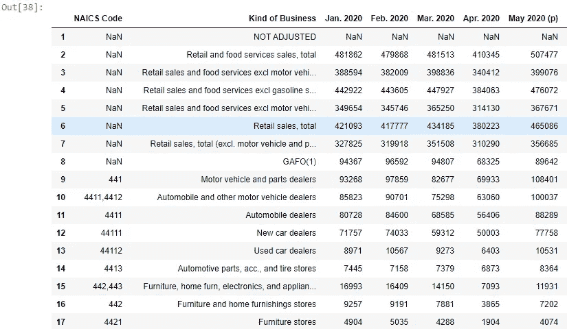
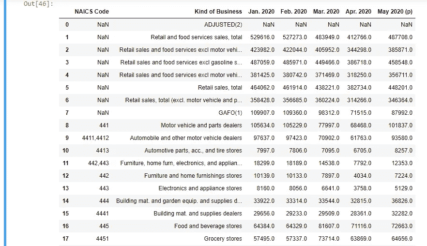
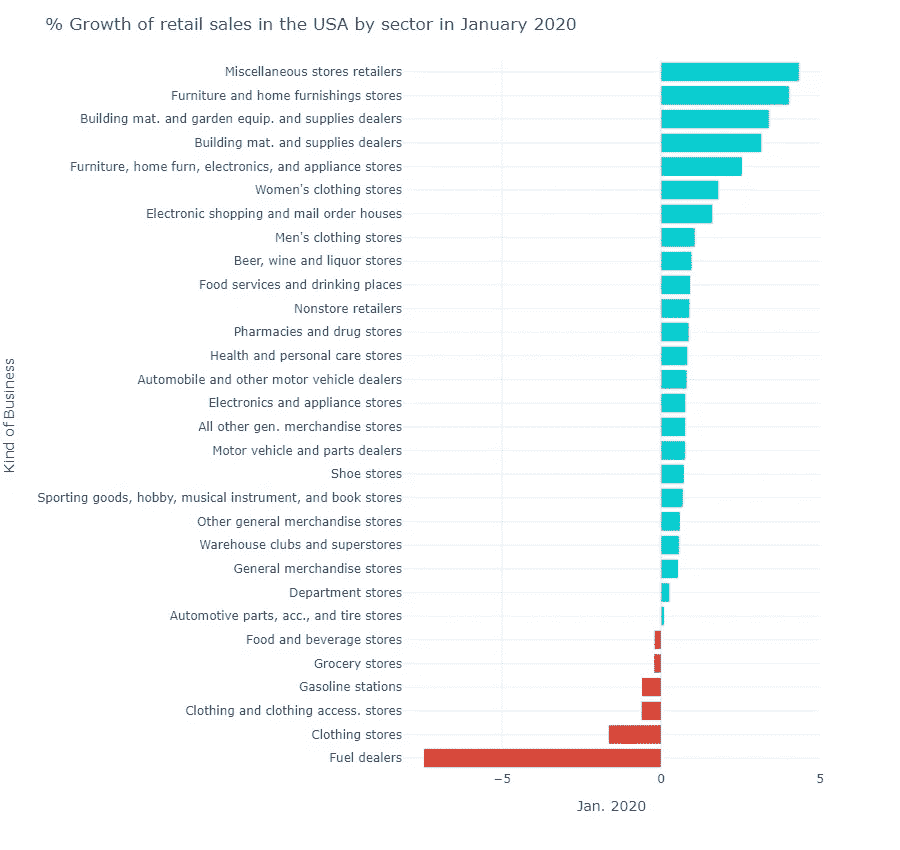
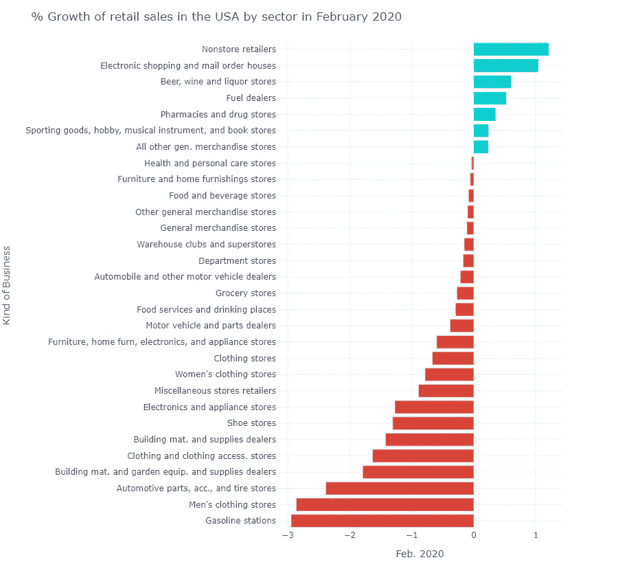
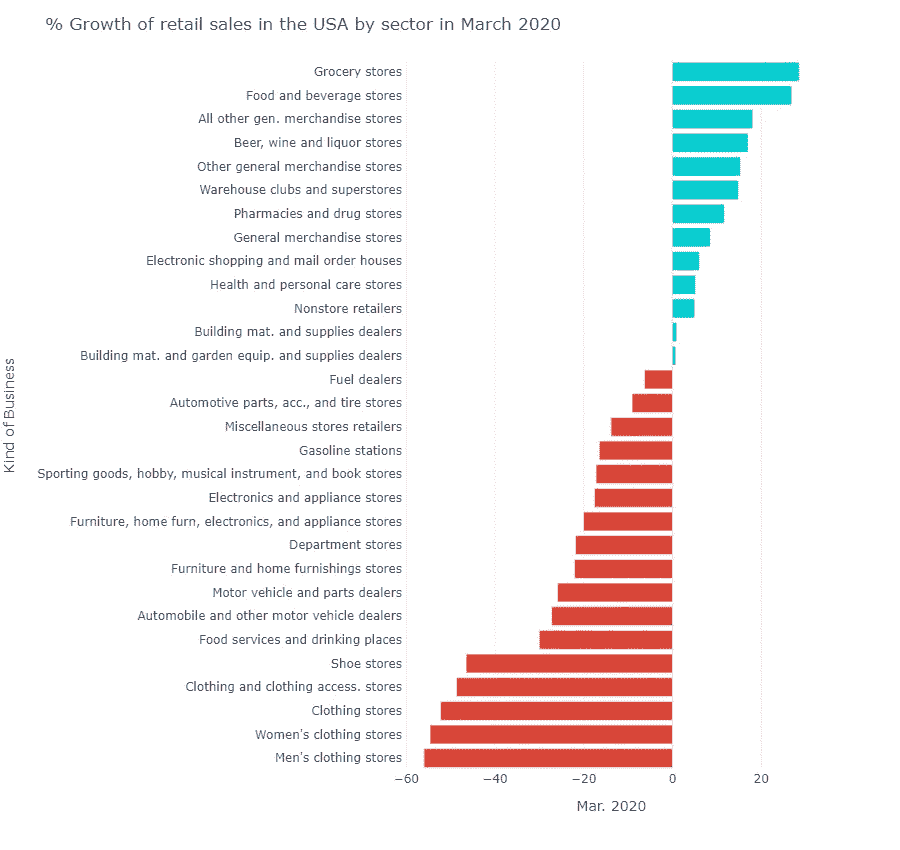
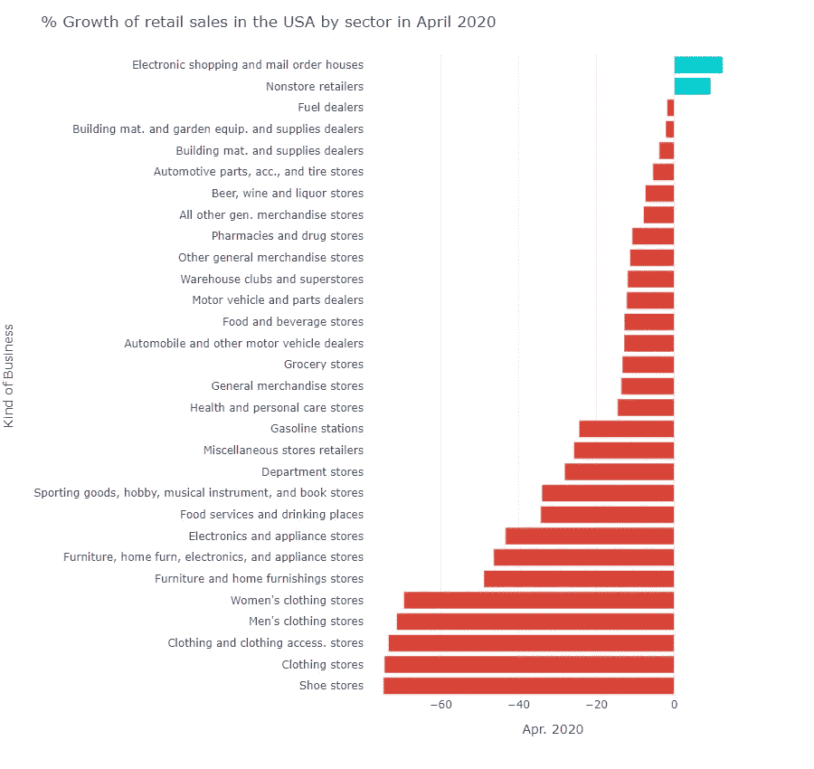
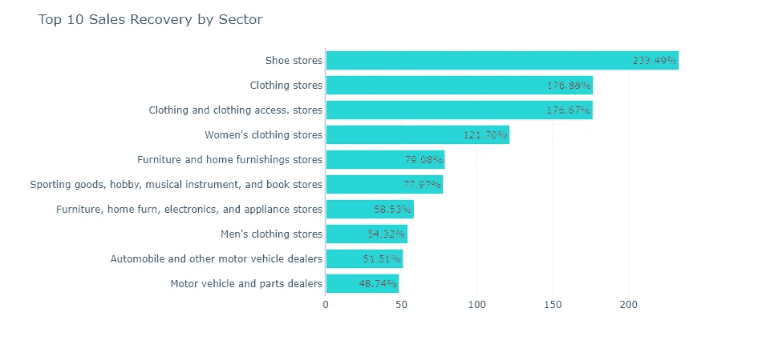
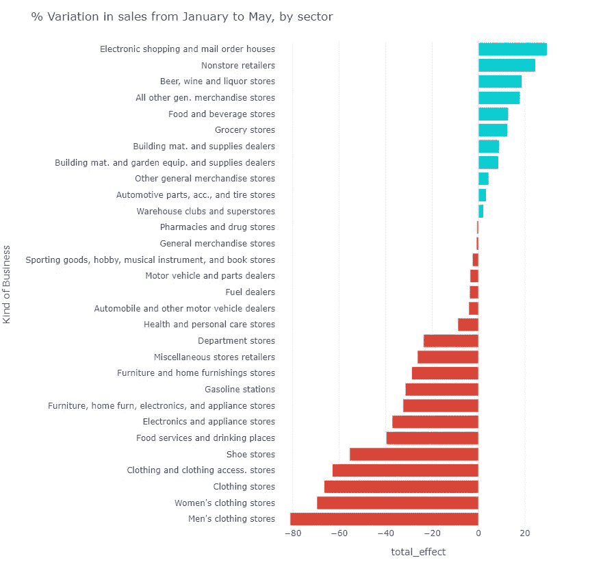

# 可视化新冠肺炎对零售的影响

> 原文：<https://towardsdatascience.com/visualizing-the-impact-of-covid-19-on-retail-sales-49ce73509b1f?source=collection_archive---------53----------------------->

## 零售业是受疫情影响最大的行业之一，而且可能永远不会恢复

来源:作者使用人口普查局月度零售报告的数据制作的图表

由于新冠肺炎造成的全球疫情现在已经延伸到 2020 年上半年之后，几个国家仍然每天报告数千例病例。最初的行动旨在遏制病毒的传播并使曲线变平以拯救生命，但也产生了严重限制经济活动的不幸影响，因为大多数人都呆在家里以遵守封锁措施。严重依赖人流量的部门被派往 UCI，数量空前的企业要么在有限的产能下工作，要么完全停止运营。尚不清楚一些行业是否会从冲击中恢复过来。

根据美国人口普查局(Census Bureau)的数据，零售业就是这样一个行业，在两个月内，调整后的零售额从 2 月份的 5273 亿美元增加到 4 月份的 4128 亿美元。这意味着总销售额下降了约 22%，也意味着许多企业关门，也许是永远关门。

## 数据

人口普查局定期发布全国零售数据，这些数据可以直接从官方网站下载。excel 文件包含自 1992 年以来所有月份的数据，每张工作表都以年份命名。从那里，我提取了调整后的数据(如果你对这个过程感兴趣，欢迎你访问[Github 项目](https://github.com/danifernandes-hub/Projects/blob/master/Visualizing%20the%20effect%20of%20COVID-19%20on%20retail/Project%20code/Visualizing%20the%20impact%20COVID-19%20had%20on%20retail.ipynb)并查看转换和代码，对于情节复杂的情节使用 [NBViewer](https://nbviewer.jupyter.org/github/danifernandes-hub/Projects/blob/1376a54a0eb29d215558a366f26939b4076bc871/Visualizing%20the%20effect%20of%20COVID-19%20on%20retail/Project%20code/Visualizing%20the%20impact%20COVID-19%20had%20on%20retail.ipynb) )。

我选择了调整后的数据，因为显示的估计值是针对季节变化、假日和交易日差异进行调整的，这意味着图表中显示的影响将仅对应于新冠肺炎。使用调整后的数据的一个缺点是，未调整数据的一些细节会丢失，如下图所示。

来源:作者照片。数据来自人口普查局月度零售报告

来源:作者照片。数据来自人口普查局月度零售报告

调整后的切片中有更少的 NAICs，这意味着我们将使用组成每个代码的聚合。总的来说，调整后的数据有 30 个部门，这足以了解每个部门的总体情况。

## 疫情之前的现实

来源:作者使用人口普查局月度零售报告的数据制作的图表

在上图中，调整后的数据中确定的 30 个地区中的大多数都报告说 1 月份的销售额有所增长，只有一些例外。五个行业的利润率下降到 2%以下，只有燃油经销商似乎表现出“挣扎”的迹象，与 2019 年 12 月相比，下降了约 7.5%。

来源:作者使用人口普查局月度零售报告的数据制作的图表

2 月份几乎所有的零售行业都遇到了一些困难，行业整体下降了 0.44%，在 3 月份灾难降临之前，大多数行业的销售额都减少了相对较小的一部分。

## 封锁

来源:作者使用人口普查局月度零售报告的数据制作的图表

虽然一些地区在封锁措施下蓬勃发展，如杂货店、药店和非商店零售商；其他公司遭受了不成比例的冲击，比同行受到的伤害大得多。其中一个例子就是仅在三月份就损失了高达 50%的鞋店。

这种情况在 4 月份开始恶化，当时距离措施开始生效。4 月份只有两个行业出现增长，因为整个行业的销售额下降了创纪录的 14.71%。

来源:作者使用人口普查局月度零售报告的数据制作的图表

受封锁影响最大的是服装店、家具和家电商店、餐饮服务和饮酒场所、运动和爱好商店以及加油站。

仅凭直觉，这些结果并不令人惊讶，因为这些商店严重依赖流量来确保其大部分销售。它们还具有非必需品的性质，这意味着公众可以放弃这些支出，转而将资金用于购买危机情况下的必需品。

## 复苏的开始

随着 5 月初，一些州取消了限制，允许人们回到日常生活中。这些行动转化为大多数行业的销售增长，尤其是受疫情影响最大的行业。仅鞋店销售额就恢复了 200%以上，服装店恢复了 176.88%。

来源:作者使用人口普查局月度零售报告的数据制作的图表

然而，这些数字仍低于新冠肺炎封锁前的水平，如下图所示。

来源:作者使用人口普查局月度零售报告的数据制作的图表

## 结论

从冠状病毒的初始休克中恢复的小步骤正在进行中。令人高兴的是，在 2020 年 6 月月度报告的预览中看到了进一步改善的迹象，这标志着零售销售的总体增长约为 7.5%，正如[华尔街日报](https://www.wsj.com/articles/us-retail-sales-report-data-june-2020-11594846181)所报道的那样。

然而，随着[美国的病例数量日益增加](https://www.worldometers.info/coronavirus/country/us/)，恢复封锁措施的可能性增加，5 月和 6 月取得的成果可能会付诸东流。

[1]人口普查局，[零售业月度报告](https://www.census.gov/retail/index.html)，(2020)

[【2】](https://www.wsj.com/articles/us-retail-sales-report-data-june-2020-11594846181)h . Torry，美国[随着商店重新开业，6 月份零售额增长 7.5%，](https://www.wsj.com/articles/us-retail-sales-report-data-june-2020-11594846181) (2020)，华尔街日报

[3]世界计量仪，[美国冠状病毒](https://covid19.healthdata.org/united-states-of-america)，(2020)。