# 视觉化虚无

> 原文：<https://towardsdatascience.com/visualizing-the-nothing-ae6daccc9197?source=collection_archive---------17----------------------->

## 如何用 Python 可视化数据集的不完整性

很难知道如何处理数据中的空值。大多数时候，放下它们，继续做剩下的事情会更容易。

但它们最终会有意义，可以被研究。花些时间好好看看它们，通常可以更好地理解数据是如何收集的，甚至可以揭示其中的一些模式。

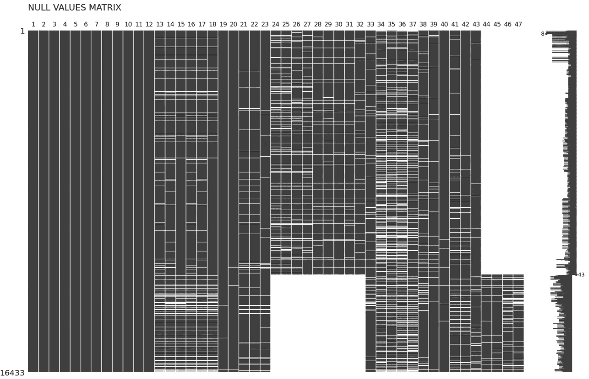

空值矩阵

在本文中，我们将探索如何可视化数据集中的所有空值，并看看我们可以从中获得什么样的见解。

我将在 [Jupyer Lab](https://jupyterlab.readthedocs.io/en/stable/) 中运行代码，对于这个例子，我将使用 [Pandas](https://pandas.pydata.org/) 、 [Numpy](https://numpy.org/) 、 [Missingno](https://github.com/ResidentMario/missingno) 和 [Matplotlib](https://matplotlib.org/) 。

数据集将是[加州监狱概况调查](https://www.openicpsr.org/openicpsr/project/104560/version/V1/view)，包含 1995 年至 2018 年每月县级数据。

```
import pandas as pdf = 'data/california_jail_county_monthly_1995_2018.csv'
df = pd.read_csv(f)
```

将数据集加载到 Pandas 之后，我们可以看看它处理空值的一种方便的方法。

我们可以利用。isnull 后跟一个. sum，并获取缺失值的个数。

```
df.isnull().sum()
```

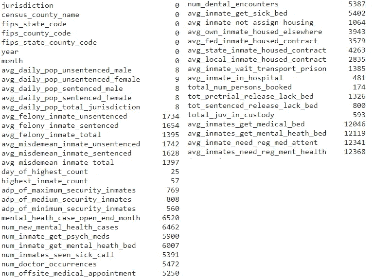

空值按列计数

这已经很有用了，因为它让我们知道我们可以依赖哪些字段，但是有更好的方式来可视化它，让我们尝试使用 Missingno。

Missingno 是一个用于可视化数据集中不完整性的库，它工作在 Matplotlib 和 Seaborn 之上，使用起来毫不费力。

```
import missingno as msno
```

我们将从一个简单的条形图开始。我们将使用矩形和它们的大小，而不是比较大量的数字。

## 条形图

```
msno.bar(df)
```

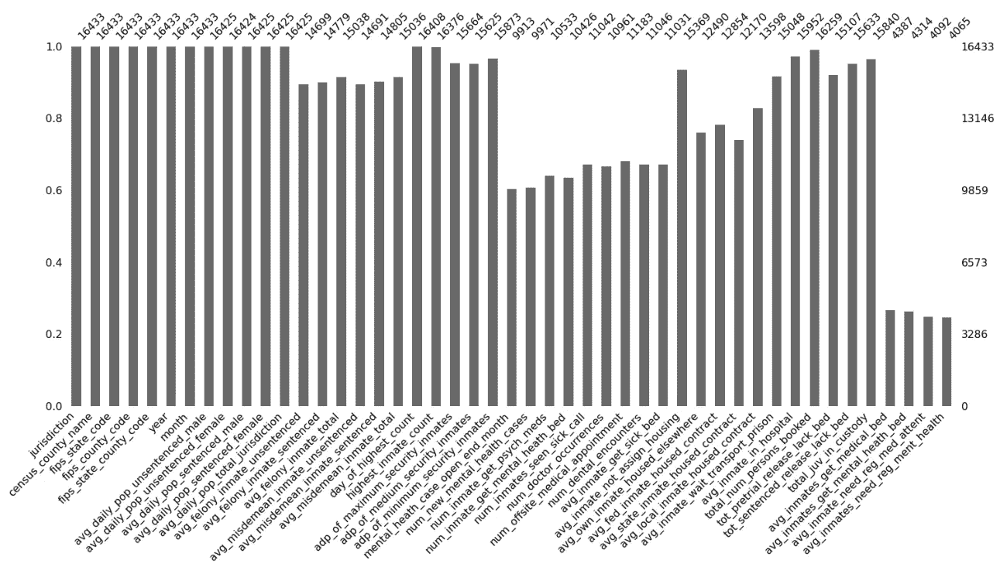

空值的条形图表示

太好了！在一个方法中，仅仅传递数据帧，我们就已经有了丢失值的可视化表示。

此条形图代表每列中的记录数。这里我们有两个刻度，一个表示字段中值的确切数量(右)，另一个表示占总行数的比例。

从条形图开始可以让我们快速判断是否需要花更多的时间来分析空值。

我们的数据并非如此，但如果您有一个没有任何空值或空值数量可接受的数据集，您现在可以停下来继续您的分析。

让我们尝试一种不同的可视化方法来显示缺失的值。

## [数]矩阵

```
msno.matrix(df)
```

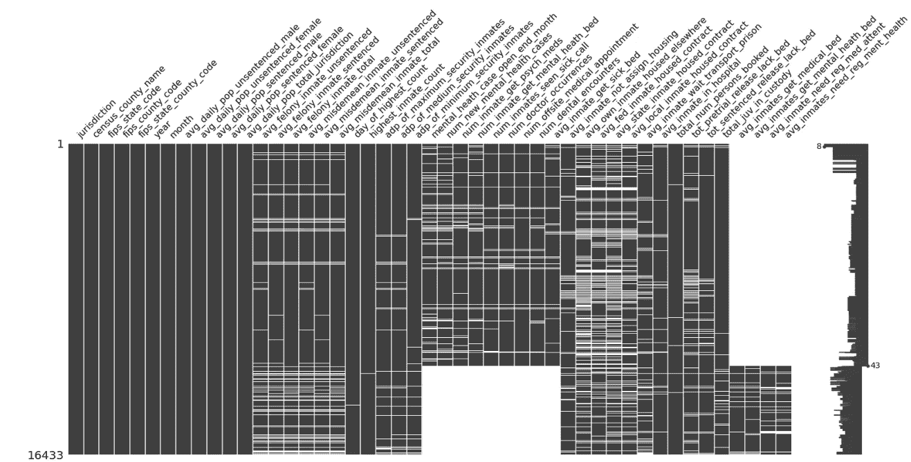

数据集的空值矩阵

矩阵告诉我们丢失值的确切位置，在我们的例子中，数据被排序，最新的记录在最上面。

通过查看矩阵并了解我们的数据是如何排列的，我们已经可以获得一些有价值的见解。在这里，我们可以看到收集的数据在某个时间点发生了变化，矩阵右侧的“*平均囚犯获得心理健康床位”*等字段被终止，其他字段被添加。

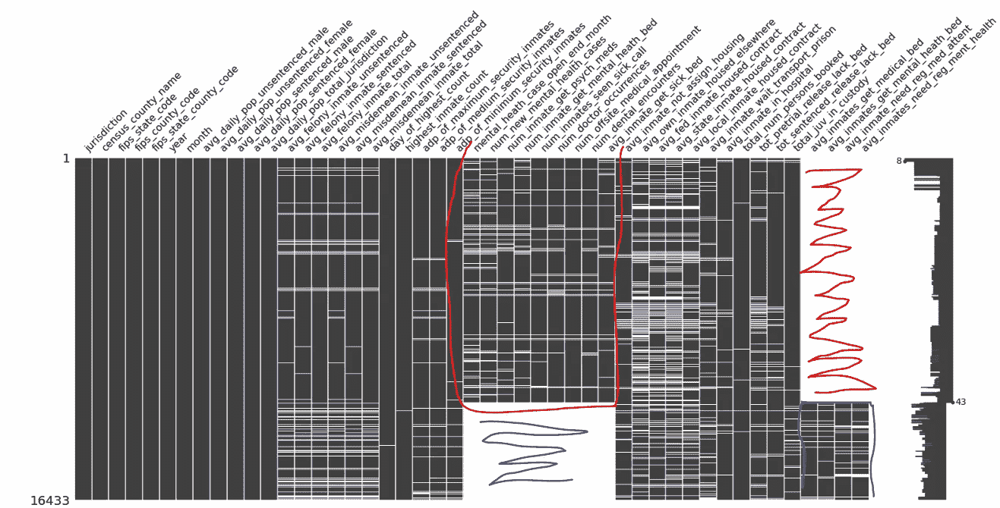

突出显示列组的矩阵

非常酷，矩阵的右边还有一个小的 viz，代表行的完整性——它们甚至标记了缺失值的最大和最小数量。

现在让我们来看看。热图，这将有助于我们理解关于不完整性的领域是如何相互关联的。

## 热图

```
msno.heatmap(df)
```

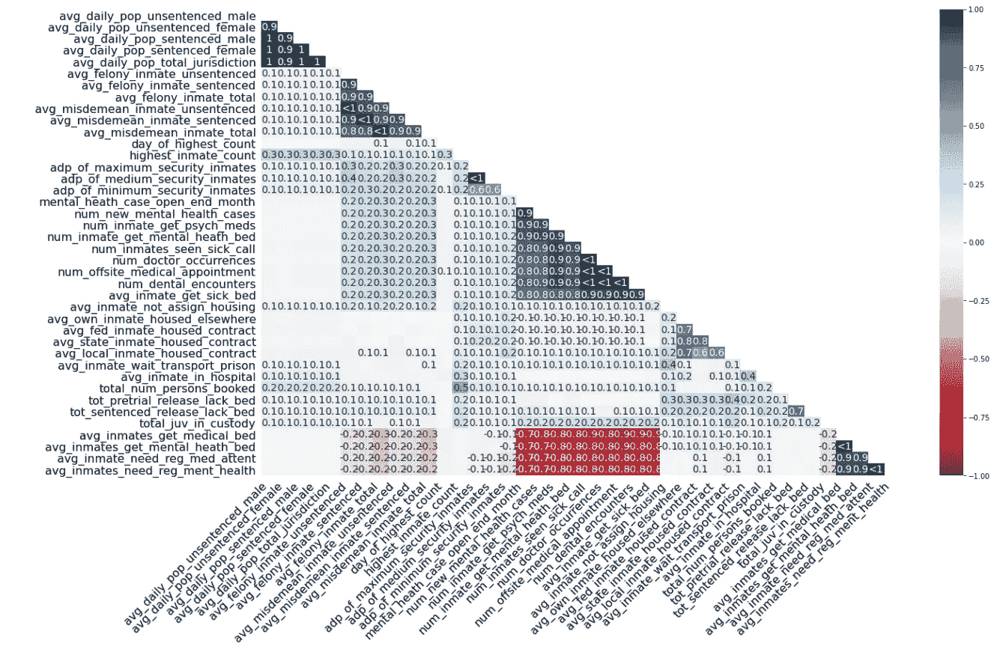

具有空值相关性的热图

好吧，事情变得复杂了——让我们简化一下。

此图按列表示空值之间的相关性。

A 列有一个值，B 也有一个值，这意味着强正相关或图表中的蓝色 1。

A 列有一个值，但 B 列有一个空值，这意味着强负相关，或者在图表中为红色-1。

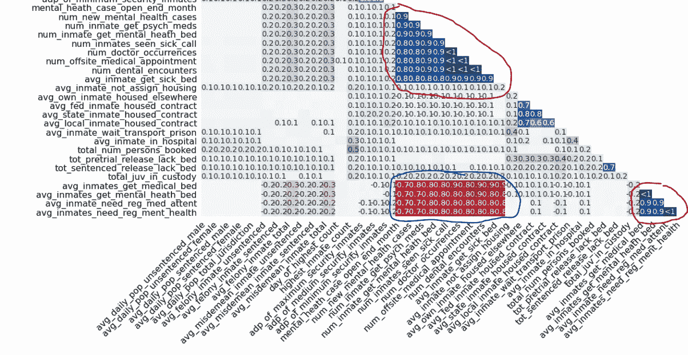

突出显示的热图

我们之前注意到数据收集方式发生了一些变化，在这里我们可以再次看到这一点。新变量与自身正相关，但与旧字段负相关。

尽管我们可以通过查看矩阵来可视化这种关系，但热图使它们更加明显。为了实现这种模式，我们并不总是以一种方便的方式对行进行排序。

在这个数据集中，我们可以看到调查的字段几乎是分组的。

因此，如果回答了一个问题，我们很可能会得到该组中所有项目的答案。

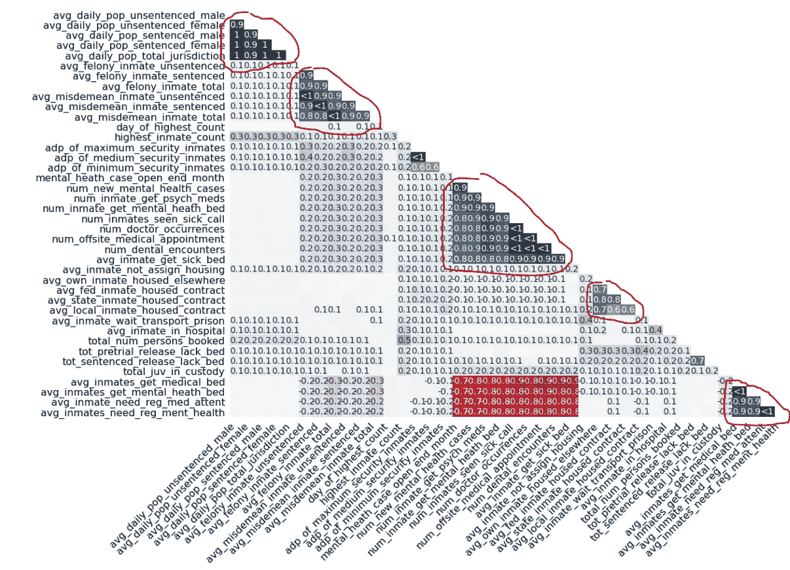

突出显示各组的热图

好的，我想通过另一种方式，来形象化地展示场在空值问题上的关系。

## 系统树图

```
msno.dendrogram(df)
```

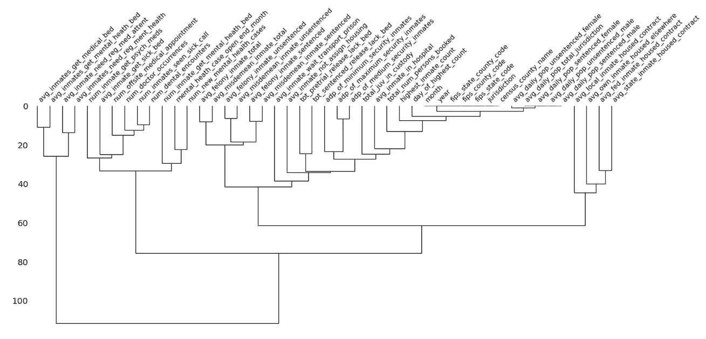

数据集的树状图

我们在热图中看到了一些群体行为，但主要是因为数据集的排列。

如果对**行**进行排序，我们可以使用**矩阵**图表注意到字段之间的一些相关性，但是如果它们是随机放置的，这将更加困难。

同样的事情也发生在**热图上。**如果**列**是随机放置的，我们将会有一段更具挑战性的时间来找出变量组之间的模式。

树状图使用分层聚类算法根据字段的相关性对其进行分类。**我们看到的与热图的关系。*

因此，这就像找出哪些字段在无效性问题上高度相关，然后测试这些变量组如何相互关联等等。

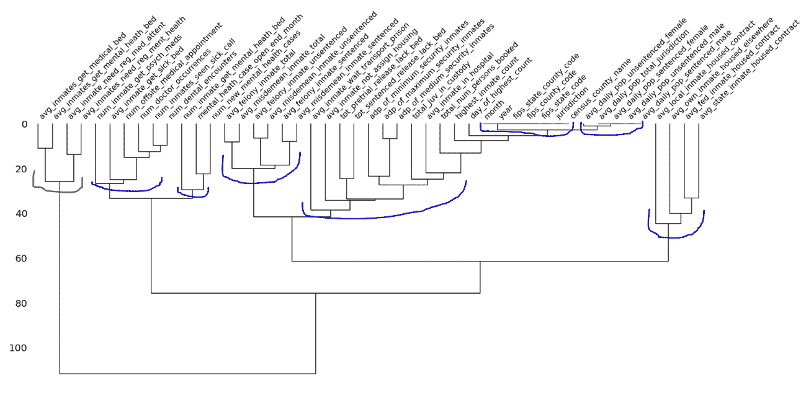

突出显示各组的树状图

同样，我们可以注意到不连续的字段，但我们可以更清楚地看到哪些变量可能更可靠。

该图说明了各组之间的联系，其中离零越远的联系表示无效性不太相似的变量的组合。

## 过滤器和 Matplotlib

Missingno 是快速可视化缺失值的优秀工具；我们对每个图表只使用了一行代码，得到了一个相当不错的结果。

该工具具有一些过滤功能，可以选择和排列我们想要绘制的变量。它允许我们自定义图表的某些方面，所有这些都在同一个语句中。

对于任何你不能直接用 Missingno 定制的东西，你都可以去 Matplotlib。

```
from IPython.core.display import display, HTML
import matplotlib.pyplot as plt
import numpy as np# define matrix for the 13 columns with most nulls
**m** = msno.matrix(df, figsize=(25, 14),
                **filter='bottom', n=13**, 
                color=(0.3, 0.3, 0.5))# get ticks names and positions
cols = [i.get_text() for i in **m.axes.get_xticklabels()**]
ticks = np.arange(0,len(cols))# plot new ticks
**plt.xticks**(ticks, labels=ticks+1, rotation=0, ha='center')# title n plot
**plt.title**('Null values matrix\n'.upper(), loc='left', fontsize=22)
plt.show()# empty string for the HTML and template for div
html_table = ''
template = '<div style="border-style:solid; display: inline-block; width: 325px; padding-left: 5px; border-width: thin" >{} - {}</div>'table_order = [1, 6, 10,
               2, 7, 11,
               3, 8, 12,
               4, 9, 13,
               5]# draw table
for i in table_order:
    html_table += template.format(i, cols[i-1])HTML(html_table)
```

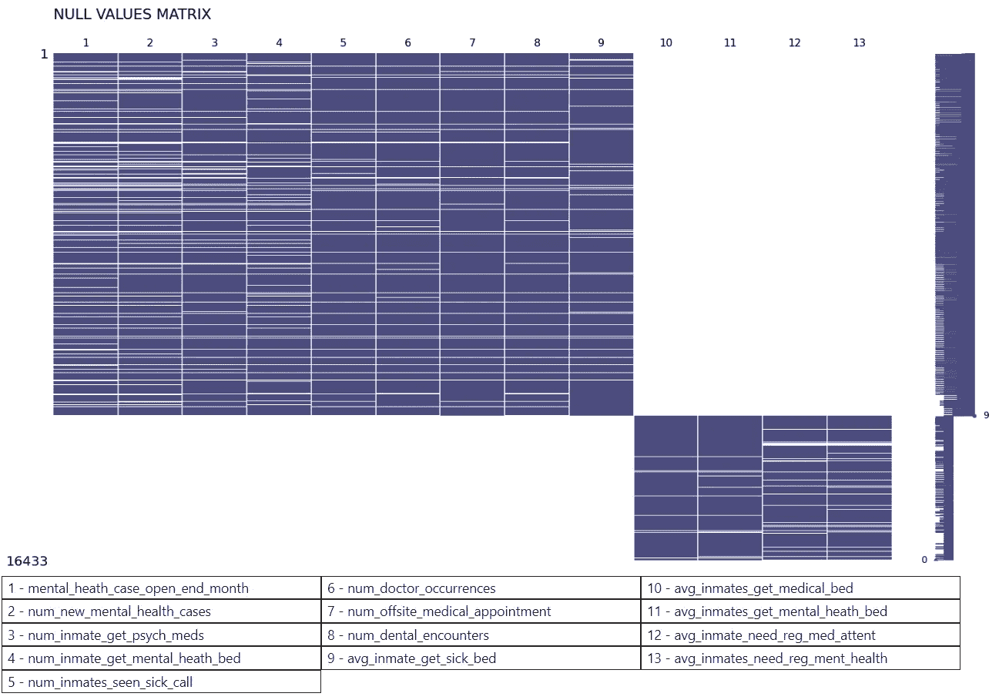

空值最多的 13 列的空值矩阵

很好，我们了解了可视化和分析数据集完整性的基础知识。有趣的是，我们可以通过可视化数据缺失的值来了解这些数据。

感谢阅读我的文章。我希望你喜欢它。

在这里你可以找到更多关于 Python 和数据可视化的教程。

**资源**:
[https://pandas . pydata . org/pandas-docs/stable/reference/API/pandas . is null . html](https://pandas.pydata.org/pandas-docs/stable/reference/api/pandas.isnull.html)；
[https://github.com/ResidentMario/missingno](https://github.com/ResidentMario/missingno)；