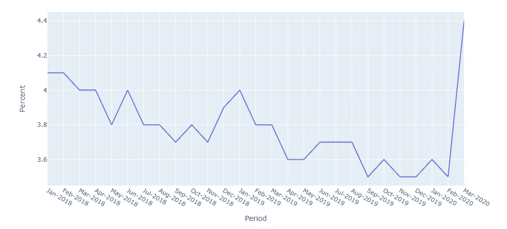

# 想象新冠肺炎对全球经济的影响

> 原文：<https://towardsdatascience.com/visualizing-the-pandemics-impact-on-the-global-economy-with-plotly-169f31963eb3?source=collection_archive---------60----------------------->

## 理解四种数据可视化中的疫情效应

凯尔·格伦在 [Unsplash](https://unsplash.com/s/photos/economy?utm_source=unsplash&utm_medium=referral&utm_content=creditCopyText) 上的照片

# 目录

1.  [简介](#c7e3)
2.  [冠状病毒与股市](#191b)
3.  [冠状病毒与失业率](#385f)
4.  [冠状病毒和黄金](#3861)
5.  [冠状病毒和消费者信心](#ac7d)
6.  [奖金](#5e4d)

*数据和代码可以在这里找到:*[*https://github.com/terenceshin/Covid_Impact_on_Economy*](https://github.com/terenceshin/Covid_Impact_on_Economy)

# 介绍

随着我们接近近 400 万例冠状病毒病例、近 25 万例死亡和数月的隔离，我们都同意它极大地影响了我们的日常生活。但这不是唯一受影响的事情。

全球经济中断如此之多，以至于有些人想知道第二次大萧条是否正在向我们走来。虽然目前这只是一种猜测，但我们可以通过客观数字看到，疫情确实正在影响我们的经济。下面是一些统计数据和可视化数据，让你更好地理解目前的经济状况。

# 冠状病毒和股票市场

标准普尔 500 指数

**S&p500 正在下跌。简单来说，标准普尔 500 指数基本上代表了美国 500 家最大的上市公司。今年早些时候，标准普尔 500 指数从最高点下跌了 30%以上——上次标准普尔 500 指数下跌这么多是在 2008 年的经济衰退期间。**

你可能会问，“为什么疫情会导致股市下跌这么多？”从理论上讲，股票市场是我们经济运行状况的反映，并且受到许多因素的影响，比如利率。但实际上，股票市场反映了我们对经济在不久的将来会有多好的预期。由于这场疫情引发了很多对未来的不确定性，投资者一直在抛售股票套现，这反过来又降低了股市的价值。

当然，不确定性不是唯一的因素。还有许多其他指标，如失业率和消费者信心，表明经济放缓。这让我们有了下一个洞见…

# 冠状病毒和失业率

历史失业率

**失业率正在上升。2008 年经济衰退后，失业率从 10%一路稳步下降到今年 2 月的 3.5%。然而，从 2 月到 3 月，失业率从 3.5%增加到 4.4%，增幅超过 25%。这可能只是个开始……[高盛预测今年失业率可能达到 15%的峰值](https://www.forbes.com/sites/sergeiklebnikov/2020/03/31/how-bad-will-unemployment-get-heres-what-the-experts-predict/#2a0158134f16)。**

举个例子，2008 年衰退期间的最高失业率是 10%。这既可怕又糟糕，因为失业率影响到每个人。更高的失业率意味着家庭的可支配收入将减少，这意味着公司的收入将下降，从而导致更多的裁员，这一循环还在继续。

# 冠状病毒和黄金

GLD 信托价格

黄金正在增值。当经济形势恶化时，黄金往往会升值，这种情况也不例外。对那些感兴趣的人来说，从技术上讲，黄金没有内在价值。你不能去杂货店用黄金买食品杂货。但黄金在古代文明中是一种货币，从那时起，它就被社会建构并被视为价值储存手段。因此，这可能是另一个迹象，表明我们的经济正在走下坡路。

# 冠状病毒与消费者信心

**消费者信心下降**。经合组织对消费者信心的定义如下:

> 「这个消费者信心指标提供了家庭消费和储蓄未来发展的指标，是根据对他们预期的财务状况、对整体经济状况的看法、失业情况和储蓄能力的回答而得出的。高于 100 的指标表明消费者对未来经济形势的信心增强，因此他们不太倾向于储蓄，而更倾向于在未来 12 个月内花钱购买大件商品。低于 100 的数值表明对经济未来发展的悲观态度，可能导致更多储蓄和更少消费的趋势。”

从上面的图片来看，消费者信心指数已经下降到 100 以下，我预计在接下来的几个月里会继续下降。这是什么意思？报告称，数值低于 100 表明对未来经济发展持悲观态度。这与我们在上面看到的其他指标是一致的。

如果消费者认为近期前景黯淡，并决定增加储蓄，这意味着经济中流通的货币会减少，这意味着企业赚钱会减少，裁员会增多。

# 奖金

*   世界上 90%以上的人生活在有旅行限制的国家。这对航空业产生了重大影响，因为许多航空公司已经解雇了数千名员工。*点击* [*这里*](https://www.pewresearch.org/fact-tank/2020/04/01/more-than-nine-in-ten-people-worldwide-live-in-countries-with-travel-restrictions-amid-covid-19/) *如果你想了解更多。*
*   从更积极的方面来看，世界各地的空气污染正在急剧下降。呆在室内意味着路上的汽车更少，经济放缓意味着产量减少。一月和二月，中国的 NO₂水平下降了 40%。*点击* [*这里*](https://www.weforum.org/agenda/2020/04/coronavirus-lockdowns-air-pollution) *如果你想了解更多。*

# 感谢阅读！

如果你喜欢我的工作并想支持我，我会非常感谢你在我的社交媒体频道上关注我:

1.  支持我的最好方式就是在**媒体**这里[关注我](https://medium.com/@terenceshin)。
2.  在推特上关注我[这里](https://twitter.com/terence_shin)。
3.  点击这里订阅我的新 **YouTube 频道** [。](https://www.youtube.com/channel/UCmy1ox7bo7zsLlDo8pOEEhA?view_as=subscriber)
4.  在 **LinkedIn** [这里](https://www.linkedin.com/in/terenceshin/)关注我。
5.  在我的**邮箱列表** [这里](https://forms.gle/UGdTom9G6aFGHzPD9)注册。
6.  查看我的网站[**terenceshin.com**](https://terenceshin.com/)。

***编者注:*** [*走向数据科学*](http://towardsdatascience.com/) *是一份以数据科学和机器学习研究为主的中型刊物。我们不是健康专家或流行病学家，本文的观点不应被解释为专业建议。想了解更多关于疫情冠状病毒的信息，可以点击* [*这里*](https://www.who.int/emergencies/diseases/novel-coronavirus-2019/situation-reports) *。*