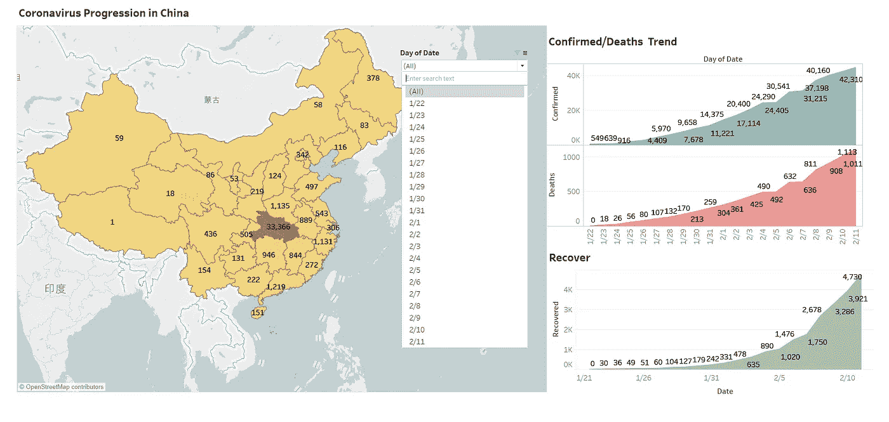
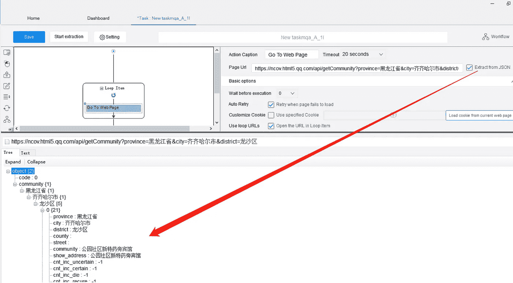
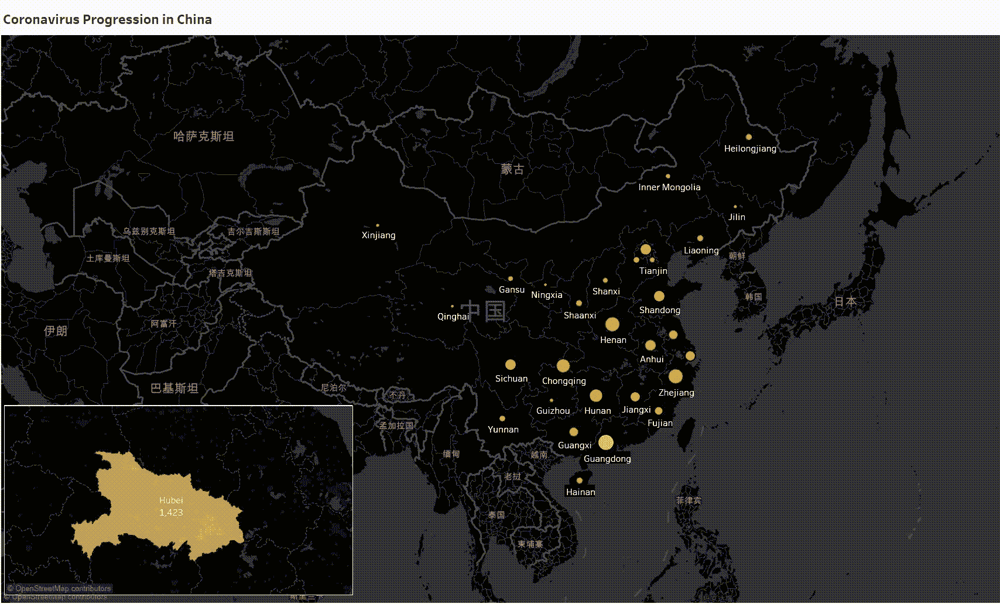
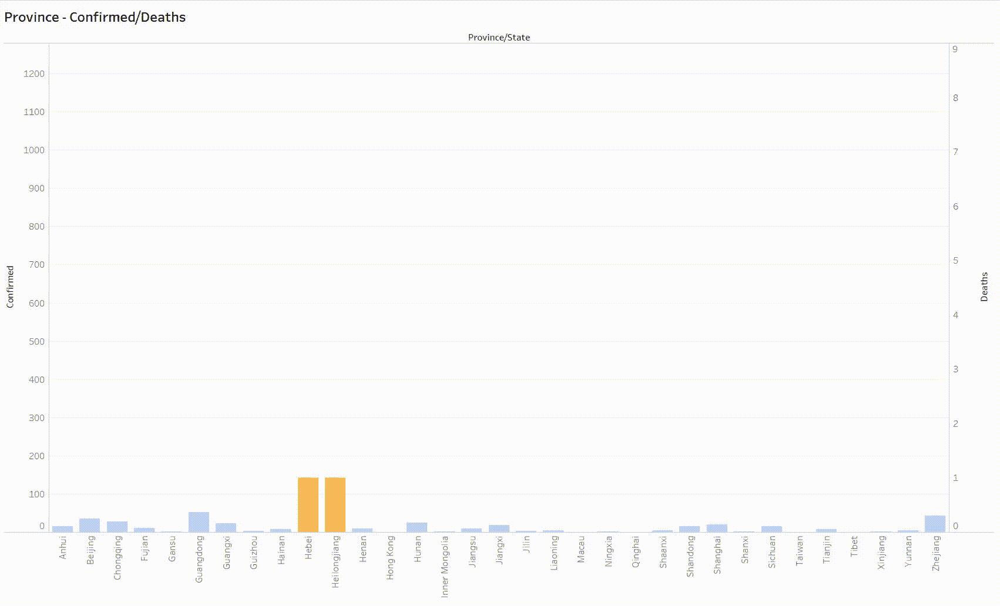
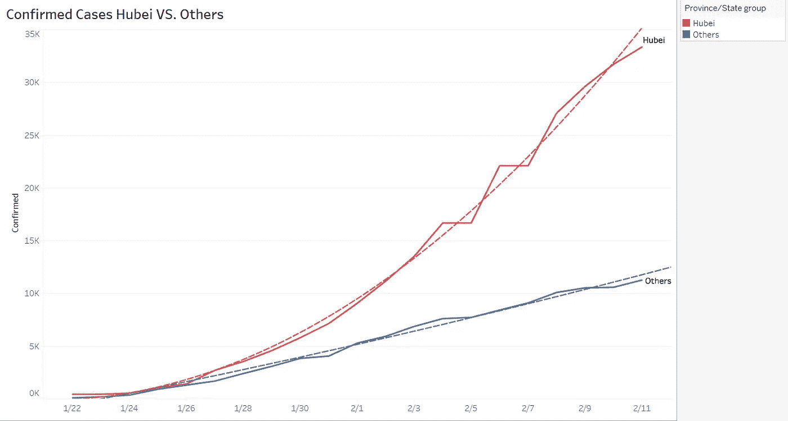
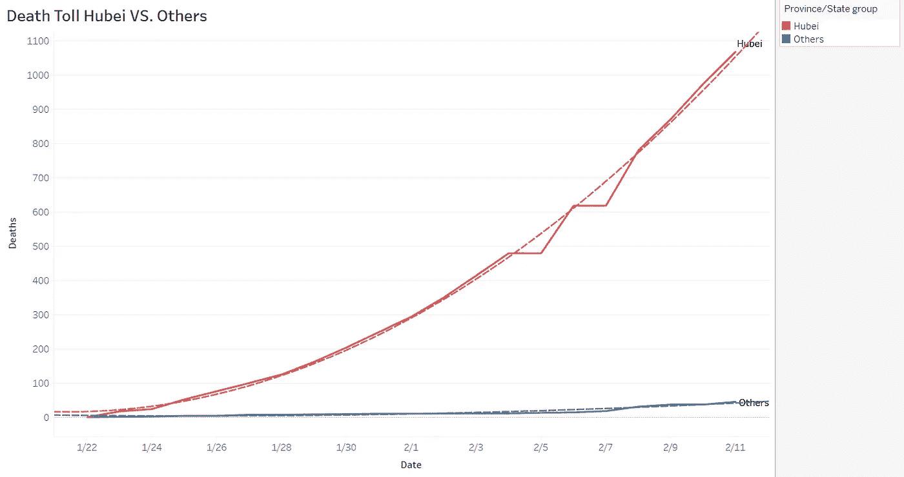
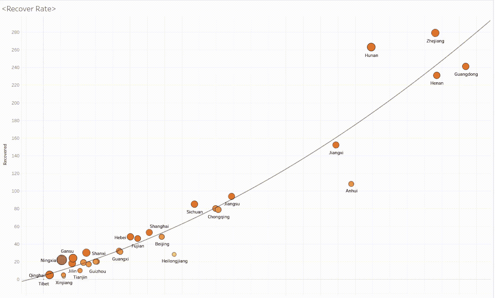

# 可视化冠状病毒爆发的进程

> 原文：<https://towardsdatascience.com/visualizing-the-progression-of-the-coronavirus-outbreak-a586cf1dc879?source=collection_archive---------29----------------------->

由[章节](https://www.chappatte.com/en/images/containing-the-coronavirus/)

前几天我发表了一篇文章，分析了冠状病毒(新冠肺炎)在中国的[社会影响。然而，总的来说，一些人仍然对这次疫情缺乏充分的了解。我认为从一个更客观的角度来想象这种情况会很有趣。](/how-data-analysis-helps-unveil-the-truth-of-coronavirus-8430de107ba4)

# 如何开始

首先，我从**网络搜集**开始，从中国国家卫生委员会提取数据，并使用[表格](https://www.tableau.com/)从空间上可视化疫情进展。我还创建了一个 [**仪表板**](https://public.tableau.com/profile/ashley.han8603#!/vizhome/CoronavirusDataTrend_Octoparse/ProvinceDash?publish=yes) ，我们可以在其中轻松地切换日期和省份，以便更仔细地查看。

冠状病毒进展仪表板由 [Ashley](https://public.tableau.com/profile/ashley.han8603#!/vizhome/CoronavirusDataTrend_Octoparse/ProvinceDash?publish=yes)

## 免责声明:

请注意，我收集的数据截止到 2 月 11 日。当你读到这篇文章的时候，这些数据可能已经跑偏了，不能反映这次疫情的现状。我将在本文的后面解释有一种简单的方法来跟上实时数据。我使用了一个 [**网页抓取工具**](https://www.octoparse.com/) 来提取数据，而不是编码，因为它可以将数据转换为可行的格式，而无需清理数据。

# 选择数据源:

如果你谷歌冠状病毒数据，我相信你会找到很多资源。像 [Kaggle](https://www.kaggle.com/) 这样的来源是其他人收集的二手数据，这些数据落后于像中国官方健康网站这样的主要来源的最新数据。如果你是一个对准确性和及时性有严格标准的数据分析师，你应该避免用二手数据下结论。那么你应该使用什么来源呢？原始数据是你选择的。此时，我选择了[冠状病毒更新源](http://i.snssdk.com/ugc/hotboard_fe/hot_list/template/hot_list/forum_tab.html?activeWidget=1)，因为它被保存为 JSONs，使我们能够通过 API 管道将各个城市的数据传输到我们的系统。([阅读这个 JSON 文件的指南](https://helpcenter.octoparse.com/hc/en-us/articles/360028283392-Scrape-data-from-JSON-with-Octoparse))

[八分网页抓取 JSON](https://www.octoparse.com/)

# 刮模板

另一种提取实时数据的方法是使用一个[抓取模板](https://www.octoparse.com/)，就像我在上一篇文章中做的那样。对于不会编码的人来说，这是一个现成的解决方案(观看此[视频](https://www.youtube.com/watch?v=L2AxYDuMbk4)了解详情)。您可以设置任务计划程序来获取最新数据。这是我收集的[数据](https://docs.google.com/spreadsheets/d/1wCXAk0aAi6OXH1v3eozOw6vgLvjg4HQWPOjtrxrwos0/edit?usp=sharing)，可以随意使用。

# 用 Tableau 实现数据可视化

在获得大量数据后，我们可以将其上传到 Tableau。我首先创建一个地图层，只需将省/州拖放到拖放字段中。之后，我添加时间序列并累加数值，以全面展示每个省的数据趋势。我把湖北省画出来，因为我可以特别注意它的数据趋势。该地图显示了自 1 月 22 日以来过去 20 天冠状病毒的历史传播情况。截至 2 月 11 日，仅湖北一地的确诊感染人数就达到了 33366 人。

阿什利冠状病毒爆发

我们可以看出，除了湖北，这次疫情对广东、浙江、湖南和河南的影响也很大。

不同省份报告的病例

请注意，湖北报告的病例明显多于所有其他病例的总和。我创建一个群，把他们分成两类:湖北和其他。为了更好地了解此次疫情的发展方向，我还添加了趋势线来分析当前形势。

湖北和其他地区都开始下滑到趋势线之下，这表明确诊病例呈下降趋势。然而，死亡人数并没有显示出积极的变化，因为数字仍然高于趋势线。

冠状病毒爆发湖北 vs .其他

冠状病毒爆发湖北 vs .其他

除了湖北以外，各省的复苏速度似乎是一些令人高兴的消息，因为随着时间的推移，趋势线变得更加强硬，更多的地方向上移动，表明复苏有所倾斜。恢复率将继续增长，因为人们现在正在迅速采取行动击败病毒。

回收率增长

# 最终想法:

我制作了动画，因为这是一个很好的方式来理解大画面，我们能够看到这次疫情的进展。一旦我们将数据可视化，分析就变得容易多了。数据分析中最大的挑战是数据收集。我通常会把大部分时间投资在无需动脑的劳动上。通常，我还需要手动修复数据格式。我发现网页抓取工具可以大大提高工作效率。但是，我不会建议过度滥用和刮擦任何网站。这将导致严重的法律后果。查看这篇文章了解更多信息:[网络爬行合法吗？](/is-web-crawling-legal-a758c8fcacde)

我会努力提高可视化，并随时分享你的想法和[电子邮件](mailto:ashley@octoparse.com)给我。

*原载于 2020 年 2 月 14 日 https://www.octoparse.com**[*。*](https://www.octoparse.com/blog/visualizing-the-progression-of-the-coronavirus-outbreak)*