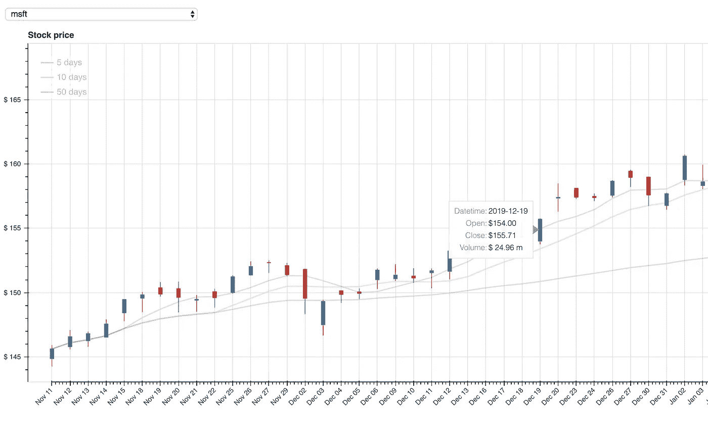
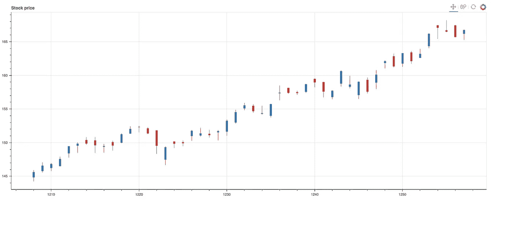
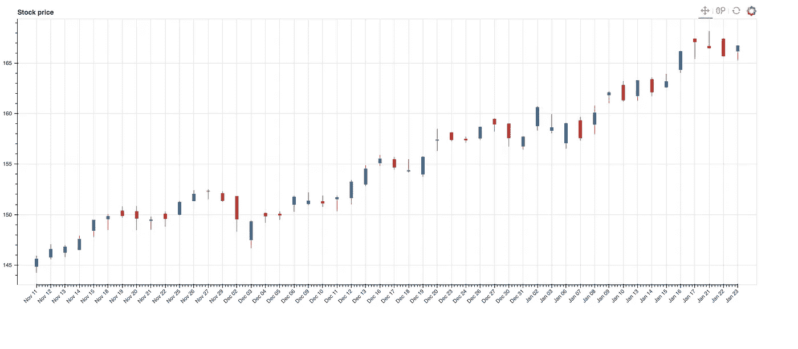
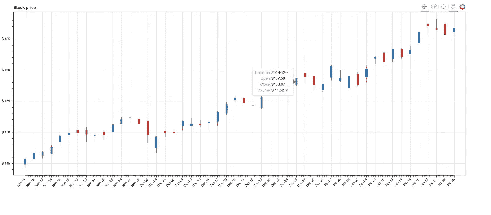
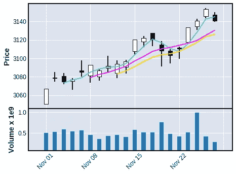

# 用 Python 散景可视化股票市场

> 原文：<https://towardsdatascience.com/visualizing-the-stock-market-with-python-bokeh-d40d9d1f288e?source=collection_archive---------5----------------------->

## 创建交互式股票价格仪表板的初学者指南。

由[克里斯·利维拉尼](https://unsplash.com/@chrisliverani?utm_source=medium&utm_medium=referral)在 [Unsplash](https://unsplash.com?utm_source=medium&utm_medium=referral) 上拍摄

# 为什么可视化很重要

要建立你的交易平台，你还需要有一个可视化你的股市数据的方法。最简单的方法之一你可以选择 [TradingView](http://tradingview.com) ，它有一个极好的分析金融市场数据的想法。

但是，您可能有特定的需求，比如在某种程度上比较两只股票的价格。大部分网络平台都支持不了这种情况。或者，如果你已经有一些自动化，你需要一个工具来可视化你的交易策略。

在这篇文章中，我将向你展示我如何开始在我的每日交易平台中建立我的可视化。在过去的几年里，我尝试了很多可视化框架，并且[散景](https://docs.bokeh.org/en/latest/index.html)可以支持我的大多数用例。

也许你对 Python 中绘图的`matplotlib`和`seaborn`比较熟悉。然而，金融数据，尤其是价格历史可视化在交互时更好。 [散景](https://docs.bokeh.org/en/latest/index.html)可以用多个复杂的图表创建丰富的交互式仪表盘。

如果你对我如何尝试其他框架感兴趣，请查看附录。

# 什么是散景？

散景是一个可视化库，可以很容易地创建功能强大的交互式绘图。

散景图可以导出为静态图像，或者嵌入到网页中。该库有一个内置的应用服务器，可以作为交互式仪表板的后端。

另一方面，散景也是一个低级的库，因为它允许我们控制一个情节的所有方面，包括交互和样式。

但是，散景也是简单易用和强大的，因为在几行代码中，你可以有多种多样的互动情节。为了对散景图有所了解，让我们来看看 MSFT 股票的一个简单图:

MSFT 每日股票价格烛台

# 开始前，数据

从可视化开始，我们需要先谈谈数据。

在本文中，我们将使用从使用雅虎金融 API 的 Python 的[免费股票数据中提取的 OHLCV 数据。先看看这个帖子，你应该能得到你想要的数据。或者你已经有了自己的 OHLC 股票数据。](/free-stock-data-for-python-using-yahoo-finance-api-9dafd96cad2e)

数据格式如下:

这里我们将使用 MSFT 日报 OHLCV 数据作为例子，并建立一个与历史股票价格相关的仪表板。你可以把它应用到任何金融符号上。

你可以在这里下载我的示例数据[。](https://gist.github.com/BarneyH19/20f932e8f06e1ede8b52926f3bd1ce89)

# 入门指南

根据您的设置，使用`conda install bokeh`或`pip install bokeh`安装散景很简单。

该库不仅提供了 Python 包，还提供了一个名为`bokeh`的 CLI，用于运行`bokeh` app server。你可以通过命令行`bokeh serve — show xxx.py`轻松运行散景。

# 基本概念

编译后，JavaScript 客户端库将在浏览器中呈现可视元素并处理散景图的 UI 交互。不需要控制 **JavaScript** 部分。

注意，使用`bokeh.plotting`界面创建的散景图**图**带有一组默认的基本字形。字形有多种形式:*圆*字形、*线*字形、*文字、*和[其他](https://bokeh.pydata.org/en/latest/docs/reference/plotting.html)。对于主要用途，散景图就足够了。

每个散景图由一组**模型组成。**构成散景“场景图”的最低级别对象。这些都存在于`bokeh.models`接口中。最终，所有的散景图都由模型集合组成，这给了你对图的绝对控制，它通常不会被直接使用。

散景**服务器**用于将散景图作为静态页面共享和发布，或者在浏览器中部署应用。

基于以上所掌握的知识，我们应该能够用市场数据画出一个图来。

# 使用股票历史价格数据源绘图

为了使绘图更加简单和清晰，我们使用了`ColumnDataSource`。`ColumnDataSource`是散景的基本数据结构。大多数图、数据表等。将由一辆`ColumnDataSource`驱动。可以像字典一样定义`ColumnDataSource`，然后从`pandas.dataframe`导入。

使用基本的*字形*如`vbar`来渲染基于`ColumnDataSource`的烛台。

基本代码如下所示:

运行`bokeh serve — show xxx.py`显示图形:

# 自定义日期标签

到目前为止，我们只处理了标准数据。这个情节有很多问题。有一点是 x 轴索引不正确。通常，我们可以显示索引号。然而，股票价格是按日期排序的时间序列数据，我们需要绘制一个时间范围并显示确切的日期。我们需要建立一个从索引到日期字符串的映射。

默认情况下，一个图中只有五个分笔成交点。为了显示每一天，我们必须设置刻度数。

更新了代码:

更改后，现在日期 x 轴清晰多了。

# 自定义货币

这里我们再次使用 Bokeh 的货币格式:`($ 0.00 a)`，它将以百万为单位输出数值。对于其他预定义的格式和各种格式化程序，请参见格式化程序[文档](https://bokeh.pydata.org/en/latest/docs/reference/models/formatters.html)。

# 自定义绘图工具悬停工具

你可能已经注意到，散景为每个图提供了一个工具栏。工具允许*缩放*、*平移*、*选择*数据并执行其他动作。

悬停工具是一种检查工具。它通常一直处于打开状态，但可以在与默认隐藏的工具栏相关联的检查器菜单中进行配置。默认情况下，悬停工具将生成一个工具提示，其中每行包含一个标签和相关值。

通过添加带有标签的工具提示更新了代码:日期时间、打开、关闭、体积。可以根据自己的选择添加更多。

下面是修改后的工具提示:

# 包裹

到目前为止，您已经学会了如何:

*   基于 OHLCV 股票数据创建带有*字形*的图。
*   用日期时间标签配置图。
*   配置自定义布局和工具提示。

现在你应该可以开始建立你的仪表板，开始你的算法交易分析。如果你想知道更多关于这个话题的信息，请留下你的评论，让我知道。

# 代码和数据

下面附上我的代码，示例数据是[这里是](https://gist.github.com/BarneyH19/20f932e8f06e1ede8b52926f3bd1ce89)。

# 附录:其他框架

以下是我对其他框架的评论:

*   Matplotlib 财务-> mpl_finance -> mplfinance
*   Viser

Matplotlib finance，已被弃用，已被移到一个名为`mpl_finance`的模块中。还有，`mpl_finance`是贬义，会有新版本 [mplfinance](https://github.com/matplotlib/mplfinance) (估计 2020 年年中替换)。

与我去年使用的相比，新的打印机相当不错。

价格和成交量图

相比于散景，很难做到交互。如果对于基本用例。这应该是一个快速的解决方案。由于它仍在开发中，我建议在 2020 年中期使用它。

我尝试过的另一个框架是 [Viser](https://viserjs.github.io/) 。如果你喜欢 JavaScript 技术栈。我做了一个 Viser 的[投资组合图](http://alwa.info/projects/stock-portfolio/)。然而，Viser 的社区支持非常差。您必须知道许多技巧，才能使它与其他 JavaScript 库一起工作。