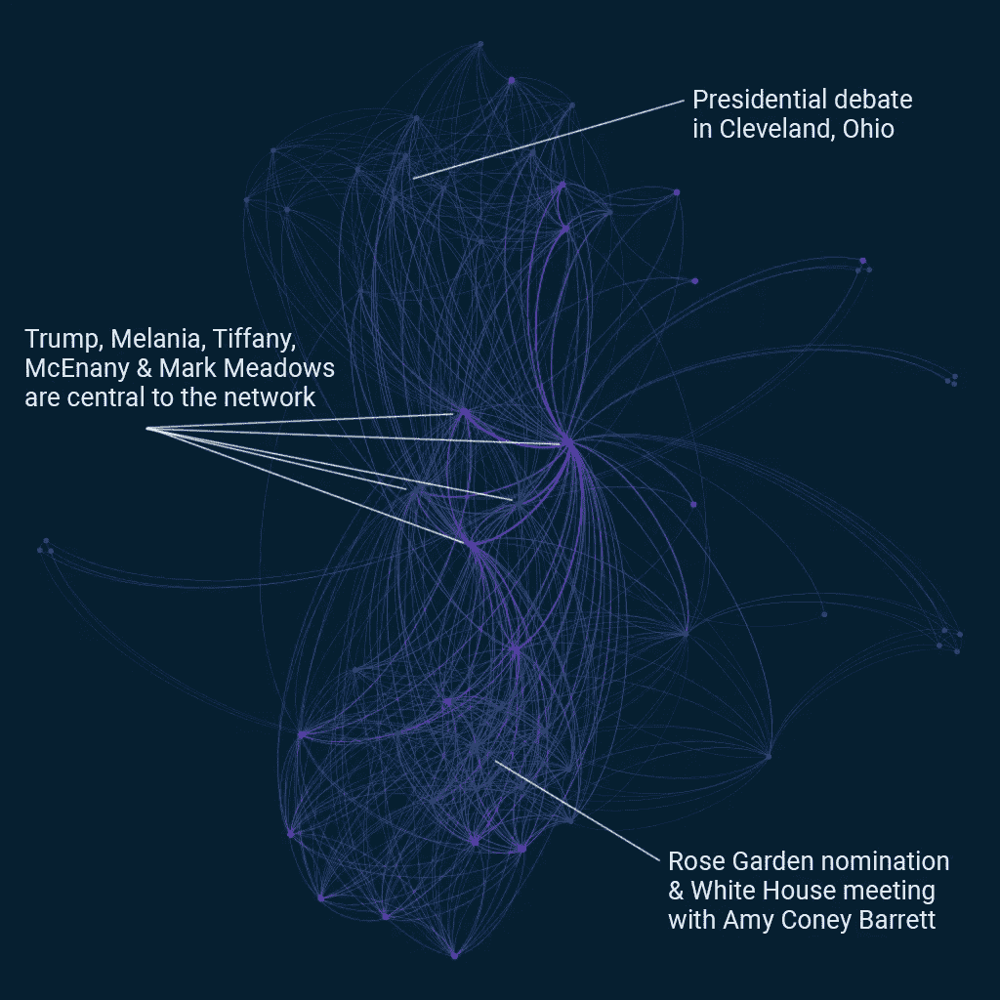
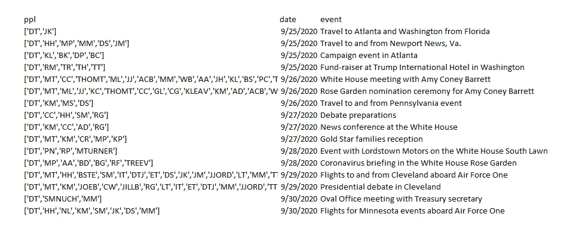
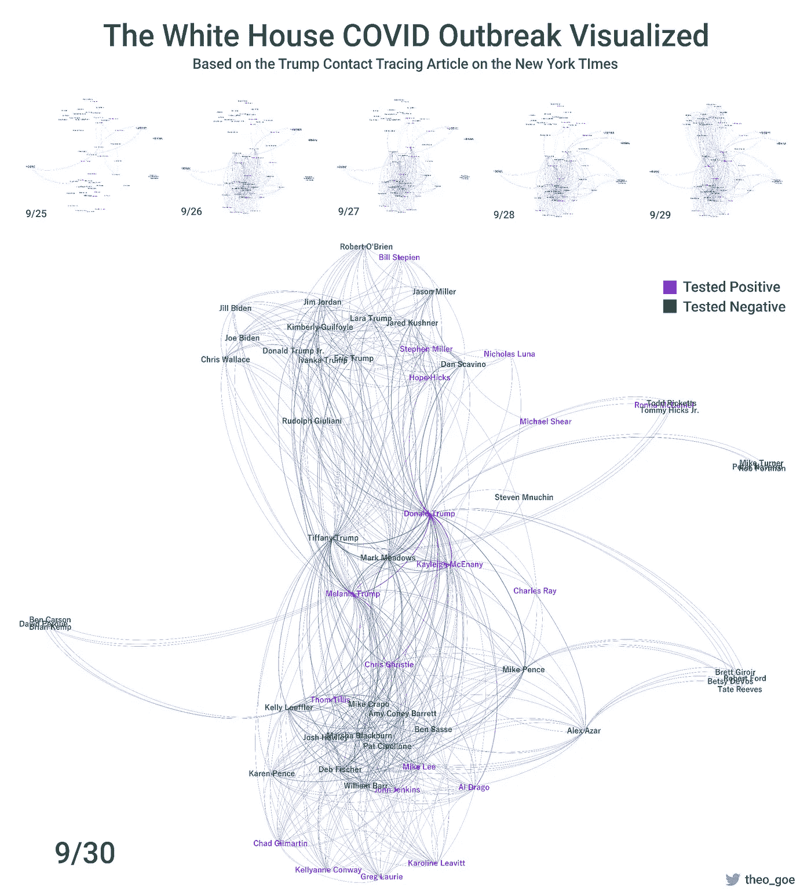
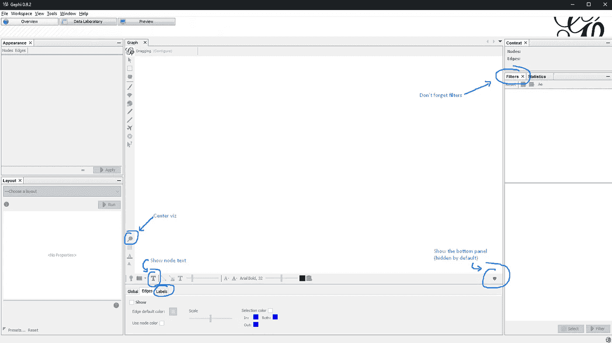

# 可视化白宫新冠肺炎疫情

> 原文：<https://towardsdatascience.com/visualizing-the-white-house-covid-outbreak-f5e35b01ae26?source=collection_archive---------44----------------------->



作者图片

新闻充斥着 COVID 在白宫行政部门的传播，所以让我们立即进入下图的代码和可视化。[数据集在此。](https://www.kaggle.com/theogoe/white-house-covid-spread) [此处代码。](https://github.com/theo-go/white_house_covid_outbreak.git)

## **方法论**

使用《纽约时报》的文章[追踪白宫冠状病毒爆发](https://www.nytimes.com/interactive/2020/10/02/us/politics/trump-contact-tracing-covid.html?action=click&module=Spotlight&pgtype=Homepage)，我们可以创建一个快速的 excel 表格，列出特朗普总统宣布 COVID 检测呈阳性之前与他在一起的所有人。



作者图片


作者图片

最无聊的部分是，又多了一个数据集来匹配缩写名和全名。[数据集在这里](https://www.kaggle.com/theogoe/white-house-covid-spread)所以你可以跳过这个过程。

为了创建可视化效果，我使用 Python 将 events 数据集转换成网络可视化格式的数据集，并使用 Gephi 来可视化网络。



作者图片

## **关于网络可视化和 Python 的说明**

在我们开始为 Gephi 准备这些数据之前，我只想简单谈谈网络可视化数据集和 Python 的准备工作。网上很多教程提到*“网络可视化”*这几个字就会带进 [NetworkX](https://networkx.github.io/) 。然而，我发现 NetworkX 对于很少或没有接触过网络分析的初学者来说是不直观的，尤其是与 TidyText (R)之类的东西相比，它真的可以指导您完成网络分析+基于文档/文本的关系提取和分析。

因此，如果您打算深入研究——在编写任何代码之前，先读一点资料，并尝试一下网络可视化。对你能运行的统计数据和你能创建的网络感兴趣。一个很棒的资源是[网络知识库](http://networkrepository.com/index.php)，它有一个[交互式图形 Vis 页面](http://networkrepository.com/graphvis.php)，可以立即将你吸引到你可以从一个网络中学到的奇妙的东西，而不仅仅是 Twitter 上谁关注谁的基础知识。

当您准备好之后，请认真考虑如何创建您一直在尝试的网络数据集格式。对于小型网络，您可以用不到 20 行的代码编写必要的脚本，使用您已经熟悉的库和函数来准备数据集。

## 准备数据

使用 pandas，导入数据集并使用 ast.literal_eval 将出席特朗普总统活动的人员列表的字符串表示转换为列表。

```
import pandas as pd
import os
from path import Path
import ast 
import itertools# set directory to where this file is located
folder_loc = os.path.dirname(os.path.realpath(__file__))
os.chdir(Path(folder_loc))events_df = pd.read_excel('events.xlsx')
ppl_df = pd.read_excel('ppl.xlsx')output_name = 'edges.csv'# convert str list to list -- please excuse the following these
# apply(lambda x)'s.. this quick script isn't industrial strength in
# efficiency
events_df['ppl'] = events_df['ppl'].apply(lambda x: ast.literal_eval(x))
```

我们的目标是创建两列: **Source** 和 **Target** ，它们表示任何给定的两个人之间的联系，前提是他们都与 Donald Trump 参加了同一个活动。

因此，我们首先获得列表的所有可能组合，每个组合代表一个事件的参与者。然后，我们分解刚刚创建的元组列表，以创建**源**和**目标**列。

```
# new column of all combinations possible
# whats cool about itertools combos is that it doesn't do duplicates
# e.g. (DT, KM) (KM, DT)
events_df['combos'] = events_df['ppl'].apply(
    lambda x: list(itertools.combinations(x, 2)))# reshape dataframe with source target
events_df_exploded = events_df.explode('combos')# create source and target rows
def src_targ(combo):
    lst = list(combo)
    return pd.Series([lst[0], lst[1]])events_df_exploded[['src', 'tar']
                   ] = events_df_exploded['combos'].apply(src_targ)
```

接下来，我们用全名替换姓名缩写，清理我们的列，并为 Gephi 导出我们的 csv 文件。我还添加了代码来导出单个数据集，每天一个，以防对您自己的项目有所帮助。

```
# add in the real names of everyone
events_df_exploded = pd.merge(events_df_exploded, ppl_df, how='left',
                              left_on='src', right_on='abbrev')
events_df_exploded = pd.merge(events_df_exploded, ppl_df, how='left',
                              left_on='tar', right_on='abbrev')# clean up
events_df_exploded.rename(columns={'name_x': 'Source',
                                   'name_y': 'Target'},
                          inplace=True)events_df_exploded = events_df_exploded.drop([
    'ppl', 'combos', 'abbrev_x', 'abbrev_y', 'src', 'tar'],
    axis=1)# export file
events_df_exploded.to_csv(output_name)# export batches by day
df_grouped = events_df_exploded.groupby('date')# iterate and export
for group_name, df_group in df_grouped:
    print(group_name)
    out_name = output_name.replace(
        '.csv', '') + '_' + str(str(group_name).split(' ')[0]) + '.csv'
    df_group.to_csv(out_name)
```

## 基于 Gephi 的网络可视化

关于 Gephi 要知道的第一件事是，它对你导入的数据集的格式和列标题非常特别。虽然我已经很多年没有使用 Gephi 了，但我很高兴地看到今天网上有更多的文章和视频解释 Gephi 的怪癖。一定要在谷歌上搜索一下，看看 Gephi 的插件，寻找新的想法和未来的项目。

使用 Data Laboratory 屏幕将节点和边数据集导入 Gephi 后，使用概览屏幕左侧的外观选项卡中的参数，以及屏幕右侧和底部的过滤和布局。当您对可视化效果感到满意时，单击预览选项卡并导出您的图像。我用 photopea 把出口和标题放在一起。

## 就是这样！

还有两件事。如果你或你的学生有热情，但不知道如何或何时，找一个安静的地方，用一支不起眼的笔(转述自保罗·西蒙)。实际上，尝试一下 [NodeXL](https://www.smrfoundation.org/nodexl/) 吧——每份学生许可证 39 美元，在 Twitter 抓取、网络可视化(虽然很慢)和数据集准备(如果你愿意，可以将其导入 Gephi)方面，它包含了一些非常强大的功能。对于非编码人员来说，这是一个轻松的好方法。



作者图片

对于跟随本教程的每个人来说，这里有一些你可能想不到在 Gephi 上看的地方，它们对于创建视觉效果非常关键，而不需要在论坛上寻找答案。整个项目花了我大约 2 个小时，最大的时间消耗(除了开始输入 excel 表格)是记住东西在 Gephi 中的位置。所以，确保你对你想要想象的东西有一个清晰的画面(一直到调色板)，放上一些高保真的音乐来放松/学习，然后投入进去。

> **关于我:**Basil Labs 的创始人，Basil Labs 是一家大数据消费者智能初创公司，帮助组织量化消费者的去向和价值。
> 
> 热爱音乐，开放数据政策和数据科学。更多文章请关注我的[媒体](https://medium.com/@theo_goe)。
> 如果你对数据伦理、开放数据和/或音乐充满热情，欢迎在 [Twitter](https://twitter.com/theo_goe) 上加我。