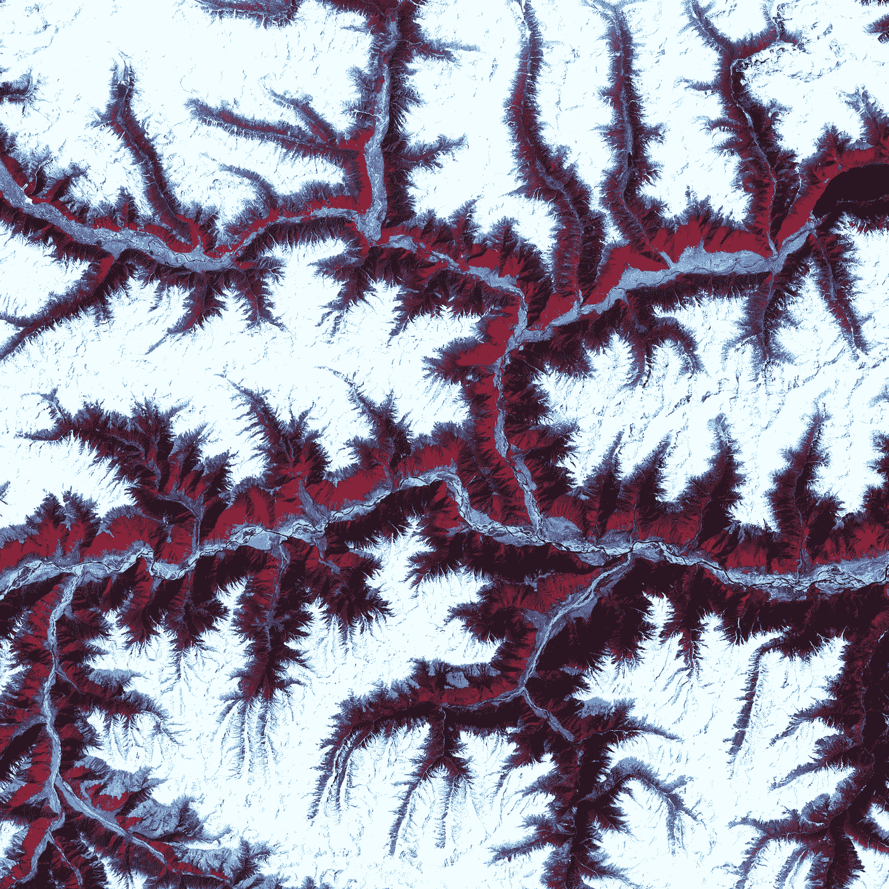
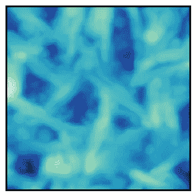
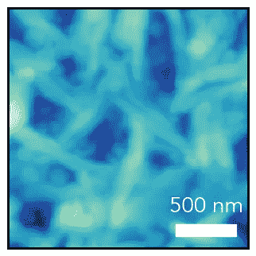
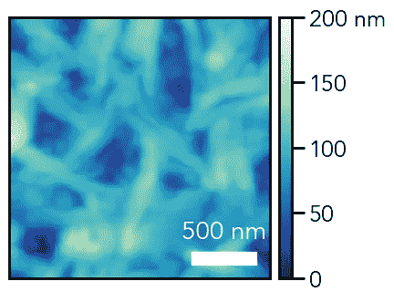
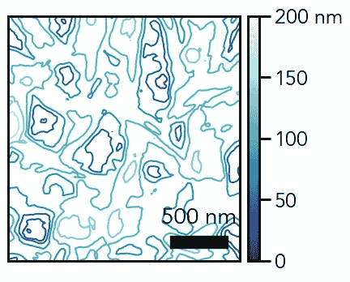
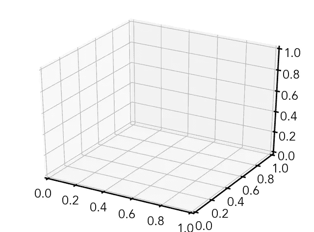
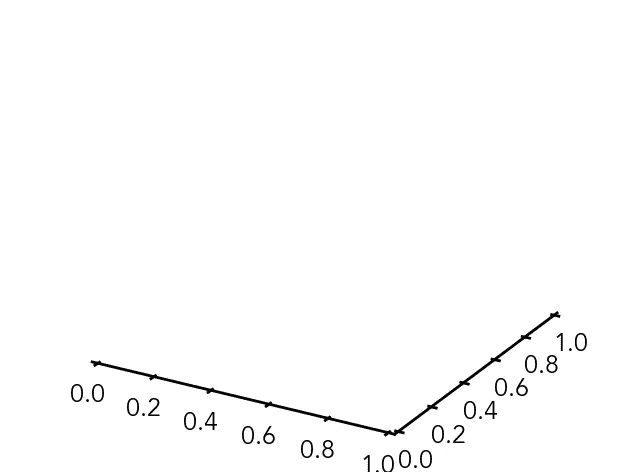
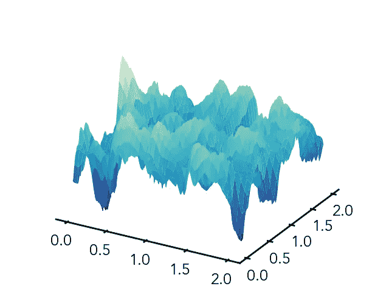
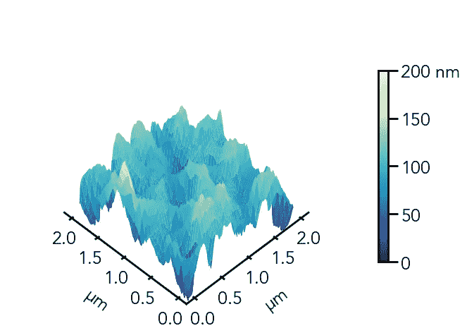

# 使用 Python 可视化三维数据-热点图、等值线和 3D 绘图

> 原文：<https://towardsdatascience.com/visualizing-three-dimensional-data-heatmaps-contours-and-3d-plots-with-python-bd718d1b42b4?source=collection_archive---------3----------------------->

## [Python 科学绘图](https://towardsdatascience.com/tagged/python-science-plotting)

## 使用 Python 绘制热点图、等值线图和 3D 图



[USGS](https://unsplash.com/@usgs?utm_source=unsplash&utm_medium=referral&utm_content=creditCopyText) 在 [Unsplash](https://unsplash.com/s/photos/microsope-image?utm_source=unsplash&utm_medium=referral&utm_content=creditCopyText) 上拍摄的照片

当您测量属性对多个独立变量的依赖性时，您现在需要绘制三维数据。这种例子通常发生在空间测量中，其中存在与每个(x，y)点相关联的强度，类似于光栅显微镜测量或空间衍射图案。为了可视化这些数据，我们有几个选项可供选择——我们将探索创建热图、等高线图(未填充和填充)和 3D 图。

我将在这个例子中使用的数据集是来自原子力显微镜(AFM)的一张 2 m x 2 m 的显微照片。首先，我们导入包——我们这次添加的两个新包是`make_axes_locatable`,它将帮助我们管理我们的绘图的色条，以及我们的 3D 绘图所需的`Axes3D`:

```
# Import packages
%matplotlib inline
import matplotlib as mpl
import matplotlib.pyplot as plt
from mpl_toolkits.axes_grid1.axes_divider import make_axes_locatable
from mpl_toolkits.mplot3d import Axes3D
import numpy as np
```

我们现在将加载我们的 AFM 数据，再次使用`numpy.loadtxt`将我们的数据直接加载到 2D `numpy`数组中。

```
# Import AFM data
afm_data = np.loadtxt('./afm.txt')
```

然后，我们可以检查我们加载的数据中的几行:

```
# Print some of the AFM data
print(afm_data[0:5])>>> [[4.8379e-08 4.7485e-08 4.6752e-08 ... 6.0293e-08 5.7804e-08 5.4779e-08]
 [5.0034e-08 4.9139e-08 4.7975e-08 ... 5.7221e-08 5.4744e-08 5.1316e-08]
 [5.2966e-08 5.2099e-08 5.1076e-08 ... 5.4061e-08 5.0873e-08 4.7128e-08]
 [5.7146e-08 5.6070e-08 5.4871e-08 ... 5.1104e-08 4.6898e-08 4.1961e-08]
 [6.2167e-08 6.0804e-08 5.9588e-08 ... 4.7038e-08 4.2115e-08 3.7258e-08]]
```

我们有一个 256 x 256 的点数组，每个值对应于该位置的测量高度(以米为单位)。因为我们知道如果用纳米表示，我们的数据会更有意义，所以我们可以用这个常数来衡量我们所有的值:

```
# Convert data to nanometers (nm)
afm_data *= (10**9)
```

现在我们可以开始可视化我们的数据了。我们从设置一些全局参数开始(随意编辑这些参数，但这些是我使用的设置):

```
# Edit overall plot parameters# Font parameters
mpl.rcParams['font.family'] = 'Avenir'
mpl.rcParams['font.size'] = 18# Edit axes parameters
mpl.rcParams['axes.linewidth'] = 2# Tick properties
mpl.rcParams['xtick.major.size'] = 10
mpl.rcParams['xtick.major.width'] = 2
mpl.rcParams['xtick.direction'] = 'out'
mpl.rcParams['ytick.major.size'] = 10
mpl.rcParams['ytick.major.width'] = 2
mpl.rcParams['ytick.direction'] = 'out'
```

# **热图**

对于热图可视化，我们将使用`imshow`函数将我们的数据显示为图像。首先，我们创建一个图形并添加一个主轴来显示我们的图像。此外，我们将删除刻度线，因为我们将添加一个比例尺。

```
# Create figure and add axis
fig = plt.figure(figsize=(4,4))
ax = fig.add_subplot(111)# Remove x and y ticks
ax.xaxis.set_tick_params(size=0)
ax.yaxis.set_tick_params(size=0)
ax.set_xticks([])
ax.set_yticks([])
```

现在我们用下面的命令显示我们的图像:

```
# Show AFM image
img = ax.imshow(afm_data, origin='lower', cmap='YlGnBu_r', extent=(0, 2, 0, 2), vmin=0, vmax=200)
```

`origin` —图像通常显示为其原点在左上角，因此通过使用`origin='lower'`我们强制原点在左下角

我们图像的色彩映射表。所有可用的`matplotlib`色彩映射表都可以在中找到[，在任何色彩映射表名称中添加`_r`都会将其反转。](https://matplotlib.org/tutorials/colors/colormaps.html)

`extent`——`imshow`将使用像素绘制我们的图像，除非我们告诉它这些像素对应的范围。在这种情况下，我们知道我们的图像是 2 m x 2 m，所以我们让我们的`extent=(x_min, x_max, y_min, y_max)`等于`(0, 2, 0, 2)`

`vmin` —设置为颜色图最小值的值

`vmax` —设置为色彩映射表最大值的值



我们的 AFM 显微照片的图像绘图

现在，我们应该添加我们的比例尺，这样任何查看该图的人都会对大小比例有一个概念。我们将使用`plt.fill_between`创建一个填充的矩形，然后在顶部添加一个文本标签。

```
# Create scale bar
ax.fill_between(x=[1.4, 1.9], y1=[0.1, 0.1], y2=[0.2, 0.2], color='white')
```

`x` —我们的填充形状的 x 范围(因为我们的图像从[0，2]到指定的范围[1.4，1.9]是 0.5 米或 500 纳米)

`y1` —我们填充形状的底部 y 值(对应于`x`的值)

`y2` —我们填充形状的顶部 y 值(对应于`x`的值)

```
ax.text(x=1.65, y=0.25, s='500 nm', va='bottom', ha='center', color='white', size=20)
```

`x` —文本的 x 轴位置

`y` —文本的 y 轴位置

`s` —文本字符串

`va` —垂直对齐(`bottom`表示`y`对应文本底部)

`ha` —水平对齐(`center`表示`x`对应文本中心)



添加比例尺的 AFM 显微照片

最后，我们可以添加一个颜色条来显示图像中的颜色与高度值的对应关系。首先，我们为 colorbar 创建一个新的 axis 对象，这是通过使用`make_axes_locatable().append_axes`函数在原始轴的右侧追加一个新轴来实现的。我们将原始轴对象`ax`传递给函数:

```
# Create axis for colorbar
cbar_ax = make_axes_locatable(ax).append_axes(position='right', size='5%', pad=0.1)
```

`position` —添加下一个轴的位置，在本例中为原始图像的右侧

`size` —新轴沿`position`方向的尺寸，相对于原始轴(图像宽度的 5%)

`pad` —两轴之间的填充(在绝对坐标中)

现在，我们把这个新的轴对象变成一个颜色条:

```
# Create colorbar
cbar = fig.colorbar(mappable=img, cax=cbar_ax)
```

`mappable` —映射到颜色条的图像/绘图(我们在前面使用`imshow`时创建了`img`

`cax` —用于颜色条的轴

最后，我们调整色条的刻度线和标签:

```
# Edit colorbar ticks and labels
cbar.set_ticks([0, 50, 100, 150, 200])
cbar.set_ticklabels(['0', '50', '100', '150', '200 nm'])
```



带有比例尺和颜色条的 AFM 显微照片

# **等高线图**

就像在大多数徒步旅行路线中发现的地形图一样，我们也可以用恒定强度的等高线来呈现三维数据。我们现在将使用等高线图绘制相同的 AFM 数据。

我们使用与之前相同的代码，更改了以下代码行(我添加了`zorder=1`以确保等值线图位于比例尺下方，因为首先绘制的是较低的 z 顺序数字):

```
# Show AFM contour plot
ax.contour(afm_data, extent=(0, 2, 0, 2), cmap='YlGnBu_r', vmin=0, vmax=200, zorder=1)
```



AFM 显微图像轮廓图，带比例尺和颜色条

如果我们使用`contourf`而不是`contour`，我们可以创建填充轮廓，而不仅仅是轮廓线:

```
# Show AFM filled contour plot
ax.contourf(afm_data, extent=(0, 2, 0, 2), cmap='YlGnBu_r', vmin=0, vmax=200)
```


AFM 显微照片填充的轮廓图，带有比例尺和颜色条

在这种情况下，来自`imshow`的许多更精细的细节在`contour`或`contourf`中没有被很好地捕捉到。如果您的数据相当平滑，没有很多较小的细节，等值线图像可能比热图更好看。最终，您希望以尽可能透明和直观的方式呈现数据，因此在这种情况下，带有颜色条的热图可能是最好的。

# **3D 绘图**

到目前为止，我们已经将我们的图限制为二维，并使用色标让读者推断强度。如果我们想更好地理解这些强度值，我们实际上可以用 3D 来绘制数据。

我们首先用下面的代码创建一个 3D 轴，这里的关键是我们在生成轴对象时使用了`projection=’3d'`:

```
# Create figure and add axis
fig = plt.figure(figsize=(8,6))
ax = plt.subplot(111, projection='3d')
```



空 3D 轴对象

灰色窗格和轴网格给我们的绘图增加了混乱，所以让我们删除它们。此外，我将再次为高度添加颜色条，因为透视视图的原因，z 轴将被压缩，所以我将删除它。

```
# Remove gray panes and axis grid
ax.xaxis.pane.fill = False
ax.xaxis.pane.set_edgecolor('white')
ax.yaxis.pane.fill = False
ax.yaxis.pane.set_edgecolor('white')
ax.zaxis.pane.fill = False
ax.zaxis.pane.set_edgecolor('white')
ax.grid(False)# Remove z-axis
ax.w_zaxis.line.set_lw(0.)
ax.set_zticks([])
```



没有背景窗格和 z 轴的空三维轴

对于表面图，我们需要 x 和 y 值的 2D 数组来对应强度值。我们通过用`np.meshgrid`创建一个 mesh-grid 来做到这一点——我们对这个函数的输入是一个要在网格中重复的 x 值和 y 值的数组，我们将使用`np.linspace`来生成这个数组。

```
# Create meshgrid
X, Y = np.meshgrid(np.linspace(0, 2, len(afm_data)), np.linspace(0, 2, len(afm_data)))
```

现在我们有了网格，我们可以绘制三维数据:

```
# Plot surface
plot = ax.plot_surface(X=X, Y=Y, Z=afm_data, cmap='YlGnBu_r', vmin=0, vmax=200)
```

`X`—x 值网格

`Y`—y 值的网格

`Z`-z 值的网格



AFM 显微照片的 3D 绘图

现在，我们可以调整绘图视图——我们为此控制三个参数:仰角、方位角(在 x-y 平面中)和离轴的距离，它们分别大致对应于球坐标系值 *φ* 、 *θ、*和 *r* 。我将方位角设置为 225，因为我们希望 x 轴和 y 轴在(0，0)处相交。

```
# Adjust plot view
ax.view_init(elev=50, azim=225)
ax.dist=11
```

添加颜色栏:

```
# Add colorbar
cbar = fig.colorbar(plot, ax=ax, shrink=0.6)
cbar.set_ticks([0, 50, 100, 150, 200])
cbar.set_ticklabels(['0', '50', '100', '150', '200 nm'])
```

`shrink` —相对于其默认大小将颜色条缩小多少

最后，我们编辑一些美感——x 和 y 轴上的刻度线、轴限制和轴标签。

```
# Set tick marks
ax.xaxis.set_major_locator(mpl.ticker.MultipleLocator(0.5))
ax.yaxis.set_major_locator(mpl.ticker.MultipleLocator(0.5))# Set axis labels
ax.set_xlabel(r'$\mathregular{\mu}$m', labelpad=20)
ax.set_ylabel(r'$\mathregular{\mu}$m', labelpad=20)# Set z-limit
ax.set_zlim(50, 200)
```



带彩条的 AFM 显微图的 3D 绘图

这个图让读者除了用颜色表示强度值之外，还能看到高度的波动。然而，噪声更大的数据集可能会导致非常混乱的 3D 绘图。

# **结论**

我希望本教程有助于解决绘制三维数据集的不同方法。在这个 [Github 资源库](https://github.com/venkatesannaveen/python-science-tutorial)中可以找到例子。感谢阅读！