# 可视化时间序列生存数据

> 原文：<https://towardsdatascience.com/visualizing-time-series-survival-data-36029652a393?source=collection_archive---------26----------------------->

Geran de Klerk 在 [Unsplash](https://unsplash.com?utm_source=medium&utm_medium=referral) 上拍摄的照片

## 卡普兰-迈耶曲线

让我们想象一下，你有关于你的研究对象“存活”了多久的数据。生存可以是字面意义上的(如在临床试验中)或比喻意义上的(如果你正在研究客户保持，当人们停止阅读一篇文章，或当一台机器坏了)。为了可视化数据，我们想要绘制一条生存曲线，叫做卡普兰-迈耶曲线，如下图所示。

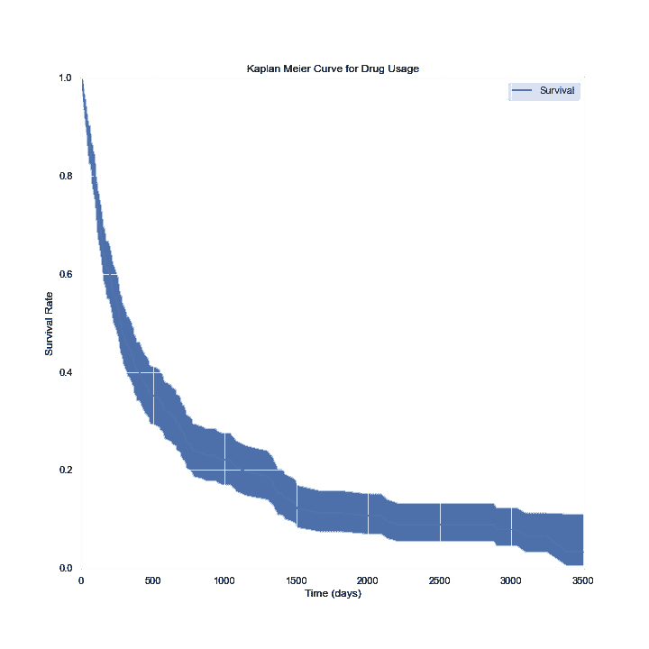

具有 95%置信区间的药物耐受性和使用的存活曲线(人工生成的数据，n ≈ 300)

左边的曲线(使用人工生成的数据创建)旨在显示开始服药几天后仍在服药的人的百分比。在这种情况下，他们会停下来，因为药物不再控制疾病，或者因为它引起了太多的副作用。

理想情况下，通过简单地考虑在开始服药后的给定天数内服药的人的百分比，很容易计算出这条曲线。

然而，一些人(本例中约 25%)仍在服药。他们可能只是服用了很长一段时间(在这种情况下接近 10 年)而没有问题，或者他们可能只是刚刚开始服用。这种观察被称为“右删截”,因为我们不能及时观察到它们(向右)。

对此最简单的解决方案是卡普兰-迈耶曲线，也称为乘积极限估计量。还有其他解决方案，但它们需要对数据做出假设，并为数据提供一个模型。另一方面，我们通常的第一步是只看数据，卡普兰-迈耶曲线允许我们在不做假设的情况下这样做。

在本文中，我们将讨论如何计算卡普兰-迈耶曲线，最重要的是，显示的置信区间。更重要的是，我们将探讨计算置信区间(有时称为“对数”和“对数-对数”/指数格林伍德置信区间)的两种方法之间的差异。

# 卡普兰·迈耶的估计

如果你还没猜到，这种生存曲线起源于医学和精算界，字面上的关注是某人是否真的会死亡。因此，我们将采用这样的术语:研究中给定的受试者(比如说一个人)可能仍然活着，在这种情况下，观察是经过审查的(我们没有观察到一个事件)，或者他们可能已经在特定的时间点死亡(我们观察到了该事件)。

请注意，当我们说“时间”时，我们不是指字面上的日期，而是相对于参与者进入研究的时间。在人寿保险的例子中，那只是他们出生的时间。在上面的医学例子中，它是当某人开始服用药物时。

上世纪 50 年代的卡普兰-迈耶估计，用文字表述比用公式表述更容易。规则是:

1.  一开始，100%的人都是活着的。
2.  在每个时间点(以 *i* 为索引)，计算存活的人的百分比，作为已知活了那么久的人的百分比。
3.  为了创建曲线，假设在时间 *i* 幸存者的百分比是该时间和每个先前时间的生存机会百分比的乘积。

例如，假设我们有三个人的记录。一个活到了 92 岁，一个死于 90 岁，一个死于 95 岁。90 岁时，66.7%的人口存活下来。92 岁时，100%存活。在 95 岁时，100%的人(不是 50 岁)会死亡。这是因为 92 岁的人没有计入 95 岁的人口中。

注意，某人被审查的次数(在我们的例子中是 92 次)不会影响曲线。事实上，只有我们观察到某人死亡的次数才算数。

现在让我们用方程式来做。

*   让 *i* 索引某事发生的时间(即某人死亡)。
*   设 *d* 为在时间 *i.* 停止的人数
*   设 n 是在时间 *i.* 时人口中(已知幸存)的人数

生存函数的卡普兰-迈耶估计量为

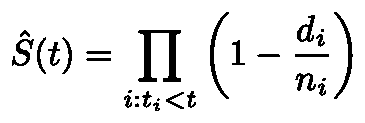

生存函数的 Kaplan-Meier 估计

换句话说，生存百分比与当前时间 *t* 之前所有时间的产品的乘积。

卡普兰-迈耶估计量是生存函数的最大似然估计量，这使得它成为快速可视化的自然选择。

一般来说，你可以发现这是大多数处理时间序列数据的统计软件包。对于 python 来说，`[statsmodels](https://www.statsmodels.org/stable/generated/statsmodels.duration.survfunc.SurvfuncRight.html#statsmodels.duration.survfunc.SurvfuncRight)`或`[lifelines](https://lifelines.readthedocs.io/en/latest/)`是一些不错的选择。`[survival](https://cran.r-project.org/web/packages/survival/index.html)`作 R。

# 格林伍德置信区间

棘手的部分在于计算置信区间。首先，我们假设在时间 *i.* 有一个真实的“风险率”，换句话说，我们假设 *d* 遵循一个[二项式分布](https://en.wikipedia.org/wiki/Binomial_distribution)，概率 *h* 和样本量 *n、*在时间 *i.* 各不相同，这意味着它有均值和方差 *nh* 和 *nh(1-h)* 。

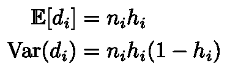

*d* 的均值和方差

下一个技巧是，由于 *S* 的估计量是一个乘积，所以处理 *S 的对数*会更容易，因为它是一个和。

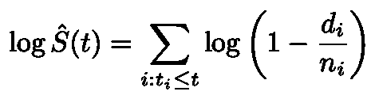

现在我们需要转移话题，谈谈泰勒级数近似，它将使我们能够进行一系列的计算。

## 德尔塔法

Delta 方法是处理随机变量(如对数)转换的一种方便而严格的方法。假设我们有一个随机变量 X 和一个函数 *f* (你应该认为它是对数)。如果我们假设 X 只是一个正则数(不是随机的)，那么我们可以写下关于一个点 c 的一阶泰勒展开式:

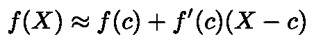

f 的一阶泰勒展开

delta 方法的本质洞见是，假设 X 是一个像样本均值或我们对 s 的估计一样的统计量，如果 c 是 X 的期望值，E[X]，那么在大样本量的极限下，X 将接近 c 并呈正态分布(由中心极限定理)，逼近将非常好。这让我们可以计算 f 的期望值:

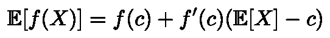

delta——期望值的方法近似值

更好的是，我们可以应用大一微积分的[中值定理](https://en.wikipedia.org/wiki/Mean_value_theorem)。假设我们已经测量了 X 的值，我们可以找到位于 c 和 X 之间的值 d，因此

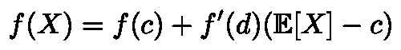

泰勒展开的中值定理

同样，在大样本量的限制下，X 更接近 c，因此 d 被挤压在它们之间，也更接近 c。因此，在大样本量的限制下非正式地工作，我们可以将上面的近似等式视为等式。

现在假设我们知道 X 的方差取决于样本大小 *n* :

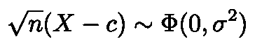

根据中心极限定理，x 关于其期望值是正态分布的

回到我们最初的泰勒展开，重新排列各项并乘以 *n* 的平方根:

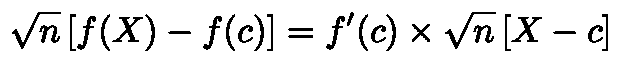

f(X)的泰勒展开的重排

这意味着我们已经计算出 f(X)的方差是 x 乘以 fʹ(c 平方的方差。

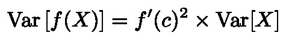

## 运用德尔塔法

请回忆一下，在我们离题进入德尔塔法之前，我们说过

让我们考虑使用 Delta 方法计算总和中每一项的方差。期望值是 1–h，所讨论的函数是导数为 1/x 的对数 log(x)(当然，我们只使用自然对数)。因此:

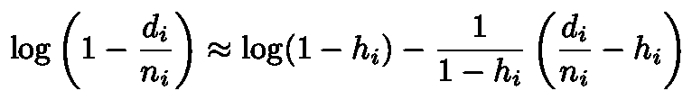

我们还可以计算每一项的方差。log(1-h)项没有方差(是常数)，第二项减去 h 也不影响方差。

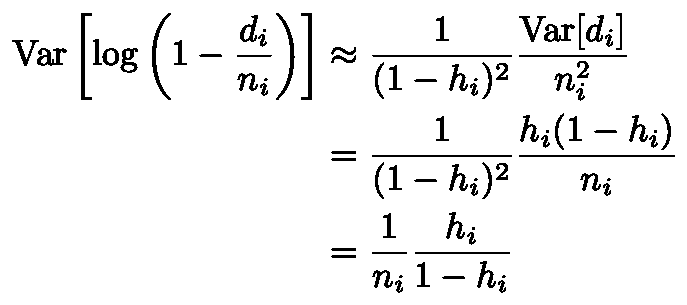

各项的方差

现在，一个简单的技术问题。通常，我们可以把方差加起来，来计算总和的方差。然而，从技术上讲，这两项并不独立，因为时间 I 的死亡会影响后面时间的分母 n。另一方面，感兴趣的项(d/n–h)具有均值 0，条件是知道所有以前的死亡，这使得这些项成为一个[鞅](https://en.wikipedia.org/wiki/Martingale_(probability_theory))差(或者它们的和是一个鞅)。反过来，[鞅中心极限定理](https://en.wikipedia.org/wiki/Martingale_central_limit_theorem)告诉我们，方差实际上只是个体方差之和。

最后，我们得到了 S 的对数的方差

最后，我们可以再次应用德尔塔法

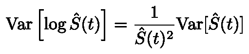

最后

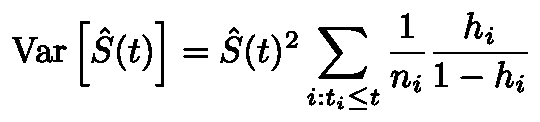

我们可以反过来估计为:

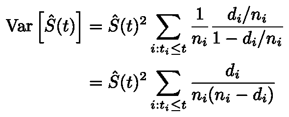

这又让我们通过假设 S 的估计量是正态分布(如果样本量足够大，就会是这种情况)来计算格林伍德置信区间。

唷。

## 指数格林伍德置信区间

现在，使用上面的格林伍德置信区间会导致一个问题，即您的置信区间可能会落在 0-1 边界之外。如果有一个图表，在这个图表上，你的置信区间允许有时候存活率是负的，这将是非常尴尬的。

这里的解决方案是注意我们使用了 log，因为它强制 S 为正。如果我们计算变换后的对数 S 的置信区间，我们至少可以保证得到的置信区间将大于 0(但也可以大于 1)。我们为此付出的“代价”是拥有一个不对称的置信区间。但是，如果我们要这样做，我们不妨一路走下去。如果我们用

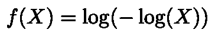

那么我们将得到保证位于 0–1 区间内的置信区间，因为 log(–log(X))只接受 0–1 范围内的参数；逆变换将确保我们在该范围内结束。

我不会给你数学；经过*变换的* S 的最终方差为

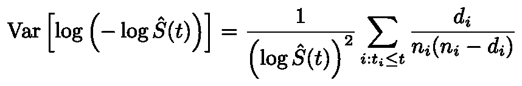

计算变换后的 s 的置信区间，然后用 x ⟼指数(-exp(x))撤消变换，以获得 s 的非对称置信区间

我的目标是写(相对)易懂的数据科学概念的解释，而不回避有时涉及的复杂数学。如果你喜欢这个，你我还有类似风格的解释**[*困惑*](/the-relationship-between-perplexity-and-entropy-in-nlp-f81888775ccc)*[*中心极限定理*](/why-is-the-normal-distribution-so-normal-e644b0a50587) *，或者* [*期望最大化*](/expectation-maximization-explained-c82f5ed438e5) *。****

***如果你不喜欢这个，多考虑一下* [*回归*](https://medium.com/@rmcharan/regression-geometry-61fdd5515ab7) *，奇异值分解***，或者* [*傅立叶变换*](/build-intuition-for-the-fourier-transform-b0bd338c6d4f) *。****

# **笔记**

**[1]很明显，如果 fʹ(c)为 0，事情会变得非常糟糕，所以这是一个很好的时机来说明这是一个额外的假设。查阅维基百科的文章，获得完全严格的处理方法。**