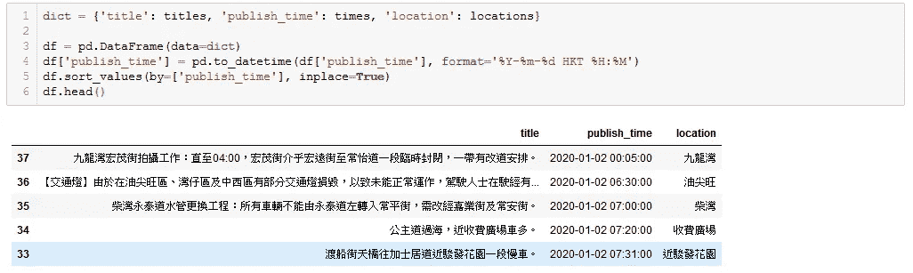
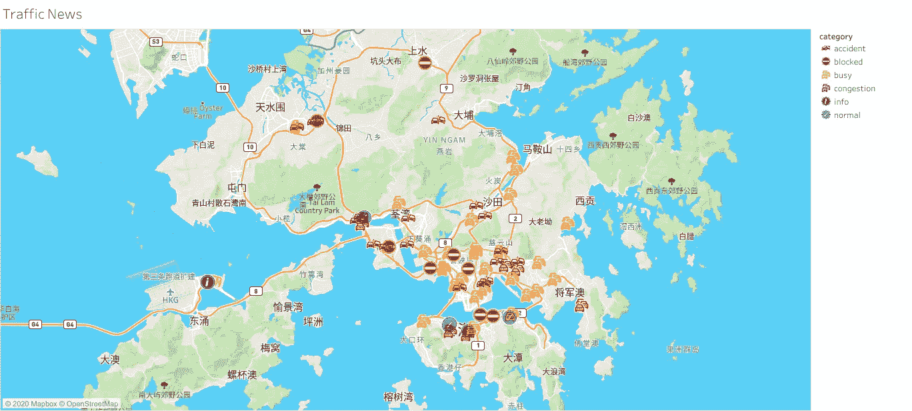

# 基于广播交通新闻的交通状况可视化

> 原文：<https://towardsdatascience.com/visualizing-traffic-conditions-based-on-radio-traffic-news-67e63eee58b3?source=collection_archive---------30----------------------->

## 美声网刮


由 [Unsplash](https://unsplash.com/?utm_source=medium&utm_medium=referral) 上的 [Max Titov](https://unsplash.com/@jonitboy?utm_source=medium&utm_medium=referral) 拍摄的照片

# 背景

这个项目发生在 2019 年 10 月，当时我的老板要求我们的团队在网络运营中心(NOC)的大屏幕上可视化我们的网络质量。作为移动运营商，我们经常全天候监控我们的网络质量和状况。开发了许多重要网络 KPI 的仪表板，我的老板希望我们增强所获得的信息，让 NOC 员工“知道/猜测”正在发生的事情。

我们的网络流量可能会受到许多外部因素的影响，我们可以想到的一般信息之一是流量状况，我指的是道路上的实际流量。当出现拥堵、交通堵塞或其他特殊路况时，该特定蜂窝基站的 KPI 可能会爆仓。因此，我们希望在地图上可视化交通状况，让我们的工作人员知道哪个位置有情况。

# 使用 BeautifulSoup 进行网页抓取

Radio news provides a very good source of detail traffic conditions as they are very useful for the Taxi drivers to choose their route (especially before the birth of Google Map). Besides the radio broadcast, all this information is online. The one we are choosing is the official radio station of Hong Kong RTHK: [http://programme.rthk.hk/channel/radio/trafficnews/index.php](http://programme.rthk.hk/channel/radio/trafficnews/index.php) (Sorry, only Chinese version available). If you know Chinese, you may figure out that the news is well-formatted. If the news is about traffic congestion, the format is the name of the road, the direction, and the queue end position (龍尾：)

HTML 结构也非常好。我们可以看到所有单独的新闻都有一个无序列表

*   。


新闻网站的 HTML 结构

有了请求和 BeautifulSoup，我们很容易获得并解析网页。感谢标准格式，我们可以在一秒钟内看到所有的故事。

```
import requestsfrom bs4
import BeautifulSoup
r = requests.get("http://programme.rthk.hk/channel/radio/trafficnews/index.php")
if r.status_code == requests.codes.ok:
    r.encoding='utf-8'
    soup = BeautifulSoup(r.text, 'html.parser')
    stories = soup.find_all('li', class_='inner')
```

我们将每条新闻分为标题(新闻内容)和发布时间。我们用“%Y-%m-%d HKT %H:%M”来格式化发布时间。

```
titles = []
times = []
for s in stories:
    title, time = list(filter(None, re.split(r'**\t**|**\n'**, s.text)))
    titles.append(title)
    times.append(time)
```

The most difficult part is to extract the location. Here we search for the particular phrase (龍尾：), which means the queue end in Chinese. If this phrase does not include in the news, we search for our location database. We will discuss how we obtain this database later. And now we have this DataFrame with title, publish time and location.



交通新闻的数据框架

接下来，我们需要对新闻进行分类。经过长时间的观察，我们发现新闻的类型属于这几类:


交通新闻类别

**服务暂停:**部分公共交通服务停止，
**受阻:**部分道路因各种原因受阻:附近道路维修或特殊事件，
**繁忙:**道路繁忙但仍可行驶；
**拥堵:**道路严重拥堵；
**事故:**那条路上发生了交通事故；
**正常:**被封锁或拥堵的道路恢复通行；
**Info:** 只是一些大概的信息。

而且那些措辞曾经重复出现过很多次。因此，我们可以通过识别词语来明确地划分不同的类别。

```
# set category
df.loc[df.title.str.contains('關閉'), 'category'] = 'service paused'
df.loc[df.title.str.contains('暫停'), 'category'] = 'service paused'
df.loc[df.title.str.contains('間封'), 'category'] = 'blocked'
df.loc[df.title.str.contains('繁忙'), 'category'] = 'busy'
df.loc[df.title.str.contains('多車'), 'category'] = 'busy'
df.loc[df.title.str.contains('車多'), 'category'] = 'busy'
df.loc[df.title.str.contains('慢車'), 'category'] = 'busy'
df.loc[df.title.str.contains('龍尾'), 'category'] = 'busy'
df.loc[df.title.str.contains('塞車'), 'category'] = 'congestion'
df.loc[df.title.str.contains('擠塞'), 'category'] = 'congestion'
df.loc[df.title.str.contains('意外'), 'category'] = 'accident'
df.loc[df.title.str.contains('回復暢順'), 'category'] = 'normal'
df.loc[df.title.str.contains('回復正常'), 'category'] = 'normal'
df.loc[df.title.str.contains('恢復運作'), 'category'] = 'normal'
df.loc[df.title.str.contains('禁止'), 'category'] = 'blocked'
df.loc[df.title.str.contains('受阻'), 'category'] = 'blocked'
df.loc[df.title.str.contains('不能通車'), 'category'] = 'blocked'
df.loc[df.title.str.contains('封閉'), 'category'] = 'blocked'
df.loc[df.title.str.contains('封路'), 'category'] = 'blocked'
df.loc[df.title.str.contains('恢復'), 'category'] = 'normal'
df.loc[df.title.str.contains('回復'), 'category'] = 'normal'
df.loc[df.title.str.contains('重開'), 'category'] = 'normal'
df.loc[df.title.str.contains('間封措施取消'), 'category'] = 'normal'
df.loc[df.category.isnull(), 'category'] = 'info'
```

为了定位交通新闻场景，我们需要纬度和经度。幸运的是，我们找到了一个 API GeoPy。你可能会找到一个关于如何使用它的很好的书面教程，从 [Geocode with Python，到数据科学](/geocode-with-python-161ec1e62b89)。这将物理地址转换为地理位置(即纬度和经度)。乍一看，我们怀疑这个 python 库是否支持中文地址。但事实证明它有着相当不错的性能。我们使用的是基于 OpenStreetMap 数据构建的 nomist 地理编码服务。

```
locator = Nominatim(user_agent=’myGeocoder’, timeout=3)
try:
    location = locator.geocode(record)
except GeocoderTimedOut as e:
    print(“Error: geocode failed on input {} with message {}”.format(record, e))
```

过了一段时间，我们收集了一堆新闻，可以选择经常出现的道路手动查询其经纬度(相信我，交通拥堵每天都在同一条道路上重复重复！)

这是我们 NOC 中使用的仪表板。也请访问 Tableau 创建的[演示站点](https://public.tableau.com/profile/joshua.yeung#!/vizhome/TrafficNewsVisualization/TrafficNews)。


交通状况仪表板



使用 Tableau 的可视化

# 结论

感谢互联网上的丰富资源和那些已经建立了重要有用模块的巨人，我们可以在他们的基础上建立一个交通新闻可视化仪表板。

要了解这个项目的更多信息，请点击这里查看我的 Github 链接[。](https://github.com/joshuayeung/Local-Traffic-News-Visualization)