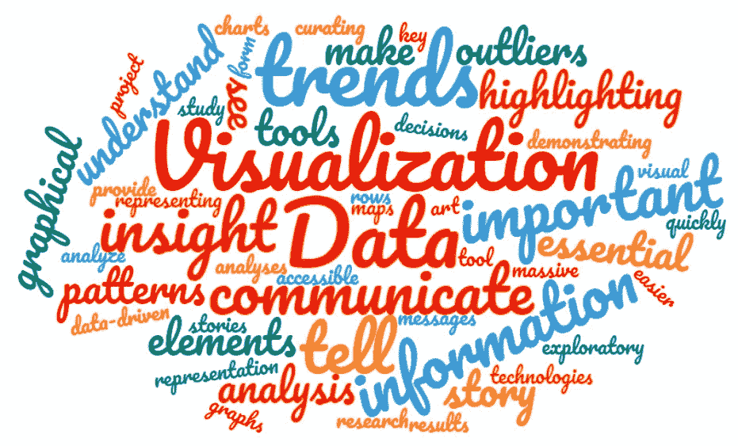
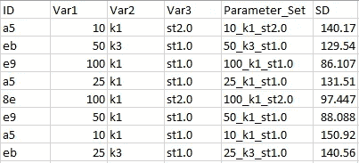
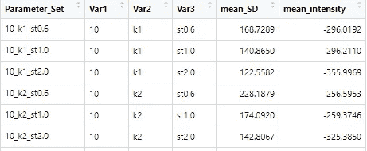
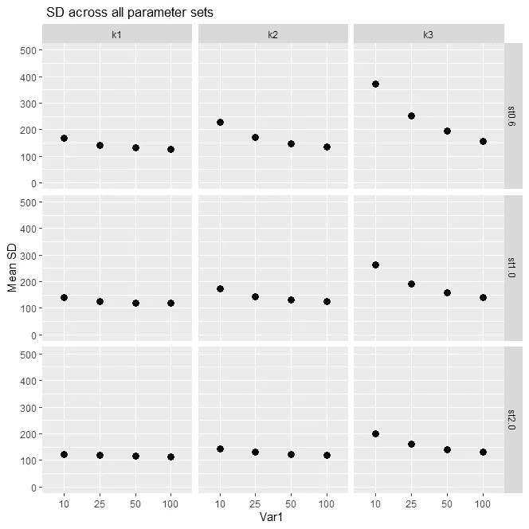
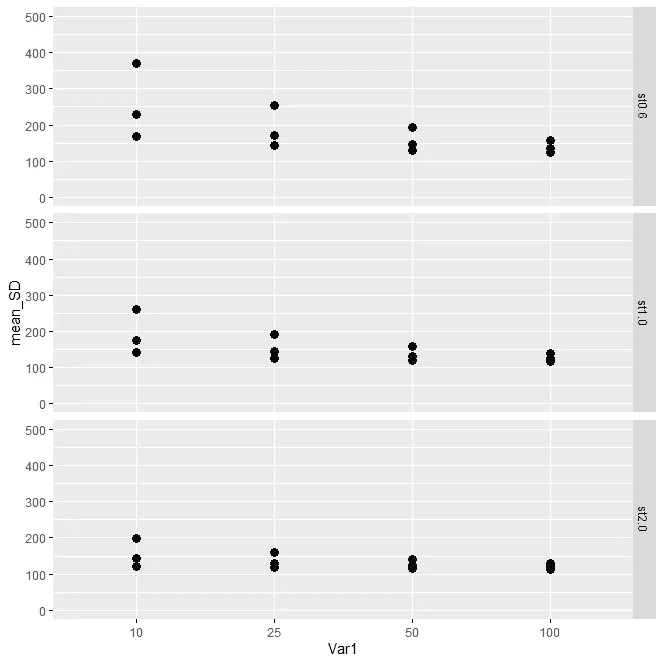
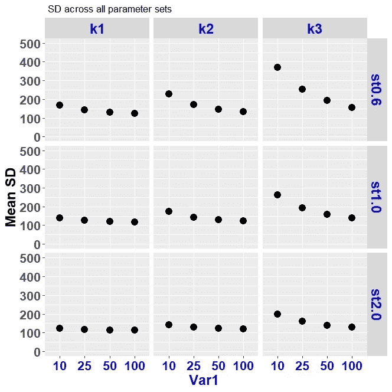
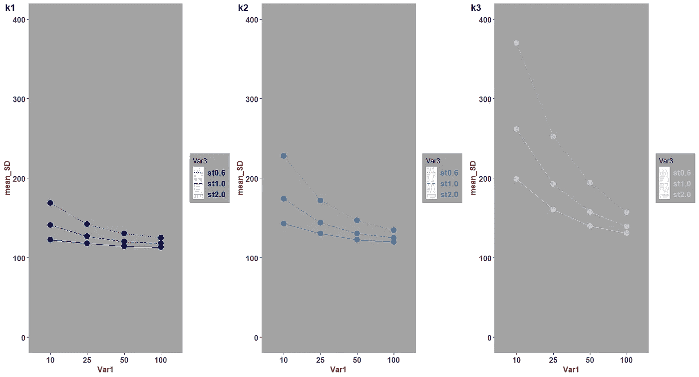
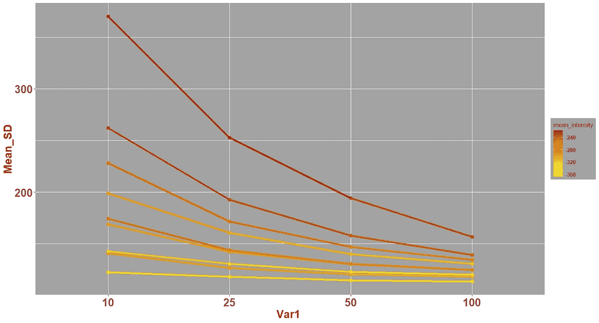
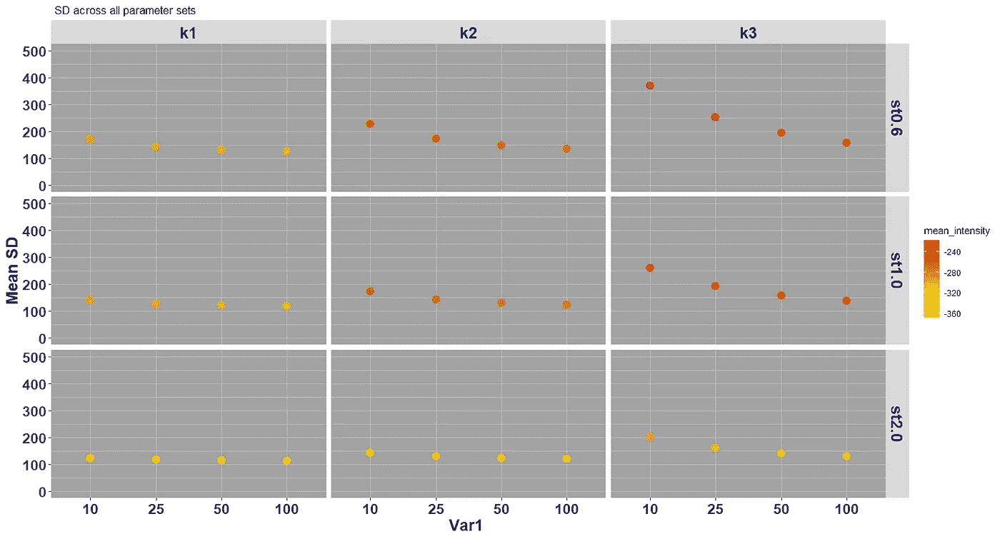

# 使用 ggplot2 可视化 R 中多元数据的趋势

> 原文：<https://towardsdatascience.com/visualizing-trends-of-multivariate-data-in-r-using-ggplot2-1b85409afcfb?source=collection_archive---------23----------------------->



由[字云](http://www.wordclouds.com)生成

数据可视化是通过图形元素表示数据的艺术，是任何研究或数据分析项目的重要组成部分。可视化在探索性数据分析和展示研究结果中是必不可少的。良好的可视化有助于讲述您的数据故事，并传达您的分析的重要信息，因为它允许我们快速查看趋势和模式，找到异常值，并获得洞察力。

通常，要么不容易找到最能描述数据的可视化类型，要么不容易找到生成感兴趣的图的简单工具。例如，可视化具有多个因变量和自变量(以及它们之间的相互作用)的高维数据集中的趋势可能是乏味的。

在这篇文章中，我决定介绍一种我认为非常有效的 3D 数据可视化技术。如果你是第一次接触 [R](https://www.r-project.org/) 或者你从未在 [R](https://www.r-project.org/) 中使用过 [ggplot2](https://ggplot2.tidyverse.org/index.html) 库，这会很有帮助。ggplot2 有几个内置的函数和功能，带来了显示复杂数据所需的灵活性。

此外，在这个博客中，将会有一些例子来说明如何使用函数设置来创建发布就绪的图形，并以高分辨率保存它们。你也可以在我的 [Github 页面](https://gist.github.com/nemaminejad/66034cb9bbb11a7242aaabe75c8e6cba)的一个地方找到所有代码。

**概要:**

**第一部分**:数据解释和准备

**第二部分**:使用 ***facet_grid()*** 函数可视化 3D 数据

**第三部分**:用其他 ggplot2 内置函数可视化 3D 数据

**第 4 部分**:可视化多因变量数据

# 第一部分:数据解释和准备

这里，我将使用来自真实世界问题的内部数据集，我们希望根据图像采集时设置的三个关键参数来表征一组对象图像中的噪声。我们不会深入讨论这些参数的细节，为了简单起见，我们将其命名为 Var1、Var2、Var3。图像中的噪声由标准偏差计算得出，命名为 SD。

```
Var1: Categorical at four levels of 100, 50, 25, 10Var2: Categorical at three levels of k1, k2, k3Var3: Categorical at three levels of st0.6, st1.0, st2.0SD: Continuous in the range of (0, 500)
```

这些参数有 4x3x3 = 36 种组合。所有这些参数的组合存在于数据集中，这意味着对于每个对象，存在 36 幅图像。每个图像都是参数集的不同组合(见下表)。

```
# set csv_file name
# set working directory
# set output_path# import libraries
library(ggplot2)
library(stringr)
library(ggpubr)
```

读取数据并准备数据列。准备工作的一个例子是数据转换:这里 Var1 是一个四层分类变量。在读取数据后，我们必须首先将该列转换为具有四个级别的数字列，然后对其进行排序，以便它在我们的图中按顺序出现。

```
# Read data
data = read.csv(csv_file,header = TRUE)
#prepare data
data$Var1 <- as.numeric(data$Var1,levels =data$Var1)
data$Var1 <- ordered(data$Var1)
data$Parameter_Set <- factor(data$Parameter_Set)
```



几行数据。每个对象(由唯一 ID 确定)有 36 个参数集的 36 幅图像

出于可视化的目的，我们将取每个参数集中图像的噪声平均值:

```
mean_SD = c()
mean_intensity = c()
Var1 = c()
Var2 = c()
Var3 = c()
for (ParamSet in levels(data$Parameter_Set)){
 data_subset = data[which(data$Parameter_Set==ParamSet),]
 mean_SD = c(mean_SD, mean(data_subset$SD))
 mean_intensity = c(mean_intensity, mean(data_subset$intensity))
 Var1 = c(Var1,str_split(ParamSet, “_”)[[1]][1])
 Var2 = c(Var2,str_split(ParamSet, “_”)[[1]][2])
 Var3 = c(Var3,str_split(ParamSet, “_”)[[1]][3])
}
Mean_DF = data.frame(Parameter_Set = levels(data$Parameter_Set),Var1 = Var1, Var2 = Var2, Var3 = Var3 ,mean_SD = mean_SD, mean_intensity = mean_intensity)
```



来自 Mean_DF 的几个样本行。注意:该数据框有 36 行，用于 36 个参数集

```
####### Prepare the Mean_DF dataframe
data = Mean_DF
data$Var3 <- factor(data$Var3)
data$Var1 <- as.numeric(data$Var1,levels =data$Var1)
data$Var1 <- ordered(data$Var1)
data$Parameter_Set <- factor(data$Parameter_Set)
```

# 第 2 部分:使用 facet_grid()函数可视化 3D 数据

**让我们看看剧情**

最后，我们将跨 3 个参数可视化图像中平均噪声的 3D 数据！[ggplot 2 库中的 facet_grid()](https://ggplot2.tidyverse.org/reference/facet_grid.html) 函数是关键函数，它允许我们跨越多个自变量的所有可能组合来绘制因变量。ggplot2 可灵活添加各种功能，通过“+”改变绘图格式。下面我们添加 [facet_grid()](https://ggplot2.tidyverse.org/reference/facet_grid.html) ， [geom_point()](https://ggplot2.tidyverse.org/reference/geom_point.html) ， [labs()](https://ggplot2.tidyverse.org/reference/labs.html) ， [ylim()](https://ggplot2.tidyverse.org/reference/coord_cartesian.html?q=yli#arguments)

```
ggplot(data, aes(y = mean_SD, x = Var1))+ geom_point(size = 3)+facet_grid(Var3 ~ Var2, scales = "free_x",space = "free")+labs(title =" SD across all parameter sets",x = "Var1 ", y= "Mean SD")+ ylim(0, 500)
```



看起来在这个情节中发生了很多事情，所以让我们回顾一下:我们有一个有九个街区的情节。每个模块都是 Var2 和 Var3 特定级别的一个参数集。(九块:三级 Var2 和三级 Var3 的组合)。Var3 显示在行上，Var2 显示在列上。在每个块中，横轴是 Var1，纵轴是因变量 mean_SD，范围为 0–500(由 ylim()确定)。

在这里使用 facet_grid()函数的好处是，随着我们的数据变得越来越复杂，变量越来越多，在自变量的不同组合下解开数据并可视化因变量的趋势将变得非常直观。例如，在这里，通过比较右上方的块(k3，st0.6)和左下方的块(k1，st2.0)，我们可以看到明显的差异。在(k1，st2.0)处，当 Var1 从 10 变到 100 时，mean_SD 是恒定的，但是在(k3，st0.6)处，当 Var1 变化时，mean_SD 显示出显著的变化。正如你所看到的，这张图可以显示自变量之间的相互作用以及它们各自对因变量的影响。

如果我们只想根据两个参数(Var1 和 Var3)绘图，facet_grid 的输入将更改如下:



```
…+facet_grid(Var3 ~ . , scales = “free_x”,space = “free”)+ …
```

在 facet_grid()中，如果将 space 和 scale 参数设置为“自由”而不是默认值“固定”,则很有帮助，这样变量的比例和面板的大小可以根据行和列中每个变量的比例自由变化。

如果你计划发表你的结果或在会议上发表，你必须注意你的绘图格式字体/字体大小/颜色，点和线的颜色/大小等。这里有一些关于如何使上面的情节看起来更好的帮助。我们简单地添加了 [theme()](https://www.rdocumentation.org/packages/ggplot2/versions/3.3.2/topics/theme) 函数来处理 axis 和块元素的一些细节。

```
ggplot(data, aes(y = mean_SD, x = Var1))+
  geom_point(size = 4)+facet_grid(Var3 ~ Var2, scales = "free_x",space = "free")+labs(title =" SD across all parameter sets",x = "Var1 ", y= "Mean SD")+ ylim(0, 500)+
theme(axis.text=element_text(size=16,face= "bold"),  axis.text.x = element_text(colour = "blue3"),
axis.title.y=element_text(size=18,face="bold", colour = "black"),
axis.title.x=element_text(size=18,face="bold", colour = "blue3"),
strip.text = element_text(size=18, colour = "blue3",face="bold"))
```



如果您想以高分辨率保存 R 图，可以使用下面这段代码。

```
myplot <- ggplot2(data, aes(y = mean_SD, x = Var1))+ ...tiff(mytitle, units=”in”, width=8, height=5, res=300)
myplot
dev.off()
```

# 第 3 部分:使用其他 ggplot2 内置函数可视化 3D 数据

**假设我们不想使用 facet_grid():**

绘制高维数据的另一种方式是简单地为 Var2 和 Var3 的每个不同级别分配不同的颜色和线型。在下面的代码中，我们为不同级别的 Var2 分配不同的颜色，为不同级别的 Var3 分配不同的线型。

在这里，我们将创建三个具有 3 个不同 Var2 值的数据帧。我们将为每个数据帧生成一个图，并将使用 [ggarrange()](https://www.rdocumentation.org/packages/egg/versions/0.4.5/topics/ggarrange) 将这些图合并成一个图。

在下面的图中，我们有意使用了背景颜色和网格线(panel.background 和 panel.grid 作为 [theme()](https://www.rdocumentation.org/packages/ggplot2/versions/3.3.2/topics/theme) 函数中的选项)。



将上面的图与有九个块的图(通过 facet_grid())进行比较，我们可以看到它们各有利弊；一个将数据合并到一个图表中，而另一个展示了允许单独和分别检查数据的 3D 数据面板。我本人更喜欢参数集面板的版本。

下面是上图中的代码:

```
#separate data frames based on Var2
data_k1 = data[which(data$Var2 == “k1”),]
data_k2 = data[which(data$Var2 == “k2”),]
data_k3 = data[which(data$Var2 ==”k3"),]
```

# 第 4 部分:用多个因变量可视化数据

假设我们希望不仅通过图像中的噪声，而且通过图像的亮度值范围来可视化数据的趋势。所以我们现在有了第二个因变量，叫做强度。在第一部分中，与“mean_SD”类似，我们计算了所有参数集的强度平均值(“mean_intensity”)。

首先，让我们看一下“mean_SD”和 Var1 之间的简单图表，其中我们通过颜色渐变显示了“mean_intensity”值的范围(参见图例)



上图的代码:

```
ggplot(data, aes(x = Var1, y = mean_SD , group = interaction(Var3, Var2)))+ geom_point(size = 3, aes(color = mean_intensity))+ 
 geom_line(lwd = 1.5, aes(color = mean_intensity))+    scale_colour_gradient(low = “yellow”, high = “red3”)+
 labs( x = “Var1 “, y = “Mean_SD”)+
 theme(strip.text = element_text(size = 20,face=”bold”, colour = “red3”),axis.text=element_text(size=20, face=”bold”),
 axis.title=element_text(size=20,face=”bold”, colour = “red3”),
 legend.text = element_text(size = 10,face=”bold” ), 
 panel.grid = element_line(colour= “white”),
 panel.background = element_rect(fill = “gray64”),
 legend.background = element_rect(fill = “gray64”))
```

现在，我们可以使用这个想法再次生成一个用块来可视化高维数据的图，并演示三个自变量对两个因变量的影响！



```
ggplot(data, aes(y = mean_SD, x = Var1))+
 geom_point(size = 4,aes(color = mean_intensity))+facet_grid(Var3 ~ Var2, scales = “free_x”,space = “free”)+ scale_colour_gradient(low = “yellow”, high = “red3”)+
 labs(title =” SD across all parameter sets”,x = “Var1 “, y= “Mean SD”)+ ylim(0, 500)+
 theme(axis.text=element_text(size=16,face= “bold”), axis.text.x = element_text(colour = “blue3”),
 axis.title.y=element_text(size=18,face=”bold”, colour = “black”),
 axis.title.x=element_text(size=18,face=”bold”, colour = “blue3”),
 strip.text = element_text(size=18, colour = “blue3”,face=”bold”),
 panel.grid = element_line(colour= “grey”),
 panel.background = element_rect(fill = “gray64”))
```

清晰的可视化有助于从数据中获得洞察力。在高维数据中，理解模式和交互尤其困难。 [R](https://www.r-project.org/) 及其库如 [ggplot](https://ggplot2.tidyverse.org/index.html) 2 为研究人员、数据爱好者和工程师处理数据和执行知识发现提供了一个有用的框架。

[R](https://www.r-project.org/) 和 [ggplot2](https://ggplot2.tidyverse.org/index.html) 有更多创建有洞察力的可视化的能力，所以我邀请你探索这些工具。我希望这个简短的教程有助于熟悉一个对数据分析有用的强大绘图工具。

*纳斯塔兰·埃玛尼贾德*

*在 Twitter 上关注我:*[*@ N _ Emaminejad*](https://twitter.com/N_Emaminejad)*和 LinkedIn:*[*Nastaran _ Emaminejad*](https://www.linkedin.com/in/nemaminejad/)