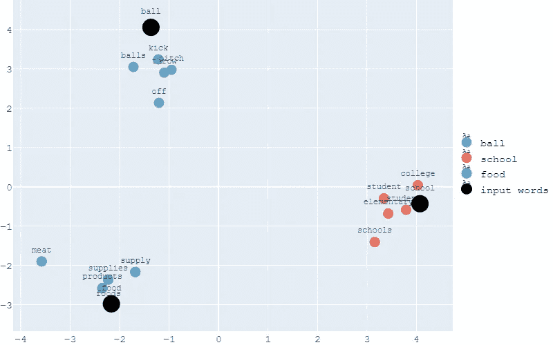
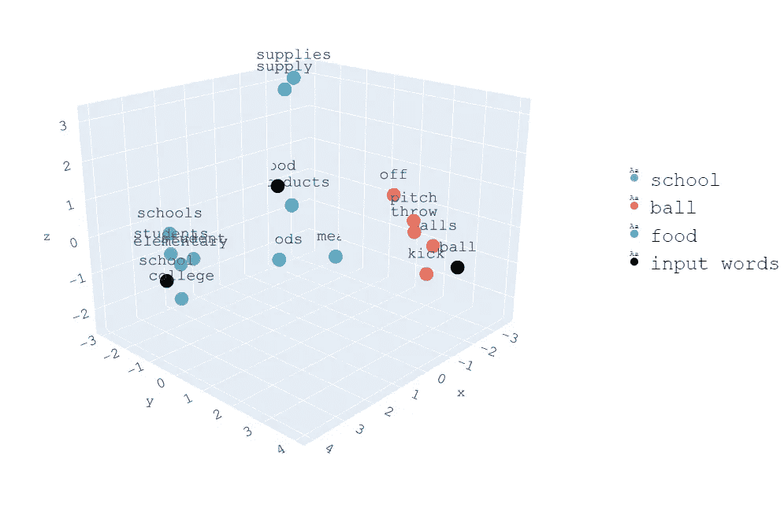
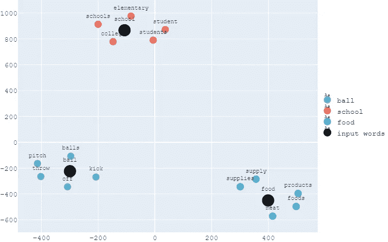
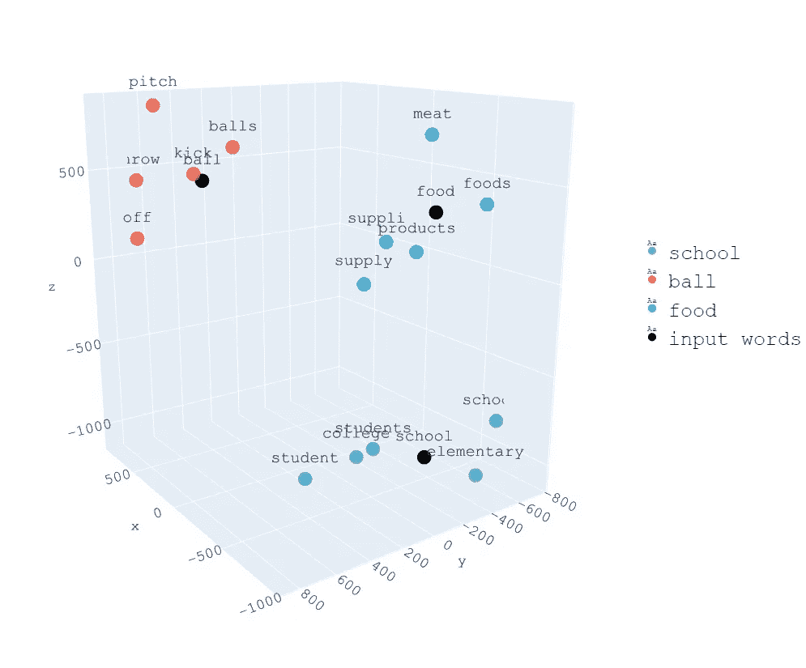
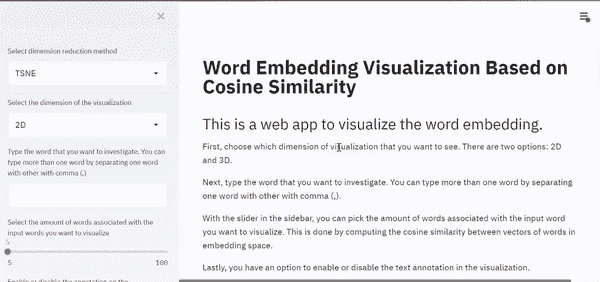

# 基于主成分分析和 t-SNE 的可视化单词嵌入

> 原文：<https://towardsdatascience.com/visualizing-word-embedding-with-pca-and-t-sne-961a692509f5?source=collection_archive---------3----------------------->

## [实践教程](https://towardsdatascience.com/tagged/hands-on-tutorials)

## 在 2D 或 3D 中创建单词嵌入的交互式可视化


由[弗朗西斯科·温加罗](https://unsplash.com/@francesco_ungaro?utm_source=unsplash&utm_medium=referral&utm_content=creditCopyText)在 [Unsplash](https://unsplash.com/s/photos/letter-word?utm_source=unsplash&utm_medium=referral&utm_content=creditCopyText) 上拍摄的照片

当你听到*‘茶’*和*‘咖啡’*这两个词，你会怎么想？大概你会说它们都是饮料，都含有一定量的咖啡因。关键是，我们可以很容易地识别出这两个词是相互关联的。然而，当我们向计算机提供单词*‘茶’*和*‘咖啡’*时，它无法像我们一样识别这两个单词之间的关联。

Word 不是计算机会自然理解的东西。为了让计算机理解单词背后的含义，需要将单词编码成数字形式。这就是单词嵌入背后的技术有用的地方。

单词嵌入是自然语言处理中常用的一种技术，用于将单词转换成向量形式的数值。这些向量将占据一定维数的嵌入空间。

如果两个单词具有相似的上下文，如*‘茶’*和*‘咖啡’*那样，那么这两个单词在嵌入空间中的距离将会彼此接近，而与具有不同上下文的其他单词的距离将会更远。

在这篇文章中，我将一步一步地向你展示如何可视化单词嵌入。由于本文的重点不是详细解释单词 embedding 背后的基本理论，您可以在本文和[中阅读更多关于理论](/introduction-to-word-embeddings-4cf857b12edc)[的内容。](/why-do-we-use-embeddings-in-nlp-2f20e1b632d2)

为了可视化单词嵌入，我们将使用常见的降维技术，如 PCA 和 t-SNE。为了将单词映射到它们在嵌入空间中的向量表示，将实现预先训练的单词嵌入手套。

# 加载预先训练的单词嵌入模型

在可视化单词嵌入之前，通常我们需要首先训练模型。然而，训练单词嵌入在计算上是非常昂贵的。因此，通常使用预先训练的单词嵌入模型来代替。它包含嵌入空间中的记号及其相关向量表示。

除了 Google 开发的 word2vec 之外，GloVe 是一个由斯坦福研究人员开发的流行的预训练单词嵌入模型。本文实现了 GloVe 预训练单词嵌入，你可以在这里下载[。同时，我们可以使用 Gensim 库来加载预先训练好的单词嵌入模型。您可以使用 pip 命令安装该库，如下所示。](https://nlp.stanford.edu/projects/glove/)

```
pip install gensim
```

作为第一步，我们需要将 GloVe 文件格式转换为 word2vec 文件格式。使用 word2vec 文件格式，我们可以使用 Gensim 库将预先训练好的单词嵌入模型加载到内存中。由于每次调用该命令时，文件加载都会花费一些时间，因此如果我们使用一个单独的 Python 文件来实现这个目的，效果会更好。

# 创建输入单词并生成相似的单词

现在我们有了一个 Python 文件来加载预训练的模型，接下来我们可以在另一个 Python 文件中调用它，根据输入的单词生成最相似的单词。根据您的喜好，输入的单词可以是任何单词。

在我们键入输入的单词后，下一件事就是创建一个代码来读取它。然后，我们需要根据模型将生成的每个输入单词指定相似单词的数量。最后，我们将相似单词的结果存储在一个列表中。下面是实现这一目的的代码。

例如，假设我们想要找出与*“学校”*相关的 5 个最相似的单词。因此，*‘学校’*将是我们的输入单词。使用上面的代码，我们将得到单词*、*、*、【学校】、*、【小学】、*、【学生】、*和*、【学生】、*作为结果。**

# 用主成分分析可视化单词嵌入

到目前为止，我们已经有了输入单词和基于它生成的相似单词。接下来，是时候让我们在嵌入空间中可视化它们了。

有了预训练的模型，每个单词现在可以用它的向量表示法映射到嵌入空间。然而，单词嵌入具有非常高的维数，这意味着不可能可视化单词如何占据嵌入空间。

通常实现诸如主成分分析(PCA)的方法来降低单词嵌入的维度。简而言之，PCA 是一种特征提取技术，它结合变量，然后丢弃最不重要的变量，同时仍然保留变量中有价值的部分。如果你想深入研究 PCA，我推荐[这篇文章](/a-one-stop-shop-for-principal-component-analysis-5582fb7e0a9c)。

使用 PCA，我们可以在 2D 或 3D 中可视化单词嵌入。因此，让我们使用我们在上面的代码块中调用的模型创建代码来可视化单词嵌入。在下面的代码中，只显示了 3D 可视化。为了使 2D 的认证后活动形象化，只需稍加改动。您可以在代码的注释部分找到需要更改的部分。

例如，假设我们想要可视化与*、【球】、*、【学校】、*、【食物】、*相关联的前 5 个最相似的单词。使用我们到目前为止创建的代码，下面是 2D 的可视化示例。**



基于主成分分析的 2D 词嵌入可视化

下面是同样一组单词的三维可视化。



基于主成分分析的三维单词嵌入可视化

从可视化中，现在我们可以看到这些单词所占空间的模式。与*‘ball’*相关联的单词被放置得彼此靠近，因为它们具有相似的上下文。同时，它们和与*【学校】**【食物】*相关的词之间的距离更远，因为它们有不同的上下文。

# 用 t-SNE 可视化单词嵌入

除了 PCA 之外，另一种常用的降维技术是 t 分布随机邻居嵌入或 t-SNE。主成分分析和 t-SNE 之间的区别是它们都实现了降低维数的基本技术。

PCA 是一种线性降维方法。高维空间中的数据被线性映射到低维空间，同时最大化数据的方差。同时，t-SNE 是一种非线性降维方法。利用 t-SNE，该算法计算高维空间和低维空间的相似度。接下来，使用优化方法，例如梯度下降方法，最小化两个空间中的相似性差异。

使用 t-SNE 可视化单词嵌入的代码与使用 PCA 的代码非常相似。在下面的代码中，只显示了 3D 可视化。为了使 2D 的 SNE 霸王龙形象化，只需要做一些小的改动。您可以在代码的注释部分找到需要更改的部分。

对于与 PCA 可视化中相同的例子，即与*‘球’*、*‘学校’*和*‘食物’*相关联的前 5 个最相似单词的可视化，下面是在 2D 的可视化结果。



基于 t-SNE 的 2D 单词嵌入可视化

下面是同样一组单词的三维可视化。



基于 t-SNE 的三维单词嵌入可视化

与主成分分析的方法相同，注意如何将具有相似上下文的单词放在彼此靠近的位置，而将具有不同上下文的单词放在较远的位置。

# 创建一个 Web 应用程序来可视化单词嵌入

到目前为止，我们已经成功地创建了一个 Python 脚本，使用 PCA 或 t-SNE 在 2D 或 3D 中可视化单词嵌入。接下来，我们可以创建一个 Python 脚本来构建一个 web 应用程序，以获得更好的用户体验。

web 应用程序使我们能够通过许多功能和交互性来可视化单词嵌入。例如，用户可以键入他们自己的输入单词，并且他们还可以选择与将被返回的每个输入单词相关联的前 n 个最相似的单词。

可以使用 Dash 或 Streamlit 创建 web 应用程序。在本文中，我将向您展示如何构建一个简单的交互式 web 应用程序，用 Streamlit 可视化单词嵌入。

首先，我们将使用我们之前创建的所有 Python 代码，并将它们放入一个 Python 脚本中。接下来，我们可以开始创建如下几个用户输入参数:

*   降维技术，用户可以选择是应用 PCA 还是 t-SNE。因为只有两个选项，所以我们可以使用 Streamlit 的`selectbox` 属性。
*   可视化的维度，其中用户有一个选项，他们是否希望在 2D 或 3D 中可视化单词嵌入。和以前一样，我们可以使用`selectbox` 属性。
*   输入单词。这是一个用户输入参数，要求用户键入他们想要的输入单词，例如*‘球’*、*‘学校’*和*‘食物’*。因此，我们可以使用`text_input` 属性。
*   前 n 个最相似的单词，其中用户需要指定将返回多少个与每个输入单词相关联的相似单词。由于我们可以选择任何数字，那么`slider` 属性将是最好的选择。

接下来，我们需要考虑在我们决定使用 SNE 霸王龙时会出现的参数。在 t-SNE 中，我们可以调整一些参数来获得最佳的可视化结果。这些参数是困惑度、学习率和优化迭代次数。在每种情况下，这些参数都没有单一的最佳值，因此最好的解决方案是让用户指定这些值。

由于我们使用的是 Scikit-learn，我们可以参考文档[来找出这些参数的默认值。困惑的默认值是 30，但是我们可以在 5 到 50 之间调整这个值。学习率的默认值是 300，但是我们可以在 10 到 1000 之间调整这个值。最后，迭代次数的默认值是 1000，但是我们可以将这个值调整为 250。我们可以使用`slider` 属性来创建这些参数值。](https://scikit-learn.org/stable/modules/generated/sklearn.manifold.TSNE.html)

现在我们已经涵盖了构建 web 应用程序的所有必要部分。最后，我们可以将所有的东西打包成一个完整的脚本，如下所示。

您现在可以使用 Conda 提示符运行 web 应用程序。在提示符下，转到 Python 脚本的目录，然后输入以下命令:

```
$ streamlit run your_script_name.py
```

接下来，会自动弹出一个浏览器窗口，您可以在这里本地访问您的 web 应用程序。下面是您可以使用 web 应用程序做些什么的快照。



就是这样！您已经创建了一个简单的 web 应用程序，它具有很多交互性，可以用 PCA 或 t-SNE 可视化单词嵌入。

如果你想看这个单词嵌入可视化的完整代码，可以在我的 GitHub 页面[这里](https://github.com/marcellusruben/Word_Embedding_Visualization)访问。