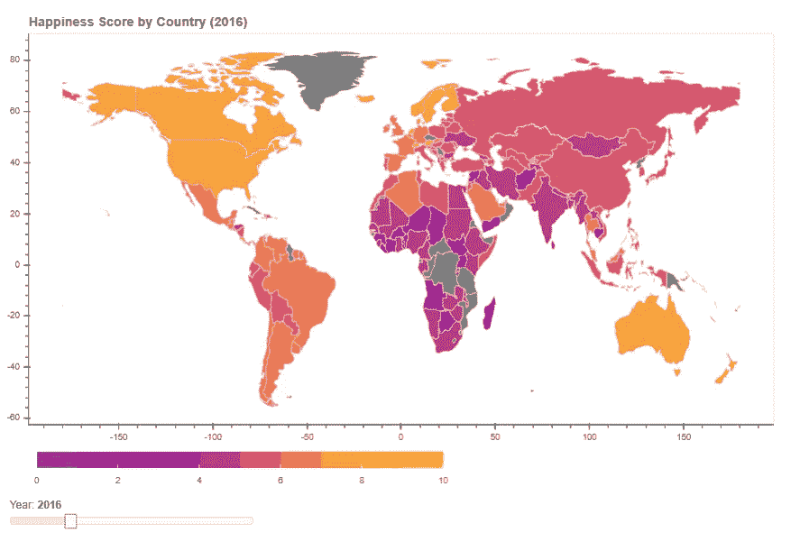
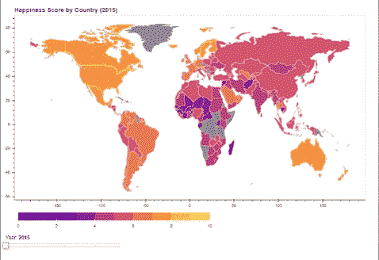

# 用交互式地图可视化世界幸福

> 原文：<https://towardsdatascience.com/visualizing-world-happiness-with-an-interactive-map-e33ebbaa3936?source=collection_archive---------44----------------------->



哪些国家最幸福？这个问题极难回答。然而,《世界幸福报告》尽力报道这个话题，对 156 个国家的公民认为自己有多幸福进行了排名。分析《世界幸福报告》数据的一个有趣的方法是观察各国的幸福分数与地图上与它们相近的国家的幸福分数之间的关系。

在本教程结束时，您将拥有一张交互式地理地图，可以用来调查世界各地不同国家的幸福程度——或者，您可以交换数据并可视化一些您自己的有趣地理数据！

# 安装软件包

以下是完成本教程所需的先决条件，可能有，也可能没有:

*   地质公园。GeoPandas 是一个软件包，它使得使用 Python 处理地理空间数据变得更加容易。你可以在这里找到安装说明[。](https://geopandas.org/install.html)
*   形状文件。为了绘制世界地图或城市地图，我们需要一个 shapefile，用于存储地理信息。我们在这个例子中使用的 shapefile 可以在我的 [Github](https://github.com/hhamer/public-dataviz/blob/master/Interactive%20Geographic%20Maps/ne_110m_admin_0_countries/ne_110m_admin_0_countries.shp) 上获得，或者你可以在这里找到它[。](https://www.naturalearthdata.com/downloads/110m-cultural-vectors/)
*   散景。[散景](https://docs.bokeh.org/en/latest/docs/user_guide/quickstart.html#userguide-quickstart)有助于快速轻松地制作交互式绘图、仪表盘和数据应用。
*   世界幸福报告数据。我在 [Kaggle](https://www.kaggle.com/unsdsn/world-happiness) 上找到了数据。

```
# basic modules 
import geopandas as gpd 
import pandas as pd 
import json 
import glob 
import os # visualizaztion modules 
from bokeh.resources import INLINE 
from bokeh.io import output_notebook, show, output_file 
from bokeh.plotting import figure 
from bokeh.models import GeoJSONDataSource, LinearColorMapper, ColorBar 
from bokeh.palettes import brewer,mpl # interactive visualization models 
from bokeh.io import curdoc, output_notebook 
from bokeh.models import Slider, HoverTool 
from bokeh.layouts import widgetbox, row, column
```

# 导入和清理数据

shapefile 包含了所有的坐标，这些坐标将有助于以后绘制世界地图。可以重命名这些列，以便它们对分析更有意义。

```
shapefile = 'ne_110m_admin_0_countries/ne_110m_admin_0_countries.shp'

# Read shapefile using Geopandas
gdf = gpd.read_file(shapefile)[['ADMIN', 'ADM0_A3', 'geometry']]

# Rename columns.
gdf.columns = ['country', 'country_code', 'geometry']
```

《世界幸福报告》提供的数据来自 2015 年至 2019 年间每年的一个文件。有些文件具有不同的形状和列名。我们必须确保所有感兴趣的列都有匹配的名称，以防止以后出现问题。

此外，在使用 pd.concat()函数将每个文件合并到一起之前，文件名中的年份必须附加到数据框中名为 year 的新列中。否则，我们将在每个国家的数据框架中有 5 行，完全不知道数据来自哪一年。

最后，发现在 shapefile 中，US 被标记为美利坚合众国。在世界幸福报告数据中，美国被标注为美国。为了在后面的操作中使两者相匹配，我们必须更新国家数据框，将美国替换为美利坚合众国。

```
datafiles_1 = ['2019.csv', '2018.csv']
datafiles_2 = ['2015.csv', '2016.csv']

df = pd.concat((pd.read_csv(f).assign(Year=os.path.basename(f[0:4])) for f in datafiles_1), sort=False)
df2 = pd.concat((pd.read_csv(f).assign(Year=os.path.basename(f[0:4])) for f in datafiles_2), sort=False)
df3 = pd.read_csv('2017.csv').assign(Year="2017")

df['Country'] = df['Country or region']
df2['Score'] = df2['Happiness Score']
df3['Score'] = df3['Happiness.Score']

countries = pd.concat([df[['Country', 'Score', 'Year']], df2[['Country', 'Score', 'Year']], df3[['Country', 'Score', 'Year']]], sort=False)

countries = countries.replace('United States', 'United States of America')
```

# 创建交互性功能

我们将需要两个功能，使我们的地理地图互动和动态。

1.  获取快乐数据的函数。该函数将接受选择的年份作为参数；今年可以用滑块选择。快乐数据将以 JSON 的形式返回，无论是哪一年。
2.  滑块更新时触发的函数。这个函数的工作是获取滑块保存的任何新值，并将其传递给从数字 1 开始的函数。无论滑块设置为什么，此功能都会使地图数据保持最新。

```
# 1\. Define function that returns json_data for the year selected by slider.
def json_data(selectedYear):
    yr = selectedYear
    df_yr = countries[countries['Year'] == yr]
    merged = gdf.merge(df_yr, left_on ='country', right_on ='Country', how ='left')
    merged['Score'] = merged.Score.fillna("N/A")
    merged_json = json.loads(merged.to_json())
    json_data = json.dumps(merged_json)
    return json_data

# 2\. Define the callback function.
# This is what will be called when the slider value changes.
def update_plot(attr, old, new):
    yr = slider.value
    new_data = json_data(str(yr))
    geosource.geojson = new_data
    p.title.text = 'Happiness Score by Country (%d)' %yr
```

# 渲染地图

现在终于可以在地图上看到所有这些数据了！

鉴于颜色可以在可视化中产生或破坏，我对散景的[调色板](https://docs.bokeh.org/en/latest/docs/reference/palettes.html)做了一些研究，并选择了一个与我的数据有意义的调色板。在这种情况下，悬停工具提示很有帮助，因为有些人(像我一样)苦于地理知识，可能无法说出地图上一半国家的名称。

创建了 slider 对象，注意它的回调函数是上面创建的函数之一。国家之间的线条被设置为白色，以便更好地匹配配色方案。

```
# Input GeoJSON source that contains features for plotting.
# Select a default year to show on first display.
geosource = GeoJSONDataSource(geojson = json_data("2016"))

# Define a sequential multi-hue color palette.
# I chose the Plasma theme because 10 would map to yellow :)
palette = mpl['Plasma'][10]

# Instantiate LinearColorMapper that maps numbers to a sequence of colors.
color_mapper = LinearColorMapper(palette = palette, low = 0, high = 10)

# Add the hovering tooltips.
hover = HoverTool(tooltips = [ ('Country','@country'),('Score', '@Score')])

# Create the color bar. 
color_bar = ColorBar(color_mapper=color_mapper, label_standoff=8,width = 500, height = 20, border_line_color=None,location = (0,0), orientation = 'horizontal')

# Create the figure object.
p = figure(title = 'World Happiness by Country (2016)', plot_height = 600 , plot_width = 950, toolbar_location = None, tools = [hover])
# Remove the grid lines. 
p.xgrid.grid_line_color = None
p.ygrid.grid_line_color = None
# Increase the title font size.
p.title.text_font_size = '12pt'

# Add the patch renderer to the figure. 
# Notice that this is where you provide the Score column from the json_data and the color mapper.
p.patches('xs','ys', source = geosource,fill_color = {'field' :'Score', 'transform' : color_mapper}, line_color = 'white', line_width = 0.5, fill_alpha = 1)

# Place the color bar below the map.
p.add_layout(color_bar, 'below')

# Make a slider object.
slider = Slider(title = 'Year',start = 2015, end = 2019, step = 1, value = 2016)
slider.on_change('value', update_plot)

# Make a column layout of widgetbox (slider) and plot, and add it to the current document
layout = column(p,widgetbox(slider))
curdoc().add_root(layout)

# Show the figure.
output_notebook(INLINE)
show(layout)
```

只需最后一步，你就可以看到你创建的美丽的地图。因为我们使用 on_change()函数，所以我们需要地图是交互式的，否则，当您移动滑块时，地图不会更新。要以交互模式查看此应用程序，您需要设置一个本地散景服务器。不要烦恼！您可以在一行中完成这项工作，并且您可以在命令行中完成这项工作，并且感觉自己已经是一名成熟的黑客了。

打开你的命令行，输入:*bokeh serve-show your file name . ipynb*

这是最终产品的样子:



嘣！你刚刚做了一个互动地图来分析世界幸福。我希望你喜欢。如果是这样，可以看看我的其他教程，比如我写的关于[用单词云](https://datadreamer.io/2020/04/30/analyzing-top-kickstarter-campaigns-with-wordcloud/)可视化 Kickstarter 数据的文章。也许这篇文章提醒了您，您需要复习数据框架知识..别担心，前往我的[数据帧 101](https://datadreamer.io/2020/03/21/dataframes-101/) 。

*原载于 2020 年 5 月 12 日*[*https://data dreamer . io*](https://datadreamer.io/2020/05/12/visualizing-world-happiness-with-an-interactive-map/)*。*