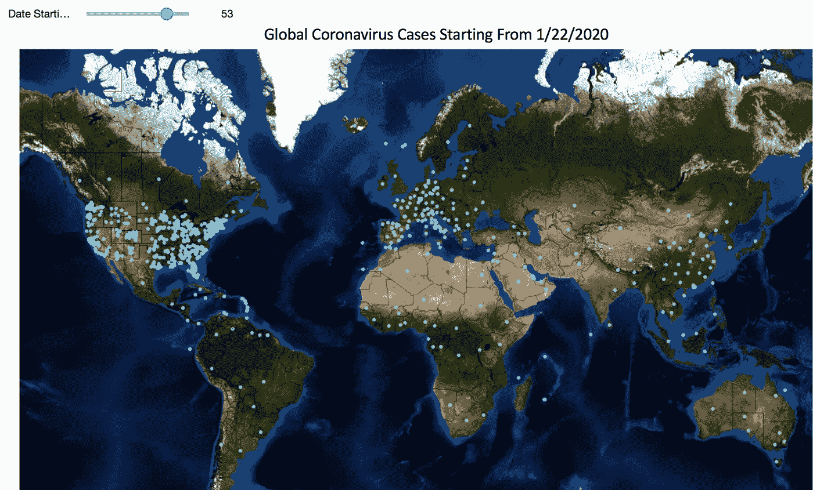
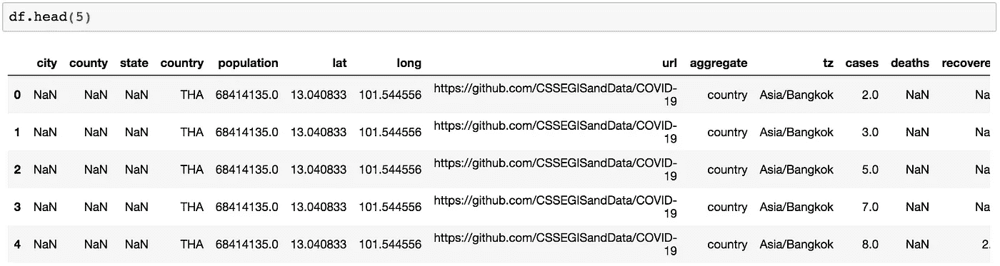
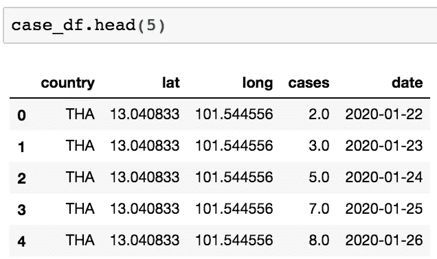
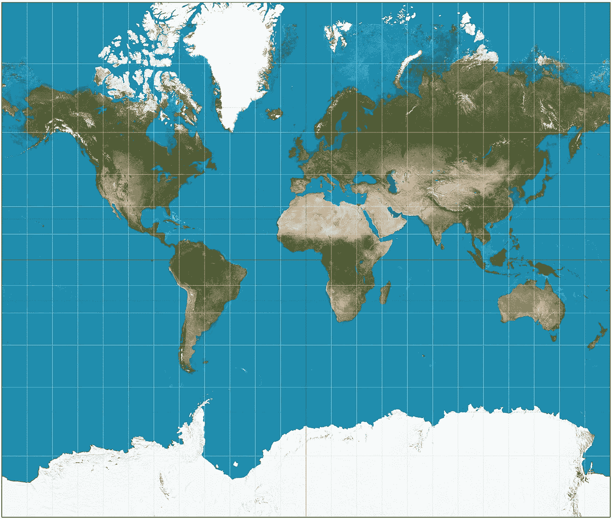
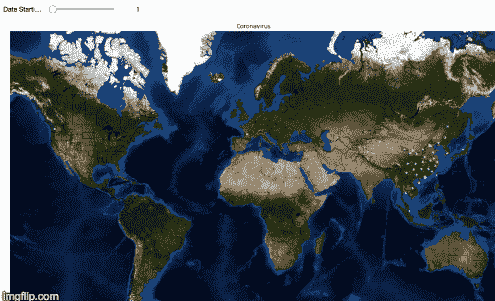

# 使用 Jupyter 可视化全球冠状病毒传播

> 原文：<https://towardsdatascience.com/visualizing-worldwide-coronavirus-spread-using-jupyter-dfbf2cd4618?source=collection_archive---------35----------------------->

## 创建你自己的新冠肺炎传播的可视化

***编者按:*** [*走向数据科学*](http://towardsdatascience.com/) *是一份以数据科学和机器学习研究为主的中型刊物。我们不是健康专家或流行病学家，本文的观点不应被解释为专业建议。想了解更多关于疫情冠状病毒的信息，可以点击* [*这里*](https://www.who.int/emergencies/diseases/novel-coronavirus-2019/situation-reports) *。*

有很多关于新冠肺炎和冠状病毒在世界各地传播的公共数据集。 [Corona Data Scraper](https://coronadatascraper.com/) 从经过验证的来源提取新冠肺炎案例数据，找到相应的 GeoJSON 特征，并添加人口信息。Corona Data Scraper 提供了奇妙的可视化效果，比如经过速率调整的 2D 国家级[地图](https://coronadatascraper.com/#features.json)和 Antonio Piccolboni 对平滑后的新冠肺炎趋势和[预测的可视化效果](https://piccolbo.shinyapps.io/covid-19/)。

如果你想尝试对冠状病毒数据进行自己的分析，你也可以使用 Jupyter 和 Python 小部件创建一些自己的漂亮的全局可视化，我们将在本文中进行讨论。这里有一个完整的交互式可视化的截图。可以拖动滑块查看从 2020 年 1 月 22 日开始的不同日期的新冠肺炎案例。



# 导入依赖项和数据集

我们将使用的数据集是冠状病毒数据刮刀的时间序列[数据](https://coronadatascraper.com/timeseries.csv)。首先导入依赖项并读入数据集。如果尚未安装底图、Networkx 和 Shapely 包，您可能需要安装它们。

```
import numpy as np
import pandas as pd
import networkx as nx
import matplotlib.pyplot as plt
from mpl_toolkits.basemap import Basemap as Basemap
from shapely.geometry import Point, MultiPoint
from ipywidgets import interact, widgets
from IPython.display import display
```

您可以下载 CSV 格式的数据集并在本地读取，也可以在[https://coronadatascraper.com/timeseries.csv](https://coronadatascraper.com/timeseries.csv')读取最新更新的数据集。

```
df = pd.read_csv(‘[https://coronadatascraper.com/timeseries.csv'](https://coronadatascraper.com/timeseries.csv'), parse_dates=[‘date’])
```



查看数据集和列信息。

我们的分析将只使用一些数据，特别是国家、纬度、经度和案例列。

```
# Get Country, Lat, Long, Cases, Date
case_df = df[[‘country’, ‘lat’, ‘long’, ‘cases’, ‘date’]]
```



Jupyter 笔记本截图

# 使用底图绘制地图

接下来，我们从包含边列表的 Pandas 数据帧创建一个 NetworkX 图。我们的目标是简单地在冠状病毒出现的位置标绘点。使用底图 Matplotlib 工具包，我们可以在地图背景上绘制点。



墨卡托投影。图片鸣谢:[维基百科](https://en.wikipedia.org/wiki/File:Mercator_projection_SW.jpg)。来自[维基共享资源](https://commons.wikimedia.org/wiki/Main_Page)的原始文件

为了使世界形象化，我们将使用墨卡托投影，一种圆柱形的保形投影。这种投影在高纬度地区产生很大的失真，并且不能完全覆盖极地区域。

创建底图墨卡托投影。参数 *llcrnrlon* 和 *llcrnrlat* 代表右下角经度和纬度。参数 *urcrnrlon* 和 *urcrnrlat* 代表右下角经度和纬度。右下角(西经 150 度，南经 50 度)到左上角(东经 160 度，北纬 75 度)似乎很适合我们的显示。

```
m = Basemap(llcrnrlon=-150., llcrnrlat=-50., urcrnrlon=160., urcrnrlat=75., rsphere=(6378137.00,6356752.3142), resolution=’l’, projection=’merc’, lat_0=0,lon_0=0., lat_ts=20.)
```

接下来，创建一个没有节点和边的空图。初始化 Matplotlib 图形以显示地图。

```
G=nx.Graph()plt.figure(figsize = (20,10))
```

用 Matplotlib 画空图 G。

```
nx.draw_networkx(G, node_size=200, node_color=’blue’)
```

# 绘制冠状病毒病例

在地图上用点标出冠状病毒病例的位置。

```
# Create a scatter plot of cases on a single date *d*.one_date_df = case_df[case_df[‘date’]== *d*]
map_points = pd.Series([Point(m(mapped_x, mapped_y)) for mapped_x, mapped_y in zip(one_date_df[‘long’], one_date_df[‘lat’])])
```

在地图上画出病例的散点图。

```
# Create a scatterplot on the mapdev = m.scatter( [geom.x for geom in map_points],  [geom.y for geom in map_points],  20, marker=’o’, lw=.25, facecolor=’#33ccff’, edgecolor=’w’, alpha=0.9,antialiased=True, zorder=3)
```

最后，画地图。

```
# Now draw the map
 m.drawcountries()
 m.drawstates()
 m.bluemarble()
 plt.title(‘Coronavirus’)
```


2020 年 1 月 22 日冠状病毒图谱

# 使地图互动

将单个地图制作代码组合到一个名为 create_map 的函数中，以在任意给定日期执行上述地图绘制。

```
def create_map(date_d):
    m = Basemap(
            llcrnrlon=-150.,
            llcrnrlat=-50.,
            urcrnrlon=160.,
            urcrnrlat=75.,\
            rsphere=(6378137.00,6356752.3142),\
            resolution='l',projection='merc',\
            lat_0=0,lon_0=0.,lat_ts=20.)G=nx.Graph()fig = plt.figure(figsize = (20,10))nx.draw_networkx(G,node_size=200,node_color='blue')# Draw scatter
one_date_df = case_df[case_df['date']== date_d]
map_points = pd.Series([Point(m(mapped_x, mapped_y)) for mapped_x, mapped_y in zip(one_date_df['long'], one_date_df['lat'])])# Scatterplot on the map
    dev = m.scatter(
                [geom.x for geom in map_points],
                [geom.y for geom in map_points],
                20, marker='o', lw=.25,
                facecolor='#33ccff', edgecolor='w',
                alpha=0.9,antialiased=True,
                zorder=3)# Draw the map
    m.drawcountries()
    m.drawstates()
    m.bluemarble()
    plt.title('Global Coronavirus Cases Starting From 1/22/2020')
    return (date_d, fig)
```

现在，为每个感兴趣的日期画一张地图。

```
all_dates = list(case_df['date'].unique()) all_maps = [ ]
for date_d in all_dates:
    all_maps.append(create_map(date_d))
```

定义一个功能 *f* 用于选择对应于其各自日期的地图。

```
def f(index):
    img = all_maps[index][1]
    display(img)
```

现在创建交互式滑块和地图。

```
interact(f, index=widgets.IntSlider(min=0,max=68,step=1,value=1,
 description=’Date Starting From 1/22/2020:’ ))
```

就是这样！这里有一张 gif 图，可以看到交互式滑块在整个时间序列中的样子。



通过 imgflip.com 创建的 Gif

# **参考文献**

[1][https://coronadatascraper.com/](https://coronadatascraper.com/#home)

[2][https://towards data science . com/catching-the-flight-visualizing-social-network-with-network x-and-base map-ce 4a 0 D2 ea 6](/catching-that-flight-visualizing-social-network-with-networkx-and-basemap-ce4a0d2eaea6)

[3] NetworkX 文档[https://networkx.github.io/documentation/stable/index.html](https://networkx.github.io/documentation/stable/index.html)

[4]底图文档[https://matplotlib.org/basemap/](https://matplotlib.org/basemap/)