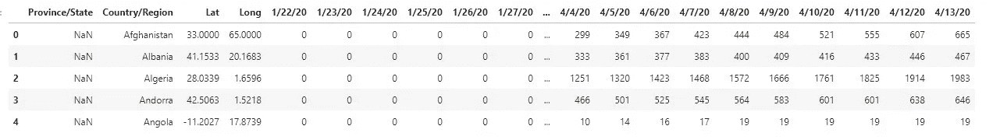
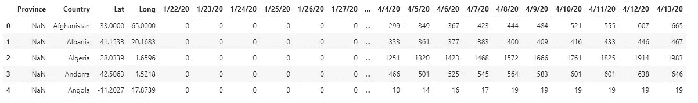
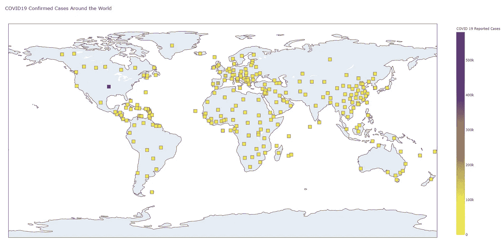
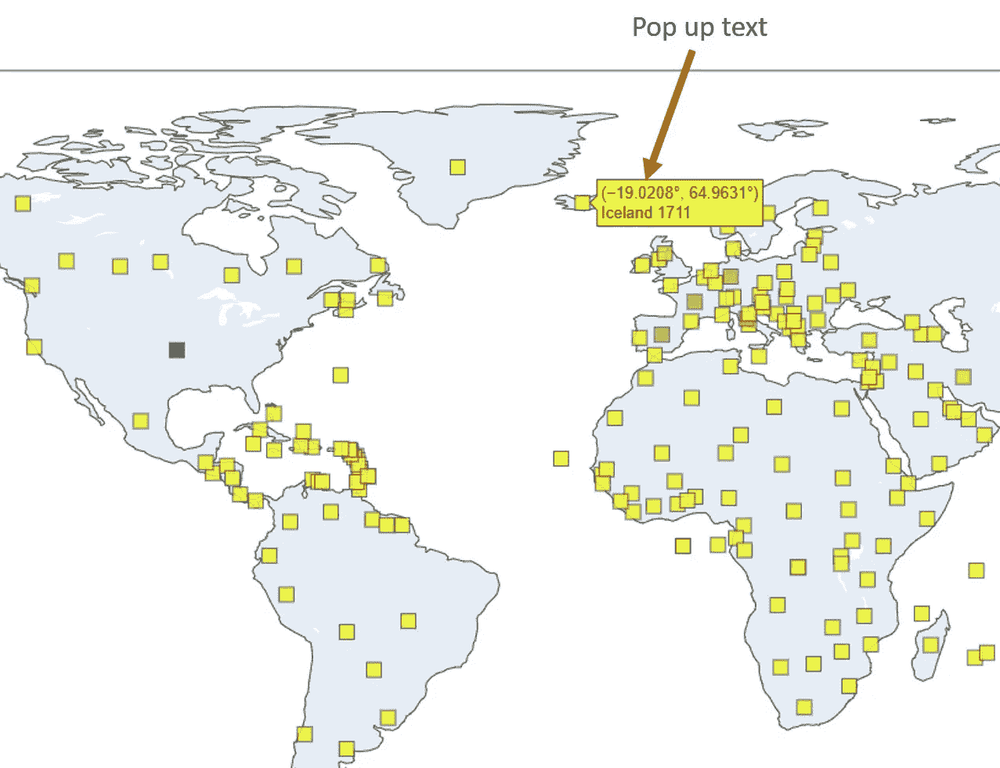
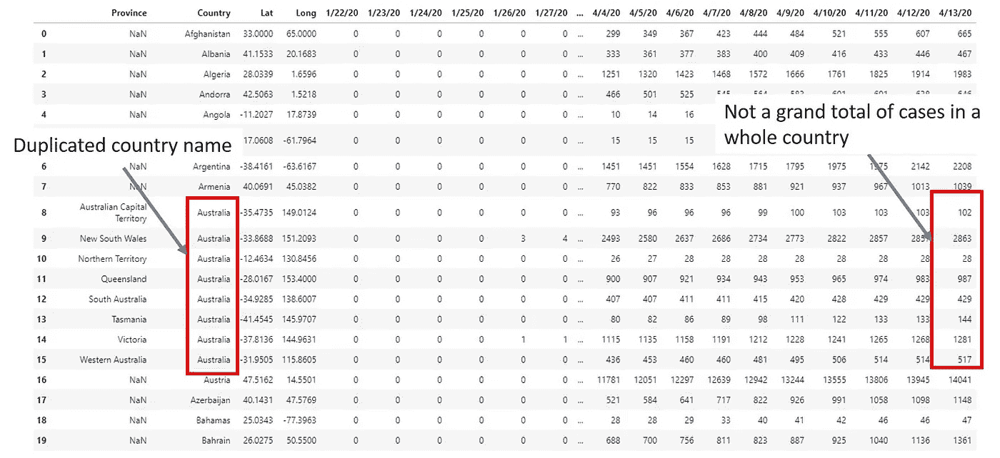
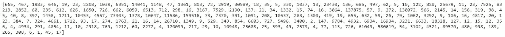
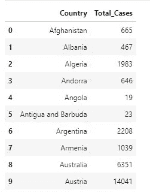
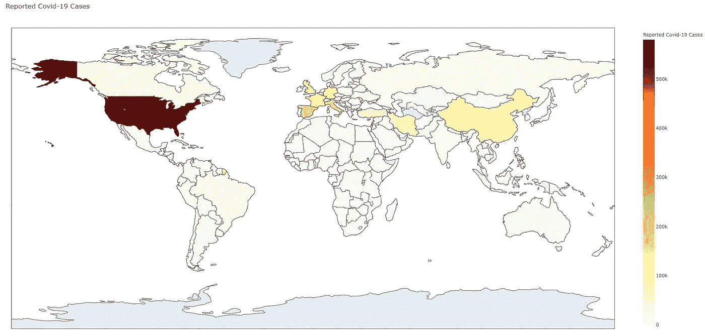
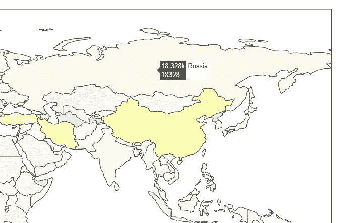

# 使用 Python Plotly 地图可视化全球新冠肺炎数据

> 原文：<https://towardsdatascience.com/visualizing-worldwide-covid-19-data-using-python-plotly-maps-c0fba09a1b37?source=collection_archive---------18----------------------->


埃德温·胡珀在 [Unsplash](https://unsplash.com/s/photos/coronavirus?utm_source=unsplash&utm_medium=referral&utm_content=creditCopyText) 上的照片

***编者按:*** [*走向数据科学*](http://towardsdatascience.com/) *是一份以数据科学和机器学习研究为主的中型刊物。我们不是健康专家或流行病学家，本文的观点不应被解释为专业建议。想了解更多关于疫情冠状病毒的信息，可以点击* [*这里*](https://www.who.int/emergencies/diseases/novel-coronavirus-2019/situation-reports) *。*

2019 年 12 月 31 日，世界卫生组织(世卫组织)驻中国国家办事处首次报告了一种未知的肺炎类型疾病。这种未知的疾病后来在 2020 年 2 月 11 日被命名为**新冠肺炎**，因为它与导致 2003 年 SARS 爆发的冠状病毒有遗传关系。新冠肺炎很快在世界范围内广泛传播，直到世卫组织于 2020 年 1 月 30 日宣布该疫情为国际关注的突发公共卫生事件。

在这篇文章中，我将介绍使用 [**Python Plotly 库**](https://plotly.com/python/) 绘制地图的两种方法，以显示新冠肺炎病例在世界各地的分布。

# 你需要什么

## 先决条件 Python 库

python Plotly—[https://plotly.com/python/](https://plotly.com/python/)

蟒蛇熊猫—[https://pandas.pydata.org/](https://pandas.pydata.org/)

***安装指南可以在官方网页上找到。***

## **数据集**

[新型冠状病毒数据集](https://www.kaggle.com/sudalairajkumar/novel-corona-virus-2019-dataset)

# 第 1 部分:地图上的散点图

在本节中，我们将使用来自 plotly 库的 *plotly.graph_objects* 在世界地图上创建一个散点图，以显示新冠肺炎确诊病例在世界各地的分布。

## 步骤 1:探索新的冠状病毒数据集

探索新冠肺炎数据集的 Python 代码

**代码解释**

**第 1–2 行:**导入熊猫和 Plotly 库

**第 3 行:**世界范围内的新冠肺炎数据可以在 [*小说电晕病毒数据集*](https://www.kaggle.com/sudalairajkumar/novel-corona-virus-2019-dataset) ***的一个 CSV 文件中找到。*** 我们可以使用熊猫 *read_csv* 方法来读取文件。

**第 4 行**:使用 Pandas *head* 方法显示前 5 行记录。



数据集记录的前五行

从上面的结果中，我们可以观察到数据集包括从 2020 年 1 月 22 日到 2020 年 4 月 13 日(截至本文撰写时)每个国家报告的新冠肺炎病例数。该数据集每天都会更新。不幸的是，数据集中缺少省/州的详细信息。我们可以看到在*省/州*列中有很多 NaN 值。

为了简化我们操作列和绘制地图的后续任务，建议简化一些列名(如国家/地区)。

Python 代码重命名列

**代码解释**

**第 5 行**:我们可以使用熊猫*重命名*的方法，将列名“国家/地区”改为“国家”，“省/州”改为“省”。

**第 6 行**:重命名列后，我们使用熊猫头*方法再次查看记录。*



重命名的列

## 步骤 2:在地图上创建散点图

我们现在可以继续使用 Python Plotly 库，使用***Plotly . graph _ objects***在地图上创建散点图。

用于在地图上创建散点图的 Python 代码

这些代码(第 8 - 39 行)一开始看起来让人望而生畏。不要担心，它们只是我们需要为地图设置的参数，关于这些参数的信息可以在 [Plotly 参考页面](https://plotly.com/python/reference/#scattergeo)中找到。这里我只讨论几个重要的参数。

**代码解释**

**第 8 行**:设置将出现在数据点上的文本元素。这意味着当我们将鼠标悬停在地图上的数据点上时，预定义的文本(例如，国家名称+20 年 4 月 4 日的病例数)将会弹出。

**Line 10–11**:*lon*和 *lat* 是我们为地图上每个数据点设置的经纬度参数。

**第 14–23 行** : *标记*是地图上数据点的表示。这里我们将符号(第 19 行)设置为*正方形*。这将在地图上将每个数据点呈现为一个正方形。我们可以将 *reversescale* 和 *autocolorscale* 保留为 True，以使标记的颜色根据报告的新冠肺炎病例数自动改变。

**第 24–26 行** : *cmin* 和 *cmax* 是数据点色域的下限和上限。

**第 31–37 行**:这是我们为整个地图设置参数值的部分，比如地图*标题*(第 32 行)，更重要的是*范围*(第 34 行)。如果我们打算在地图上显示世界范围的数据，我们需要将范围设置为“world ”, Plotly 将生成一个世界地图。如果我们的目的只是只显示美国的数据点，我们可以将范围设置为“美国”。我们可以选择以下范围选项之一:

*   世界
*   美国
*   欧洲
*   非洲
*   北美洲
*   南美洲

**第 39 行** : *fig.write_html* 将生成一个显示散点图的 html 页面。

***注*** : *可以在 Jupyter 笔记本或 Jupyter Lab 上显示地图，而不是在单独的 HTML 页面上。为此，我们必须为我们的 Jupyter 笔记本/ Jupyter 实验室安装一个扩展(*[*【https://plotly.com/python/getting-started/】*](https://plotly.com/python/getting-started/)*)。*



地图上的散布图

上面的散点图让我们大致了解了 2020 年 4 月 13 日世界各地报告的新冠肺炎病例。与深色标记相比，黄色标记反映的报告病例相对较少。从地图上，我们可以看到美国是报告病例最多的国家，其次是欧洲的一些国家，如意大利、英国、法国等。当我们将鼠标悬停在地图上的一个数据点上时，我们可以看到一个预定义的弹出文本，显示与该数据点相关的国家名称和已报告病例数。



弹出信息

# 第 2 部分:Choropleth 地图

我们也可以使用同一个数据集，通过 *plotly.graph_objects 绘制 choropleth 图。*但是，我们需要对数据进行预处理，然后才能创建 choropleth 图。

## **第一步:数据预处理**

为了创建 choropleth 图，我们需要从我们的数据集中获得两条信息:

1.  独特的国家列表
2.  每个国家报告的新冠肺炎病例总数(2020 年 4 月 13 日)

不幸的是，我们无法从原始数据集中直接提取出这两条所需的信息。通过预览一些记录，再次仔细查看我们的数据集。



原始数据集中的两个问题

我们可以从我们的数据集中得到如下两个观察结果:

1.  我们的记录中有重复的国家名称。这是因为给定数量的已报告新冠肺炎病例被分解到可能属于同一个国家的几个省/州。
2.  2020 年 4 月 13 日报道的新冠肺炎案例的每一行都只是发生在一个国家的每个省或州的案例的小计。

当我们逐个国家地遍历记录时，可以断断续续地看到上面的两个观察结果。这意味着原始数据集中的记录不一致。有些记录需要对一个国家的州进行细分，而有些记录只包含整个国家的单行数据。

幸运的是，这里有一个简单的修复方法。我们可以使用熊猫图书馆来重组我们的数据。

用于重构数据的 Python 代码

**代码解释**

**第 1–5 行**:这是导入必要的 Plotly 和 Pandas 库，读取 CSV 文件以及重命名一些列的步骤。

**第 7 行**:我们可以使用 Pandas *groupby* 方法根据国家对我们的数据进行分组，并应用 sum 方法计算每个国家报告的病例总数。结果是一个总和列表，我们将它赋给一个名为 *total_list* 的变量。



每个国家报告病例总数系列

**第 9–13 行**:我们将清理国家列表并生成一个唯一的国家列表。

*   首先，使用 *tolist* 方法将 *Country* 列转换为 list 对象，并将其赋给变量 *country_list* (第 9 行)。
*   接下来，使用 *set* 方法将 *country_list* 转换成 Python set 对象。set 方法将自动从 country_list 中删除所有重复的国家名称。只有唯一的国家名称会存储在*国家设置*(第 10 行)中。
*   接下来，再次将 *country_set* 转换为列表，并将其分配回 *country_list* (第 11 行)。
*   使用*排序*方法按照字母顺序重新排列*国家列表*(第 12 行)。**这一步是必需的，因为之前使用的 set 方法会使国家/地区的顺序随机化。*

**第 14 行**:最后，我们使用前面步骤生成的 *country_list* 和 *total_list* 作为新数据帧中仅有的两列，创建一个新数据帧。



重组原始数据后的新数据框架

我们已经成功地重组了我们的数据，并将其存储到一个新的数据帧中， *new_df* 。 *new_df* 包含了我们生成 choropleth 地图所需的数据(唯一的国家列表和每个国家的总病例数),我们现在准备进入下一步。

## 步骤 2:生成 Choropleth 图

choropleth 地图是一种由彩色多边形组成的地图，用于表示数量的空间变化。我们将使用 *go。Choropleth* graph 对象创建一个 Choropleth 图，显示全球已报告新冠肺炎病例的分布。

创建 Choropleth 地图的 Python 代码

同样，这些代码一开始看起来令人望而生畏。然而，它们只不过是设置参数来构建 choropleth 图。我们可以参考官方网站上的[参考页面](https://plotly.com/python/reference/#choropleth)来获得更多关于参数的信息。

**代码解释**

**第 17–19 行**:我们可以为我们的 choropleth 贴图定义一个色域。要定义一个色域，我们只需创建一个六色代码列表。(*颜色代码可在此处[获得](https://htmlcolorcodes.com/))。

**第 22–33 行**:这是我们可以设置位置列表、色域、地图上显示的文本信息、标记线颜色等参数的部分。

*   因为我们绘制地图来显示世界各地的新冠肺炎病例，所以我们将*位置模式*设置为“**国家名称**”。这使我们能够将*国家*列从 *new_df* 设置为*地点*参数(第 23–24 行)。这是使 Plotly 能够将我们的新冠肺炎数据映射到 choropleth 地图上各自国家位置的重要一步。(*请注意，这里没有坐标，lat & long，均为必填*)。
*   我们将来自 *new_df* 的 *Total_Cases* 数据设置为参数 *z* (第 25 行)*。*这是使 Plotly 能够根据应用于 choropleth 图的色域揭示报告病例频率的另一个关键步骤。
*   我们还可以将“ *Total_Cases* ”设置为*文本*参数(第 26 行)。每当我们将鼠标悬停在地图上的某个国家/地区上方时，就会在弹出文本中显示病例总数。
*   由于我们已经定义了自己的色域(第 17–19 行)，我们可以将参数 *autocolorscale* 设置为 false(第 28 行)。
*   我们还为颜色栏设置了一个标题(第 30 行)。

**Line 33–37**:这里，我们简单地为地图设置一个标题，并启用地图上显示的海岸线。

**第 40 行**:将地图输出到 HTML 页面。



等值区域图

最后，我们成功创建了一个 Choropleth 地图，显示了全球冠状病毒爆发的流行水平。当我们将鼠标放在一个国家地区的上方时，我们可以看到以弹出文本显示的报告病例数。



Choropleth 地图上的弹出文本

# 第 3 部分:在线发布 Plotly 地图

你有没有想过我们可以在线发布我们的地图？Plotly 为我们提供了一个免费与公众分享地图的选项。为此，我们只需遵循以下几个简单的步骤:

## **第一步:安装 chart_studio**

打开您的终端(Mac)或命令提示符(Windows)，点击

```
**pip install chart_studio
or
sudo pip install chart_studio**
```

## 第二步:注册一个 Chart Studio 的免费账户

访问[图表工作室页面](https://chart-studio.plotly.com/feed/#/)，注册一个免费账户。这个过程只需要不到 3 分钟。免费帐户允许我们与公众分享最多 100 张图表。

## **步骤 3:在 Python 代码中设置凭证**

注册一个免费的 Chart Studio 帐户后，访问设置页面并寻找 API 键。复制 API 键并将其粘贴到我们之前的 Python 代码(散点图或 Choropleth 图)的顶部。

设置 Chart Studio 凭据的 Python 代码

**第 1–2 行:**这两行代码提供凭证信息，使我们的 Python 程序能够访问 Chart Studio 特性。

## 步骤 4:将地图共享给公众

为了将我们的地图分享给公众，我们所需要的只是在现有 Python 程序的最后一行(第 42 行)添加一行代码。

将地图共享给公众的 Python 代码

运行代码，Plotly 将返回一个 URL，将我们重定向到托管我们地图的网站。

您可以在此[链接 1](https://plotly.com/~teobguan2020/5/) 查看我的共享散点图，在此[链接 2](https://plotly.com/~teobguan2020/3/) 查看 Choropleth 地图。

# 结束语

Python Plotly 是一个易于使用的图表绘图库，使我们能够创建令人惊叹的图表并与公众分享。这绝对值得我们花时间学习 Plotly，并使用它来完成我们的数据可视化任务。如果你有兴趣了解更多关于 Plotly 库的知识，可以在这篇[博客文章](https://neptune.ai/blog/plotly-python-tutorial-for-machine-learning-specialists)中找到有用的教程。

我希望这篇文章能对你有所帮助。

# 为了与我联系，你可以

1.  跟着我上 [**中**](https://medium.com/@teobguan2013)
2.  通过 [**LinkedIn**](https://www.linkedin.com/in/bee-guan-teo-bb8570128/) 联系我

# 开源代码库

本文中的所有源代码都可以在 [GitHub 资源库](https://github.com/teobeeguan/COVID-19-Scatter-Choropleth-Map)中找到。

# 参考

1.  [https://www . who . int/emergencies/diseases/novel-coronavirus-2019/events-as-these-as-than-happens](https://www.who.int/emergencies/diseases/novel-coronavirus-2019/events-as-they-happen)
2.  https://plotly.com/python/
3.  [https://Neptune . ai/blog/plotly-python-tutorial-for-machine-learning-specialists](https://neptune.ai/blog/plotly-python-tutorial-for-machine-learning-specialists)