# 立即可视化您的音乐流偏好🎧

> 原文：<https://towardsdatascience.com/viz-your-music-with-spotify-api-and-plotly-eaa65f652191?source=collection_archive---------26----------------------->

## 通过连接到 Spotify APIs，您可以收集您的流媒体历史记录和播放列表歌曲的曲目功能。你会惊讶的！

穆罕默德·梅特里在 Unsplash 上的照片

作为一个公认的音乐爱好者，我几乎每天都听音乐，在学习、跑步或者只是为了放松的时候。我在中国时使用网易云播放流媒体音乐，而在美国开始硕士课程后，我改用 Spotify。网易和 Spotify 都提供[年度总结服务](https://techcrunch.com/2019/12/05/spotify-wrapped-expands-to-include-your-favorite-music-from-the-decade-plus-podcaster-metrics/#:~:text=Spotify%20Wrapped%20expands%20to%20include%20your%20favorite,the%20decade%2C%20plus%20podcaster%20metrics&text=Spotify%27s%20annual%20%E2%80%9CWrapped%E2%80%9D%20feature%2C,tunes%2C%20the%20company%20announced%20today.)，让用户回顾他们今年最喜欢的歌曲。除此之外，我渴望知道我喜欢的歌曲或艺术家的其他特点。因此，我从流媒体历史记录和我自己创建的播放列表中收集了曲目信息和功能，以构建我的音乐流媒体故事。

我将这篇文章分成两部分:第一部分向您介绍我如何连接到 Spotify APIs 并检索我需要的音乐数据。第二部分显示流历史和播放列表轨道的探索性分析。让我们开始拍子吧！

*完整代码可在我的*[***GitHub***](https://github.com/VincyHu/MusicForYou)***获取。***

# 第一部分。获取您的流媒体历史和播放列表轨道信息。

## I.1 下载流媒体历史记录

工作的第一步是决定我想要可视化的覆盖范围，以便我们从 Spotify 检索正确的数据。Spotify 允许用户在[https://www.spotify.com/ca-en/account/privacy/](https://www.spotify.com/ca-en/account/privacy)请求他们的流媒体历史记录，通常需要 2-3 天才能获得数据，尽管说明显示 Spotify 需要大约 30 天来准备数据。
流历史将被下载到 JSON 文件中，我们可以先将 JSON 数据转换成数据帧。

现在，我们可以更好地查看流历史中的信息:我们得到了*艺术家名称、结束时间、播放时间、*和*曲目名称*(这些都是不言自明的)*。*

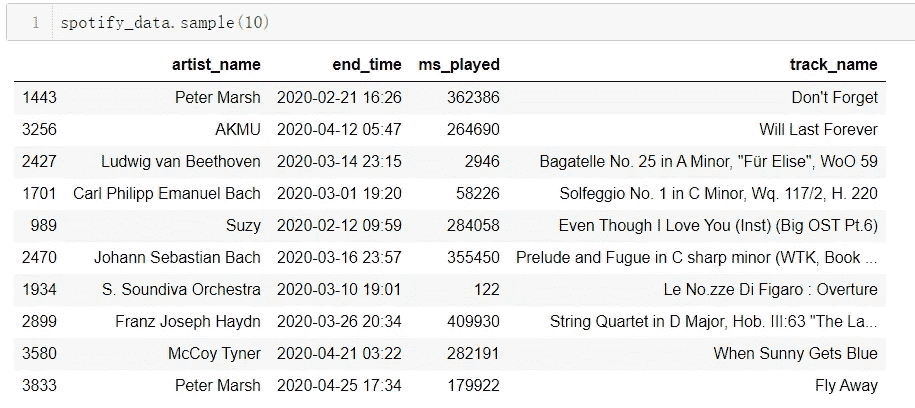

从 Spotify 帐户下载的流媒体历史数据的示例视图

## I.2 从 Spotify APIs 检索您的流媒体历史记录的曲目功能

上述步骤仅提供了有限的流媒体历史信息，其他曲目信息不包括在内，例如，[Echo Nest](https://techcrunch.com/2014/10/19/the-sonic-mad-scientists/)(Spotify 拥有)计算的[流行度、模式、基调和其他特征](https://developer.spotify.com/discover/#:~:text=With%20the%20Spotify%20Developer%20Platform,beats%2C%20pitches%2C%20and%20more.)。

Spotify Web APIs 出现了，它允许用户搜索歌曲、艺术家和播放列表，设置元数据功能。

首先，在[开发者仪表盘](https://developer.spotify.com/dashboard/applications)中注册你的应用。注册后可以看到你的 *ClientID 和客户端秘密*(如图 1 截图)*。*接下来，转到网页右上角的‘编辑设置’，然后*重定向 URIs***=**[http://localhost:7777/callback。](http://localhost:7777/callback.)保存设置，我们完成了先决条件设置，然后可以检索数据。

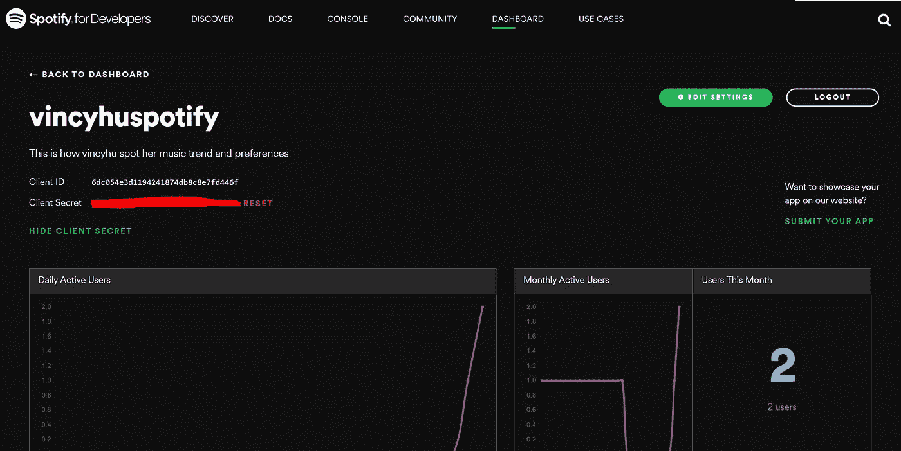

图一。你自己的 Spotify 应用截图

然后我们使用 python 包 *Spotipy* 连接到 web APIs。函数从 *spotipy.util* 发送我们的*客户端 ID* 和*客户端秘密*给 Spotify，Spotify 会通过提示授权窗口返回令牌。跟随它，使用您的 Spotify 凭据登录，并粘贴提示控制台中重定向到的任何链接(这将是一个无效页面)。

那么你的令牌将被存储在变量*令牌中。*打印出来，回顾一下你得到了什么！

获取 track_id，Spotify 中某首曲目的唯一标识符。Spotify API 还提供了描述歌曲特征的多个维度的[歌曲特征](https://developer.spotify.com/documentation/web-api/reference/tracks/get-several-audio-features/)。让我们稍微了解一些特性吧！
**声学:**一个衡量音轨是否声学的指标(0 到 1)。1.0 表示音轨是声学的高置信度。
**dance ability:**dance ability(0 到 1)描述歌曲是否适合跳舞，它结合了包括拍子、节奏稳定性、拍子力度等元素。值=1 非常适合跳舞。
**能量**:能量(0 到 1)衡量歌曲的速度、音量和嘈杂程度。
**乐器性:**一个度量(0 到 1)表示一个音轨是否不包含人声。对于一个纯器乐宋立科一个没有任何声乐的古典钢琴杰作，指数将接近 1。
**响度:**一个音轨的指数，单位为分贝(dB)。该值通常介于-60 和 0 dB 之间。
**模式:**该特征表示音轨的音阶(大调或小调)。大调用 1 表示，小调用 0 表示。通常情况下，大音阶的音乐作品更明亮，而小音阶的音乐作品更模糊/暗淡。
**价:**这是一个有趣的衡量标准(0 到 1)，描述了一条赛道的积极程度。一个曲目越快乐欢快，数值越高。

砰！现在，我们拥有了 Spotify 流媒体历史的所有功能！

## I.3 检索我自己创建的播放列表和功能

除了可能会偶然播放大量歌曲的流媒体历史记录之外，播放列表中的歌曲也由我固定，我根据不同的心情或不同的目的对它们进行了分类。Spotify APIs 还允许用户检索播放列表记录，我们将检索我的播放列表中所有曲目的功能，就像我在上一节中所做的那样。(请看我在 [Github](https://github.com/VincyHu/MusicForYou) 中的代码！)

砰！现在，我们既有完整的流媒体历史数据，也有我的播放列表。

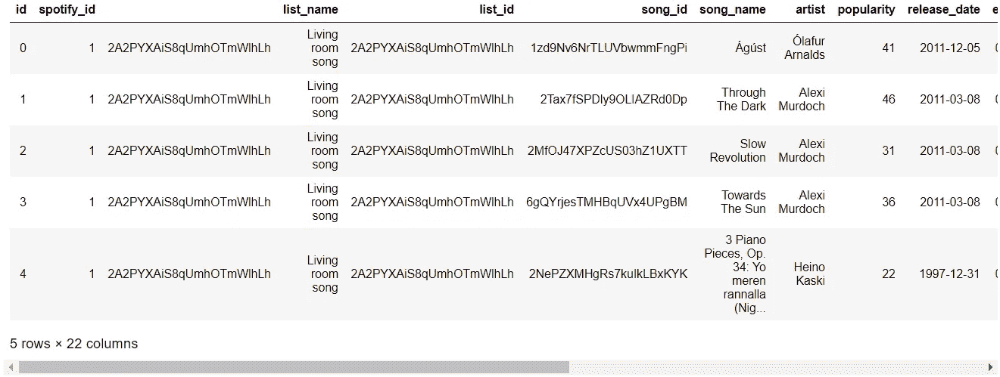

播放列表曲目的结果数据帧

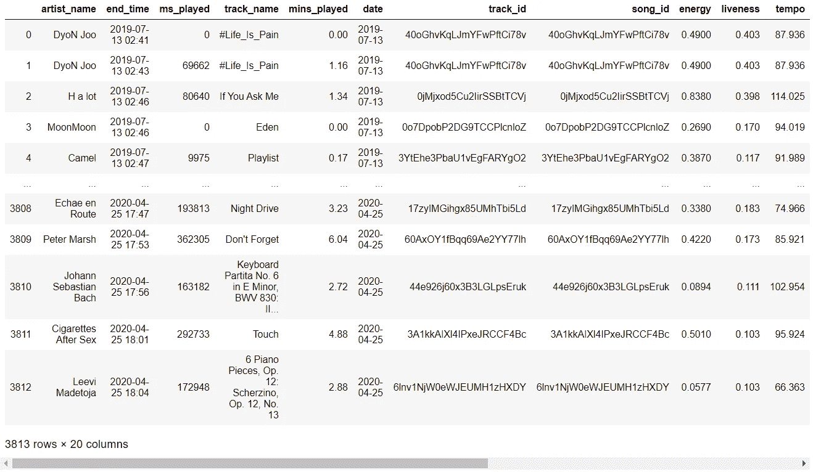

流式历史曲目的结果数据帧

# 第二部分。可视化我的流媒体习惯和音乐偏好

到目前为止，我们应该已经准备好了完整的数据表。在这一部分，我将展示探索性分析如何帮助我进一步了解我喜欢什么音乐。

## 我多久听一次音乐？

我经常告诉人们我离不开音乐，我每天都在听…但是我做到了吗？下面的热图日历剧情告诉我真相:不，我没有！(蓝色方块越深，那天我播放音乐的时间越长。2019 年的大片空白是因为我在转投 Spotify 之前是 Apple music 用户。)根据热图，我每周大约有一天不听音乐。

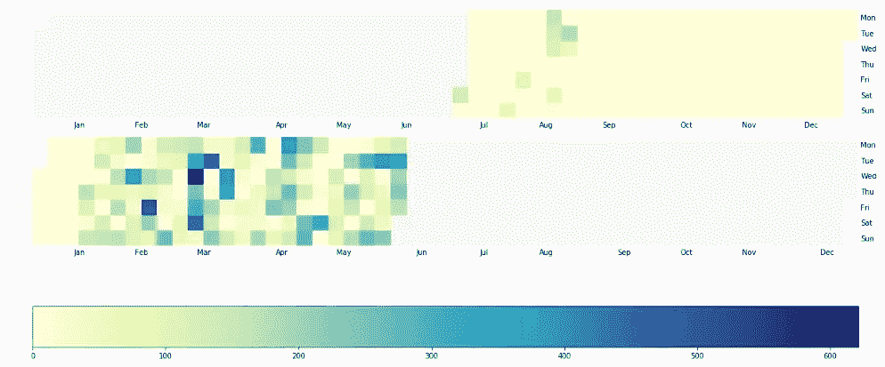

## 我最喜欢的歌手和歌曲

*麦克·艾尔斯、* *两度*和*约翰·梅耶*是我播放列表中的前三位艺术家。Twice 是韩国流行音乐中的顶级组合之一，约翰·梅耶是美国著名的歌手兼作曲家、吉他手和唱片制作人。等等，谁是麦克·艾尔斯？我甚至不知道麦克·艾尔斯是谁！经过审查，我知道 Mac 是一个美国 R & B 歌手兼词曲作者、制作人和多乐器演奏家。我在 *chillnight* 和 *Vlog* 列表中总共添加了 9 首 Mac Ayres 的歌曲，我喜欢它们，因为这些歌曲是冷冻的，并且是蒸汽波风格的。他值得被重视。

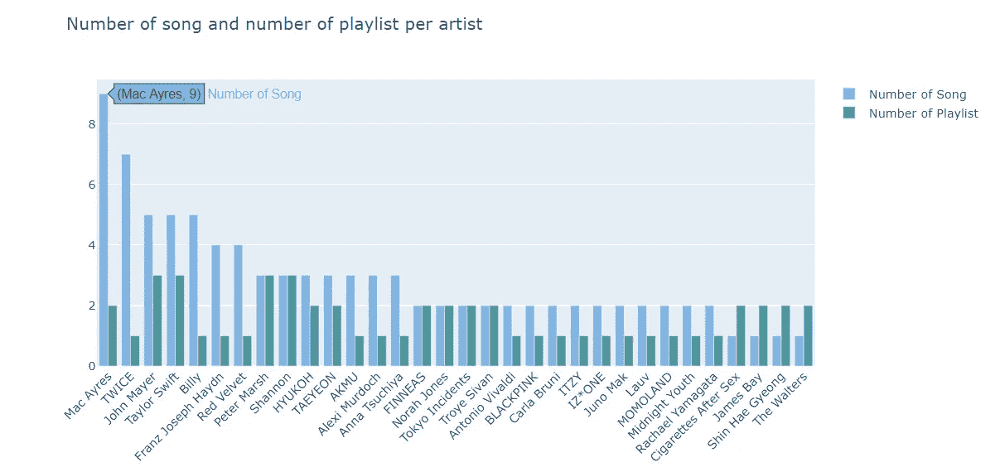

根据流媒体历史，我听了很多古典音乐，大多是巴赫，弗朗兹，德彪西。去年我演奏了 100 多首巴赫的不同作品。表示我大部分时间都是随机播放他的作品，而不是循环重复。相比之下，对于彼得·马什，我花了几乎同样多的时间，但只唱了他的大约 20 首歌。我重复最多的歌曲正是来自彼得·马奇。我已经放了他的*圣诞树*超过 400 分钟，比我放其他歌的时间都多。

根据我这一年来听过的顶级歌曲和顶级艺人，几乎一半都是古典音乐。直到看了数据，我才意识到我对古典音乐如此着迷。

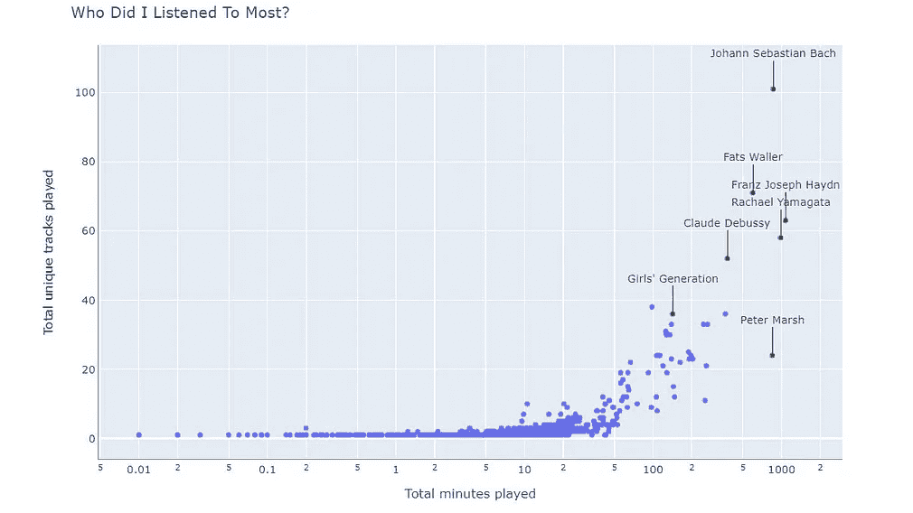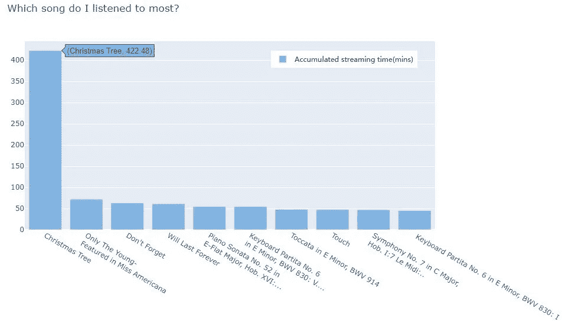

## 我的播放列表的个性

让我们先来探索我的播放列表的个性吧！我有 8 个播放列表，在那里我收集了适合不同心情的音乐:*客厅歌曲*更温和稳定，更适合在我学习或工作时听，因为这些音乐让我平静和放松。相比之下，K-pop 的播放列表则包含了大多数轻快而丰富的韩国流行歌曲，有着吸引人的旋律和非常规的制作。

我检查了雷达图中的以下特征:**声音、舞蹈性、能量、乐器性、响度、平衡**。除了响度，所有其他功能都在 0-1 标度上，因此我首先将响度转换为 0-1 标度。我把每个播放列表都画成了雷达图，以显示和比较列出的功能。图表显示播放列表*客厅歌曲*和*古典音乐*最具音乐性和器乐性，因为这两个播放列表中的大多数歌曲都是纯粹的器乐作品，而 *K-pop* 和*公路旅行*则非常响亮，充满活力。其余四个播放列表相当均衡。

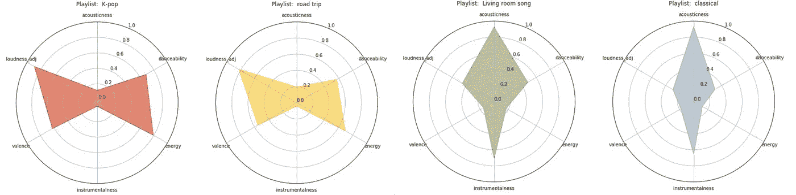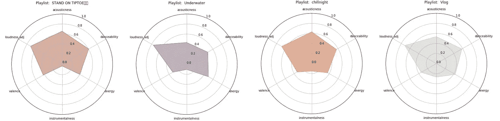

接下来，我们来探究一下**我的播放列表歌曲**有多受欢迎。通过流行指数的箱线图，我可以看出我播放列表中的大多数歌曲都是 50-60 流行度的。榜单 *K-pop* 最受欢迎，*古典*最不受欢迎。这是很合理的，因为现在人们很少关注古典音乐，除非这首曲子非常有名。名单*寒夜*和*踮起脚尖*💫在流行度分数方面具有稀疏分布。最高人气略高于 80，说明我好像不是“热门”歌曲的粉丝。

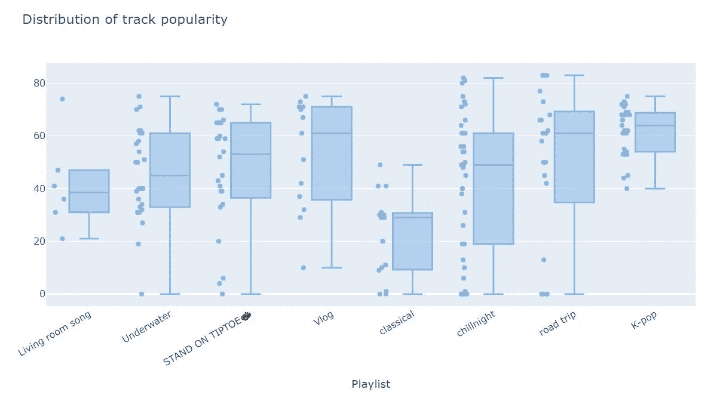

**键**和**模式**是轨道的两个基本特征。不同调的音乐有不同的风格，但微小的差异只有专业的音乐人才能识别。然而，大调和小调模式更容易识别:大调音阶通常更明亮或欢快，而小调听起来更忧郁和悲伤。看看这个 [Youtube 视频](https://www.youtube.com/watch?v=it43JQy136I)与样本音频有更直接的联系。根据下图，我可以看出我更喜欢大调模式而不是小调模式。我喜欢让我开心，点亮我生活的歌！

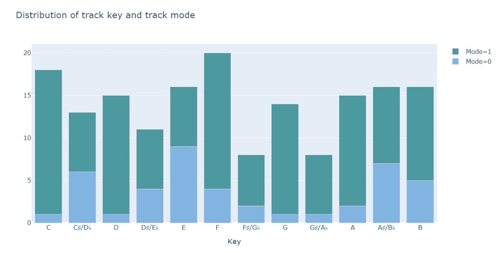

## 让价指数代表我的心情。

Spotify 计算的价指数表明一首歌有多快乐或悲伤，这有助于我跟踪我的情绪。我用误差棒图来表示每天的平均价和价的方差。下图显示了我在 3 月上半月和 5 月的心情似乎并不好。嗯嗯，正好是我硕士项目两个季度的期末考试阶段，真的很忙，压力很大。那就很有道理了！

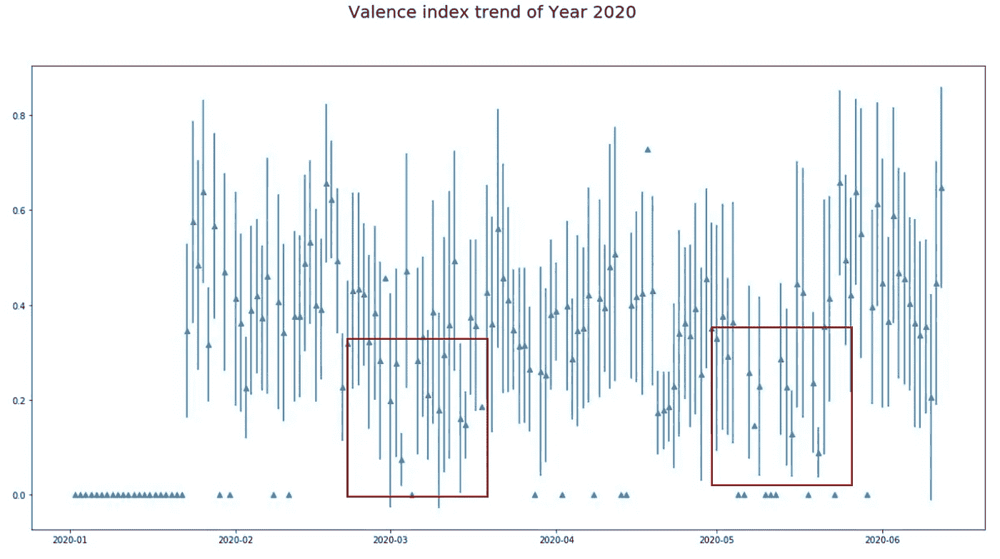

## 结论

通过可视化我的播放列表曲目和流媒体历史，我更彻底地了解了我喜欢的音乐，甚至对不看数据永远不会知道的事实感到惊讶。如果你也对你正在听的音乐感兴趣，试着建立你的探索。欢迎来到 Spotify 中的[与我联系](https://open.spotify.com/user/aujpv9lfhoctyrmyo8kpew77w)！

## **参考文献**

[1] Santos，J. D. [我的 Spotify 音乐无聊吗？涉及音乐、数据和机器学习的分析](/is-my-spotify-music-boring-an-analysis-involving-music-data-and-machine-learning-47550ae931de) (2017)

[2]Spotify for Developers:Reference，[获取多首曲目的音频功能](https://developer.spotify.com/documentation/web-api/reference/tracks/get-several-audio-features/)

这是我第一个与音乐有关的博客。接下来，我将进一步探索其他主题和工具(例如，在我无聊时倒出我可能喜欢的音乐的音乐推荐工具，或使人们能够听我的流媒体音乐的同步流媒体工具)。有兴趣的话，随时联系我 [Linkedin](https://linkedin.com/in/wenqing-vincy-hu) ！