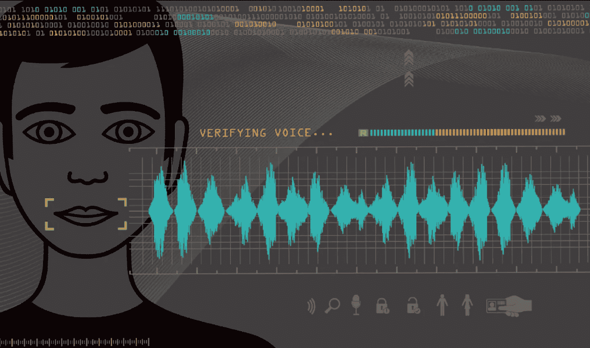

# 基于神经网络的语音分类

> 原文：<https://towardsdatascience.com/voice-classification-with-neural-networks-ff90f94358ec?source=collection_archive---------8----------------------->

## *使用 python 对说话人和说话人性别进行神经网络分类*

Si-Gal/Getty Images 在 [searchmobilecomputing](https://searchmobilecomputing.techtarget.com/photostory/450428625/Get-personal-with-mobile-biometric-authentication/5/Get-in-tune-with-voice-recognition-authentication) 拍摄的照片

想象一个正在开会的会议室。有几个人，他们都轮流发言。我们想记下他们所说的话。有一些工具可以将语音转换为文本(我们大多数人的手机上都有这个功能，但我们甚至不知道它)，但我们可以训练一个模型来学习语音，并通过听他们的声音来准确预测谁在说话吗？我们能预测他们的性别吗？

我们将通过使用带有神经网络的机器学习来解决这些问题。

## 项目概述

第一步是学习如何处理音频数据和建立声音分类模型。我发现一个很棒的比赛叫做城市声音分类[这里](https://datahack.analyticsvidhya.com/contest/practice-problem-urban-sound-classification/) **。问题是对 10 种不同的城市声音进行分类，如儿童玩耍、街头音乐、汽车引擎声等。我做了很多研究来了解如何解决这个问题，以及很多人是如何解决这个问题的。我主要关注两种方法。第一种方法是使用 python 的 librosa 库从音频剪辑中提取数字特征，并使用这些特征来训练神经网络模型(NN)，第二种方法是将音频剪辑转换为图片，并使用这些图像来训练卷积神经网络模型(CNN)。**

我在神经网络(93%的测试数据)和 CNN (92%的测试数据)上得到了很好的结果。我通过加入预测的概率将这两个模型结合在一个投票分类器中，当同时使用神经网络和 CNN 时，获得了 95%的准确率。

现在我可以继续前进，用我学到的知识来解决说话者和说话者的性别分类问题。

我用神经网络模型对 115 个说话人进行分类，得到了 99.8%的准确率。因为神经网络模型的高精度(几乎完美),我不再做 CNN 了。

我使用神经网络模型来预测性别，并在对该模型之前听过的发言者的性别进行分类时获得了 99.8%的准确率。我从扬声器中获得了模型从未听过的新数据，并获得了 95%的准确率。

我还使用了 CNN 模型来预测性别，并获得了 97.7%的准确率(相比之下，NN 模型的准确率为 99.8%)。我对从未听过的扬声器有 95%的准确率。

现在让我们更深入地了解每个不同的项目。

# 城市声音挑战

## *前馈神经网络*

我从比赛的网站上找到了数据的链接。他们在谷歌硬盘里[这里](https://drive.google.com/drive/folders/0By0bAi7hOBAFUHVXd1JCN3MwTEU)。我只使用训练数据，因为我想测试标签数据，看看我的模型有多好。来自源的测试数据是未标记的，并且仅用于为竞赛提交的预测。

该数据包含来自 10 个不同类别的 5435 个标记声音。这些课程是警笛、街头音乐、钻孔、发动机空转、空调、汽车喇叭、狗叫、钻孔、枪击和手提钻。大多数班级是平衡的，但是有两个班级代表性很低。大多数代表 11%的数据，但一个只代表 5%，一个只代表 4%。我没有平衡这些类，因为我把用有些不平衡的类构建一个好的模型当作一个很好的挑战。

Librosa 是一个很棒的 python 库，可以用来处理音频文件，也是大多数人在音频分类问题中使用的库。我用 librosa 库提取特征。在做了一些研究后，我从 librosa 信息[这里](https://librosa.org/doc/latest/feature.html)发现了一些特征。

我将训练数据附带的 csv 文件加载到一个数据帧中，该数据帧包含所有音频文件的名称及其对应的标签。我通过一个函数提取了这些特征，这个函数遍历数据帧的每一行，通过读取文件的路径来访问计算机中的文件。我使用了梅尔频率倒谱系数(MFCCs)、色谱图、梅尔标度谱图、光谱对比度和音调质心特征(tonnetz)。我得到了一个包含 193 个特征及其各自标签的数组。我将它们设置为我的 X 和 y，并将其分为训练、验证和测试数据。我检查了是否保持了与总数据相同的类比例，并对数据进行了缩放。我选择 3435 个音频作为我的训练数据，1000 个音频作为我的验证数据，1000 个音频作为我的测试数据。

我使用 relu 和 softmax 为 10 个输出建立了一个具有两个隐藏层的密集层的前馈神经网络。然后，我使用 adam 优化器和损失分类交叉熵来编译模型。我还搜索了神经元数量和各层脱落比例的最佳参数，并提出了一个不错的模型，该模型预测了我的测试中从未见过(或听过)的数据，准确率为 93%。

## 卷积神经网络

使用与上面相同的数据和步骤，我为音频文件生成了数据帧。现在我需要使用一个函数来为每个音频文件创建图像。和以前一样，我的函数遍历了 dataframe 的每一行，并使用 librosa 创建了一个图像，并将其保存到本地文件夹中。以下是关于如何从 librosa 创建图像的信息，以及您可以创建的不同类型的图像: [Specshow from librosa](https://librosa.org/doc/latest/generated/librosa.display.specshow.html) 。

创建图像后，我再次分割我的数据介绍训练，验证和测试(我使用了与之前神经网络相同的比例)。我检查了我在类上有相同的平衡，并把 dataframe 文件名从。wav to。jpg，这样我就可以使用相同的数据帧来访问本地文件夹中的图像。

Keras 提供了一些关于如何从本地文件加载和预处理图像的精彩信息，特别是。我用的是 flow_from_dataframe。这里的文档是。这样，我将我的训练、验证和测试数据加载到生成器中，并准备好构建模型。

我用一个 Conv2D 和 MaxPooling2D 输入和五个隐藏层构建了一个卷积神经网络:三个 Conv2D 和它们各自的 MaxPooling2D，然后是 flatten 和两个密集层(都用 relu)。最后，我用 softmax 激活了 10 个类的密集输出层。我再次使用 adam 优化器和分类交叉熵来编译模型。我没有使用 gridsearch，因为它花费的时间太长(大约两个小时)，所以我训练了 250 个纪元。我从未见过的测试数据有 92%的准确率。

## 投票分类器

我决定，既然我有两个做同样事情的模型，我不妨一起使用它们。我从我的神经网络和 CNN 得到了每一类的预测概率，把它们加在一起，得到了每一类的最大值。换句话说，如果我的神经网络 65%确定一个声音是一些孩子在玩，而我的 CNN 95%确定是街头音乐，那么街头音乐的概率会更高，因此我的预测是街头音乐。我这样做了，在从未见过的测试数据上，我的预测准确率达到了 95%(记得我对神经网络的准确率是 93%，对 CNN 的准确率是 92%)。我发现这是一种将不同的模型结合起来进行更好预测的惊人方法。

# 说话人分类器

现在我有了解决我最初的问题的工具，这个问题就是对说话者进行分类。第一个问题是获得好的音频数据。经过大量的研究，我发现了一个绝对惊人的数据库，里面有有声读物录音的音频剪辑。该数据集包含许多千兆字节的干净数据。flac”文件，非常适合 MAC 电脑。我使用了 train-clean-100.tar.gz[6.3G]的一个子集。这些数据按照演讲者的 id、书籍、章节和文件编号很好地组织在文件夹中。我也得了一个”。txt”文件中的信息，让你知道他们的性别，他们的录音长度，甚至他们的名字。我使用的子集有 13000 个语音剪辑，通常从 12 秒到 18 秒不等。

我尝试了前馈神经网络，因为它速度更快，给了我更好的城市声音挑战问题的准确性。我按照以前相同的步骤，只是现在处理更多的数据(大约 13k 而不是 5k)和更长的语音剪辑(平均大约 14 秒而不是 4 秒)。提取特性需要大约 3 个小时，但只需要做一次，我将该数组作为 numpy 数组保存在本地文件夹中，并在需要使用它或更改任何内容时加载它。

我使用了 115 个不同的演讲者，包括男性和女性，其中每个演讲者的最小语音剪辑数为 56，最大为 166(随机选择)。每个扬声器的剪辑数量的标准偏差约为 16。我认为他们是平衡的阶级。

我将数据放入一个神经网络模型中，该模型与我在城市声音挑战赛中的 gridsearched 模型具有相同的配置，并获得了高达 99.8%的准确率。我预测了 1312 个音频样本，并将它们分类到 115 个扬声器中，只有两个音频样本是错误的。这个模型只花了 20 秒来拟合，它几乎是完美的，所以我决定没有必要做 CNN 的模型。

# 说话者性别分类器

使用与说话者分类器相同的数据量，我通过将声音片段放入两个独立的文件夹中，按男性和女性对它们进行标记。我从每个文件夹中生成数据帧，然后将它们连接(放在一起的奇特术语)成一个数据帧。我打乱了数据，重新设置了索引，得到了一个全新的数据框架，包含了所有标注了性别数据的文件。

我使用了与城市声音挑战 NN 模型相同的分割和提取相同的特征。我使用了来自我的前馈神经网络的相同配置，同样，它只花了 20 秒来拟合模型。我的测试数据准确率达到了 99.8%。尽管我的模型从未看过(或听过)我的测试数据，但它已经用包含相同人说话的数据进行了训练，这就是为什么我的模型几乎是完美的。我教模型哪个说话者是男性和女性，当我预测新的语音剪辑时，它几乎是完美的，因为它已经知道这些人了。考虑到这一点，我收集了更多的数据。我从新人那里收集了 100 个新的声音片段，这些人是我的模型从未听过的。我用同样的方法清理了它，并对它进行了预测。我从 100 个从未听过的说话者那里获得了 97%的新测试数据。

我有一个很好的模型，但它不像说话人分类器的模型那样几乎完美，所以我决定做一个 CNN，看看我是否可以改善我的结果。

就像在城市声音分类器问题中一样，我从我的数据中创建了图像，并将其标记和放置到本地文件夹中。我创建了数据帧，并使用我的函数在不同的文件夹中创建图像，以便与 Keras 生成器一起使用。因为我处理的是语音，所以我降低了音频剪辑图像的频率，只包括 50 赫兹到 280 赫兹的频率。“一个典型的成年男性的浊音语音将具有 85 至 180 Hz 的基频，一个典型的成年女性的浊音语音将具有 165 至 255 Hz 的基频”(来自[维基百科](https://en.wikipedia.org/wiki/Voice_frequency) [)](https://en.wikipedia.org/wiki/Voice_frequency).) 。我再次使用与之前相同的 CNN 配置，并拟合模型(花了几个小时)。我的测试数据有 97.7%的准确率。请记住，我用简单的密集前馈神经网络获得了 99.8%的测试数据准确性，因此这有点令人失望。我又一次对 100 个从未听过的新说话者进行了预测，准确率达到了 95%。

我可以将这两个模型与投票分类器结合起来，获得更好的准确性，或者用更多的数据训练模型，使它们更准确，但我有时间限制来展示我的项目，我想实现这个模型，以便能够将其用于交互式演示，而 CNN 模型的过程需要太长时间。创建图像和拟合模型需要很长时间，所以我使用了准确率为 97%的神经网络，因为它既快又准确。

# 未来探索:

我想在我的 CNN 上搜索最佳参数，看看我是否能获得与我的密集分层神经网络相同或更好的准确性。这也可以通过上传数据和使用 Google Colab 来完成，因为他们提供免费的 GPU 使用，使神经网络运行得更快。如果你的笔记本电脑需要 4 个小时来适应一个神经网络，谷歌 Colab 可能在 15 分钟内完成。如果 Google Colab 听起来很有趣，我推荐阅读我的朋友兼同事布兰达·哈利关于 Google Colab 的 [**这篇**](/google-colab-jupyter-lab-on-steroids-perfect-for-deep-learning-cdddc174d77a) 博文。

我还想用 librosa 从音频文件中提供的所有不同类型的图像来尝试 CNN 模型，看看哪种图像给出了更好的预测。

我想添加更多的训练数据，看看我是否可以在说话人的性别分类器中获得更好的结果。我不得不手工标记数据，这非常耗时。有了更多的数据，我大概可以有更精确的模型。

我还想拟合一个递归神经网络，看看它有多准确，因为它们擅长处理时间序列数据，语音剪辑基本上是时间序列。

# 密码

jupyter 笔记本中整个项目的代码可以在我的 [github](https://github.com/jurgenarias/Portfolio/tree/master/Voice%20Classification) 上获得。

# 来源:

图片:

Si-Gal/Getty Images，[searchmobilecomputing.techtarget.com](https://searchmobilecomputing.techtarget.com/photostory/450428625/Get-personal-with-mobile-biometric-authentication/5/Get-in-tune-with-voice-recognition-authentication)

数据集:

[http://www.openslr.org/12/](http://www.openslr.org/12/)

[https://drive . Google . com/drive/folders/0 by 0 Bai 7 hobafuhvxd 1 jcn 3 MWT eu。](https://drive.google.com/drive/folders/0By0bAi7hOBAFUHVXd1JCN3MwTEU.)

文章和有用的链接:

[1]大卫·卡斯帕，亚历山大·贝利，帕特里克·富勒， [Librosa:一个 Python 音频库(2019)](https://medium.com/@patrickbfuller/librosa-a-python-audio-libary-60014eeaccfb)

[2] Rami S. Alkhawaldeh，[DGR:使用一维常规神经网络的人类语音性别识别](https://www.hindawi.com/journals/sp/2019/7213717/) (2019)

[3]科里·贝克尔，[使用机器学习识别声音的性别](http://www.primaryobjects.com/2016/06/22/identifying-the-gender-of-a-voice-using-machine-learning/) (2016)

[4] [乔纳森·巴拉班](https://towardsdatascience.com/@ultimatist?source=post_page-----1ef708ec5f53----------------------)，[深度学习技巧和窍门](/deep-learning-tips-and-tricks-1ef708ec5f53) (2018)

[5] [Youness Mansar](https://medium.com/@CVxTz?source=post_page-----b0a4fce8f6c----------------------) ，[音频分类:一种卷积神经网络方法](https://medium.com/@CVxTz/audio-classification-a-convolutional-neural-network-approach-b0a4fce8f6c) (2018)

[6] [Faizan Shaik](https://www.analyticsvidhya.com/blog/author/jalfaizy/) h，[使用深度学习开始音频数据分析(附案例研究)](https://www.analyticsvidhya.com/blog/2017/08/audio-voice-processing-deep-learning/) (2017)

[7] [Mike Smales](https://medium.com/@mikesmales?source=post_page-----8bc2aa1990b7----------------------) ，[利用深度学习进行声音分类](https://medium.com/@mikesmales/sound-classification-using-deep-learning-8bc2aa1990b7)，(2019)

[8] [Aaqib Saeed](http://aqibsaeed.github.io/) ，[城市声音分类，第 1 部分](http://aqibsaeed.github.io/2016-09-03-urban-sound-classification-part-1/)，(2016)

[9] Marc Palet Gual，[使用运行在 FPGA 上的深度神经网络进行声音性别识别](https://upcommons.upc.edu/bitstream/handle/2117/86673/113166.pdf)，【2016】

[10] [Kamil Ciemniewski](https://www.endpoint.com/team/kamil_ciemniewski) ，[在 TensorFlow](https://www.endpoint.com/blog/2019/01/08/speech-recognition-with-tensorflow) ，【2019】中使用扩展卷积和 CTC 从零开始进行语音识别

[11] [Admond Lee](https://towardsdatascience.com/@admond1994?source=post_page-----81d0fe3cea9a----------------------) ，[如何用 Python 构建语音识别机器人](/how-to-build-a-speech-recognition-bot-with-python-81d0fe3cea9a) (2019)

[12] [阿德里安·易捷·许](https://medium.com/@adrianitsaxu?source=post_page-----486e92785df4----------------------)，[利用卷积神经网络和 Keras 进行城市声音分类:理论与实现](https://medium.com/gradientcrescent/urban-sound-classification-using-convolutional-neural-networks-with-keras-theory-and-486e92785df4)，(2019)

[13]塞纳特·阿达帕，K .[阿格尔自由声音音频标记](https://github.com/sainathadapa/kaggle-freesound-audio-tagging) (2018)

【14】[歌词特征提取](https://librosa.github.io/librosa/0.6.0/feature.html)

【15】[Librosa 显示 Specshow](https://librosa.github.io/librosa/generated/librosa.display.specshow.html)

[16] [Keras 图像预处理](https://keras.io/preprocessing/image/)

[17] [Keras 序贯模型方法](https://keras.io/models/sequential/)