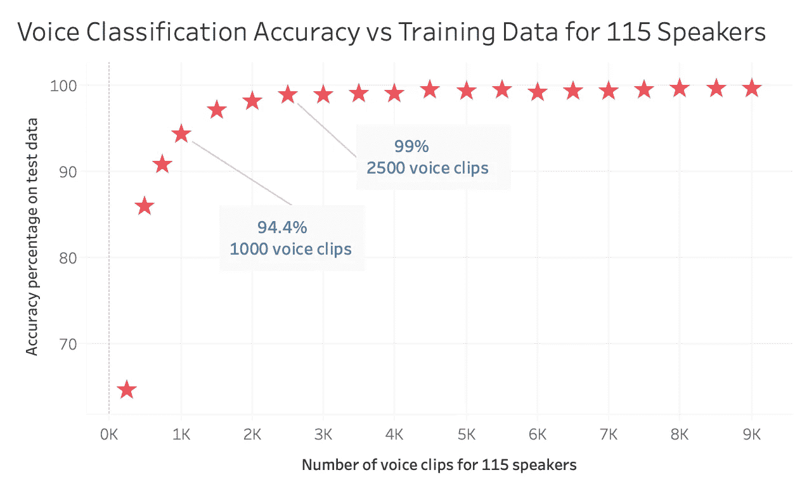
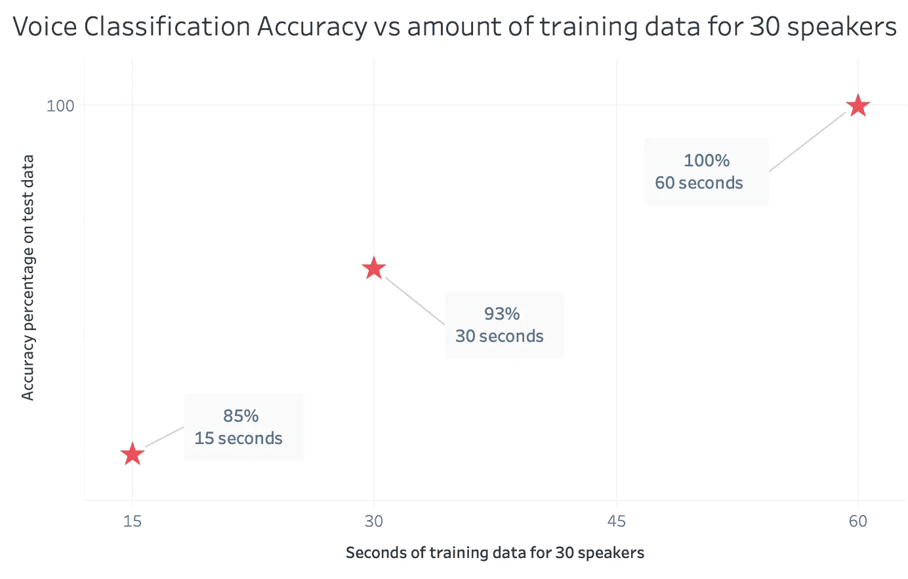

# 用 Python 进行语音分类

> 原文：<https://towardsdatascience.com/voice-classification-with-python-4bec6856d06a?source=collection_archive---------16----------------------->

## 我们需要多少训练数据来识别说话者？

[图片来自 Adobe Stock166291199 由 metamorworks](https://stock.adobe.com/search?filters%5Bcontent_type%3Aphoto%5D=1&filters%5Bcontent_type%3Aillustration%5D=1&filters%5Bcontent_type%3Azip_vector%5D=1&filters%5Bcontent_type%3Avideo%5D=1&filters%5Bcontent_type%3Atemplate%5D=1&filters%5Bcontent_type%3A3d%5D=1&filters%5Bcontent_type%3Aimage%5D=1&filters%5Binclude_stock_enterprise%5D=0&filters%5Bis_editorial%5D=0&order=relevance&safe_search=1&search_page=1&search_type=see-more&limit=100&acp=&aco=speech+recognition&serie_id=166291199&get_facets=0&asset_id=166291199https://stock.adobe.com/search?filters%5Bcontent_type%3Aphoto%5D=1&filters%5Bcontent_type%3Aillustration%5D=1&filters%5Bcontent_type%3Azip_vector%5D=1&filters%5Bcontent_type%3Avideo%5D=1&filters%5Bcontent_type%3Atemplate%5D=1&filters%5Bcontent_type%3A3d%5D=1&filters%5Bcontent_type%3Aimage%5D=1&filters%5Binclude_stock_enterprise%5D=0&filters%5Bis_editorial%5D=0&order=relevance&safe_search=1&search_page=1&search_type=see-more&limit=100&acp=&aco=speech+recognition&serie_id=166291199&get_facets=0&asset_id=166291199)

在我之前的帖子 [*用神经网络进行声音分类*](/voice-classification-with-neural-networks-ff90f94358ec) 中，我解释了如何让 python 只根据声音来识别不同的说话者。对于我的数据，我使用了 115 个不同的扬声器，每个扬声器有 13000 多个 15 秒左右的语音剪辑。也就是说，每个发言人大约需要 28 分钟。我的前馈神经网络给了我 99.8%的测试数据准确率。从逻辑上讲，下一步是弄清楚我们是否真的需要那么多数据来获得一个好的结果。

这个项目的想法来自于尝试用一个可以区分声音并记录谁说了什么的应用程序来转录会议。对于这种用法，115 人可能是多余的。会议通常不会有那么多人发言。我觉得 10 是个更现实的数字。然而，我想更广泛一些，以便捕捉在线会议动态，您可能与一组选定的人进行电话会议，然后与不同的人进行单独的电话会议。如果你想使用相同的转录应用程序，将所有这些声音都放在你的数据集中会很好。考虑到这些因素，我认为 30 人足够了。

就训练数据而言，30 分钟的语音剪辑太多了。例如，当你设置 Siri 学习你的声音时，iPhone 只要求你说五个短语。我的手机已经被其他人语音激活，因此少量数据不是最佳的，但五个短语听起来像是更现实的训练数据量。没有人愿意花 30 分钟来设置一个应用程序。

我开始减少 115 个扬声器的训练数据量，并验证我的神经网络每次运行的准确性。

30 分钟的训练数据是一个巨大的杀伤。当减少训练数据量时，在 2500 个语音剪辑(大约是 5 分钟的训练数据)时，我们仍然获得了 99%的测试数据准确率。之后准确度逐渐下降。正如我们在上面的图表中看到的，在大约 1000 个语音剪辑(大约 2 分钟的训练数据)的情况下，我们仍然获得了 94%的测试数据准确率。这很好。

然而，我真的不在乎有那么多人。因此，我从头开始重做了整个项目。这次我只收集了 30 个人的数据。结果很有收获。

我对每个神经网络运行了三次，并记录了平均准确度(相当于进行了三重交叉验证)，以确保我的准确度分数是可以接受的。当只有 30 个说话者时，我对说话者的声音使用了 60 秒的训练数据，并在测试数据上获得了 100%的准确性。我每人测试了两个剪辑，因此测试了 60 个不同的剪辑。我运行神经网络的三次预测都是正确的。然后我把数据压缩到 30 秒，得到了 93%的准确率。只有 15 秒的训练数据，我得到了 85%的准确率。我发现非常有趣的是，当你改变训练数据或语音剪辑的秒数时，准确率会迅速变化；但是仍然取得了很好的效果。

总之，声音分类是非常有效和可靠的。我们通常在电影中看到的绝密堡垒最著名的密码输入是语音识别、指纹和视网膜扫描。我现在明白为什么语音认证这么可靠了。对于我的下一个项目，我可能会尝试用卷积神经网络建立一个视网膜扫描或虹膜识别分类器，看看这些方法有多准确。

## 密码

我在 Jupyter 笔记本上的项目代码可以在我的 [github](https://github.com/jurgenarias/Portfolio/tree/master/Voice%20Classification) 上找到。

## **消息来源**

尤尔根·阿里亚斯，[用神经网络进行声音分类(2020)](/voice-classification-with-neural-networks-ff90f94358ec)