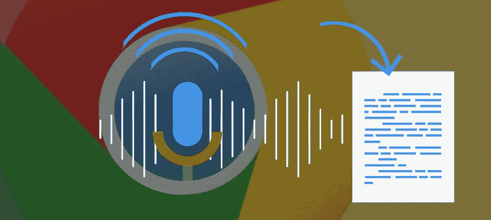
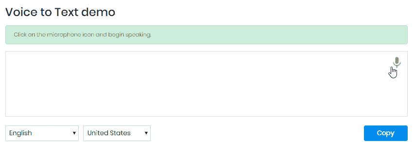
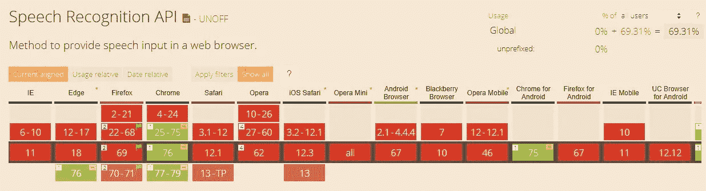
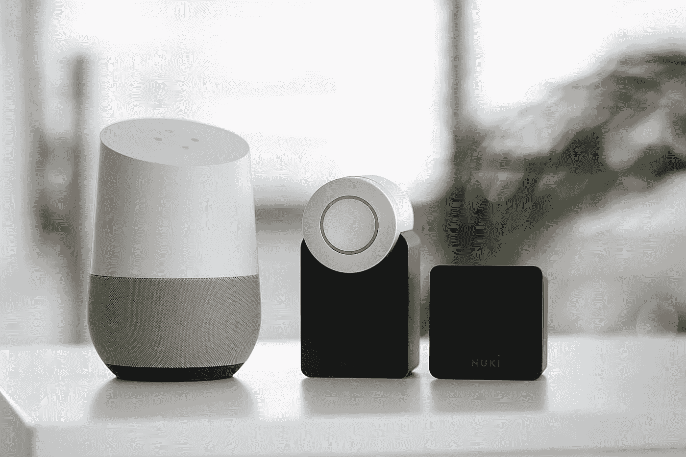

# 使用 Chrome 网络语音 API 将语音转换为文本

> 原文：<https://towardsdatascience.com/voice-to-text-with-chrome-web-speech-api-d98462cb0849?source=collection_archive---------31----------------------->

## 使用谷歌 Chrome 网络语音 API，写邮件的速度比其他人快 10 倍



来源:[bensonruan.com](https://bensonruan.com/voice-to-text-with-chrome-web-speech-api/)

自 2013 年谷歌 Chrome 发布第 25 版以来，对网络语音 API 的支持为网络应用程序将语音转换为文本开辟了一个全新的机会世界。

通过下面的演示，你可以将谷歌 Chrome 用作语音识别应用程序，在不触摸键盘的情况下输入长文档、电子邮件和学校论文。



点击下面的链接亲自尝试一下:

[](https://bensonruan.com/voice-to-text-with-chrome-web-speech-api/) [## 使用 Chrome Web Speech API 的语音转文本- Benson 技术

### 您可以在下面的链接中下载上面演示的完整代码:您可能会想“功能就像…

bensonruan.com](https://bensonruan.com/voice-to-text-with-chrome-web-speech-api/) 

你可能会想“像语音转文本这样的功能实现起来相当复杂。”嗯，如果你从头开始训练语音识别模型，你就对了。但感谢谷歌，他们已经为你做了艰苦的工作，通过利用 Chrome 内置的网络语音 API，你可以将你的 Chrome 浏览器变成语音到文本的应用程序。让我们在下面探索更多的细节。

# 履行

## #步骤 1:检查浏览器支持



来源:[caniuse.com](https://caniuse.com/#search=Speech)

正如你在上面看到的，Chrome 是支持语音到文本 API 的主要浏览器，使用谷歌的语音识别引擎。

你可以通过检查`webkitSpeechRecognition`对象是否存在来判断浏览器是否支持 Web Speech API。

```
if (**'webkitSpeechRecognition'** in window) {
  // speech recognition API supported
} else {
  // speech recognition API not supported
}
```

## #步骤 2:创建语音识别对象

下一步是创建一个新的语音识别对象。

```
recognition = new **webkitSpeechRecognition**();
```

## #步骤 3:注册事件处理程序

语音识别对象有许多属性、方法和事件处理程序。完整名单请参考[https://w3c.github.io/speech-api/#speechreco-section](https://w3c.github.io/speech-api/#speechreco-section)

```
interface SpeechRecognition : EventTarget {
    // recognition parameters
    attribute SpeechGrammarList grammars;
    attribute DOMString lang;
    attribute boolean continuous;
    attribute boolean interimResults;
    attribute unsigned long maxAlternatives;

    // methods to drive the speech interaction
    void start();
    void stop();
    void abort();

    // event methods
    **attribute EventHandler onresult;**
    attribute EventHandler onerror;
    attribute EventHandler onstart;
    attribute EventHandler onend;
};
```

下面我将强调这个应用程序的重要部分。

```
recognition.continuous = true;recognition.interimResults = true;
```

当`recognition.continuous`设置为真时，识别引擎将把你讲话的每一部分都视为一个中间结果。当`recognition.interimResults`设置为真时，应该返回中间结果。

```
**recognition.onresult** = function(event) {
  var interim_transcript = '';
  for (var i = event.resultIndex; i < event.results.length; ++i) {
    **if (event.results[i].isFinal) {
      final_transcript += event.results[i][0].transcript;**
    } else {
      **interim_transcript += event.results[i][0].transcript;**
    }
  }
  final_transcript = capitalize(final_transcript);
  final_span.innerHTML = linebreak(final_transcript);
  interim_span.innerHTML = linebreak(interim_transcript);
};
```

让我们在下面探索一下这个`recognition.onresult`事件，以便更好地理解会返回什么。


`recognition.onresult`事件处理程序返回一个包含以下字段的`SpeechRecognitionEvent`:

*   `event.results[i]`–包含识别结果对象的数组。每个数组元素对应于 **i** 识别台上的一个已识别单词。
*   `event.resultIndex`–当前识别结果指数。
*   `event.results[i][j]`–已识别单词的第 **j** 个备选项。第一个元素是最有可能识别的单词。
*   `event.results[i].isFinal`–显示该结果是最终结果还是临时结果的布尔值。
*   `event.results[i][ j].transcript`–单词的文本表示。
*   `event.results[i][j].confidence`–给定单词正确解码的概率(值从 0 到 1)。

## #第四步:语言选择

Chrome 语音识别支持多种语言，如果您的用户说的不是英语，您可以通过指定语言参数`recognition.lang`来改善他们的结果

```
recognition.lang = select_dialect.value;
```

## #第五步:开始识别

通过调用`recognition.start()`，它激活语音识别器。一旦它开始捕获音频，它就调用`onstart`事件处理程序，然后对于每一组新的结果，它调用`onresult`事件处理程序。

```
$("#start_button").click(function () {
  recognition.lang = select_dialect.value;
  **recognition.start();**
});
```

就是这样！剩下的代码只是为了增强用户体验。它向用户显示一些信息，并交换麦克风按钮上的 GIF 图像。

# GitHub 知识库

您可以通过下面的链接下载上述演示的完整代码:

[](https://github.com/bensonruan/Chrome-Web-Speech-API) [## Benson Ruan/Chrome-Web-Speech-API

### 使用 Google Chrome Web Speech API 的语音转文本 https://Benson Ruan . com/voice-to-Text-with-Chrome-Web-Speech-API/Clone…

github.com](https://github.com/bensonruan/Chrome-Web-Speech-API) 

# 结论



Sebastian Scholz (Nuki) 在 [Unsplash](https://unsplash.com?utm_source=medium&utm_medium=referral) 上拍摄的照片

Web 语音 API 对于语音控制、对话脚本、数据输入非常有用。但目前在各大浏览器中，只有 Chrome 在桌面和安卓手机上支持。很高兴看到将来其他现代浏览器也能支持这个伟大的特性。

感谢您的阅读。如果你喜欢这篇文章，请在脸书或推特上分享。如果你有任何问题，请在评论中告诉我。在 [GitHub](https://github.com/bensonruan/) 和 [Linkedin](https://www.linkedin.com/in/benson-ruan/) 上关注我。