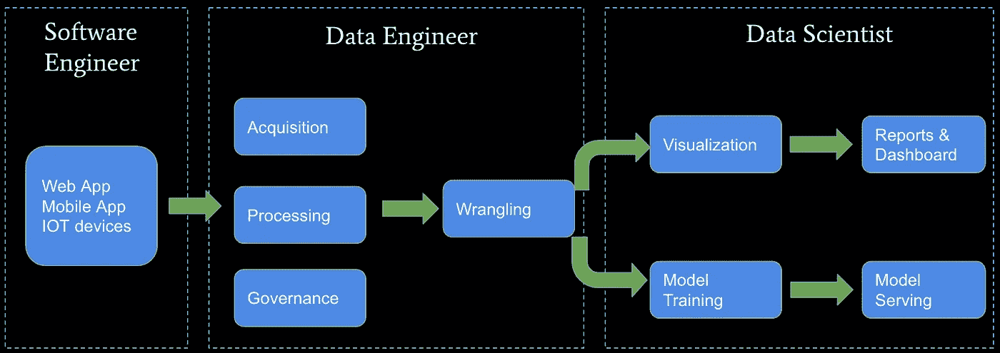
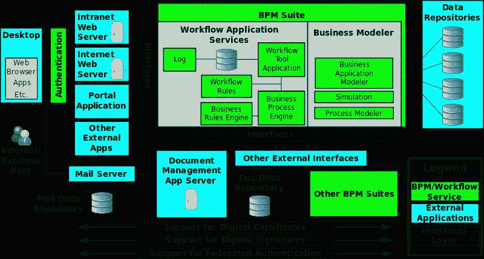
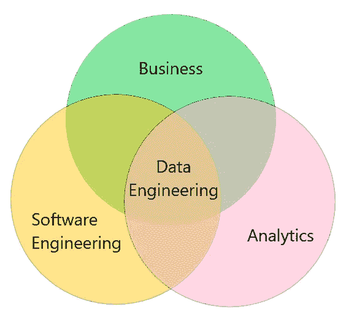

# 为数据工程发声，无名英雄

> 原文：<https://towardsdatascience.com/voicing-for-data-engineering-the-unsung-hero-b91b6ef39dcd?source=collection_archive---------44----------------------->

## 我如何改变策略来帮助企业启动其数据基础设施和报告渠道

[来源](https://blog.jetbrains.com/scala/2019/12/13/data-engineering-and-developer-tools-for-big-data/) : Intellij Scala 插件博客——大数据的数据工程和开发工具，2019 年 12 月，作者 Jeff Zhang

每当“数据科学”或“深度学习”出现在对话中，房间里立即充满了智慧的光环和人们的好奇心，他们想知道你是如何通过使用现代水晶球——一种预测模型——让企业赚了一百万美元。如果您是数据科学家，您不会让他们厌烦花费大量的时间来处理数据，以确保它是干净的、语义正确的，并且格式适合您使用的任何模型。你会跳到最后 20%的工作，开始解释让房间里的人敬畏(和困惑)的数学。

[图片来自 Sanchez，Cruz](https://commons.wikimedia.org/wiki/File:Man_Giving_Toast_at_Banquet_Table_(26080717372).jpg) :让我们听听他的百万美元预测模型

哦，等等，你有没有提到有一个数据工程团队会给你预处理过的数据，你可以相对容易地提取出来？(我的意思是，看看他们疯狂的计划 ETL 工作的队列…我说的对吗？)

不，关键是你已经为公司赚了几百万美元。

好吧，虽然我确信你最有可能是一个体面的数据科学家，因为你有一个由公司决策者选择的模型来继续实施，但我更确信你有一个强大的数据工程团队，能够在第一时间为你提供稳定的各种数据。哦，他们的工作也没有完成。现在，他们有一个全新的项目正在进行中，因为他们和软件工程师需要通过将您的模型与当前系统集成(或为其提供全新的服务)来使其为生产做好准备。

# 我在执行数据工程任务时没有意识到

之前我有一篇[文章概述了如何充分利用数据分析证书计划](https://medium.com/@irishuang527/was-the-data-analytics-certificate-program-at-ryerson-university-really-worth-it-949c2460ee15)。当我完成一个顶点项目时，我遇到的第一个大障碍是导入数据。我做了额外的学习，以了解如何将流行类型的平面文件读入 pandas Dataframe，甚至验证 ping 数据的应用程序接口(API)。花很多时间熟悉数据意味着用映射到正确值的不正确值的字典清理数据，[根据可视化或报告格式](https://cran.r-project.org/web/packages/tidyr/vignettes/tidy-data.html)塑造窄或宽的数据，并调整可视化，以便读者可以理解而不是猜测其中的含义。与我的一些更痴迷于开发预测模型的同学不同，我着迷于为获得用于质量分析的正确数据而投入的策略。

项目结束后，我受雇的两家公司都有同样的动机。他们希望改进他们的业务流程，以便能够利用高质量的数据，并获得有意义的分析结果。他们(以及任何企业)总是对减少管理/手动工作、领先竞争对手一步以及获取秘密以更快提高盈利能力感兴趣。然而，当我开始工作时，我真正的问题是，业务流程是否存在，如果存在，数字化转型[的阻力有多大。](https://www.salesforce.com/ca/products/platform/what-is-digital-transformation/#:~:text=Digital%20transformation%20is%20the%20process,digital%20age%20is%20digital%20transformation.)

[来源](https://commons.wikimedia.org/wiki/File:Business_Process_Modelling_Workflow_Schematic.svg):业务流程建模工作流示意图. svg

也许“业务流程”这个术语对你和对我来说听起来一样模糊。如果我试图根据我的经验来定义它，我相信它是这样的:

> 数字化转换的业务流程将有一个定义和标准化的协议，详细说明数据如何产生(数据收集)、转换(数据管道或通常称为 [ETL](https://en.wikipedia.org/wiki/Extract,_transform,_load) )和消费(数据分析&数据可视化)。

阻碍业务流程数字化的瓶颈通常是在数据收集或数据管道阶段。例如(根据真实故事修改)，如果不同的团队都有报告成本的电子表格的小版本，对您来说，集中他们报告成本的地方是否更有意义，这样您只需要从一个地方收集数据？假设你是一个团队的明星，并且设法集中成本数据，你开始注意到一个团队以与另一个团队完全不同的格式报告成本。这严重影响了您的仪表板对成本报告的可视化。现在，您需要检查将数据发送到仪表板的数据管道，以使这种差异正常化。

# 大多数企业都有大数据的前身——混乱数据

[图片来自《驯服和教育马的艺术》第 184 页](https://www.google.com/url?sa=i&url=https%3A%2F%2Fwww.flickr.com%2Fphotos%2Finternetarchivebookimages%2F14760413391%2F&psig=AOvVaw3w3SkBxWC_D0_cTLbDCvGE&ust=1590971352317000&source=images&cd=vfe&ved=0CA0QjhxqFwoTCPD4ua7s3OkCFQAAAAAdAAAAABAL)(1884 年)

我被聘为分析师，但我患有严重的冒名顶替综合症，因为我认为我没有做足够多的“冷静分析”来推动商业决策(这也是我围绕“数据工程师”这一职位做更多研究的时候，[罗伯特·张](https://medium.com/@rchang)带着他的三部曲，/[P2](https://medium.com/@rchang/a-beginners-guide-to-data-engineering-part-ii-47c4e7cbda71?source=---------8------------------)/[大结局](https://medium.com/@rchang/a-beginners-guide-to-data-engineering-the-series-finale-2cc92ff14b0?source=---------7------------------))。不要管推荐系统背后的尖端机器学习模型，有时甚至很难将没有意义的总体字段放在一起(嗯，请求者可能不知道这一点)或找到数据源。

幸运的是，在后一家公司，他们对转变业务流程的阻力要小得多，所以我不用再去处理成堆的平面文件了。尽管如此，新的挑战开始涌现。我能够通过托管在 [AWS Lambda](https://aws.amazon.com/lambda/) 上的 ETL 脚本来管理 MySQL 数据库中的集中式任务关键型运营数据，而不是平面文件。整个运营使用的许多系统没有集成，所以 MySQL 数据库是桥接数据的旁路。有了这个集中的数据库，我们就可以实现“数据驱动”的要求。对从这个 MySQL 数据库中提取数据的兴趣从一些分析师发展到管理者，他们的决策与数据库中的历史数据或主数据相关。

如果你是一个有经验的工程师，你现在会有很多问题冒出来。首先，这个数据库[是 OLTP 还是 OLAP](https://www.guru99.com/oltp-vs-olap.html) ？连接数量的增长是否会带来任何性能问题？为什么它不能作为 OLAP 并集成系统的后端 OLTP(他们每个人都有一个，对吗？)反而？我们如何保证数据的一致性？

都是非常合理的问题。这是我真正对《气流》作者马克西姆·博奇明(Maxime Beauchemin)写的 [**数据工程师的崛起**](https://www.freecodecamp.org/news/the-rise-of-the-data-engineer-91be18f1e603/) 中的一段话产生共鸣的时候。

> 现代数据仓库是一个比过去更加公开的机构，欢迎数据科学家、分析师和软件工程师参与它的构建和操作。数据对于公司的活动来说太过集中，以至于没有限制哪些角色可以管理它的流动。**虽然这允许扩展以匹配组织的数据需求，但它通常会导致基础架构更加混乱、变形和不完善。**

您使用分配给您的或未被阻止的工作，不可控因素将影响您设计/管理数据生态系统的方式。这家公司大约两年前刚刚成立，我是在它扩张阶段的早期被聘用的。当时，发生了太多事情—公司合并、人员流动、新系统上线、数据集成等。虽然我很兴奋，在某种程度上，这意味着我们可以用新的氛围定义新的业务流程，但这也可能意味着一些现有的伟大业务流程可能会在被记录下来之前丢失，或者如果它不适合公司的路线图。

# 把所有的东西放在一起

退一步说，您会注意到大多数企业在利用大数据工具的力量之前，通常会经历数据管道的演变。大数据、机器学习和人工智能等流行语为分析赢得了大量公众关注。从尖端技术会议到一切如常的办公室，经常缺少的是应用适当的技术来优化业务的当前状态。

作者图片

最后，理解和重新设计业务的整个数据基础设施，对于许多利益相关者来说，将您置于一个极其宝贵的位置。决策者必须向你咨询一份需要从头开始创建的报告。软件工程师将不得不询问您在新部署时对其他数据服务的连锁反应。分析师必须与您一起就如何(多长时间)捕获数据进行头脑风暴，以便他们的分析能够支持业务需求。加分？如果有一天你改变了成为一名数据工程师的想法，你将会对数据和它们的用例了如指掌，以至于你可以相对容易地转换到上面描述的任何角色。