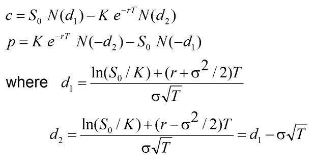
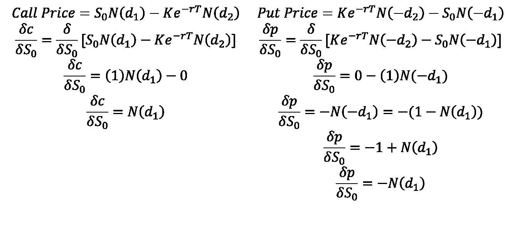

# 波动交易 101

> 原文：<https://towardsdatascience.com/volatility-trading-101-6f934cce5be3?source=collection_archive---------24----------------------->

## delta 对冲的直观指南


[来自 Unsplash 的照片](https://unsplash.com/photos/uksDQT8CfA8)

某大客户欲购买100，000 份 AAPL 看涨期权，参数如下:

*   **成交价格:** 350
*   **现货价格:** 320
*   **隐含波动率:** 30%
*   **无风险利率:** 8%
*   **到期时间:** 1 年

你决定咨询你的团队。

你的团队有研究表明，已实现的波动率将小于期权隐含的波动率，你的目的是从这种价差中获利。然而，他们对 AAPL 的发展方向持有不同的观点。你的任务是构建一个投资组合，以利用潜在的波动性传播，同时减轻方向性风险。

让我们来看看如何实现这一点…

# 布莱克-斯科尔斯方程

1973 年，费希尔·布莱克、迈伦·斯克尔斯和罗伯特·默顿在发表于的*政治经济学杂志的论文 [*【期权定价和公司负债*](https://www.cs.princeton.edu/courses/archive/fall09/cos323/papers/black_scholes73.pdf) 中开发了臭名昭著的布莱克-斯科尔斯期权定价模型。如果你想理解整个推导过程，你可以看[推导布莱克-斯科尔斯模型](https://medium.com/swlh/deriving-the-black-scholes-model-5e518c65d0bc)。这个等式有效地给定了一个执行价格、到期日、波动性和适当的无风险利率的期权定价。*



看涨期权和看跌期权定价的布莱克-斯科尔斯方程

*   **N :** 累积正态分布函数
*   **K** :成交价格
*   **T** :截止时间
*   **r** :无风险利率
*   **S** :标的资产的现货价格
*   **σ** :波动性

本质上，这个等式是一个多变量函数，其中输入 K、T、r、S 和σ产生理论期权价格。因此，它可以对每个变量进行部分微分，以找出每个变量的变化对期权价格的影响，保持所有其他变量不变。

# Delta 对冲

Delta 是部分区分基础资产价格的结果。以下是描述 delta 的函数的推导…



Black-Scholes 方程相对于基础资产的偏导数导致 delta

如果期权是看跌期权，那么 delta 是负数或零:[-1，0]，如果期权是看涨期权，delta 是正数或零:[0，1]。虽然δ的函数是根据累积正态分布函数，但有一个简单的解释。

当基础资产的现货价格增加/减少 1 美元时，保持所有其他变量不变，期权的价值将增加/减少δ。值得注意的是，期权的结算与股票相同，这些由基础资产的增加/减少产生的利润/损失在头寸清算之前是*未实现的*。

由于 delta 告诉我们期权的价值如何随着基础资产价值的变化而变化，我们可以采取抵消头寸来创建一个**风险中性*或 *delta 中性*投资组合。为了构建这个投资组合，我们基于我们的头寸和 delta 的数量，相对于我们的期权头寸采取一个头寸。*

*让我们考虑一个例子:*

*   ***持仓:多头 10 万看涨期权，delta = .7***

**要构建 delta 中性投资组合，做空(100，000)*(.7) = 70，000 股相关资产。**

## *案例 1:*

*基础资产增加 1 美元*

*期权头寸价值减少(100，000)*(. 7)= 70，000 美元*

*基础资产头寸价值减少(70，000)*(-1)=-70，000 美元*

***投资组合价值的净变化= 0 美元***

## *案例二:*

*基础资产减少 1 美元*

*期权头寸减少(100，000)*(. 7)=-70，000 美元*

*股票头寸的价值增加(70，000)*(1)= 70，000 美元*

***投资组合价值的净变化= 0 美元***

*虽然投资组合保持 delta 中性，但标的资产的方向性变动不会改变投资组合的整体价值。这使我们能够利用我们的研究，即隐含波动率将大于实际波动率，而不用担心基础资产价格最终会在哪里。*

*在上面例子的上下文中，我们有了寻找期权 delta 所需的所有参数。我冒昧地用 Python 构建了看涨和看跌期权的类，以帮助定价和计算 delta…*

*使用示例中给定的参数创建了 *EuropeanCall* 类的实例后，我们得到了一个……*

```
*.5469501144776616*
```

*要构建风险中性的投资组合…*

*   ***持仓:做空 10 万 1 年期 350 AAPL 看涨期权，delta = .54695***

**构建 delta 中性投资组合，做多(100，000)*(.54695) = 54，695 股标的资产。**

## *案例 1:*

*AAPL 价格 320 →321*

*期权头寸价值减少(100，000)*(. 54695)=-54，695 美元*

*股票头寸的价值增加了(54，695)*(321–320)= 54，695 美元*

***投资组合价值的净变化= 0 美元***

## *案例二:*

*AAPL 价格 320 →319*

*期权头寸增加(100，000)*(. 54695)= 54，695 美元*

*股票头寸价值减少(54，695)*(319–320)=-54，695 美元*

***投资组合价值的净变化= 0 美元***

*我们有效地构建了一个投资组合，以利用潜在的高估的波动性，同时减轻方向风险。*

# *重新对冲*

*这是风险中性投资组合的一个主要问题，也是为什么我在上面指定了 ***临时*** 。基础资产中的抵消头寸基于非线性函数的线性近似。这意味着随着基础资产的价格进一步偏离我们的初始对冲，当前 delta 和初始 delta 之间的误差会产生方向性风险。为了继续维持风险中性的投资组合，股票头寸必须通过购买或出售股票定期更新，以确保当前 delta 的正确股票数量保留在风险中性头寸的投资组合中。请记住，这一过程不是免费的，当购买/出售股票时，你将受到交易成本的影响，同时(可能)实现一个开放的损益。*

# *想要更多信息？*

*我制作了一个视频来解释这个例子中的波动性交易:*

*一如既往，这个项目的所有代码都可以在我的 [GitHub](https://github.com/RomanMichaelPaolucci/Pricing_Exotic_Options) 上找到。*