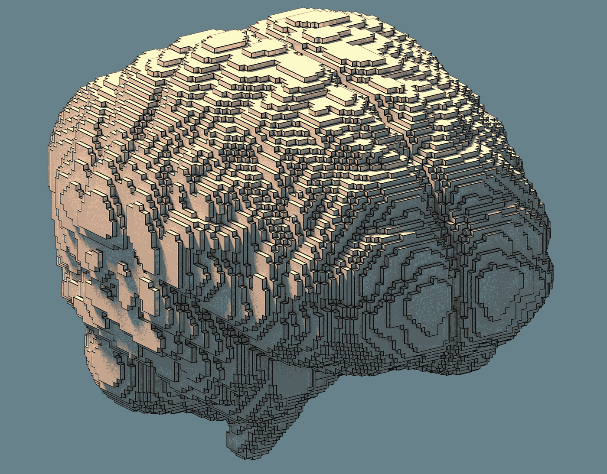
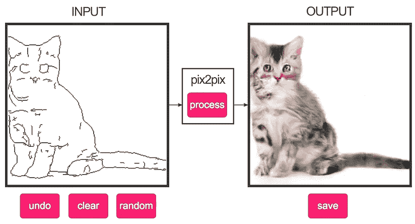
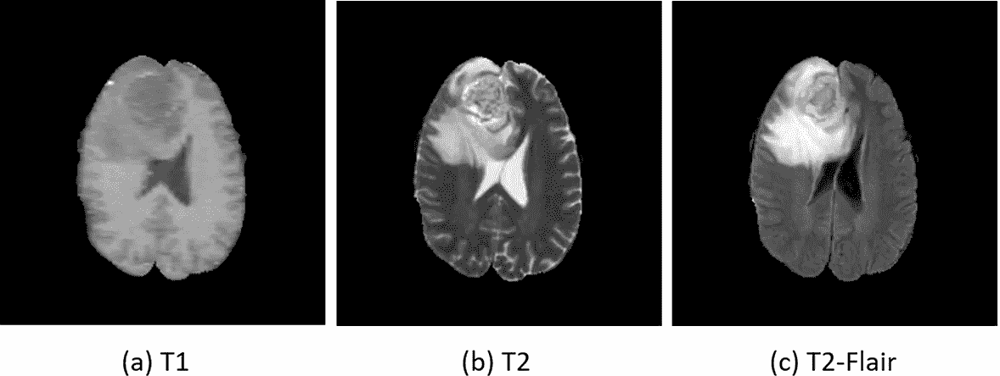
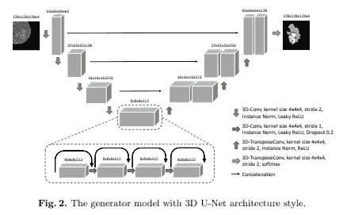
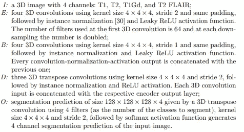

# 基于 Vox2Vox 的体积医学图像分割

> 原文：<https://towardsdatascience.com/volumetric-medical-image-segmentation-with-vox2vox-f5350ed2094f?source=collection_archive---------37----------------------->

## 如何实现用于 CT/ MRI 分割的 3D 体积生成对抗网络

如果你熟悉生成对抗网络(GANs)及其流行变体，Pix2Pix 这个术语应该一点也不陌生。Pix2Pix 是一种执行图像到图像转换的条件 GAN (cGAN)。在医学领域，它们通常用于执行模态翻译，在某些情况下用于器官分割。



“我脑海中的体素”——唐·巴克斯

# Pix2Pix，基础知识

与大多数 gan 类似，Pix2Pix 由单个发生器网络和单个鉴别器网络组成。生成器网络只不过是一个 U-Net，这是一种最初提出用于执行生物医学图像分割的深度卷积神经网络。U-Net 具有以下架构:


弗赖堡大学计算机科学系

U-Net 包含三个主要组件:编码器、瓶颈和解码器。Pix2Pix 的生成器 U-Net 的技术细节包括输入/输出通道的数量、内核大小、步长和填充可以在其[原始论文](https://arxiv.org/pdf/1611.07004.pdf)中找到。简而言之，编码器提供了一种压缩路径，该路径卷积并减少了给定 2D 图像的维度。瓶颈块包含具有跳跃连接的卷积块，并且最终解码器提供扩展路径来升级编码表示。共享相同大小的编码器和解码器层沿着它们的通道连接。如果你有兴趣了解更多关于 U-Net 以及它如何执行图像分割的信息， [Heet Sankesara](https://towardsdatascience.com/@heetsankesara3?source=post_page-----b229b32b4a71----------------------) 有一篇关于它的很棒的[文章](/u-net-b229b32b4a71)。

Pix2Pix 的鉴别器只不过是一个标准的卷积网络，它“鉴别”给定图像是真实的(原始训练数据)还是伪造的(由 U-Net 生成器生成)。Pix2Pix 的训练目标是生成图像和真实图像之间的 L₂/ MSE 损失(对抗损失)和 L₁损失(重建损失)的简单最小最大公式。

Pix2Pix 最早的应用之一就是从图纸生成猫的图片(给各位酷猫和小猫)。然而，它还被扩展到医学成像领域，以执行磁共振(MR)、正电子发射断层扫描(PET)和计算机断层扫描(CT)图像之间的畴转移。



(左)Christopher Hesse 的 Pix2Pix demo(右)杨等的 MRI 跨通道翻译。

对 Pix2Pix 的主要批评之一是它不能在 3D 级别上执行图像到图像的转换。这对许多医学人工智能研究人员来说是一个巨大的障碍，因为医学图像通常是自然的体积。随着图形处理单元(GPU)和深度神经网络设计的进步，研究人员近年来取得了巨大的突破，使他们能够执行体积分割。V-网(U-网的简单 3D 扩展)和密集 V-网是执行 3D 单/多器官分割的常见架构。来自瑞典林雪平大学的 M. Cirillo、D. Abramian 和 A. Eklund 提出了 Pix2Pix 的一种变体，其中他们调用 Vox2Vox 网络以对抗的方式执行分割。这里是[链接](https://arxiv.org/pdf/2003.13653.pdf)到论文。

因为在这篇博文发表时，目前还没有 Vox2Vox 的开源 PyTorch 实现，所以我决定尝试一下。全网实现可以在我的 [**github repo**](https://github.com/enochkan/vox2vox) 找到。还链接到 [**PapersWithCode**](https://paperswithcode.com/paper/vox2vox-3d-gan-for-brain-tumour-segmentation) 以获得更多曝光和反馈。请随意叉，修改我的代码，甚至提交错误修复，只要你给我信用。

# 实现 Vox2Vox

对于这个项目，您将需要以下依赖关系:

*   Python 3.7
*   PyTorch>=0.4.0
*   火炬视觉
*   Matplotlib
*   笨笨，笨笨
*   枕头
*   sci kit-图像
*   Pyvista
*   h5py

克隆存储库后，您可以通过运行以下命令来安装所有需要的库:

```
pip **install** -r **requirements**.**txt**
```

U-Net 生成器的实现可能有点棘手，主要是因为论文的作者没有指定卷积块是如何连接的。我花了好几个小时才得到正确的体积尺寸。



“具有体积卷积和跳跃连接瓶颈块的 3D U-Net 生成器”

然而，以下是体积 U 网生成器的三个主要构建模块。每个块包含一个卷积层、一个归一化层和一个激活层。三个模块:编码器模块、瓶颈模块和解码器模块实现如下:

瓶颈模块和解码器模块都使用级联。然而，瓶颈模块的连接与解码器模块略有不同。如该论文所述，典型瓶颈块的输入是其前一个块的输入和输出的串联。尽管输入和输出的连接是恒定的，但是瓶颈块的输出尺寸应该保持恒定(8x8x8x512)。另一方面，解码器块的输出被连接到它们各自的编码器块的输出。



“Vox2Vox 的模型架构”——m . ci rillo、D. Abramian 和 A. Eklund

有了模型架构描述，用我们之前创建的三个基本块来实现 U-Net 生成器就非常简单了:

鉴别器的实现非常简单，因为它包含与发生器相同的体积编码器模块。事实上，你可以用任何你想要的鉴别器架构来训练。只要确保你在训练中注意发电机和鉴别器之间的平衡。通过调整初始学习率和设置鉴别器的精度阈值，您可以通过试错法轻松平衡两个网络。3DGAN 的作者在他们最初的 3DGAN 论文中提供了许多关于容量 GAN 的平衡和稳定训练的有用建议。

Vox2Vox 实现的另一个重要部分是它的损失函数。与 Pix2Pix 类似，Vox2Vox 的损失可以分解为对抗性损失(MSE 损失)和重构损失(广义骰子损失)。在 PyTorch 中，*标准*类似于损失函数。因此， *criterion_GAN* 表示对抗损失，而 *criterion_voxelwise* 表示重建损失。发电机损耗的计算包含一个可调参数*λ*，它控制对抗损耗和重建损耗之间的比率。以下是发生器和鉴别器训练期间损失函数的实现:

# 广义骰子损失

在医学图像分割中，一种常用的损失函数是广义 dice 损失。索伦森 Dice 系数通常用于评估两个样本之间的相似性，其公式如下:


TP 代表真阳性，FP 代表假阳性，FN 代表假阴性。骰子系数通常在 0 到 1 之间，1 代表两个给定样本之间的完美匹配。广义骰子损失是骰子分数的简单修改，以提供深度学习训练期间最小化的损失函数。下面是我的 PyTorch 实现的广义骰子损失:

虽然我有可能一行一行地检查我的代码的其余部分，但是我将把它留给您来通读和理解我的实现。通读原文肯定是有帮助的。我对创建 Vox2Vox 的作者充满敬意，所以如果你决定自己实现 Vox2Vox，也请给予他们信任。如果你有任何问题，请在下面评论，告诉我你想在我的下一篇博文中看到什么！保持安全，保持好奇:)

