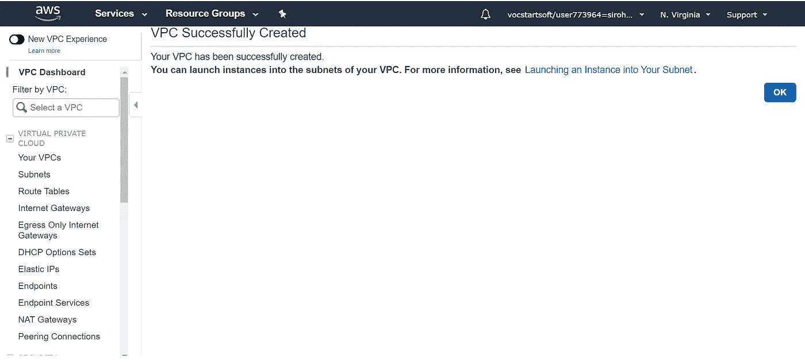
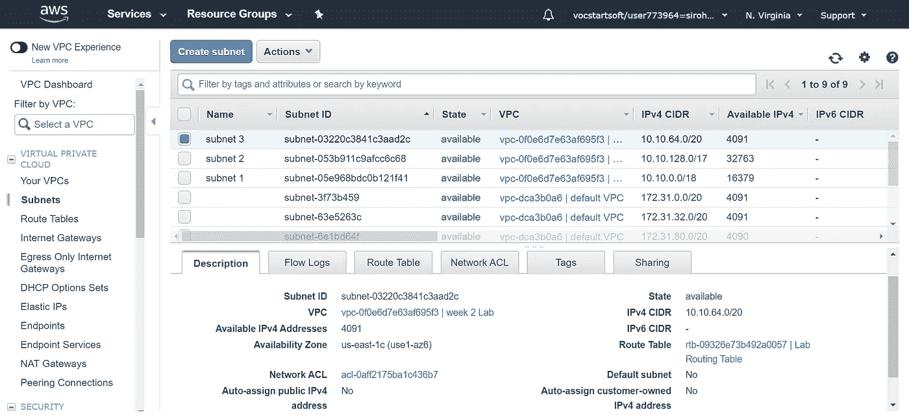
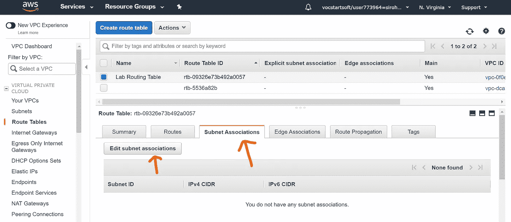
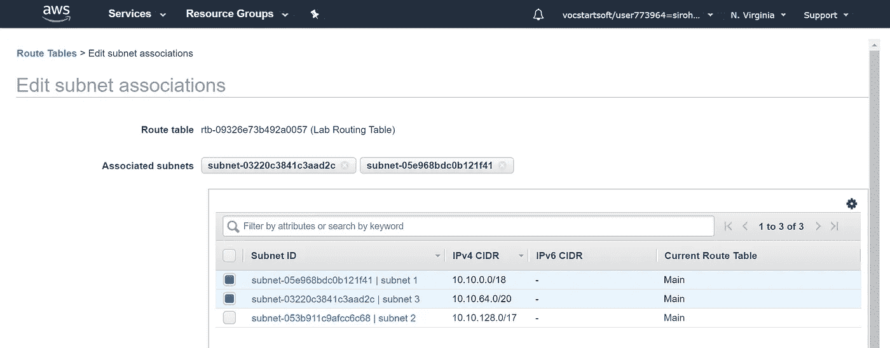
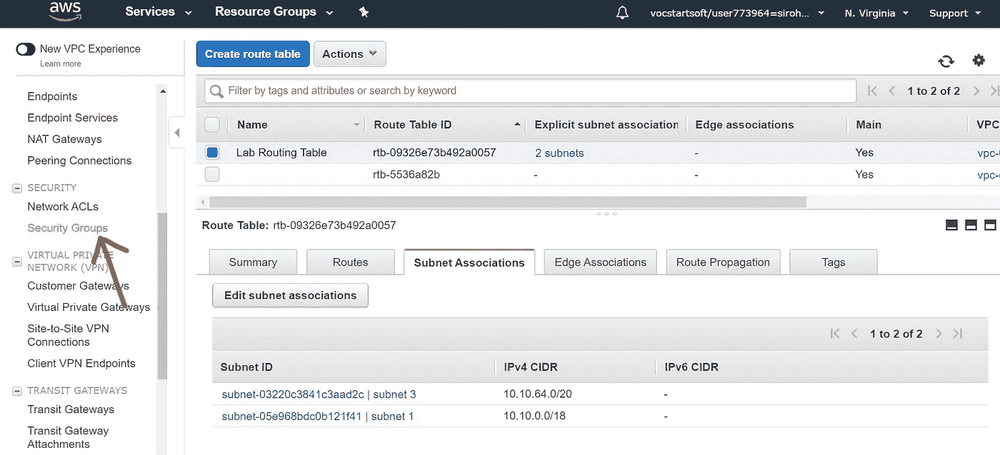
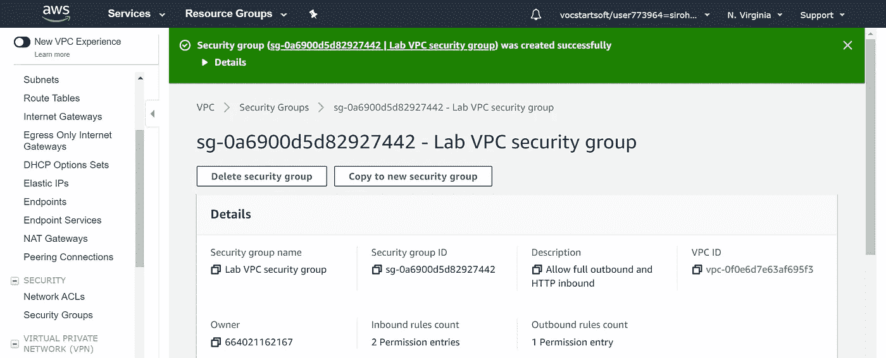
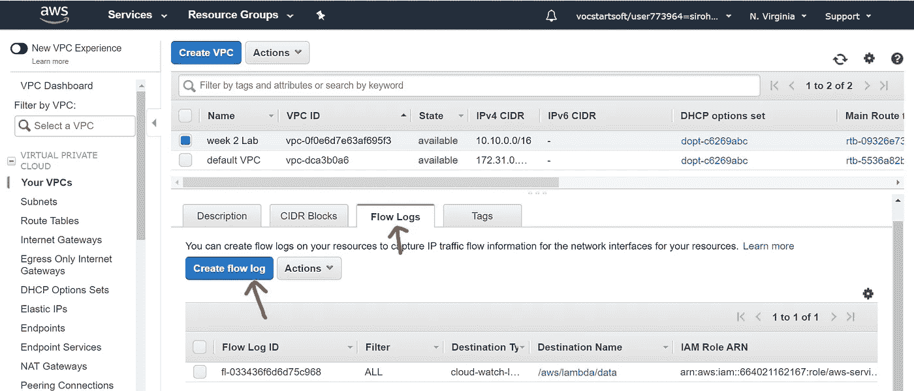
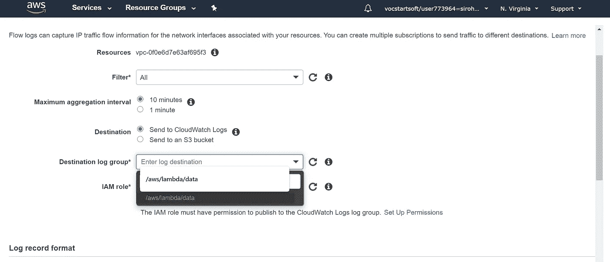

# AWS 云中的 VPC、子网和路由器

> 原文：<https://towardsdatascience.com/vpc-subnet-and-router-in-aws-cloud-17c8f421af21?source=collection_archive---------39----------------------->

## 了解如何在 AWS cloud 中设置 VPC 和子网，以及路由器的作用。

> 指导——在每一步，我都给出了如何执行该步骤的指导，然而，在下面的描述中，我解释了我自己对整个过程的评估，这可能因人而异。(可以的话请指正)
> 
> 作为一个旁注，如果下面的文章看起来太脱节，只需打开 AWS 控制台，开始动手实践，这将是小菜一碟。

VPC 是一种虚拟私有云，它允许我们创建一个网络逻辑单元，其中的硬件和资源由供应商或服务提供商管理。作为用户，我们负责网络的配置和逻辑设置。

一个 VPC 只能在一个区域内定义，每个 VPC 可以有多个子网。子网用于提供 VPC 内部的粒度。我为这个博客创建了三个子网。每个子网的 IP 地址范围都必须在 its IP 的范围内，并且每个子网的 IP 都不能与其他子网冲突。我们使用 CIDR 块来设置这些 IP 范围。

每个子网可以是公共子网，也可以是私有子网。公共子网可以直接访问互联网，而私有子网不能直接访问互联网。

一旦建立了 VPC，我们就需要创建一个互联网网关来允许 VPC 的流量进出互联网。拥有一个因特网网关并不能使每个子网对因特网公开，而是允许路由表做出决定。

路由表将来自网关的流量转移到 VPC 内部，并在子网之间进行分配。每个 VPC 都有一个连接到每个子网的默认路由表。另一方面，我们可以创建自己的路由表来定义 VPC 内部的流量。因此，我创建了一个单独的路由表，然后将它连接到 IP 为 0.0.0.0/0 的 internet 网关，然后将两个子网关联到这个自制的路由表。这样，我使我的两个子网(三个中的两个)具有公共访问权限，而第三个子网只连接到默认路由表(仍然是私有的)。

需要注意的一点是，每个 VPC 只能有一个互联网网关。当我试图连接另一个网关时，系统不允许我这样做。

正如 AWS 中的其他服务需要一个安全组来定义入站和出站流量一样，VPC 也需要这样做。因此，我提供了 HTTP 入站流量和完整的出站流量。这意味着来自互联网网关的任何 HTTP 请求都将被允许到达网络内部，SSH 也是允许的。但是，每种输出流量都将被允许流向互联网。

网络建立后，出于安全原因，监控任何更改都至关重要。因此，我们必须设置一个日志流来跟踪我们的 VPC 内部的每一个活动，并将其发送到所需的目的地。我们可以将其发送到 s3，然后使用数据进行分析，也可以将其发送到 cloud watch。我已经将我的流日志设置为使用适当的 IAM 角色发送到 CloudWatch。

1.  创建了 VPC →去控制台搜索 VPC。然后点击启动 VPC 向导，并选择正确的模板。提供必要的详细信息，然后点击创建。

2。 创建三个具有不同可用性区域的子网。转到左侧面板上的子网，然后单击创建子网。为子网提供名称，并将其连接到相关 VPC。重复该步骤三次，创建三个子网，每个子网具有不同的可用性分区，如下图快照中突出显示的那样。

3。 创造了一个互联网网关，并将其连接到 VPC。单击左侧面板上的互联网网关，提供一个名称，然后单击创建。我把它命名为实验室互联网网关。创建后，选择网关并单击操作下拉菜单。将有一个选项将其附加到特定的 VPC。一旦附上，回到你的 VPC 菜单。

4。 创建了另一个互联网网关，并试图将其连接到同一个 VPC。再次遵循上述相同的步骤，可以看到我们只能将一个网关连接到一个 VPC。

5。 创建公共访问路由表后，三个子网中有 2 个是公共访问，剩下 1 个是私有访问。首先，创建一个路由表，然后附上有关 VPC。连接 VPC 并创建路由表后，单击路由器选项卡并编辑路由表。在路由表中，单击添加路由并输入 0.0.0.0/0，这是一个公共访问 IP。现在，将该 IP 与我们在上述步骤中创建的 VPC 网关连接起来。现在，要使我们的两个子网具有公共访问权限，请转到“subnet associated”选项卡，编辑子网关联，选择两个子网，然后单击“save”按钮。这样，我们就创建了一个连接到 VPC 网关的路由表，并且我们已经将两个子网连接到该路由表，可以通过连接的网关进行公共访问。

6。现在，我们已经将子网连接到 VPC，将路由表连接到网关，我正在连接安全组。安全小组将允许交通进出我们的 VPC。对于入站流量，我允许 HTTP 和 SSH，对于出站流量，我允许完全访问。这意味着只有 HTTP 和 SSH 元素可以进入 VPC，但是 VPC 内部的所有内容都可以不受任何限制地发送到外部。首先，单击左侧面板上的安全组，然后单击“创建安全组”，然后为安全组提供一个新名称，提供一个描述并附上相关的 VPC。然后提供入站和出站流量规则，如快照所示。完成后，单击创建安全组，它将被附加到 VPC。

7。现在我们已经建立了整个环境，跟踪我们网络内部的每一项活动非常重要。为此，我们必须创建一个 VPC 流量日志。首先，单击我们创建的 VPC，然后单击“流量日志”选项卡，然后单击蓝色的“创建流量日志”按钮，然后选择过滤器，通知流量日志监控特定类型的活动。例如，如果我们希望只监控网络中被拒绝的请求，或者只监控网络中被允许的请求，或者两者都监控。我选择了全部。现在创建一个目标日志组，该日志组将包含来自我们网络的所有日志信息，此外，用户还可以将日志发送到 s3 存储桶。为了访问日志组，我们还必须附加 IAM 策略，以允许流日志访问云观察日志组。最后，我们点击保存。

我们到此为止，我们的网络设置完毕。如果你有任何意见，请分享你的想法。谢谢大家！