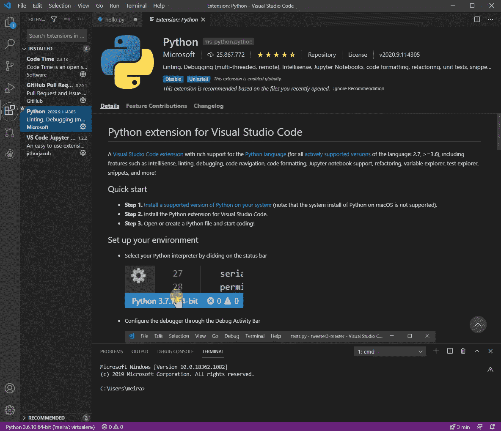
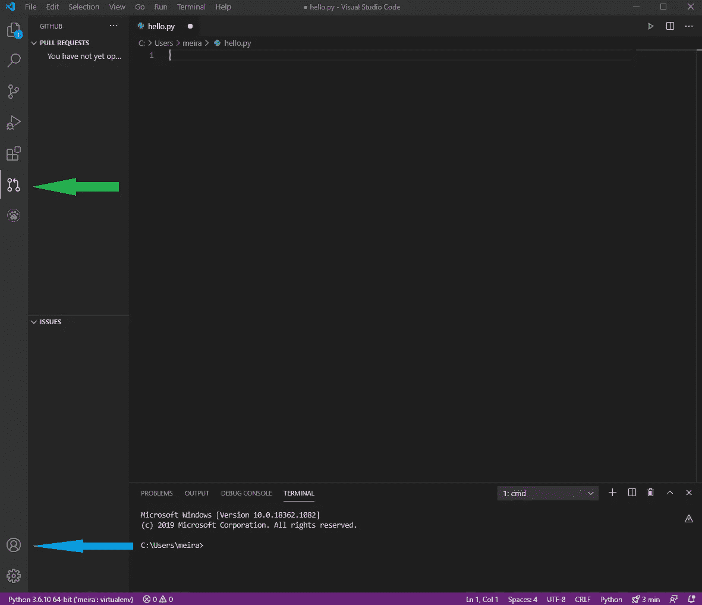
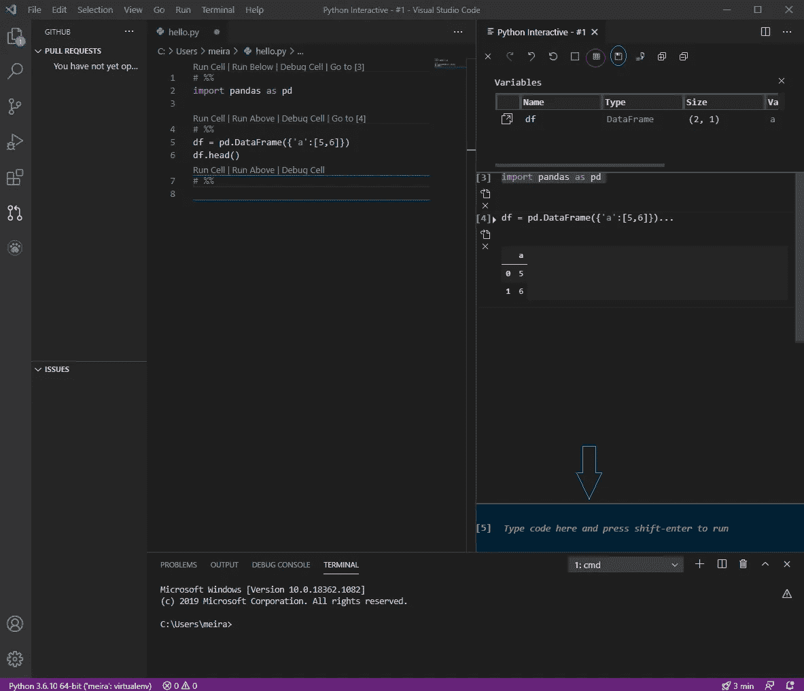

# 如何为数据科学设置 VS 代码—手册

> 原文：<https://towardsdatascience.com/vs-code-setup-for-data-science-5f8ba549802a?source=collection_archive---------6----------------------->

## [入门](https://towardsdatascience.com/tagged/getting-started)

## 开始使用 VSCode for Data Science 所需的一切

图片来源:Pixabay

在热情的、有时是暴力的推荐之后，我决定从 PyCharm 转向 VSCode。在设置我的环境时，我觉得我花了太多的时间来弄清楚我需要什么，并通过几个指南来学习如何安装每个小东西。在那段时间里，我希望有一本手册能给我一些简介，并准确地告诉我如何为数据科学设置 VSCode 环境。由于我找不到，我决定记录我的过程的每一个部分，并在此提供给你，这样你就可以在合理的时间内愉快地完成你的设置。

# **安装 VSCode**

每个伟大的旅程都从安装开始，在这里做[。](https://code.visualstudio.com/download)

# **Python**

要使用 Python，您需要安装它的扩展。

**关于扩展的补充说明**——基本上，VSCode 中的所有东西都通过它们工作。要找到一个，请按左边栏上的第四个图标(下图中被包围)或 ctrl-shift-X。然后，您会看到一个扩展列表、一个搜索面板和对右边扩展的解释。安装你喜欢的，但要小心——扩展浏览可能是免费的，但也很容易上瘾。

VSCode 扩展预览。用绿色圈起来的是打开这个魔法的按钮，在它的右边有一个扩展列表和一个搜索面板。按一个分机将在右边打开关于它的解释。

# **解释器**

为了让我们的 DS/ML/AI 包工作，我们需要设置解释器，如下所示

Ctrl+shift+p → Python: Select 解释器→ conda base。

在这个例子中，我选择了 conda base，但是你可以从列表中选择任何你喜欢的解释器。

请注意，由于路径设置的原因，这里可能会有问题。为了解决这些问题，我建议在这里查看一下[中描述的步骤](https://stackoverflow.com/questions/44515769/conda-is-not-recognized-as-internal-or-external-command)。

# **开始一个新文件**

我发现这并不简单，因此值得一提——当您在 VSCode 中打开一个文件时，在您保存它之前，它不会出现在您的目录中。保存时，为了使它成为您想要的文件类型，您需要在文件名中注明扩展名。

**底线—要启动一个 Python 文件，请执行以下操作**

文件->新建->写一些代码。

**使文件成为. py 类型-**

文件->另存为->带有。py 扩展->保存。

然后 Python 的颜色就会出现，你就可以运行这个文件了。

# 运行您的脚本

右键单击文件->在终端中运行 Python 文件。或者，单击脚本窗口左上角的绿色播放按钮。

# 饭桶

我假设您希望将您的环境连接到您的 git 帐户和存储库，如果您没有，那么这一节对您来说就不太相关了。

1.安装扩展: [GitHub 拉请求和发布](https://marketplace.visualstudio.com/items?itemName=GitHub.vscode-pull-request-github)

2.签到。您可以通过下图中蓝色箭头所指的按钮来确认您的登录是否正确。

3.克隆存储库:ctrl-shift-p -> **Git: Clone**

4.进入存储库进行编辑:文件->打开目录。

在[这个链接](https://code.visualstudio.com/docs/editor/github)中，有更深入的解释和一些更有用的东西，所以我建议你有空去看看。

在 VSCode 预览中 Git。绿色箭头标记的按钮打开 Git，蓝色箭头指向可以检查连接的按钮。

# Jupyter 功能

VSCode 为数据科学家提供的最强大的功能之一是可以在一个地方同时使用 IDE 和 Jupyter 笔记本的功能。要获得 Jupyter 功能，请安装其扩展— VSCode Jupyter 笔记本预览，安装后您可能需要重新启动 VSCode。

要使用“单元格”功能，请在代码段上方的行中用# %%标记代码段，以将其转换为单元格(如下图所示)。请注意，它会将代码的其余部分标记为单元格，或者直到下一次出现该标记。一旦将这一行放在代码之前，运行单元、调试单元和运行上面代码的选项就会出现(如图所示)。按下“运行单元”后，Python Interactive 将在右侧打开，您可以从其中的脚本运行单元，也可以从它自己的控制台运行代码(图中用蓝色箭头指向)。

**此处需要注意的有用特性**–

1.变量(图中用红色圈出)——显示当前存储在内核中的所有变量及其有用信息。

2.导出为 Jupyter Notebook(图中用蓝色圈出)-在我看来，这款工具非常有用，因为它将您在内核中运行的所有内容(无论是通过脚本还是从 python 交互式控制台)保存到一个笔记本中。这样你就可以回去找到你可能忘记添加到你的脚本/函数中的代码段，这样可以节省很多时间。

VSCode 的 Jupyter 功能预览。用红色圈起来的是变量按钮，下面是你按下时看到的。蓝色圆圈是通往 Jupyter 按钮的出口。

这应该足够让你开始了。如上所述，您可以添加扩展来增强您在 VSCode 中的编码体验(请在评论中告诉我哪些非常有用)，并根据您的偏好对环境进行一些不同的设置和调整。然而，要开始使用 VSCode for data science，我发现这些步骤已经足够了。我希望这本手册对你有所帮助，如果你有任何反馈，请在评论中或私信中与我分享。干杯。