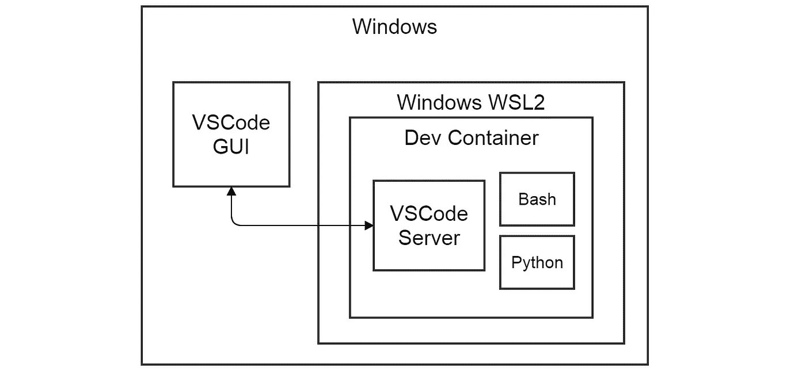
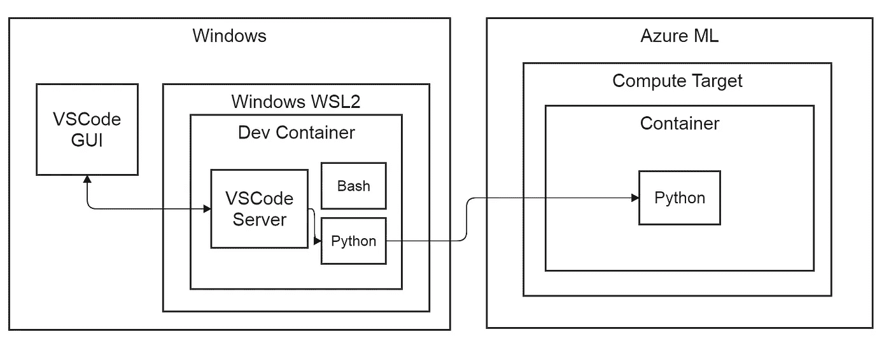

# 带有 VSCode devcontainers 的 Python AzureML SDK 工作流

> 原文：<https://towardsdatascience.com/vscode-devcontainers-and-the-python-azureml-sdk-323dec18a675?source=collection_archive---------43----------------------->

## 微软和 Python 机器学习:现代爱情故事，第 1 部分，共 2 部分

微软在征服我们的心和融入开源生态系统方面正在大步前进。他们在 2000 年公开反对的生态系统。我承认我正在融入微软的世界，并且感觉很好。在这篇博客中，我描述了在云中启动 ML 模型(AzureML)和在 VSCode 中远程开发代码的开发工作流。

参见:[第 2 部分](/unifying-remote-and-local-azureml-environments-bcea1292e37f):统一远程和本地 AzureML 环境

# 1 VSCode ML 开发容器

由于对 VSCode 的认识相当晚，在我通常的否认期之后，它让我大吃一惊。在 Q2 2019 上引入的远程开发功能( [vscode-dev-blog](https://code.visualstudio.com/blogs/2019/05/02/remote-development) )真的为我敲定了这笔交易。这有三种味道:

1.  在 Linux 的 Windows 子系统(WSL)中部署 VSCode 服务器，并在 Windows 桌面上运行客户端
2.  在 Docker 容器中部署 VSCode 服务器，并在 Windows 桌面上运行客户端
3.  将 VSCode 服务器部署到 SSH 目标，并在本地运行客户机

这是一个非常丰富的功能，不会令人失望的可靠性。让我们仔细看看。

## 1.1 VSCode 和 WSL2

Linux 的 Windows 子系统(WSL)已经存在了很多年。WSL2 在同一架构上统一了运行基于 Linux 的 docker 容器和 WSL Linux([docker-WSL 2-back end](https://www.docker.com/blog/new-docker-desktop-wsl2-backend/))。重要的是，它从架构中移除了复杂的虚拟化，WSL Linux 几乎可以本地运行。VSCode 可以处理 windows 文件系统上的代码，并在 WSL 上运行其服务器；与 Python 解释器和 shells 无缝集成。

在这篇博客中，我们建议在 WSL2 后端的 docker 容器中运行 VSCode 服务器，GUI 在 Windows 桌面上运行。WSL2 是未来的发展方向，它有很多好处，比如 Windows Home 支持( [docker-windows-home](https://www.docker.com/blog/docker-desktop-for-windows-home-is-here/) )、资源管理和 GPU 支持的潜力( [WSL2-dev-blog](https://devblogs.microsoft.com/commandline/the-windows-subsystem-for-linux-build-2020-summary/) )。我们讨论的内容也适用于历史悠久的 Docker 后端。



在 devcontainer 中运行的 VSCode 和 Python(图片由作者提供)

## AzureML devcontainer 中的 1.2 VSCode

微软提供了维护良好的 Dockerfiles，其中包含用于语言和语言不可知场景的通用开发工具( [vscode-dev-containers](https://github.com/Microsoft/vscode-dev-containers) )。我们选择了 azure-machine-learning-Python-3 容器( [azureml-dev-container](https://github.com/microsoft/vscode-dev-containers/tree/master/containers/azure-machine-learning-python-3) ，因为它的 Conda Python 解释器安装了 azureml-sdk 包。图片来源于 Ubuntu。如果我们包括了”。/.devcontainer”文件夹，VSCode 将:

1.  检测”的存在。/.devcontainer”及其内容
2.  从“构建一个容器。/.devcontainer/Dockerfile `文件
3.  安装“decontainer.json”中定义的 VSCode 服务器和可选扩展
4.  按照“devcontainer.json”中的配置运行容器；定义 a.o .绑定装载和启动脚本

VSCode 容器集成的设置存储在。/.devcontainer/devcontainer.json ”,并允许集成任何 docker 文件而无需修改。

## 可定制

我们可以将我们喜欢的开发工具添加到这些 devcontainers 中，作为 Dockerfile 中的附加层。或者，我们可以通过调用自定义“Dockerfile”中的“FROM ”,在基本图像的基础上进行构建。例如，添加带有扩展的 Azure CLI 和带有“运行”命令的 terra form([my-branch](https://github.com/luuk-codebeez/vscode-dev-containers/tree/for-blog))。带有您最喜欢的开发环境的映像可能是一个很好的伙伴。我们可以在一个地方管理我们的自定义图像，并从我们的每个项目中提供到它的符号链接。

## 1.2.2 设置 VSCode Python AzureML 项目

1.  在 windows 上安装 docker 桌面
2.  安装 git for windows(我建议在安装过程中将其添加到 powershell 中)
3.  安装 VSCode 及其“远程容器”扩展
4.  将目录更改为 windows 文件系统上合适的 dev 目录(这里是“dev”)
5.  git clone[https://github . com/Microsoft/vs code-dev-containers/tree/master/containers/azure-machine-learning-python-3](https://github.com/microsoft/vscode-dev-containers/tree/master/containers/azure-machine-learning-python-3)
6.  在现有的 Python 项目中，符号链接。使用 New-Item-Item type Junction-Path " c:\ dev \ Path \ to \ your \ project \的 Powershell 中的 devcontainer。dev container \ "-Target " c:\ dev \ vs code-dev-containers \ containers \ azure-machine-learning-python-3 \。devcontainer "
7.  在项目基本文件夹中，使用“code”启动 vscode。
8.  VSCode 检测到“.”。并要求在容器中重新打开->是
9.  VSCode 构建容器并安装其服务器，然后重新打开
10.  确认你的环境在左下角，一个绿色方块写着“Dev Container:Azure Machine Learning”

## 1.3 VSCode devcontainer 摘要

我们可以使用完全可复制的 Linux 工具链进行开发，并且仍然可以在 windows 笔记本电脑上工作。对于 Linux 或 MacOS 用户来说，这可能没有说服力，但是如果您对这些工具感到舒适，您几乎可以在任何地方使用它们。如果你在为你提供基础设施和笔记本电脑的公司工作，这是很有价值的。另一个场景是在你的游戏桌面 windows 电脑上用 GPU 训练深度学习模型，因为已经宣布了对 WSL2 的 GPU 支持( [WSL2-dev-blog](https://devblogs.microsoft.com/commandline/the-windows-subsystem-for-linux-build-2020-summary/) )。

# Azureml Python SDK 很棒

此部分的先决条件是有效的 Azure 订阅。如果你有信用卡，你可以很容易地获得一个免费的 azure 账户。

我们的 VSCode 运行在一个包含 Python 和 AzureML Python SDK 的 devcontainer 中。SDK 包含一个复杂的 API，跨越了 ML 模型的整个生命周期。从笔记本中的探索、培训和跟踪模型到工件管理和部署。这包括用于模型培训的计算资源调配和配置，以及用于模型评分的部署目标。我将引用的一些工具(Azure CLI)被添加到我自己的 fork 中( [my-branch](https://github.com/luuk-codebeez/vscode-dev-containers/tree/for-blog) )。

下图显示了我们的目标工作流程。我们使用 devcontainer 中的 AzureML SDK 从 VSCode 启动了一个实验，SDK 在计算目标上执行我们的代码。计算目标也在 docker 容器中运行我们的代码。运行时环境的细节将在本博客的第 2/2 部分讨论。



带有 VSCode devcontainer 的 AzureML 工作流(图片由作者提供)

## 2.1 向 Azure 注册您的容器

1.  在 VSCode 中打开一个终端:菜单终端->新终端
2.  在 shell 上执行“az 登录”。前往 www.microsoft.com/devicelogin[填写控制台输出中提供的密码](http://www.microsoft.com/devicelogin)
3.  我们现在已经将我们的环境与 Azure 订阅链接起来
4.  帐户信息存储在“~/”中。azure/azureProfile.json”。

## 2.2 给我们看看代码！

让我们看看 Python AzureML SDK 代码:

1.  创建 AzureML 工作区
2.  创建一个计算集群作为培训目标
3.  在计算目标上运行 Python 脚本

## 2.2.1 创建 AzureML 工作空间

AzureML 工作区由一个存储帐户、一个 docker 图像注册表和一个在 portal.azure.com 上具有丰富 UI 的实际工作区组成。一个新的相关机器学习工作室正在公开测试中，看起来真的很好([https://ml.azure.com](https://ml.azure.com/))。下面的代码创建工作区及其所需的服务，并将它们附加到一个新的资源组。

```
**from** **azureml.core** **import** Workspaceworkspace = Workspace.create(
    name="learnml", subscription_id="<UUID>", resource_group="ml", create_resource_group=**True**, location="<location>", sku="basic",)
```

## 创建计算集群

我们需要计算资源来训练我们的 ML 模型。我们可以使用 AzureML Python SDK 创建、编排计算集群。创建资源的工作空间由工作目录中的 config.json 文件定义( [configure-workspace](https://docs.microsoft.com/en-us/azure/machine-learning/how-to-configure-environment#workspace) )。 **AmlCompute** 代表 Azure 机器学习计算，是集群的配置类。如果群集不存在，我们将创建一个从 0 到定义的最大虚拟机数量的扩展。这些虚拟机正在运行 docker。我们将供应配置传递给 **ComputeTarget** 类的 create 方法，该方法返回一个 ComputeTarget 对象。每当我们要进行计算时，就会用到这个对象。下面的代码可以包装成一个函数来获取 compute_target。

```
**from** **azureml.core** **import** Workspace**from** **azureml.core.compute** **import** AmlCompute, ComputeTarget**from** **azureml.core.compute_target** **import** ComputeTargetExceptionCLUSTER_NAME = "cpucluster"VM_SIZE = "Standard_D2_V2"MAX_NODES = 1workspace = Workspace.from_config()  *# local config.json with subscription info**# retrieve existing cluster or create a new one***try**: cpu_cluster = ComputeTarget(workspace=workspace, name=CLUSTER_NAME) print("Found existing cluster, use it.")**except** ComputeTargetException: compute_config = AmlCompute.provisioning_configuration( vm_size=VM_SIZE, max_nodes=MAX_NODES )cpu_cluster = ComputeTarget.create(workspace, CLUSTER_NAME, compute_config)
```

## 2.2.3 在计算目标上运行 Python 脚本

我们希望在我们的计算集群上运行一个 Python 脚本。在本系列的第 2/2 部分中，我们将详细讨论运行时环境的配置。这里我们展示了在 compute _ target([AML compute-docs](https://docs.microsoft.com/en-us/azure/machine-learning/how-to-set-up-training-targets#amlcompute))上运行 Pyton 脚本所需的最少代码。

```
**from** **azureml.core** **import** Experiment, RunConfiguration, ScriptRunConfig, Workspace**from** **tools** **import** get_compute_targetCLUSTER_NAME = "cpucluster"EXPERIMENT_FOLDER = "/workspaces/azureml/code"workspace = Workspace.from_config()*# get_compute_cluster wraps the code under section 2.2.2*cpu_cluster = get_compute_target(workspace, CLUSTER_NAME)*# Create a new runconfig object*run_amlcompute = RunConfiguration()*"""**Skipping Environment details, treated in Blog Part 2/2, code is still valid**"""**# Set the compute target for the run*run_amlcompute.target = cpu_cluster*# Create a script config*script_config = ScriptRunConfig( source_directory=EXPERIMENT_FOLDER, script="run_experiment.py", run_config=run_amlcompute,)*# Submit the experiment*experiment = Experiment(workspace=workspace, name="my-experiment")run = experiment.submit(config=script_config)
```

## 2.3 AzureML SDK 摘要

我们已经看到创建 Azure ML 工作空间是多么容易，旋转计算集群并在其上运行 Python 脚本。所有这些都作为 ML 工作室内的一个实验被跟踪。

# 3 四舍五入

微软全力投入机器学习和 Python，这一点显而易见。对于我们的工作流，我们已经添加了 Docker/WSL2。从开发人员的角度来看，所有部分可靠地协同工作以完成实际工作是很重要的。我对生态系统各个部分的质量印象深刻:Docker/WSL2、VSCode 和 AzureML 以及它们对工作流的集成。当然，这一过程中也有一些陷阱，总结如下。

## 3.1 Windows 10 上 Docker 和 WSL2 的陷阱:

*   Linux 和 Windows 文件系统之间的文件权限映射是奇数([wsl-chmod-dev-blog](https://devblogs.microsoft.com/commandline/chmod-chown-wsl-improvements/))；绑定挂载在 root:root 下
*   Crontab 用户可能不得不接触 windows 任务调度程序( [wsl-scheduling](https://stephenreescarter.net/automatic-backups-for-wsl2/) )
*   GPU 支持正在进行中，但尚未实现(2020 年)
*   Linux 图形用户界面应用在路线图上，但还没有实现(2021 年)

*原载于*[*https://codebeez . nl*](https://codebeez.nl/blogs/microsoft-and-python-machine-learning-modern-love-story-part-1/)*。*