# VSCode Jupyter 笔记本即将迎来重大升级

> 原文：<https://towardsdatascience.com/vscode-jupyter-notebooks-are-getting-an-upgrade-cc9aaaefc744?source=collection_archive---------3----------------------->

## 刷新的用户界面和显著的性能修复

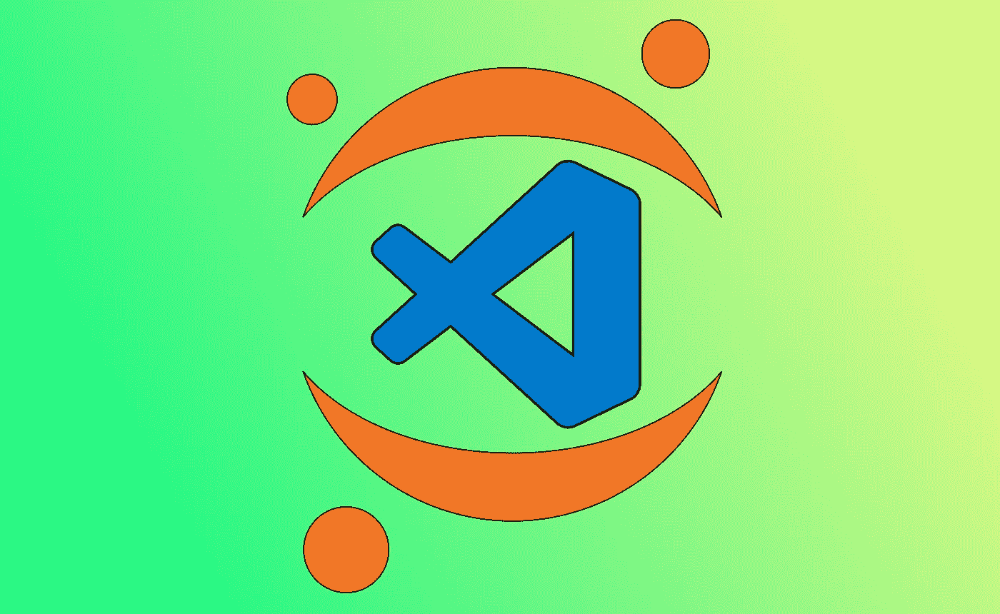

VSCode Jupyter 笔记本。图片来源:我😄

# 介绍

**我一直想用 Visual Studio Code (VSCode)作为我日常一切的驱动，包括 iPython 笔记本**。不要误解我的意思:JupyterLab 用于数据科学目的很棒(Jupyter 笔记本也是如此)，但用于常规代码脚本就不那么好了，更不用说 Jupyter 只(实际上)支持 Python、Julia 或其他一些编程语言。

当 vs code——或者确切地说是 VSCode Python 扩展团队*——在 2019 年首次宣布笔记本支持时，我不得不尝试一下。最后，除了涵盖 Jupyter 笔记本的所有按键和功能外，它还完成了一些值得注意的壮举:*

*   *强大的**变量浏览器**和**绘图浏览器***
*   *将 VSCode 的**智能感知自动完成功能**集成到代码单元中*

*但是，我发现它在其他方面有点令人失望:*

*   *启动非常慢，尤其是通过 WSL 或 SSH*
*   ***界面很笨拙**感觉半生不熟*
*   *与 JupyterLab 不同，笔记本**会话在 VSCode 中关闭**后是不可恢复的*

*尽管如此，引入 Jupyter 笔记本集成是 VSCode 在 Python 数据科学领域向前迈出的一大步。 ***随着该团队最近宣布对 VSCode Jupyter 笔记本电脑进行重大更新，似乎在不久的将来会有另一个巨大的进步！****

# *有什么新鲜事？*

*让我们先拿一个 Jupyter 笔记本样本来看看这些新变化。我将使用我以前的一篇关于 [*的文章中的一个笔记本来预测英雄联盟与 py torch*](/predict-league-of-legends-matches-while-learning-pytorch-part-2-38b8e982c7ea)*的比赛，因为它有**大量的代码、一个熊猫数据帧和一些图形**——一个真实世界场景的很好的例子。**

> ***可以看一下笔记本* [*这里*](https://jovian.ml/richardso21/lol-nn) *。免费文章可在下面阅读👇。***

** [## 学习 PyTorch 的同时预测英雄联盟比赛(第二部分)

### 学习在 PyTorch 中实现一个前馈网络，并使用 GPU 为一个合适的用例进行训练，稍微接触一下…

towardsdatascience.com](/predict-league-of-legends-matches-while-learning-pytorch-part-2-38b8e982c7ea) 

## 改进的用户界面

对于我们 VSCode+Python 用户来说，这可能是最大的变化。与旧的笔记本编辑器相比，新的 VSCode Python Jupyter 笔记本拥有**全新的外观**！下面是旧的*(左)*和新的*(右)*用户界面的对比。

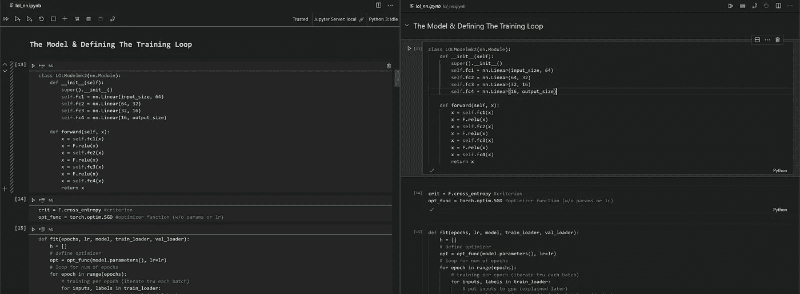

**老款(左)** vs **新款(右)** Jupyter 笔记本接口。使用的主题:Dark+(默认)。

界面的许多元素已经比它的前身干净多了。markdown 单元格文本的可怕字体和间距现在已经消失了，取而代之的是一种更加标准的字体，在我看来，这种字体**更加美观**。您可以在顶部的单元格中看到:“定义训练循环的模型&”。

*让我们放大其中一个单元格:*

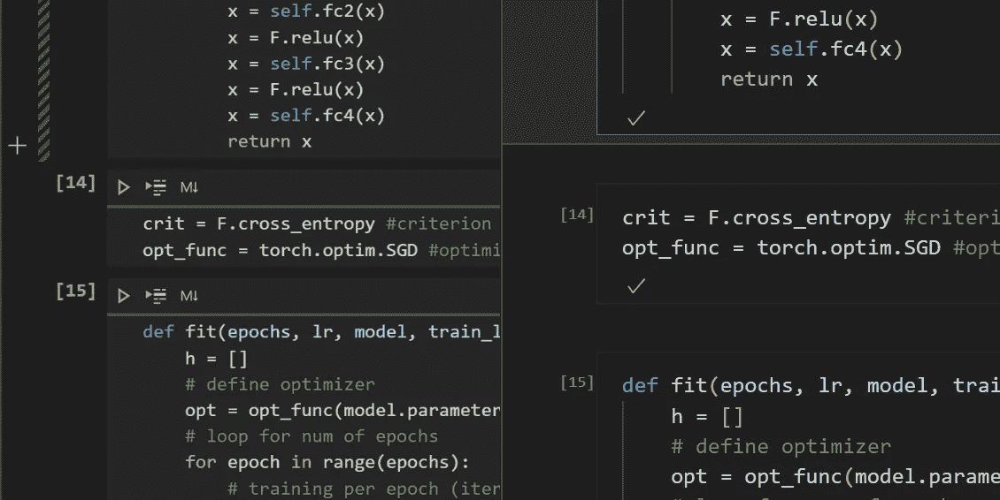

笔记本单元格比较[ **左(旧)**，**右(新)**

代码单元变得不那么杂乱，让你更好地专注于你正在编程/解决的问题。虽然他们已经用 markdown 单元格减少了过多的间距，但这些间距被添加回代码单元格之间，作为生活质量的改善。

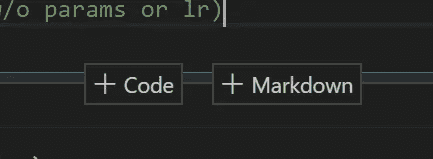

这让我对谷歌实验室产生了模糊的感觉😳

在这个新的 UI 中，添加新的单元格是一件轻而易举的事情。你甚至可以选择想要添加哪种类型的单元格，这对不使用键盘快捷键的人很有用。

*另一个显著的 UI 变化位于顶部，如下所示:*

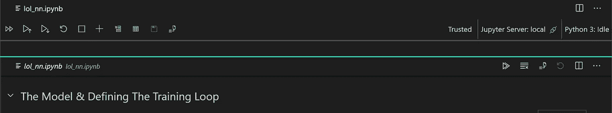

一条青色线将**旧的(最上面的)**和**新的(最下面的)** UI 分开。

当我开始使用新的 VSCode Jupyter 笔记本电脑时，我感觉突然有了更多空间来存放我的笔记本电脑。事实证明，情况确实如此——现在，**按钮与文件名标签**集成在同一层，这不仅节省了空间，而且看起来非常时尚😏。唯一的问题是:我们失去了对心爱的变量浏览器的访问(尽管我确信随着开发的继续，这个问题会得到解决)。

不过，这个新的用户界面并不全是外观。首先，**拖放笔记本单元格**的功能成为现实(类似于 JupyterLab)。没有更多的剪切和粘贴代码和 markdown 单元格！

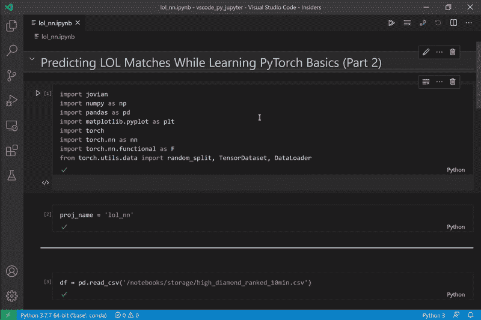

展示新 VSCode Jupyter 笔记本电脑的新**拖放功能**

你可能还会注意到一些降价单元格旁边的箭头。更新后的笔记本用户界面还支持在 markdown 标题下折叠单元格，这对于浏览较长的笔记本非常方便。

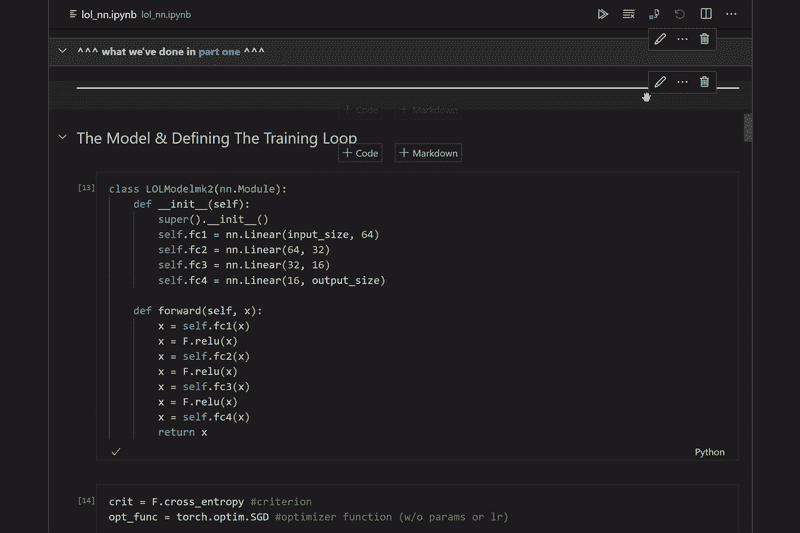

这是我展示的可折叠笔记本电池。此外，如果你不知道为什么隐藏状态和侧边栏，我在 VSCode 上使用 Zen 模式(Ctrl + K，Z)。

## 提高装载性能

我可以处理一个半生不熟的用户界面，但是我不能处理一个永远显示在我屏幕上的笔记本电脑——这是我还没有放弃 Jupyter 的主要原因之一。然而，随着即将到来的笔记本更新，这将最终成为历史！

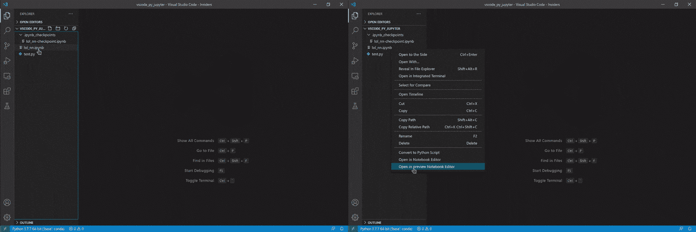

**老版本(左)**和**新版本(右)**加载同一笔记本的对比，实时。

在你从上面看到的 GIF 中的这个小实验中，我试着为两个版本加载同一个笔记本。我已经尽力保持所有变量不变(python 环境、CPU/内存使用等。)——是的，两次试验都是在电脑重启后进行的。没有对 gif 进行任何修改来放大性能提升。综上所述，新的 VSCode Jupyter 笔记本的速度将会有多快已经很明显了。

## VSCode 扩展与笔记本的兼容性

旧的 VSCode Jupyter 笔记本界面在处理扩展兼容性方面存在各种问题。以下是最值得注意的:

*   像[括号对着色](https://marketplace.visualstudio.com/items?itemName=CoenraadS.bracket-pair-colorizer-2) **这样的扩展根本不能在笔记本上工作**
*   VSCode **主题不在 WSL 上注册，也不通过 SSH 注册**

此更新将修复这两个问题，如下所示:

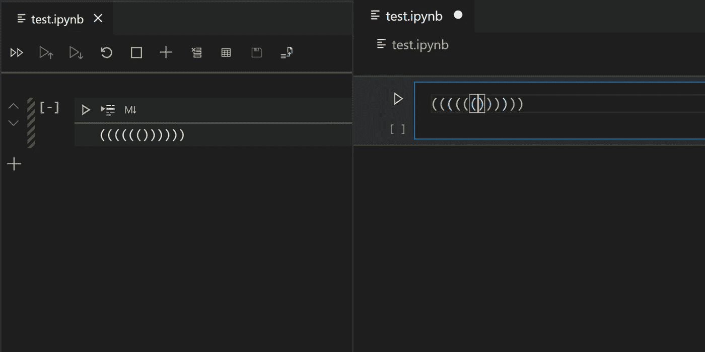

括号对着色现在可以在 VSCode Jupyter 笔记本上使用。不过，以前没有！

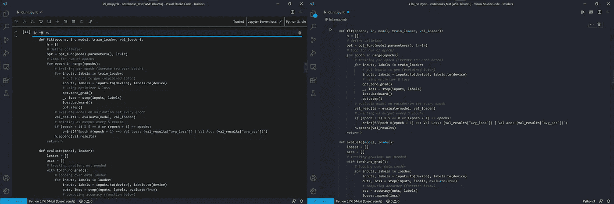

这是在 WSL 下运行的 VSCode。在新笔记本上(右)，主题被保留，但在旧笔记本上(左)没有。VSCode 主题:[仙女座](https://marketplace.visualstudio.com/items?itemName=EliverLara.andromeda)

## 这些变化是如何实现的？

新的 VSCode Jupyter 笔记本**利用了新的原生笔记本 API** 。为了澄清任何混淆，该 API 由 VSCode 团队开发，该团队独立于负责 Jupyter 笔记本集成的 Python 扩展开发人员。在 API 之前，UI 基本上是从头开始构建的，解释了旧的 VSCode Jupyter 笔记本所遭受的一些性能/扩展兼容性问题。** 

# **先看看这些新功能**

**这些特性在内部版本的 VSCode 和 Python 扩展中都可用。简而言之，以下是启用这些实验功能的步骤:**

1.  **在这里下载并安装 **Visual Studio 代码内幕** [。](https://code.visualstudio.com/insiders/)**
2.  **在扩展管理器上安装 **Python 扩展**。**
3.  **为 Python 扩展启用**知情者每日频道**。**

**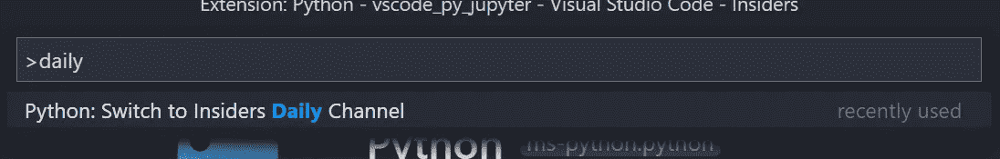**

**就是这样！它将开始安装，并让您知道完成后重新加载您的 VSCode Insiders。现在，无论何时你想用新的 Jupyter 笔记本用户界面打开一个`**.ipynb**`文件，打开上下文菜单(右击文件)并选择**“在预览笔记本编辑器中打开”**。**

**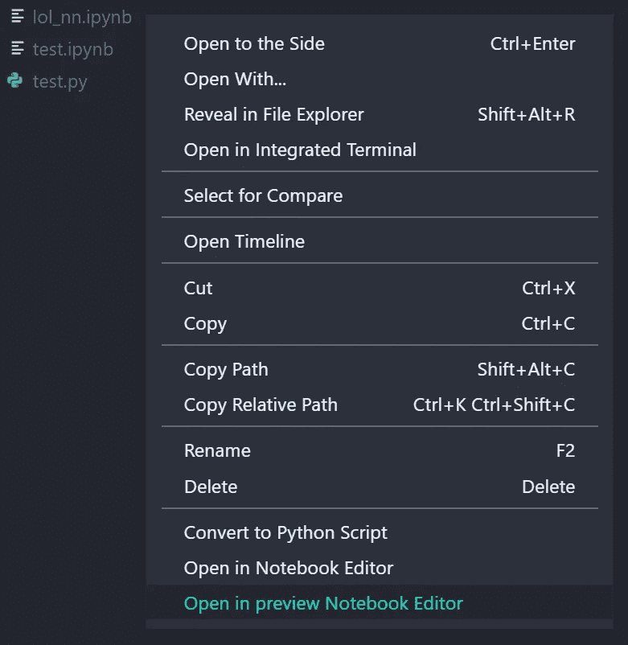**

**右键单击. ipynb (Jupyter 笔记本)文件时显示的上下文菜单。**

> **您对 VSCode Jupyter 笔记本电脑的这些升级有多期待？下面让我知道！**