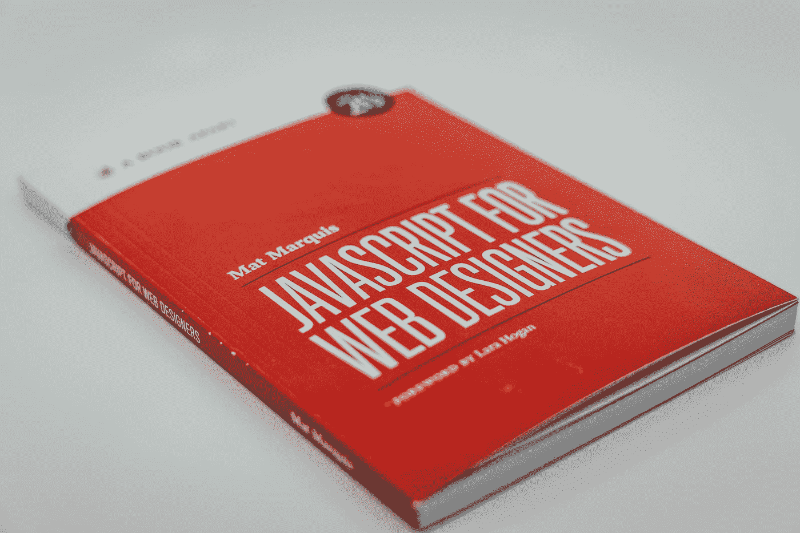
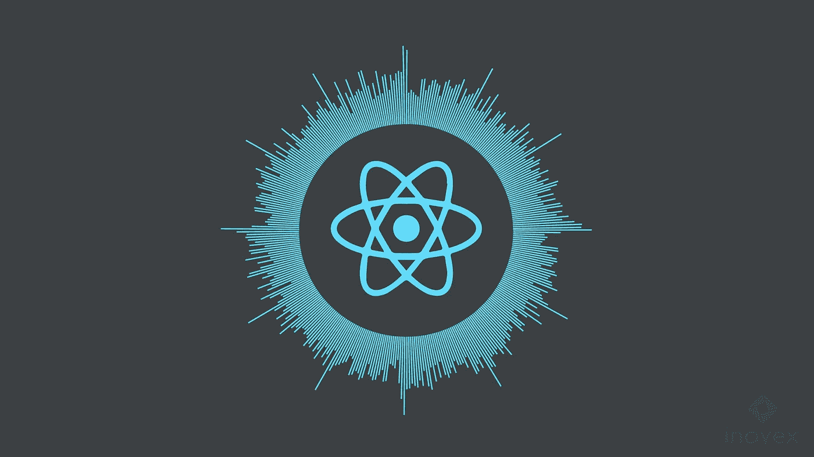
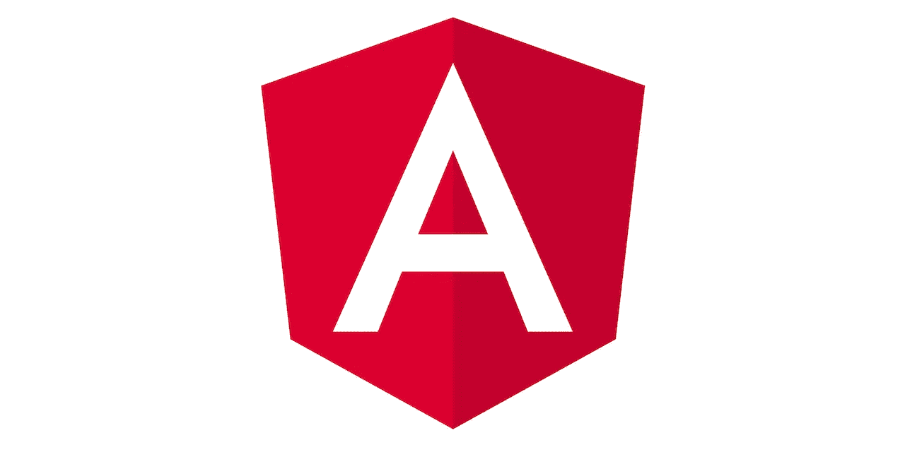

# Vue vs 反应 vs 角度

> 原文：<https://towardsdatascience.com/vue-vs-react-vs-angular-114718eac3c5?source=collection_archive---------12----------------------->

## 哪个 JavaScript 框架适合你

🇨🇭·克劳迪奥·施瓦茨| @purzlbaum 在 [Unsplash](https://unsplash.com?utm_source=medium&utm_medium=referral) 上拍摄的照片

**JavaScript** 是一种高级编程语言，目前是 web 的语言。前端和后端开发都可以用这种语言进行。随着当前网站的发展以及对设计和简单性需求的增加，**框架**被开发出来。它们允许程序员更快地创建漂亮的网站，这就是为什么他们比直接用 JS 编写更受欢迎的原因。

选择一个 JavaScript 框架是相当具有挑战性和令人困惑的，尤其是在没有任何相关知识的情况下。实际上有相当多的框架，我们将只讨论最流行的三个，它们通常被认为是开发得最好的。在这篇文章中，我将讨论它们的不同点和相同点，以及在选择一个之前需要考虑的问题。我会尽量简明扼要，所以我们开始吧。

# 做决定

首先也是最重要的，不需要过多考虑初始框架的选择。学习其中的一个会让学习其他的更容易。此外，您不仅将学习特定于该框架的特性，还将学习适用于每个框架的一般概念以及一般的 web 开发(设计和开发组件、理解数据流、管理状态和模板等等)。记住这一点，让我们更详细地看看每一个框架。

## 某视频剪辑软件

(图片由 2Developer 提供)

特点:

*   数据绑定
*   简单
*   模板

Vue 是最新的框架，拥有越来越多的用户。它是三者中最容易上手的，对于更专业的开发者来说足够强大。Vue 没有 Angular 那么多内置功能，但仍然比 React 多很多，这意味着你可以马上开始用 Vue 建立网站。这是初学者的普遍选择。Vue 还允许你利用你的原生 HTML 和 CSS 技能。更重要的是，它以其*精心编写的文档*而闻名，这是非常有用的。最近，除了 CLI 之外，Vue 还创建了 UI 组件。这甚至进一步简化了初学者的学习过程，并提供了大量的统计数据。

Vue 比 Angular 和 React 更新，这意味着它有一个不断增长的社区。但是，它不像其他两个那样成立。

## 反应

(图片由菲利普·桑托斯·科雷亚提供)

特点:

*   基于组件的
*   宣言的
*   JSX

**React** 提供简单实用的*组件创建*。此外，React 优雅的 API 敦促您利用组件。React 非常受欢迎，尤其是在*创业社区*。通过选择大量容易获得的开源插件和扩展，基本上可以开发任何类型的网站。组件模板是用 JSX 编写的，这可能和你习惯的有点不同。

拥有如此多的扩展选择是很好的，但是会很有挑战性，甚至令人困惑，特别是对于那些刚刚起步的创作者。

## 有角的

(图片由 Angular GitHub 提供)

特点:

*   普遍的
*   当地的
*   复杂的

**Angular** 当然比 React 或 Vue 提供了更多。因此，构建完整的解决方案更加简单。棱角分明受*企业*欢迎。此外，它还提供了三者中最好的命令行界面(CLI)。虽然它的语法需要一些时间来适应，Angular 允许更好地使用 HTML 和 CSS。与其他框架相比，代码相当冗长和复杂，学习曲线也更陡峭。

# 找什么？

弄清楚你将使用框架做什么是很重要的。想想自己的现状和要求。如果你正在你所在的地区找工作，检查一下招聘启事上的要求，弄清楚哪一个更常用。

你打算为一家新公司还是一家大公司工作？与招聘人员交谈，对你选择的职业道路做一些研究。查看哪个框架拥有最大的本地开发人员社区，并参加任何会议或加入他们的在线小组和讨论。

如果你为你的团队的下一个项目选择一个框架，看看你的团队成员有什么技能。思考一下克服一个更陡峭的学习曲线是否有利于进一步发展，比如 Angular 中的那个。也许这只是一个小项目，你想选择一些简单和容易开始。

# 比较

## 易用性

React 和 Vue 在很大程度上专注于构建用户界面，而 Angular 专注于构建应用程序。因为这个角度对于初学者来说比较复杂和困难。React 和 Vue 最初比较简单，但是在开发更大的应用程序时会变得越来越复杂。

## 工具支持

这三个框架都提供了 CLIs，这使得创建新项目和支持持续开发变得更加容易。此外，它们都受到流行的 ide 的良好支持，比如 VS Code 和 Atom。

## 表演

性能当然会因情况而异，在大多数情况下，这三个框架都相当快。在它们之间进行选择时，性能通常不是主要考虑的因素。然而，值得注意的是，在特定的任务中，一个可能比另一个更好，这是在处理大型应用程序时要考虑的事情。

# 结论

试图决定哪一个框架是最好的可能是棘手和主观的。这三者都提供了相似的功能，掌握其中任何一个对任何开发人员来说都绝对是一种好处。更重要的是学习使用 JavaScript 和开发 web 应用程序的核心概念和理论。最好先从一个开始，然后再尝试使用其他的。您最喜欢的框架当然会有所不同，所以考虑每一个细节并不重要。

# 链接:

https://vuejs.org/

反应过来:【https://reactjs.org/】T2

棱角分明:【https://angular.io/】T4