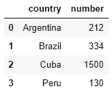
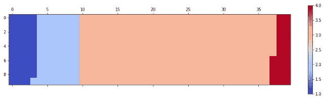
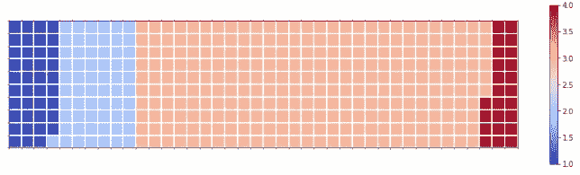
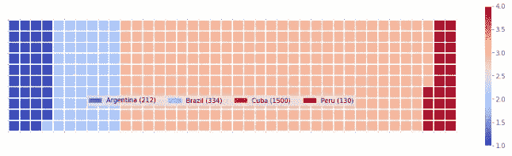
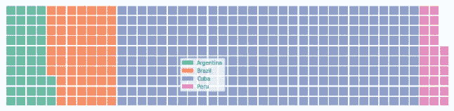

# 使用 Python 的 Matplotlib 的华夫饼图表

> 原文：<https://towardsdatascience.com/waffle-charts-using-pythons-matplotlib-94252689a701?source=collection_archive---------19----------------------->

## 如何使用 Matplotlib 库在 Python 中绘制华夫饼图表


资料来源:佩雷斯·冈萨雷斯的 Unsplash

华夫饼图表可能是仪表板中一个有趣的元素。显示实现目标的进度以及查看每个项目对整体的贡献尤其有用。但是如果你试图在里面放太多的项目，华夫饼图表就不是很有用了。r、Tableau 和 Python 都有用于华夫饼图表的包或函数。**我将展示如何从头开始生成一个华夫饼干图表，并使用 pywaffle 中的华夫饼干函数。**

## 要使用的工具

对于本教程，我们将使用:

1.  [Numpy 图书馆](https://numpy.org/)
2.  [熊猫图书馆](https://pandas.pydata.org/)
3.  [Matplotlib 库](https://matplotlib.org/)
4.  [Jupyter 笔记本](https://jupyter.org/)环境。

## 开发一个没有华夫饼包装的华夫饼图表

1.  导入必要的包:

```
import pandas as pd
import numpy as np
import matplotlib.pyplot as plt
import matplotlib.patches as mpatches
```

2.创建一个数据框架。在本教程中，我将制作一个数据图，假称从阿根廷、巴西、古巴和秘鲁移民到美国的人数。这些数字只是虚构的。

```
df = pd.DataFrame({
    'country': ['Argentina', 'Brazil', 'Cuba', 'Peru'],
    'number': [212, 334, 1500, 130] 
})
```



3.由于我们将呈现每个国家的移民人数对总数的贡献，我们需要知道总数。计算总数:

```
total = sum(df['number'])
```

4.计算每个国家的比例

```
proportions = [(float(value) / total) for value in df['number']]#Output:
[0.0974264705882353,
 0.15349264705882354,
 0.6893382352941176,
 0.05974264705882353]
```

5.指定图表的宽度和高度。然后计算华夫饼图表中瓷砖的总数

```
width = 40
height=10
total= width * height
```

6.确定每个国家将分配多少瓷砖

```
tiles_per_category = [round(proportion * total) for proportion in proportions]#Output:
[39, 61, 276, 24]
```

所有的数据准备都做好了。

来源: [GIPHY](https://giphy.com/)

7.所有容易的工作都完成了。现在是棘手的部分。生成华夫饼。为此，我们将生成一个全零矩阵。然后用相应的类别替换每个零。这个矩阵将类似于华夫格图。

```
waffle = np.zeros((height, width))
category_index = 0
tile_index = 0for col in range(width):
    for row in range(height):
        tile_index += 1
        if tile_index > sum(tiles_per_category[0:category_index]):
            category_index += 1
        waffle[row, col] = category_index
```

8.选择[颜色图](https://matplotlib.org/3.1.0/tutorials/colors/colormaps.html)并使用 [matshow](https://matplotlib.org/3.1.1/api/_as_gen/matplotlib.pyplot.matshow.html) 显示矩阵

```
fig = plt.figure()
colormap = plt.cm.coolwarm
plt.matshow(waffle, cmap=colormap)
plt.colorbar()
```



9.添加一些美化元素，如蜱和网格

```
fig = plt.figure()
colormap = plt.cm.coolwarm
plt.matshow(waffle, cmap=colormap)
ax = plt.gca()ax.set_xticks(np.arange(-0.5, (width), 1), minor=True)
ax.set_yticks(np.arange(-0.5, (height), 1), minor=True)ax.grid(which='minor', color='w', linestyle='-', linewidth=2)plt.xticks([])
plt.yticks([])
plt.colorbar()
```



10.最后，添加图例来完成华夫饼图表。这是华夫饼图表的完整代码。如果您喜欢，您可以简单地保留这段代码，并在您的数据中重用它。

```
fig = plt.figure()
colormap = plt.cm.coolwarm
plt.matshow(waffle, cmap=colormap)
ax = plt.gca()ax.set_xticks(np.arange(-0.5, (width), 1), minor=True)
ax.set_yticks(np.arange(-0.5, (height), 1), minor=True)ax.grid(which='minor', color='w', linestyle='-', linewidth=2)plt.xticks([])
plt.yticks([])values = df['number']
categories = df['country']
value_sign = ''
values_cumsum = np.cumsum(values)
total_values = values_cumsum[len(values_cumsum) - 1]legend_handles = []
for i, category in enumerate(categories):
    if value_sign == '%':
        label_str = category + ' (' + str(values[i]) + value_sign + ')' 
    else:
        label_str = category + ' (' + value_sign + str(values[i]) + ')'
    color_val = colormap(float(values_cumsum[i]) / total_values)
    legend_handles.append(mpatches.Patch(color=color_val, label=label_str))

plt.legend(handles=legend_handles, loc = 'lower center', ncol=len(categories),
          bbox_to_anchor=(0., 0.2, 0.95, 0.1)) #positioning legends
plt.colorbar()
```



看，每个国家的移民人数对总人数的贡献是非常明显的

来源: [GIPHY](https://giphy.com/stories/black-excellence-simone-biles-9718bf95-8b0b)

> 如果情节中的元素太多，就不再那么清晰了。这是华夫饼图表的一个重要缺点

## 使用 Waffle 类开发 Waffle 图表

您需要使用以下命令安装 pywaffle 包

```
pip install pywaffle
```

现在从 pywaffle 包中导入华夫饼

```
from pywaffle import Waffle
```

使用与上一个示例相同的数据，使用 waffle 函数绘制一个 Waffle 图

```
fig = plt.figure(
    FigureClass=Waffle, 
    rows=10, 
    values=list(df.number/5),
    labels=list(df.country),
    figsize=(12, 8),
    legend={'bbox_to_anchor': (0.5, 0.5)}    
)
```



我试图展示如何使用 Matplotlib 库而不是 pywaffle 包来编写一个 waffle 图表，因为我认为这样可以给你更多的灵活性。使用 pywaffle 包也不错。这也可以制作一个像样的华夫饼图表，并很好地服务于您的目的。点击[此链接](https://readthedocs.org/projects/pywaffle/downloads/pdf/latest/)了解更多关于 pywaffle 套餐的选项和细节。

非常感谢您阅读这篇文章。我希望这有所帮助。

推荐阅读:

[Matplotlib 中的气泡图](/bubble-plots-in-matplotlib-3f0b3927d8f9)

[Matplotlib 中的基本绘图:Python 中的可视化](/basic-plots-in-matplotlib-visualization-in-python-13013c9e4ee4)

[Pandas 的详细分组功能，用于高效的数据汇总和分析](/master-pandas-groupby-for-efficient-data-summarizing-and-analysis-c6808e37c1cb)

[使用直方图和箱线图理解数据，并举例](/understanding-the-data-using-histogram-and-boxplot-with-example-425a52b5b8a6)

[如何在 Python 中展现多个变量之间的关系](/how-to-present-the-relationships-amongst-multiple-variables-in-python-fa1bdd4f368c)