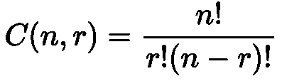

# 等等，那么什么是 P 值？

> 原文：<https://towardsdatascience.com/wait-so-whats-a-p-value-6fc50f362df1?source=collection_archive---------22----------------------->

## 概率值快速介绍

如果有人让你解释什么是概率值(p 值)，你会怎么直观地解释？在本文中，我将探讨这个问题，并让你对 p 值的真正含义有一个直观的认识。

## 建立

先说个例子。假设我们有两个篮球队…

A 队——NBA 球员

B 队——高中全明星

为了这个例子，让我们假设 A 队全是 NBA 球员，B 队是高中全明星。鉴于这种天赋的不平衡，我们假设 A 队每场比赛获胜的概率是 99%。

## 分析

那么如果这两个队互相比赛 100 次会怎么样呢？A 队在 100 场比赛中赢 99 场的概率是多少？

> 99%你猜对了吗？

可惜低了不少。A 队在 100 场比赛中赢 99 场的概率大约是 37%。这可能看起来不直观，但是先忘掉这个数字，想想 A 队能赢多少场比赛。

A 队**确实**有大概率赢 99 场，但是它**也有大概率赢 100 场或者 98 场。我们必须考虑到 A 队每场比赛都赢***或者比 99 场比赛少**。左边的表格是 90+游戏获胜的概率。赢得 99 场比赛是最有可能的结果，但赢得 100 或 98 场比赛也是有可能的。*******

*****所以现在你可以问问自己，A 队赢 96 场的概率是多少？嗯，这种事发生的几率只有可怜的 1.49%。*****

******注意，我们不会深入计算，但我在文章末尾列出了公式和一个* [*参考，此处为*](https://www.khanacademy.org/math/ap-statistics/probability-ap/probability-multiplication-rule/v/compound-probability-of-independent-events) *。******

## *****结论*****

*****假设你去一个偏远的小岛度假一周，与外界没有任何联系。当你回来的时候，A 队和 B 队打了 100 场比赛，你的朋友问“嘿，如果我告诉你他们只赢了 93 场比赛呢？”“哈，我得说这种情况发生的概率不到 1%，你也不再是我的朋友了。”*****

*****虽然是开玩笑，但当你听到一种新药的成功具有统计学意义时，他们正在评估成功结果的可能性(想想玩游戏的次数)。如果成功的概率小于某个阈值(行业标准通常为 5%)，则该结果被视为成功。即使这个结果有**或**的随机几率发生，也不足以得出我们的结果是成功的结论。*****

*****从高层次上讲，下次你听到一种新药显示出统计学意义时，想想…*****

> *****在该公司进行的所有测试中，他们的药物对试验患者无效的可能性小于 5%。*****

*****感谢阅读！为了简单起见，我偏离了假设检验、不同的统计检验和置信水平。*****

## ********公式使用********

********************