# 排队模型

> 原文：<https://towardsdatascience.com/waiting-line-models-d65ac918b26c?source=collection_archive---------10----------------------->

## 排队模型和排队论完全指南

排队模型。在 [Unsplash](https://unsplash.com/s/photos/waiting-line?utm_source=unsplash&utm_medium=referral&utm_content=creditCopyText) 上由[halance](https://unsplash.com/@halacious?utm_source=unsplash&utm_medium=referral&utm_content=creditCopyText)拍摄的照片

在这篇文章中，我将详细介绍排队模型。我将从商业角度讨论何时以及如何使用等待线模型。在第二部分中，我将深入研究多个特定的排队论模型，这些模型可用于特定的等待队列，以及排队论的其他应用。

# 排队模型介绍

等待线模型是用来研究等待线的数学模型。这个领域的另一个名字是排队论。

排队等候的方式有很多种。在主题公园里，你通常只有一条线。在超市里，你有多个收银员，每个人都有自己的等候队伍。在快餐店，你可能会遇到多名服务员和一个人排队的情况。

等待线模型的目标是描述等待线系统的预期结果 KPI，而不必为了经验观察而实现它们。等候线的结果 KPI 可以是，例如，人员成本的减少或顾客满意度的提高。

# 何时使用等待线模型？

只要你的情况符合等待线的概念，就可以使用等待线模型。这意味着，对于到达的客户机(或者您正在建模的任何对象)，必须有一个特定的过程，对于服务器，也必须有一个特定的过程(通常是在得到服务后客户机离开系统)。

> 排队模型需要到达、等待和服务

这个想法可能看起来非常特定于等待线，但是实际上等待线模型有许多可能的应用。例如，等待线模型对于以下情况非常重要:

*   **计算机处理器和任务处理**。许多任务同时到达你计算机的处理器，它必须一个接一个地处理它们，而不使计算机出故障。
*   **电信型号**。例如，当许多消息在短时间内被发送，并且必须在限制消息的“等待时间”/“延迟”的同时被正确处理时。
*   **交通工程**。例如，当许多汽车同时到达同一地点，他们必须等待时。
*   复杂的**多层系统**像**具有多种服务的呼叫中心**就是多条等候线连接在一起的一个例子。

# 使用排队模型的好处

想象一家商店，平均每分钟有两个人排队等候，每分钟也有两个人离开。这似乎是一条平衡的等待线，但是为什么首先会有一条等待线呢？

答案是平均值的变化。让我们看一个例子:

***想象一条平衡的等待线，每分钟有 2 个人到达，每分钟有 2 个人被服务:***

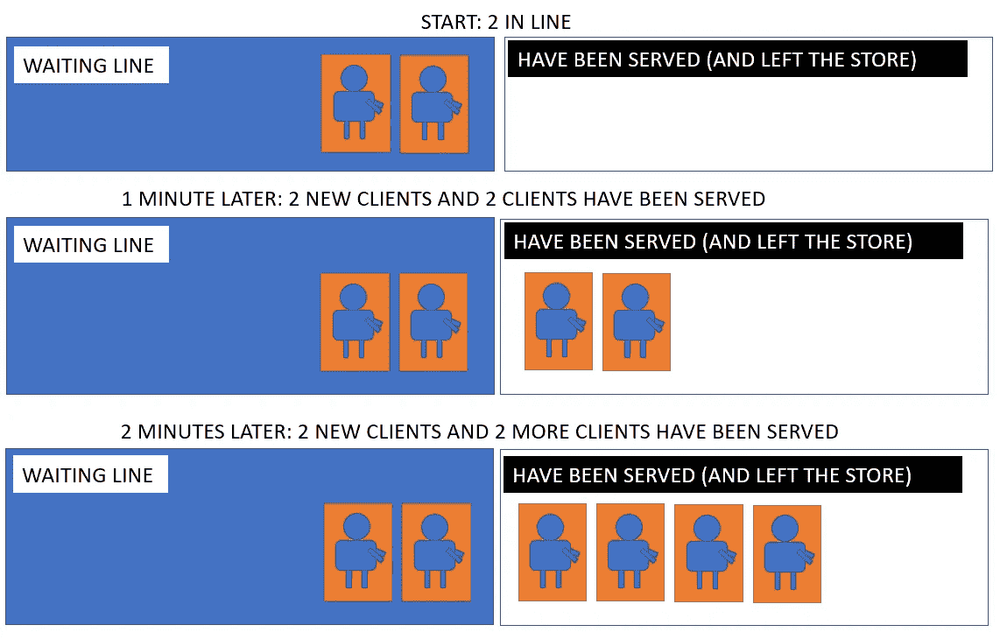

平衡中的等待线(来源:作者)

**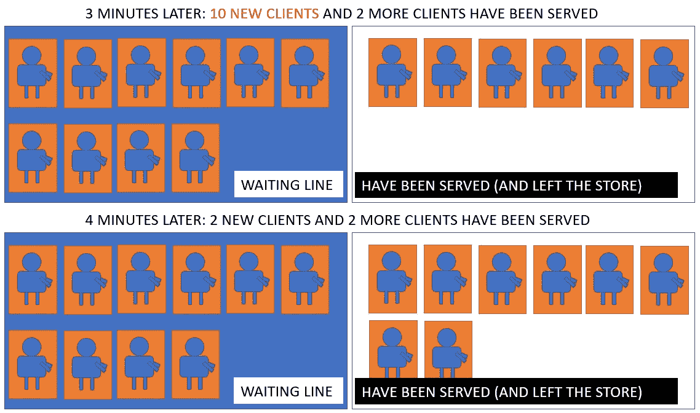**

**今天剩下的时间都在排队等候(来源:作者)**

**总之，使用等待线模型的好处是，它们允许根据特定等待线的组织情况，估计不同场景发生在等待线系统中的概率。**

# **找到经济上最优的等待线**

**一个有趣的面向业务的排队建模方法是分析你的等待时间从什么时候开始对你的销售产生负面的财务影响。**

**数字巨头们已经在这方面做了一些有趣的研究。例如，亚马逊发现等待时间(页面加载)每增加 100 毫秒，他们就会损失 1%的销售额([来源](https://www.gigaspaces.com/blog/amazon-found-every-100ms-of-latency-cost-them-1-in-sales/))。这种类型的研究可以针对任何特定的等候线进行，以找到理想的等候线系统。**

> **提示:在建立实际等待线模型之前，找到你的目标等待线 KPI**

## **排队模型 KPI**

**等待时要遵循的主要财务 KPI 是:**

*   **人事费**
*   **等待时间的成本(机会成本)**
*   **总成本**

**客观研究这些成本的一个很好的方法是试验不同的服务级别，并构建一个图表，x 轴表示服务量(或服务人员), y 轴表示成本。这给出了以下类型的图形:**

**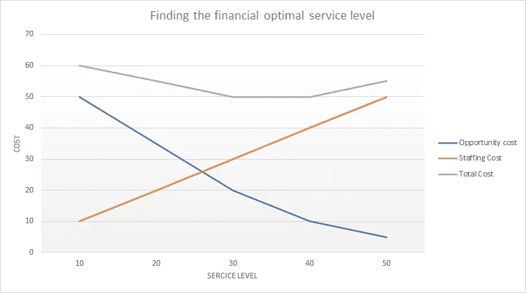**

**寻找最佳的财务服务水平。(来源:作者)**

**在此图中，我们可以看到，服务级别为 30 到 40 时，总成本最小。即使我们可以在服务级别为 50 的情况下为更多的客户提供服务，这也抵不上员工成本。**

## **概率 KPI 达到我们的目标-等待线**

**一旦我们设置好这些成本 KPI，我们就应该研究概率 KPI。这意味着:试图确定我们的等待线的数学定义，并使用模型来计算等待线系统达到某个极值的概率。**

**这种概率问题的例子有:**

*   **每月至少“有可能”出现一次的最糟糕的排队情况是什么？**
*   **有多少人会等超过 x 分钟？**

**等待线建模还可以模拟更长的运行时间和极端情况，以分析非常复杂的多级等待线系统的假设情景。**

# **M/M/1 队列——标准的等待队列**

**我们将进入的第一个等待队列是最简单的等待队列。它有一条等待线和一个服务器。**

**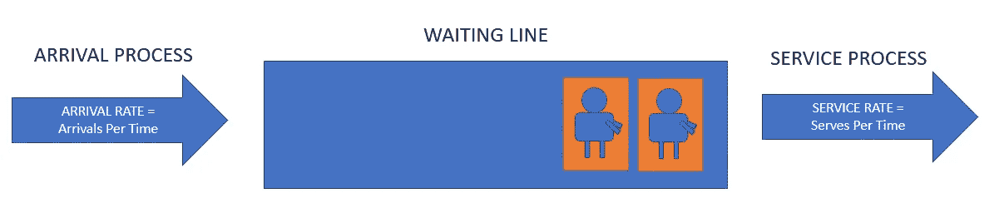**

**最简单的排队系统**

**只要知道到达过程和服务过程的概率分布，这条等待线的所有 KPI 都可以用数学方法识别出来。**

**如果满足下列条件，这个等待系统称为 M/M/1 队列:**

## ****1。到达遵循泊松分布****

**泊松分布是一种著名的概率分布，它描述了在给定平均事件率的情况下，在固定时间范围内发生一定数量事件的概率。**

**如果之前的分析表明我们的到达遵循泊松分布(通常我们会将此作为一种假设)，我们可以使用平均到达率，并将其代入泊松分布，以获得固定时间范围内特定数量的到达的概率。**

**以下示例显示了当到达率为 1/次且到达次数遵循泊松分布时，每个客户端到达次数的可能性。**

**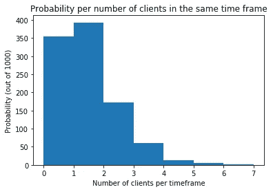**

**我们使用泊松分布的原因很简单，在实践中，等待线上到达的变化经常遵循这个概率。还有其他选择，我们将在后面看到一个例子。**

## **2.服务时间遵循指数分布**

**M/M/1 排队的第二个准则是服务持续时间服从指数分布。这意味着服务持续时间有一个平均值，以及围绕该平均值的变化，该变化由指数分布公式给出。**

**平均等待时间为 1 分钟的指数分布示例如下:**

**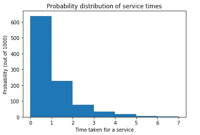**

# **一个 M/M/1 排队模型的分析**

**对于 M/M/1 队列的分析，我们从以下内容开始:**

*   **平均到达率(观察到的或假设的)，称为λ(λ)**
*   **平均服务时间(观察到的或假设的)，定义为 1μ(mu)。服务时间可以通过做 1 / μ转换成服务率μ。**

**根据这些输入，使用 M/M/1 队列的预定义公式，我们可以找到等待线模型的 KPI:**

## ****1。分析我们的** M/M/1 队列的稳定性**

> **只要λ < μ**

**It is often important to know whether our waiting line is stable (meaning that it will stay more or less the same size). For the M/M/1 queue, the stability is simply obtained as long as λ (lambda) stays smaller than μ (mu). This means that service is faster than arrival, which intuitively implies that people the waiting line wouldn’t grow too much.**

## ****2，M/M/1 队列就是稳定的。计算我们的** M/M/1 队列的利用率**

**第二个要做的分析是计算服务器被占用的平均时间。这叫利用率。利用率称为ρ (rho ),计算公式如下:**

> **ρ = λ / μ**

## **3.计算 M/M/1 队列中的客户数量**

**可以使用以下公式计算系统中的平均客户数量:**

> ***ρ*/(1*ρ***

**客户平均数量的变化定义如下:**

> ***ρ*/(1*ρ*)^2**

## **4.计算 x 个客户在我们的 M/M/1 队列中的概率**

**在客户数量上更进一步，我们也可以反过来问这个问题。与其问顾客的平均数是多少，我们可以问给定数量 x 的排队顾客的概率。**

> **P (x 客户)=(1*ρ*)**ρ^ x***

## **5.计算 M/M/1 队列中的平均响应时间**

**响应时间是客户从到达到离开所需的时间。包括等待和被服务。平均响应时间可以计算为:**

> **1/(*μ*—*λ*)**

## **6.计算 M/M/1 队列中的平均等待时间**

**平均等待时间可以计算如下:**

> ***ρ*/(*μ*—*λ***

# **M/M/1 队列示例 1**

**举个实际的例子，让我们把分析应用到一个小商店的等待线上。有一行和一个收银员，M/M/1 队列适用。假设收银员的平均工作时间是 30 秒，每分钟有两个新顾客进来。**

*   ****稳定性:**到达率λ为每分钟 2 个客户。服务时间 1 / μ为 0.5 分钟，所以服务率μ为 1 / 0.5= 2。我们注意到λ并不严格小于μ，因此这种情况是不稳定的。**
*   ****结论**:这不是一个好的排队规划，因为服务不够快，无法应对顾客的数量。**

# **M/M/1 队列示例 2**

**作为解决方案，收银员说服店主给他买了一台更快的收银机，现在他平均能在 15 秒内处理一名顾客。然而，在某个时候，店主走进他的商店，看到 4 个人在排队。车主应该为此担心吗？**

*   ****稳定性:** λ仍然是每分钟 2 个客户。服务时间 1/μ是 0.25 分钟，所以μ是 1 / 0.25 = 4。λ现在严格小于μ，因此这种情况是稳定的。**
*   **使用公式 4。P (x 个顾客)=(1*ρ*)**ρ^ x，*我们可以计算出有 4 个顾客排队的概率。
    首先我们将ρ计算为λ / μ，则得出 2 / 4 = 0.5。
    然后我们计算
    P ( 4 个客户)=(1*ρ*)**ρ^ x*
    p(4 个客户)= (1 — 0.5) * 0.5 ^ 4
    P ( 4 个客户)= 0.5 * 0.0625
    P ( 4 个客户)= 0.03125**
*   ****结论:**有 4 个客户排队的概率比较低(100 个里面有 3 个左右)。这种情况可能发生在平均客户服务时间为 15 秒的情况下，但可能性不大。我们可以假设平均客户服务时间可能稍长，或者在那个时间有更多的客户进来。**
*   **为了确保商店的正确运营，我们可以尝试调整 lambda 和 mu，以确保我们的流程在新数字下仍然稳定。**

# **其他类型的队列**

**现在，我们已经了解了 M/M/1 队列的所有内容，接下来我们将讨论一些更复杂的队列类型。为了做到这一点，我们通常会更改名称中三个参数中的一个。这就是所谓的肯德尔符号。**

## **肯德尔符号**

**我们通常有 3 种类型的流程:**

*   **m 代表马尔可夫过程:它们具有泊松到达和指数服务时间**
*   **d 代表到达之间的**固定时间**或**固定**服务时间。d 代表确定性。**
*   **g 代表到达和服务时间的“任何”分布:将其视为“不确定分布”**

**末尾的数字是从 1 到无穷大的服务器数量。M/M/1，之前覆盖的队列代表马尔可夫到达/马尔可夫服务/1 服务器。带 G 的模型可能很有趣，但是已经为它们确定了一些公式。已经对 G 队列进行了一些分析，但我更倾向于将重点放在更实用和直观的 M 和 d 组合模型上。让我们来看看三个众所周知的队列:**

*   **M/M/c 队列—一条等待线上的多个服务器**
*   **M/D/c 排队——马氏到达，固定服务时间，多服务台**
*   **D/M/1 排队——固定到达间隔，马尔可夫服务和 1 个服务员**

# **M/M/c 队列——一条等待线上的多个服务器**

**M/M/c 队列的特征在于:**

*   **每个时间段到达人数的泊松分布**
*   **服务持续时间的指数分布**
*   **同一等待线上的“c”个服务器(c 的范围可以从 1 到无穷大)**

**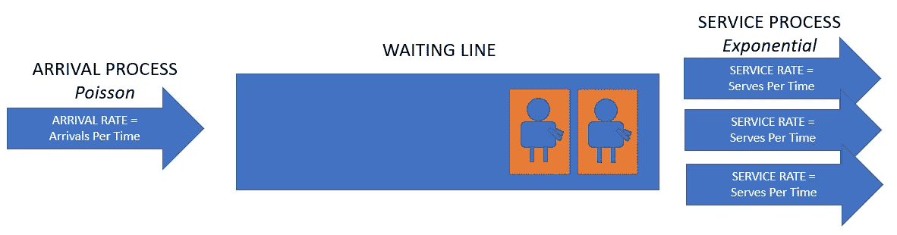**

**这种情况的一个例子是在快餐店的等待线上，每个人都站在同一条线上，并且将由多个服务器中的一个来服务，只要到达是泊松分布并且服务时间是指数分布的。**

**其公式如下:**

*   **服务器利用率ρ= λ / c * μ**
*   **如果ρ < 1**
*   **Probability of observing x customers in line:**

**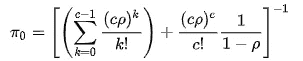**

**[源](https://en.wikipedia.org/wiki/M/M/c_queue)，则队列稳定**

**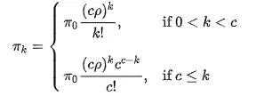**

**[来源](https://en.wikipedia.org/wiki/M/M/c_queue)**

*   **到达的顾客在到达时必须排队等候的概率是:**

**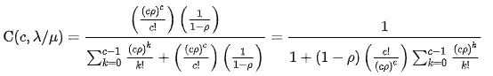**

**[来源](https://en.wikipedia.org/wiki/M/M/c_queue)**

*   **系统中的平均客户数量(等待和接受服务)为:**

**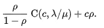**

**[来源](https://en.wikipedia.org/wiki/M/M/c_queue)**

*   **顾客平均花费的时间(等待+接受服务)是:**

**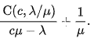**

**[来源](https://en.wikipedia.org/wiki/M/M/c_queue)**

# **M/D/c 队列—固定服务时间**

**M/D/c 队列的特征在于:**

*   **每个时间段到达人数的泊松分布**
*   **固定服务持续时间(无变化)，称为 D 表示确定性**
*   **同一等待线上的“c”个服务器(c 的范围可以从 1 到无穷大)**

**这种情况的一个例子可以是机场中用于安全扫描的自动照相亭。如果我们假设为每位乘客拍照花费的时间完全相同，并且人们按照泊松分布到达，这将符合 M/D/c 队列。**

**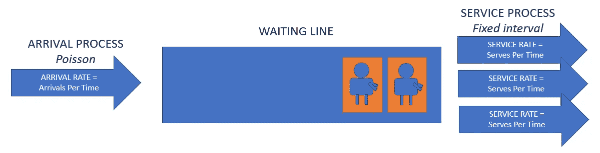**

**在只有一台服务器的更简单的常见情况下，我们有 M/D/1 的情况。适用于 M/D/1 情况的公式如下:**

*   **服务利用率ρ = λ / μ**
*   **系统中的平均客户数量是**

**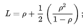**

**[来源](https://en.wikipedia.org/wiki/M/D/1_queue)**

*   **队列中等待的平均实体数计算如下:**

**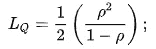**

**[来源](https://en.wikipedia.org/wiki/M/D/1_queue)**

*   **我们还可以计算顾客平均花费的时间(等待+接受服务):**

**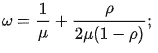**

**[来源](https://en.wikipedia.org/wiki/M/D/1_queue)**

*   **平均等待时间可以计算为:**

**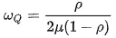**

**[来源](https://en.wikipedia.org/wiki/M/D/1_queue)**

*   **队列中有一定数量 n 个顾客的概率可以计算如下:**

**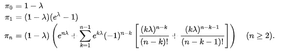**

**[来源](https://en.wikipedia.org/wiki/M/D/1_queue)**

**当 c > 1 时，我们不能使用上述公式。我们需要使用以下内容:**

*   **服务利用率ρ*ρ*=(*λ*D)/*c***
*   **只要*ρ*1，等待线就稳定**
*   **等待时间的分布如下:**

**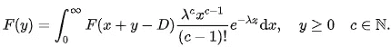**

**[来源](https://en.wikipedia.org/wiki/M/D/c_queue)**

*   **系统中的客户数量为“n”或更少的概率可以计算为:**

****

**[来源](https://en.wikipedia.org/wiki/M/D/c_queue)**

# **D/M/1 队列——固定的到达间隔**

**D/M/1 队列的特征在于:**

*   **到达之间的固定间隔( *β)* (D 表示确定性)**
*   **服务持续时间的指数分布(速率 *μ，*平均持续时间 1 / μ) (M 为马尔可夫)**
*   **1 台服务器**

**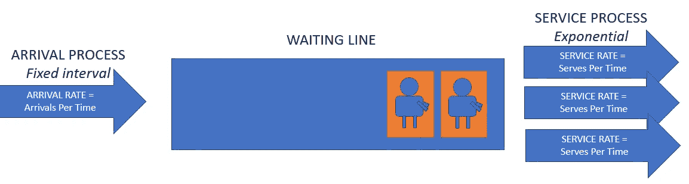**

**专用于 D/M/1 队列的公式有:**

*   **如果*μβ*为 1，则队列稳定**
*   ***δ* 是绝对值最小的方程*δ*= e ^(*-μβ*(1—*δ*))的根。**
*   **到达顾客的平均等待时间为(1/*μ*)*δ*/(1—*δ*)**
*   **零顾客队列的平均时间(空闲时间)为 *β* — 1/ *μ***
*   **系统中有一定数量客户的概率是:**

**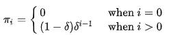**

**[来源](https://en.wikipedia.org/wiki/D/M/1_queue)**

# **特殊排队——队列变量概述**

**在本文的最后一部分，我想展示在对等待队列建模时，许多不同之处会付诸实践。在某些情况下，我们可以找到合适的公式，而在其他情况下，我们可能很难找到合适的模型。**

**以下是您可能遇到的各种变体的概述**

*   ****线路数量**:一些队列被分割成多条线路(或者由系统分割，或者由客户选择)**
*   ****阶段数量**:一些队列被分成多个阶段，例如在外卖餐馆，队列通常被分为点菜和取餐两个阶段。**
*   ****优先级规则**:有些队列有特定的优先级规则，会影响系统的吞吐量。**
*   **批量排队:一些系统成批提供服务(如主题公园景点)，或者有时顾客成批到达，但却是一对一地服务(如对刚着陆的飞机上的每个乘客进行护照检查)。**
*   ****杰克逊网络**:有时多个队列在服务节点相互连接，从而创建队列网络。多层等候队伍的一个例子是呼叫中心，你从一个代理人到另一个代理人，每一步都更靠近出口。**
*   ****犹豫**表示客户拒绝在队列过长时加入。如果已知顾客没有耐心，这可能是排队系统中的一个重要因素。**
*   ****出尔反尔**指进入后离开队列。如果这种情况经常发生，你可以考虑两阶段排队，这样人们就不太可能离开。或者改善平均等待时间。**
*   **变换位置意味着从一个队列换到另一个队列。对于你的情况来说，这可能有问题，也可能没有问题，但是它可能对你的计算的正确性有影响。**

# **结论**

**看完这篇文章，你应该对分析上众所周知的不同的等待线模型有所了解。由于对排队论的研究，在实践中把排队论应用到等待线上变得相对容易了。**

**对于一些复杂的排队问题，可能更难找到解决方案，因为这可能需要更理论化的数学方法。**

**我希望这篇文章能为你进入排队模型和排队论提供一个很好的起点。感谢阅读！**