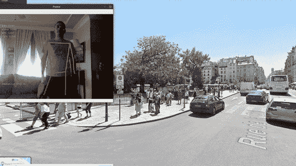
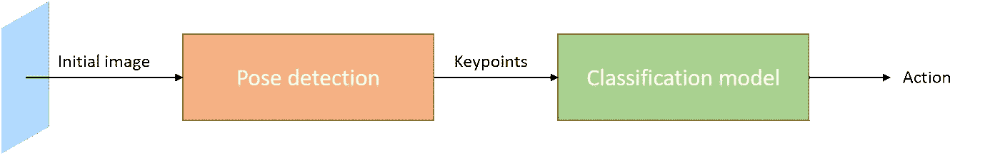
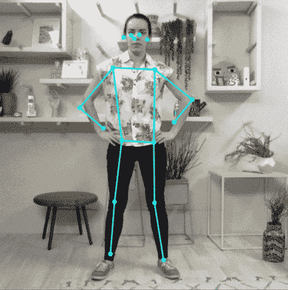
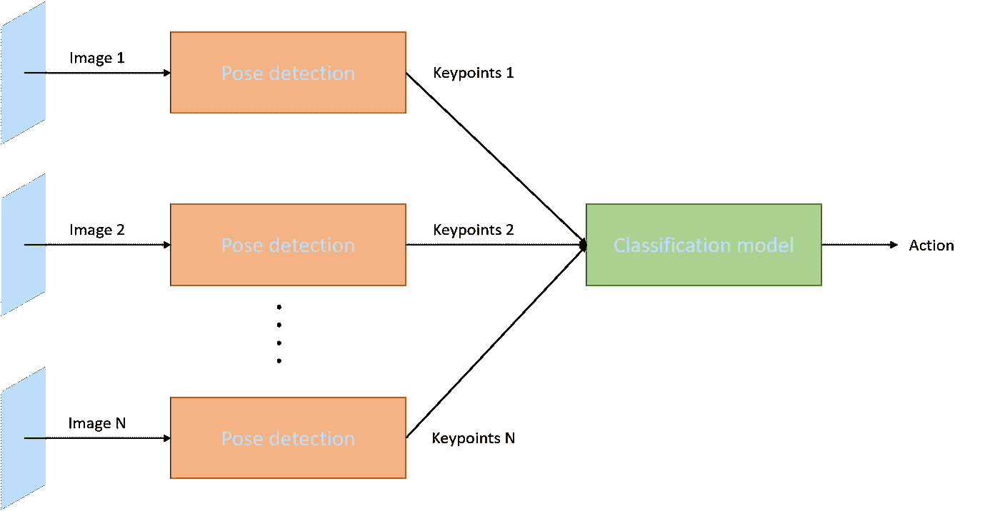
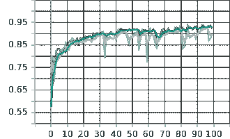
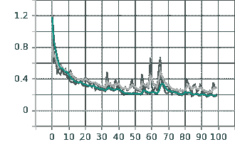

# 带着动作识别环游世界

> 原文：<https://towardsdatascience.com/walking-around-the-globe-with-action-recognition-64bceaa65435?source=collection_archive---------57----------------------->

古伊列梅·斯特卡内拉在 [Unsplash](https://unsplash.com?utm_source=medium&utm_medium=referral) 上的照片

## 如何在家使用 AI 技术环游地球？

在本文中，我们将构建一个能够使用 Tensorflow 识别一些动作的应用程序，并将结果发送到 Google Street View，由它来执行这些动作。下面的 GIF 显示了应用程序的输出:

实时动作识别示例及其在谷歌街景中的应用

*在开始之前，需要注意的是有两个人参与了这个项目。因此，在本文中，我们将使用复数。*

有各种各样的方法来解决这个问题:在意识到没有多少现成的动作识别模型来重新训练所需的动作后，任何人脑海中出现的第一个想法可能是使用在具有不同动作的巨大数据集上训练的卷积神经网络，将每个图像映射到人正在执行的动作。该领域受过更多培训的人可能会考虑使用 Inception Network 或 ResNet，并在 ImageNet 或 COCO 数据集上转移学习。

然而，经过一些思考后，人们可以意识到，将图像输入神经网络并期望获得准确的分类是远远不现实的。模型将如何识别人在哪里？如果图像中不止一个人呢？假设地球上有和人一样多的体形，我们如何做出一个可接受的概括？

通过前面的段落，我们想指出，在某些情况下，最初的想法并不是更好的想法，对问题的反思可能会导致更深入、更稳健的解决方案。*(看到我们在那里做了什么吗？)*

# “两阶段”方法

在我们看来，这不是一个单一的神经网络可以解决的问题，至少有两个阶段必须顺序工作:首先，应该有一种检测人身体关键点(或接合点)的方法，从而解决不同体型的问题。第二，分类系统应该在第一阶段的结果上工作，以关键点作为坐标，并且以这种方式使其不知道初始图像的具体属性。

动作识别的基本模型

1.  姿态检测

姿势检测的问题非常广泛，对于我们大多数必须在 Google Colab 中训练他们的模型的人来说，这可能是不可估量的。幸运的是，有一些选项(训练过的模型)表现很好并且具有很高的准确性，比如 [PoseNet](https://github.com/tensorflow/tfjs-models/tree/master/posenet) 或者 [OpenPose](https://github.com/CMU-Perceptual-Computing-Lab/openpose) 。这里我们只有一个小条件:选择的模型必须在推理模式下以合适的帧速率运行，因为我们希望实时识别动作。

姿态估计。来源:[https://www . tensor flow . org/lite/models/pose _ estimation/overview](https://www.tensorflow.org/lite/models/pose_estimation/overview)

受限于这个条件，我们准备选择 PoseNet，即使在手机中也是实时运行的。此外，PoseNet 更容易使用，因为它提供了 Tensorflow Lite 和 tfjs 文件。PoseNet 有两种不同的“风格”:MobileNet 和 ResNet，第一种更快，但是(经过一些试错过程)非常不准确。因此，我们将使用以 ResNet 为主干的 PoseNet。

一旦我们得到了关键点，下一步就是用分类模型识别动作。

2.分类模型

让我们停下来想一想，我们要对哪些动作进行分类:行走、向左或向右看、站立。从关键点的角度来看，第一个(行走)与最后一个(站立)的不同之处在于它们跨帧的移动:行走是不同站立帧的拼接，而站立是相等站立帧的拼接。因此，对分类模型的输入必须来自一系列帧，而不是一个单独的帧。以前的模式应该相应地改变:

动作识别的选定模型

因为我们想要处理时间演化，所以一个好主意是选择递归神经网络，其输入将具有维度(#帧，#关键点)，其中#帧表示预测动作所需的图像数量。此外，人们必须注意到关键点带有一定程度的信心，这意味着从一帧到下一帧可能会有“消失”的关键点。为了解决这个问题，我们施加了这样的条件，即一个系列的第一帧应该呈现眼睛和臀部，并且在同时出现的帧中消失的关键点将通过先前的高置信度关键点来推断。这一推理的动机来自于这样一个事实，即一幅图像在两帧之间不会有很大的不同，为了实现这一点，我们需要一个高的帧速率。

我们将使用一个带有一层 LSTM 细胞的 RNN，后面跟着一个前馈神经网络。使用正常反向传播和 SGD 进行训练，下面的图片显示了训练过程的准确性(左)和损失(右):

左:模型精度。右:损失。绿色表示培训结果，灰色表示验证结果

识别出这个动作后，剩下的唯一工作就是将它传输到谷歌街景中。鉴于街景可以通过键盘控制，Selenium 是一个很好的选择，可以让我们与网页进行交互。建立连接后，向前执行一步，向驱动程序发送一个点击:

使用 Selenium 在谷歌街景中前行

并且按键事件将向左或向右移动相机:

使用 Selenium 旋转谷歌街景的摄像头

这样，关于如何制作一个动作识别系统的基本概念将被涵盖。如果您想改进我们的模型或者只是玩玩它，请随意浏览 GitHub 中的资源库。

 [## 移动人工智能/虚拟行走

### 在隔离期间，由于新冠肺炎疫情，我们现在有权利在街上自由行动…

github.com](https://github.com/Moving-AI/virtual-walk) 

此外，让我知道任何关于模型或文章本身的方法的建议或意见。