# 走过线性回归

> 原文：<https://towardsdatascience.com/walking-through-a-linear-regression-dca9942111e4?source=collection_archive---------6----------------------->

## 机器学习过程的全面分解


卢卡·布拉沃在 [Unsplash](https://unsplash.com?utm_source=medium&utm_medium=referral) 上的照片

处理数据时，线性回归是基础算法。它被广泛使用，是现有的最适用的监督机器学习算法之一。通过执行线性回归，我们试图捕捉预测自变量( **X1，X2 等)**和预测因变量( **Y)** 之间的最佳线性关系。让我们一起来看看 Python 中的线性回归模型过程。包含所有代码和数据的存储库可以在[这里](https://github.com/andrewcole33/carseat_sales_linreg)找到。

# 该设置

我们将使用一个模拟数据集来代表一家公司的汽车座椅销售。该公司希望他们的数据团队建立一个模型，在给定一个包含多个预测独立变量的数据集的情况下，该模型能够准确地捕捉和预测他们商店所在地的汽车座椅销售活动。变量描述如下:

*   **销售额:每个地点的单位销售额**
*   CompPrice:在每个地点最接近的竞争对手收取的价格
*   收入:社区收入水平
*   广告:公司在各地的本地广告预算
*   人口:该地区的人口规模(以千计)
*   价格:每个站点汽车座位的收费价格
*   搁置位置:现场搁置位置的质量(好|差|中)
*   年龄:当地人口的平均年龄
*   教育:每个地点的教育水平
*   城市:商店位于城市还是农村
*   美国:无论商店是否在美国

销售将是我们的因变量(或目标),其余 10 个变量(特征)将被处理和操纵，以协助我们的回归。在这一点上，注意我们的变量由什么组成是很重要的。我们有某些变量，如收入、广告或人口，这些都是基于整数的变量。然而，我们也有像 Urban、USA 和 ShelveLoc 这样的变量。这些变量的值代表分类值(是/否；好/差/中等；等等。).随着我们的进展，我们将会看到如何解释这些差异，在这个阶段，重要的是要注意到它们是不同的。(利用 Python 中的‘df . info()’命令将有助于识别变量值的构成。

这是我们数据帧的快照:

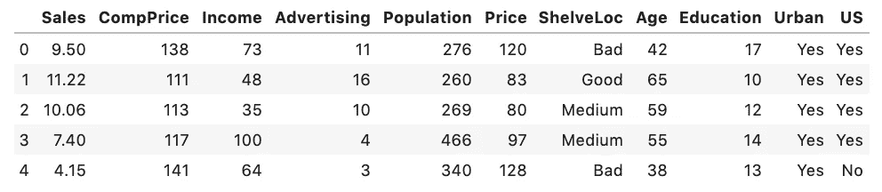

df.head()

# 预处理

令人震惊的是，预处理阶段是我们在构建模型之前准备数据框架及其内容的阶段。在此阶段，我们将执行训练-测试-分割，使用编码处理上述分类变量，最后处理可能出现的任何缩放问题。

我们需要做的第一件事是将数据框架分成目标系列和预测系列。x 将是我们的独立变量的数据框架，而 y 将是我们的目标特征。

```
X = df.drop('Sales', axis = 1)
y = df.Sales
```

现在我们已经有了每个分割，我们可以执行训练-测试-分割。这一步对我们的机器学习模型至关重要。我们将数据分为“训练”组和“测试”组。训练集将用于我们的模型进行实际学习，我们的测试集将用于验证输出，因为我们已经知道这些值。为了让我们访问这个特性，我们必须从 Sklearn 导入它。我们有 400 个数据条目，这是一个足够大的数据量，所以我们将对我们的训练量和测试量分别使用 70/30 的比率(对于函数中的 test_size 参数)。

```
from sklearn.preprocessing import train_test_splitX_train, X_test, y_train, y_test = train_test_split(X, y, test_size = .30, random_state = 33)
```

接下来，我们需要进行一些快速清洁程序。让我们从训练数据集中删除任何重复值或缺失值。

```
X_train.drop_duplicates(inplace = True)
X_train.dropna(inplace = True)
```

# 处理不同的数据类型

如前所述，区分数据集中的数据类型至关重要。这要求我们将数字数据(整数或连续数)与分类数据(二进制结果、用数字表示的位置等)分开。).至此，**所有的**数据类型都包含在我们的 *X_train 中。*

```
X_train.info()
```

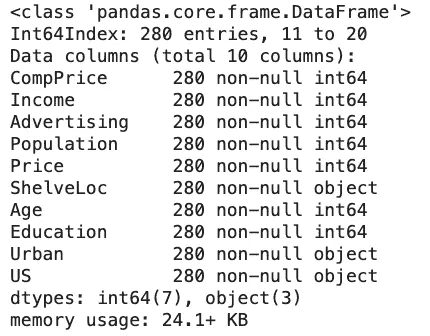

我们在第三列中看到了数据类型，其中除了三个特性之外，所有特性的数据类型都是“int64”，这意味着我们的数据帧将该数据解释为整数。这些将被视为我们的数字数据。剩下的三个分类变量将被暂时排除。

# 数字数据

下面的代码块将选择所有数据类型的特性，不包括我们的分类数据“object”。第二行和第三行代码只是从我们的 *X_train* 中带来了列标题。

```
X_train_numerics = X_train.select_dtypes(exclude = 'object')
X_train_cols = X_train.columns
X_train_numerics.columns = X_train_cols
```

为了验证这一点，下面左边是我们新的纯数值型数据集的数据信息。下图右侧是我们的数字数据帧的快照。

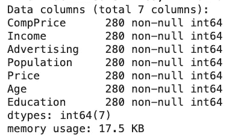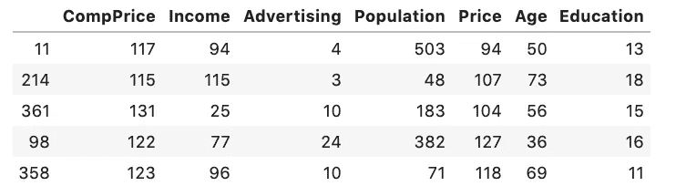

尽管我们现在已经收集了所有的数字数据，但是我们的预处理工作还没有完成。现在我们必须了解每个数字序列包含什么。例如，“CompPrice”代表来自另一个竞争对手的美元数字，而“Education”代表每个地点的教育水平，但我们没有任何进一步的信息。人口代表(以千计)一个地区有多少人。即使这些都是数字数据的形式，我们也不能真正比较它们，因为单位都是不同的！我们如何处理这个难题？缩放！

## **缩放我们的数据**

缩放将允许我们所有的数据转换成一个更正常的分布。我们将使用 Sklearn 的 StandardScaler 方法。该函数将通过移除平均值并缩放至单位方差来有效地标准化各自的特征。此函数将允许我们移除某个要素(比如 CompPrice，由于其较大的值)对预测变量产生不正确影响的任何影响。

```
from sklearn.preprocessing import StandardScaler
from scipy import statsss = StandardScaler()X_train_numeric = pd.DataFrame(ss.fit_transform(X_train_numeric))
X_train_numeric.set_index(X_train.index, inplace = True)X_train_numeric.columns = X_numeric_cols
X_train_numeric.head()
```

首先，我们导入并实例化一个 StandardScaler 对象。然后，我们拟合并转换我们的数字数据帧，并将索引特征设置为等于我们的原始 X_train 的索引特征。这将确保我们对正确的数据条目进行操作。我们必须再次设置列名，因为它们在通过 StandardScaler 对象时被删除了。我们得到的数据如下所示:

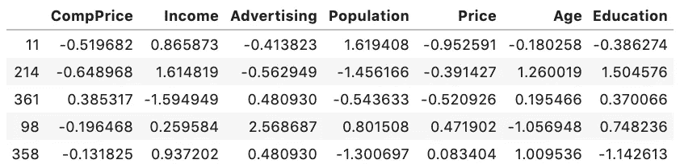

我们注意到一些事情。我们的数据值不再像以前那样了。我们已经去除了原始特征的任何和所有大小差异，它们现在都是一致的尺度，没有任何单个特征对我们的预测变量有不准确的影响。

## **去除异常值**

我们处理数字数据的最后一步是移除任何异常值。异常值可能会导致要素数据的不准确表示，因为少量的输入值可能会对另一个变量产生不准确的影响。我们将通过使用“stats”包并过滤任何 z 得分值大于平均值 2.5 倍标准差的值来实现这一点。

```
X_train_numeric = X_train_numeric[(np.abs(stats.zscore(X_train_numeric)) < 2.5).all(axis = 1)]
```

# 分类数据

现在我们已经准备好了数字数据，我们想处理分类数据。让我们把我们的分类数据隔离到它自己的数据框架中，看看我们在处理什么。这与使用 numeric 时的第一步相同，我们只需将“select_dtypes”方法中的参数从“exclude”更改为“include”。

```
X_train_cat = X_train.select_dtypes(include = 'object')
```

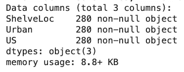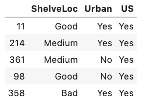

右图向我们展示了我们的分类数据框架实际上看到了什么。如果我们的计算机能够理解如何解释“好”、“中等”或“是”，这将是非常酷的，但不幸的是，它还没有那么智能——我们将稍后保存 NLP 模型；).此时，我们需要通过一个称为编码的过程将这些值转换成我们的计算机可以理解的东西。

## 编码分类数据

让我们开始处理我们的城市和美国变量。这些变量都是二进制的(“是”或“否”)，所以我们想把它们用二进制值表达给我们的计算机，而不是“是”或“否”。我们将使用 sklearn 的 LabelBinarizer 函数来实现。要使用该函数，我们首先为每个特性实例化一个 LabelBinarizer()对象，然后对每个特性执行 fit_transform。

```
from sklearn.preprocessing import LabelBinarizerurban_bin = LabelBinarizer()
us_bin = LabelBinarizer()X_train_cat.Urban = urban_bin.fit_transform(X_train_cat.Urban)
X_train_cat.US = us_bin.fit_transform(X_train_cat.US)
```

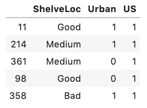

我们得到的数据帧现在用 1 表示“是”,用 0 表示“否”。现在让我们把注意力转向“ShelveLoc”特性。因为这个特性不再有二进制值集，所以我们必须使用不同类型的编码。我们将为每个值创建一个新的二进制变量，并删除原来的特性。这将允许计算机解释哪个变量具有“真”二进制值，然后给它分配一个整数。我们实际上是为每个值创建虚拟变量。这听起来有点令人困惑，但是让我们来看看它的实际应用。我们将使用熊猫。get_dummies()函数将每个值分配给一个虚拟变量。*注意:我们通过“drop_first = True”参数来避免我们的数据帧中的自相关，这是* ***基本的*** *。*

```
X_cat_prepped = X_train_cat.merge(pd.get_dummies(X_train_cat.ShelveLoc, drop_first=True), left_index=True, right_index=True)X_cat_prepped.drop('ShelveLoc', axis = 1, inplace=True)
```

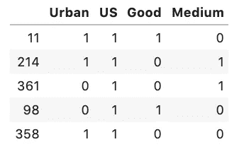

我们现在可以很容易地看到分类值选项是如何被转换成新的二进制变量供我们的计算机解释的。

现在我们已经完成了数字和分类数据类型的预处理，我们将它们合并回一个完整的准备好的数据帧。

```
X_train_prep = pd.merge(X_cat_prepped, X_train_numeric, left_index = True, right_index = True)
```

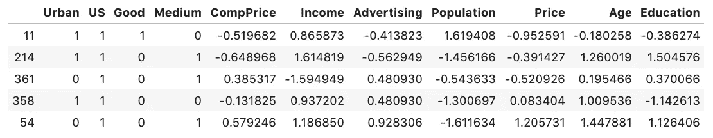

我们的最后一步是设置我们的 *y_train* 来包含正确的条目。请记住，当我们考虑到重复、缺失值和异常值时，我们在训练测试分割后从我们的 *X_train* 中删除了几个条目。该步骤确保我们的 *y_train* 与我们的 *X_train* 长度相等且准确。

```
y_train = y_train.loc[X_train_prep.index]
```

# 建立线性回归模型

我们已经处理了模型的本质，即预处理。一旦我们有了准备好的数据，构建实际的线性回归模型就相当简单了。我们将首先导入一个线性回归模型，并从 Sklearn 实例化它。然后，我们将 *X_train_prep* 和 *y_train* 拟合到我们的线性回归对象。最后，我们将利用。predict()方法来预测我们未来的值。

```
from sklearn.linear_model import LinearRegressionlr = LinearRegression()lr.fit(X_train_prep, y_train)y_hat_train = lr.predict(X_train_prep)
```

我们的模型现在已经完全建立和预测好了。为了了解我们的模型表现如何，我们将利用两个指标:一个 **r 平方值**和**均方根(rmse)。**

*   **R 平方:**数据与我们拟合的回归线接近程度的统计度量(也称为“拟合优度”)。范围是[0，1]，其中 r2 = 1.00 意味着我们的模型解释了响应数据围绕其平均值的所有可变性，而 r2 = 0 意味着我们的模型解释不了任何可变性。**R2 越高，模型越好。**
*   **RMSE:** 预测值向量和观测值向量之间的归一化相对距离。“小”值表示误差项更接近预测的回归线，因此证明模型更好。**RMSE 越低，模型越好。**

```
from sklearn.metrics import r2_score, mean_squared_errorprint(f"r^2: {r2_score(y_train, y_hat_train)}")
print(f"rmse: {np.sqrt(mean_squared_error(y_train, y_hat_train))}")
```

上述函数将通过我们的训练集和预测集( *y_hat_train* )来建立模型性能的度量分数。

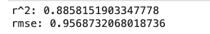

我们的两个指标看起来都非常好！我们的 r2 值 0.88 告诉我们，我们的模型已经捕获了我们的平均投影周围的 88.6%的可变性。对于我们的 RMSE，我们可能需要多个模型进行比较，因为它们是一个相对的衡量标准。如果我们运行另一个模型并返回 RMSE = 1.5，我们的第一个模型将是两个模型中较好的。

# 线性回归假设

当执行 OLS 线性回归时，在模型建立和预测之后，我们剩下最后一步。这些回归有一些模型假设，如果它们不满足，那么我们的结果就不能被认为是稳健和可信的。这些假设之所以存在，是因为 OLS 是一种**参数**技术，这意味着它使用从数据中学到的参数。这使得我们的基础数据必须满足这些假设。

## **1。线性度**

线性假设要求我们的目标变量(销售额)与其预测变量之间存在线性关系。试图将非线性数据集拟合到线性模型会失败。最好用散点图来测试。由于离群值的存在会产生重大影响，因此删除离群值对于这一假设非常重要。因为这个数据集是根据线性假设随机生成的，所以我们不需要为我们的数据测试这个假设。

## 2.常态

正态假设要求模型**残差**应遵循正态分布。检验这一假设最简单的方法是通过直方图或分位数-分位数图(Q-Q-Plot)。

*   **QQ 图**:通过绘制两个概率分布的分位数来比较它们的概率图。这张图有助于我们了解样本是否呈正态分布。该图应显示一条正直线，剩余点在直线上。如果我们的残差线有失真，那么我们的数据表明是非正态分布。

```
from statsmodels.graphics.gofplots import qqplotqqplot(residuals, line = 'q')
```

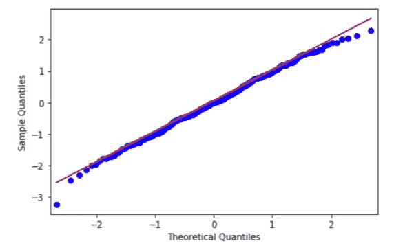

正如我们在上面看到的，蓝色的观测点始终以线性模式下降，向我们证明了我们的残差是正态分布的。这个假设现在得到了验证。

## 3.同方差性

同方差性表示因变量在自变量的值之间具有相等的方差。我们的残差在回归线上应该是相等的。如果不满足这一假设，我们的数据将是异方差的，我们的变量散点图将是圆锥形的，表明我们的独立变量值的方差不相等。要查看我们的残差:

```
residuals = y_hat_train - y_trainplt.scatter(y_hat_train, residuals)
```

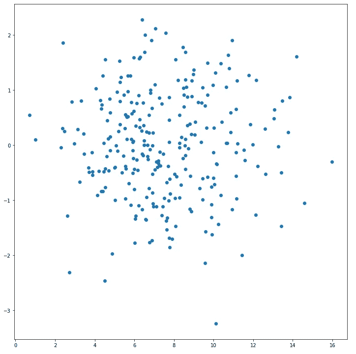

我们没有看到任何类似圆锥曲线的形状，也没有证据表明所有值的方差不相等，所以我们可以说这个假设也得到验证。

# 总结

我们现在已经完成了线性回归的整个过程。希望这个笔记本可以为一个非常强大和适应性强的机器学习模型提供一个良好的开端。同样， [GitHub 库](https://github.com/andrewcole33/carseat_sales_linreg)可用于所有代码。在我的下一篇博客中，我将通过一个非常强大的数据科学工具——特征工程来改进这个模型！