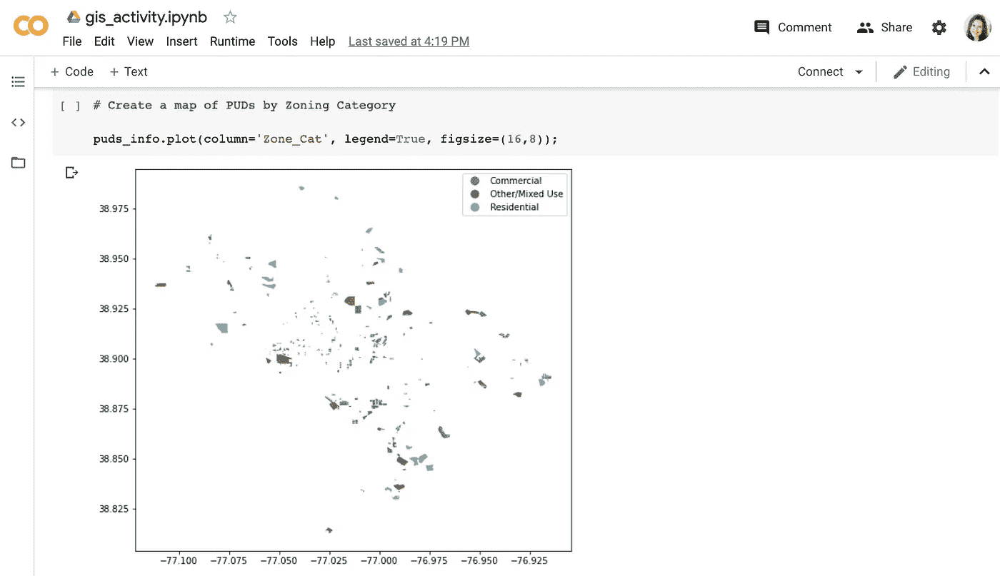
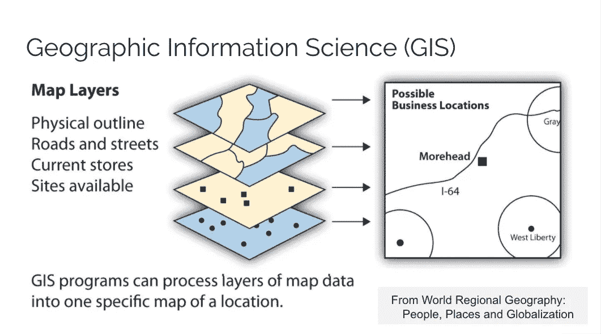
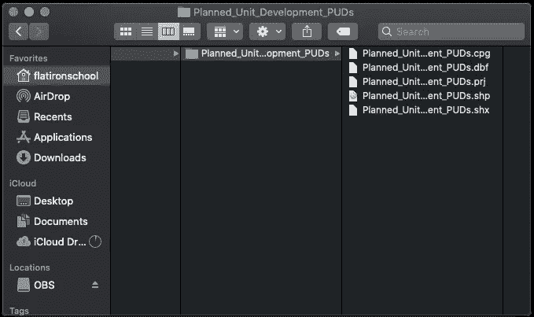
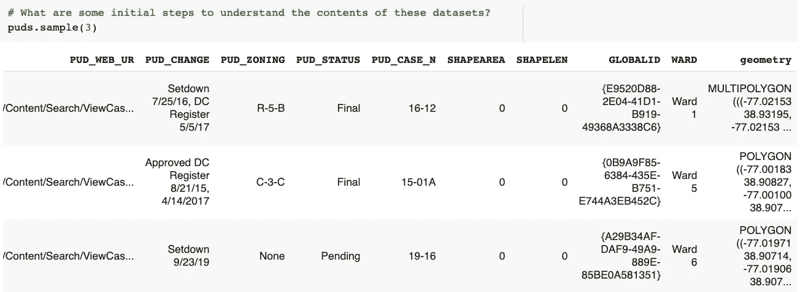
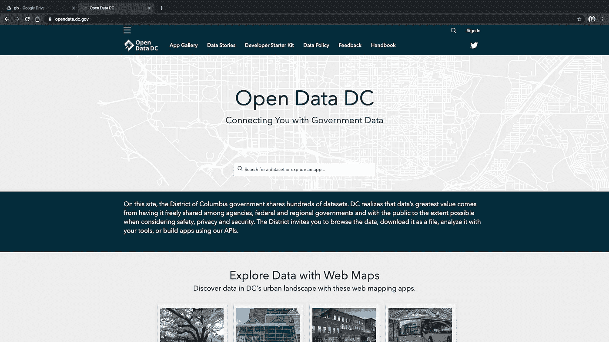
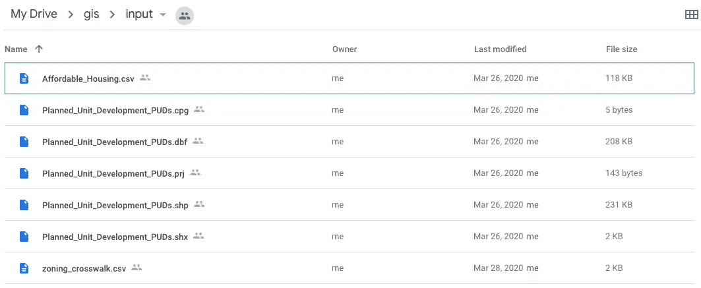
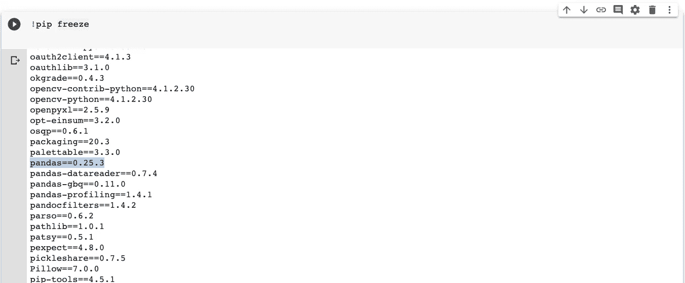
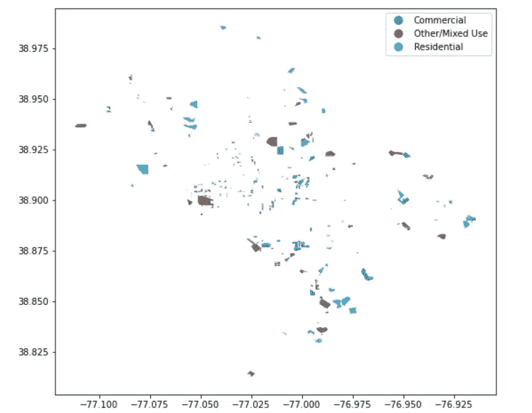
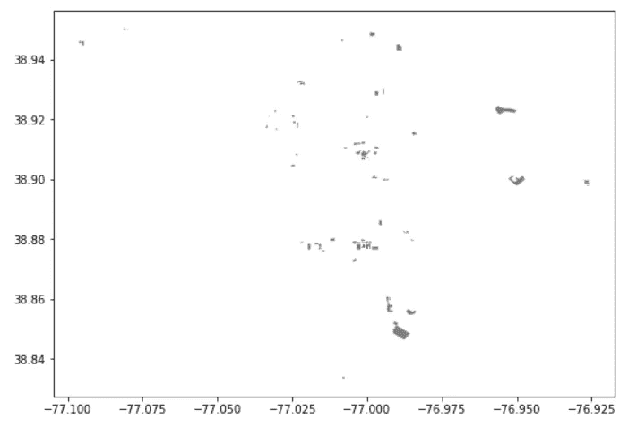
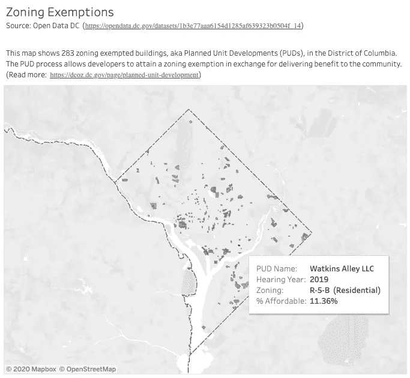

# 演练:在 Python 中映射 GIS 数据

> 原文：<https://towardsdatascience.com/walkthrough-mapping-gis-data-in-python-92c77cd2b87a?source=collection_archive---------6----------------------->

## [视频教程](https://towardsdatascience.com/tagged/video-tutorial)

## 地理数据似乎从未像现在这样重要。本文将提高您对地理空间信息的理解，通过简洁、易于使用的 pandas 数据框架，让您进入丰富的地理信息科学(GIS)世界。

[简介](#06ea) | [活动](#8db5) | [资源](#69f5)

通过遵循这些代码，您将学会在 Google Colab 的虚拟环境中托管的 Jupyter 笔记本中导航地理形状文件。最后你会得到一些非常漂亮的地图，突出显示 DC 华盛顿州的住房情况。

地理信息科学(GIS)可能是一个相当复杂的领域，因此请将本演练视为一个入门教程。为了跟进，你需要有一个免费的 [Google Drive](https://drive.google.com/drive/my-drive) 账户——所以如果你还没有的话就去设置吧。谷歌提供了 15GB 的免费存储空间，所以至少你的硬盘上会有更多的空间来存放潮湿的地理信息系统迷因。

在本演练中，您将从 DC 的开放数据门户上传数据，然后从 Google 的 Colab 平台连接到这些数据集。在这个环境中，我们将对数据集进行一些分析，并最终制作地图。

本教程中提到的所有资源，包括 [Google Drive](https://drive.google.com/) 、 [Google Colab](http://colab.research.google.com) 和 [Tableau Public](https://public.tableau.com/en-us/s/) ，都是免费的——不需要你的信用卡，没有注册试用期，没有“你的第一个孩子叫什么名字，Rumpelstiltskin？”废话。

如果您不想参与代码跟踪，[单击此处链接到完整的 Colab 笔记本和本练习中使用的其他材料](https://drive.google.com/open?id=1kEwPhEWhR8ta3_DADXcGqZNdMuL7Mjf9)。但是你听过他们说的旅程比目的地更重要吗？让我们开始演练吧！

# 目录

1.  **简介** | [映射成表](#06ea) | [包](#367b) | [数据结构](#6c3e)
2.  **活动** | [虚拟环境](#8db5) | [数据收集](#5ccd) | [打码](#f84f)
3.  **总结** | [资源](#69f5)

[将地图翻译成表格](#06ea) | [地理空间包](#367b) | [地理空间数据结构](#6c3e)

# 将地图转换成表格

在本练习中，我们将在 Google Colab 托管的 Jupyter 笔记本中创建一个地图，显示分区豁免的位置。此分析将直观地回答以下问题:

## 我们如何对 DC 华盛顿州获得分区豁免的建筑进行分类？

展示 DC 华盛顿州分区豁免的地图

> 如果你想了解更多关于 DC 分区豁免的信息，以及它们如何代表企业利益和公平发展之间的脆弱妥协，请查阅这篇文章。

由于多种原因，使用地理数据可能会很困难。首先，数据科学家可能会对许多层次的信息感兴趣。其次，这些信息并不总是以一种易于格式化为表格数据帧的方式来组织。

[GIS 流程中图层的图示](https://saylordotorg.github.io/text_world-regional-geography-people-places-and-globalization/s04-introduction-to-the-world.html)

处理 GIS 数据通常需要压缩不同类型的非结构化物理和政治信息。为了给这些数据的数字表示提供意义，我们将使用坐标参考系统(CRS)的初始化来导入数据集中的每个“层”。这组数字(例如 epsg:4326)构成了地球的标准坐标框架——解释了空间中的点如何相互关联( [*阅读更多*](http://www.epsg.org/) )。

例如，在本演练中，我们将查看建筑物的物理位置，用经度和纬度表示，以及它们在 DC 华盛顿州的政治边界内的位置(基于 EPSG 的标准 4326 CRS)。

下面是我们在设置 CRS 时如何导入数据集的预览。不要太担心理解这段代码的每一个方面——它将在演练部分详细解释。

## Python 的地理空间包

GeoPandas 是在 Python 中操作地理数据的基本包

如果你使用 Python 已经有一段时间了，你可能对[熊猫](https://pandas.pydata.org/docs/)有些熟悉。本质上来说，熊猫在 Python 方面更胜一筹。您可以将数据组织为行和列，并使用类似于 Excel 的功能执行操作，甚至更多。

[GeoPandas](https://geopandas.org/index.html) 是一个建立在这些能力之上的库，能够从 GIS 包 [Shapely](https://shapely.readthedocs.io/en/latest/manual.html) 中建模点、线和多边形。您还需要导入几个名为 [rtree](https://toblerity.org/rtree/) 和 [spatialindex](https://github.com/simplegeo/spatialindex) 的附加包来支持 GeoPandas 中的操作。

相关包的导入语句——我们将在代码部分回到这个问题

*注意:要让 rtree 在您的本地环境中运行，我建议使用家酿软件包管理器* [*brew 安装 spatial index*](https://formulae.brew.sh/formula/spatialindex)

# 地理空间数据结构

为了保存数据集中的地理空间信息，这些信息保存在一个 [shapefile](https://www.loc.gov/preservation/digital/formats/fdd/fdd000280.shtml) 中。shapefiles 不是一个文件，而是由几个组件组成，每个组件都有自己的扩展名。这组文件将共享相同的文件名前缀，并且应该存储在一个目录中。

下面是这些文件在您的文件系统中的样子。

使用 shapefile 时，其中三个组件文件是必不可少的:

*   *。shp* —提供对每个记录的直接访问的主文件，作为具有顶点列表的形状
*   。 *shx —* 索引文件，包含记录相对于主文件开头的偏移量
*   。*DBF*-dBASE 表文件，包含基于主文件“几何图形”栏的特征属性

“几何”列是保存地理空间信息的字段，即数据的*形状*，无论是点、线还是多边形。在我们的例子中,“geometry”列中的每条记录都包含一个多边形，它代表了 DC 一个免分区建筑的物理轮廓。

在 shapefile 的地理数据框表示中，您可以看到“几何”列包含一个面或多面对象，其坐标表示每条记录的折点

虽然在使用 GIS 数据库和制图应用程序时非常有用，但 shapefiles 也有一些主要限制:

*   列标题的最大长度为 10 个字符
*   文本字段的最大长度为 254 个字符
*   最大字段数为 255

我们需要记住这些约束，因为我们将从该活动中导出数据集作为 shapefile。当通过添加新列来操作 GIS 数据时，我们需要将列名控制在 10 个字符以内。如果我们希望将一长串文本与每条记录相关联，我们会将该信息与主地理数据框架分开存储(例如，作为熊猫数据框架，我们可能会将其导出为 csv 或 json ),以避免该文本被截断。最后，如果我们处理非常宽的数据帧，我们需要注意不要超过 255 列。

[虚拟环境中的 GIS](#8db5)|[数据采集](#5ccd) | [代码跟踪](#f84f)

# 虚拟环境中的 GIS

Google Colab 为 Python 编码提供了一个智能且轻松的虚拟环境/虚拟机设置

我们将在 [Google Colab](https://research.google.com/colaboratory/faq.html) 中做这个演练。沿着其驱动产品(文档、表格、幻灯片等)的路线。)，Google Colab 提供了一个云设置，让工作变得更加容易。

Colab 是基于 Jupyter Notebook 技术为 Python 用户构建的，因此任何不熟悉这个平台但熟悉 Jupyter 的人都应该立即对逐个单元格的执行格式感到放心。有了 Colab，你的代码在云中执行，笔记本存储到 Google Drive。这种设置使得 Colab 成为临时项目以及那些需要协作的项目的绝佳选择。

以下是 Google Colab 用户体验的几个亮点:

*   通用[虚拟环境](https://www.geeksforgeeks.org/python-virtual-environment/)预装了数百个最常见的 Python 包
*   Colab 笔记本存储在 Google Drive 中，可以下载为。ipynb 文件
*   只需传递链接即可轻松共享笔记本，收件人无需下载、安装或运行任何东西

最后这一点使得 Colab 成为与非技术观察者分享发现、建立同事间协作或创建教育资源的理想媒介(就像这个演练！)

# 数据收集

本练习的数据来自 DC 的开放数据门户。查看他们关于[规划单元开发](https://opendata.dc.gov/datasets/planned-unit-development-puds)(又名 PUDs——又名分区豁免)和[经济适用房](https://opendata.dc.gov/datasets/affordable-housing)的页面。在 PUDs 页面上，您需要从下拉选项中下载 shapefile。从经济适用房，我要请你下载电子表格。我知道也有一个用于经济适用房的 shapefile 选项，但出于本练习的目的，我想浏览一下获取常规 ol 数据文件(如 csv)并赋予其特殊地理空间属性的过程。

一旦你下载了数据，你需要把它上传到你的谷歌硬盘。为了便于在代码运行期间访问数据，请设置以下文件结构:

*   从你的 **My Drive** 文件夹(如果你愿意，可以称之为 Google Drive 存储系统的根目录)创建一个名为 **gis** 的文件夹
*   在该文件夹中，创建**输入**和**输出**文件夹
*   在**输入**文件夹中，解压后上传 bufferentable _ housing . CSV 以及规划单元开发文件夹中的所有文件

使用这些精确的命名约定和组织系统，或者在代码编写过程中对导入/导出语句进行必要的更新，这一点很重要。

你还需要一个我为这个活动做的人行横道。[你可以在这里](https://drive.google.com/open?id=1RxxikCuiAelk71giceUrJWNAK34KBwDF)得到那个文件——然后把 csv 文件也上传到你的**输入**文件夹。

确保您的文件夹和文件的命名约定与此屏幕截图相匹配

# Google Colab 中的代码

接下来，我们将使用新的 Google Colab 笔记本电脑。为此，您需要前往[colab.research.google.com](http://colab.research.google.com)并点击新建笔记本。这将在您的 Google 帐户独有的虚拟机上打开一个 Jupyter 笔记本。

从 Google Colab 的欢迎页面移到一个空白的笔记本，在这里我们可以一个单元一个单元地执行 Python 代码

一旦到达那里，您可以通过键入*来检查 Colab 环境中预装的所有包！皮普别动。*因为 Colab 虚拟镜像了 linux 操作系统的设置，我们可以使用*与 bash shell 交互！*在虚拟 Colab 终端上执行代码的神奇命令。然后通过点击看起来像播放按钮的东西或者用快捷键 *Command / Ctrl + Enter* 来运行单元格。

！pip freeze 显示了 Google 环境中预装软件包的完整列表

在本演练中，我们将主要使用 GeoPandas，它构建在更常用的 Pandas 包之上。虽然 pandas 已经安装在 Google Colab 环境中，但是我们还需要安装更具体的 GIS 包。为了将这些特定于地理空间的包引入 Google 的环境，请通过运行以下代码来安装它们:

*注意:这里我们使用 linux 的安装语法(* apt-get *)将一个 spatialindex 包引入 Colab 环境。这个包是 rtree 的一个依赖项，而 rtree 又是 GeoPandas 强大的地理空间连接方法的一个依赖项。sjoin()。如果你是一个想在本地机器上复制它的 Mac 用户，我推荐你使用家酿软件包管理器* 安装 spatialindex

接下来，我们将把 Google Colab 连接到 Google Drive。这是一种管理小型数据科学项目并将相关数据存储在云中的好方法。

此时，Google 会要求您提供一个授权码，您可以从提供的链接中抓取并粘贴到 Colab 的文本框中。现在这款 Colab 笔记本已经链接到你的 Google Drive 了！这非常方便——现在我们可以读取 Google Drive 云中的任何文件，也可以导出到 Google Drive。

不要迷路，确保你有正确的文件夹设置

这是我们导入数据文件的地方。只有 PUDs shapefile 具有 GeoPandas 可以解释的地理空间属性。模仿熊猫的。read_csv()方法，GeoPandas '。read_file()函数需要指向. shp 的文件路径。然后，我们需要使用之前讨论过的标准 crs 来初始化地理空间属性。

在下面的代码中，pud。shp shapefile 组件作为地理数据框读入，而两个 csv 文件作为标准 pandas 数据框读入。

*注意:为了使这个工作，重要的是你把你的文件系统设置成*我的驱动器*>*GIS*>*输入 *>文件。如果您在这方面有问题，请查看数据收集部分的屏幕截图。*

就检查数据集的一些初始方法而言，我建议您运行一些。info()和。每个数据帧上的 sample()方法。您将看到这些函数在 GeoPandas 和 dfs 上的工作方式与它们在 Pandas 上的工作方式相同。提醒一下，你可以把 GeoPandas 想象成一个附加的功能层，它位于熊猫的上面，形状优美。所有与 pandas 相关的功能都应该很好地转移到我们的地理数据框架中——我们稍后将利用一些合并功能。

正如我们在 GeoPandas 简介中所讨论的，如果您查看 PUDs 地理数据框架，您会注意到最后一列“几何图形”包含表示分区豁免建筑物外部的多边形矢量。

接下来，我们来解决将经济适用房 csv 转换为地理数据框架的项目。我们将通过将经度(' X ')和纬度(' Y ')包装在一个形状优美的点对象中来实现这一点，如下所示:

现在当我们。sample()df，您将看到一个“geometry”列，其中包含每个记录的 POINT 对象。。info()确认数据类型已转换为地理数据框架。

要根据地理交叉点合并数据集:

现在，我们有了一个主地理数据框架，其中包含相同地理位置的分区豁免以及经济适用房项目的信息。因为我们将 puds df 左连接为左表，所以生成的 geo-df 保留了 puds 的“geometry”列，并从表中删除了 aff df 的“geometry”列。

最后一步——与分区类别合并人行横道将分区代码转换成简单的英语，将分区豁免的建筑物分类为商业、住宅或其他/混合用途。

现在，让我们看看这些 pud 如何归入每个分区类别。使用一行代码即可在地理数据框上创建地图。plot()函数——这绝对不是一个普通的熊猫 df 所能做到的。

DC 免分区建筑地图，按分区类别着色

各位，这是一张彩色的 DC 华盛顿州分区豁免地图。

让我们再来看一个——这次是提供经济适用房的分区豁免建筑的位置。

在 Google Colab 中，您可以做更多的事情，但是假设您想暂停数据探索，开始考虑创建一个工具来与世界共享这些信息。为此，我们将从 Colab 中导出 shapefile，如下所示:

就是这样！

为了操作我们到目前为止所做的工作，你可以考虑创建一个[Tableau Dashboard](https://public.tableau.com/profile/nicole.janeway#!/vizhome/PUDYears/PUDs)——但这是另一篇文章的主题。

[与](https://public.tableau.com/profile/nicole.janeway#!/vizhome/PUDYears/PUDs) [Tableau Public](https://community.tableau.com/docs/DOC-9135) 一起开发的分区豁免仪表板

# 总结

在这个练习中，我们学习了如何使用 Python 的 GeoPandas 包在 Google Colab 托管的笔记本中制作地图。你可以在这里找到所有的资料[，包括一个](https://drive.google.com/open?id=1kEwPhEWhR8ta3_DADXcGqZNdMuL7Mjf9)[完成的 Colab 笔记本](https://drive.google.com/file/d/1y-v4PoOOFtk8OOdJJOa_VkMumNKMMvQ8/view?usp=sharing)和[所有需要的数据集](https://drive.google.com/open?id=1wYC9o4W_7zGoctpOGQtdIWqmyPp0gSKR)。

# 资源

GIS 简介:

*   [地理基础开源教材](https://saylordotorg.github.io/text_world-regional-geography-people-places-and-globalization/index.html)
*   [GeoPandas 坐标参考系统指南](https://geopandas.org/projections.html)
*   [ESRI shapefile 白皮书](https://www.esri.com/library/whitepapers/pdfs/shapefile.pdf)

DC 华盛顿州的分区豁免和住房:

*   [规划单元开发和社区利益数据库](https://www.dcpolicycenter.org/publications/pud-database-2010-2018/)
*   [DC 城市发展规划手册办公室](http://handbook.dcoz.dc.gov/zoning-rules/general-procedures/planned-unit-developments/)
*   [深入研究 DC 情况的驱逐数据科学](/data-science-of-evictions-874a41f3cc36)

虚拟环境/包管理:

*   [如何通过设置虚拟环境避免包冲突](https://docs.python.org/3/tutorial/venv.html)(强烈建议使用 GIS 包)

使用 Python 的其他制图演练:

*   [交通安全](/how-safe-are-the-streets-of-santiago-e01ba483ce4b)
*   [人口](/mapping-geograph-data-in-python-610a963d2d7f)

只是为了好玩:

*   [刘易斯·卡罗尔悖论的完整地图](https://gisandscience.com/2009/10/28/quote-of-the-day-lewis-carrolls-paradox-of-the-complete-map/)

