# 想要建立有效的机器学习模型？

> 原文：<https://towardsdatascience.com/want-to-build-effective-machine-learning-models-aws-recommends-these-steps-to-follow-b11f52cd9a41?source=collection_archive---------50----------------------->

## AWS 建议遵循以下步骤

不到一个月前(2020 年 4 月初)，AWS 宣布发布关于 AWS ML 最佳实践的官方白皮书。这是一份 78 页长的白皮书，充满了有用的信息，涵盖了机器学习最佳实践的所有方面，从定义问题到分析 ML 模型结果。

在本文中，我将用 15 分钟的时间总结 AWS ML 最佳实践白皮书。如果您没有时间阅读完整的 78 页白皮书，那么这篇文章就是为您准备的。如果你是机器学习的初学者或专业数据科学家，或者正在准备 AWS ML 专业考试，那么这篇文章也适合你。我确保用简单易读且没有行话的语言写这篇文章，这样它可以适合每个人。

声明:我建议阅读白皮书原文，以获得充分的好处。

数据有更好的想法。来源: [Unsplash](https://unsplash.com/photos/1K6IQsQbizI) 。

# 让我们开始看看这篇 ML 最佳实践论文是关于什么的。

官方 AWS ML 最佳实践白皮书分为 3 个主要部分。

*   **定义 ML 堆栈和 ML 工作量阶段**
*   **一般设计原则&参考架构**
*   **从 ML 的角度来看，架构良好的框架的 5 个支柱**

我们将一起浏览上述每个部分并理解它们，现在开始。

# 定义 ML 堆栈和 ML 工作负载的阶段

***ML 栈*** 可以分为 3 个桶，如下图所示。AWS 希望迎合所有专业水平，并使 ML 民主化。

**Bucket 1** AI 服务是像 AWS 翻译、转录、Polly、Rekognition 等预建的服务。用户不需要任何 ML 知识来使用这些服务，简单的 API 调用就能得到答案。

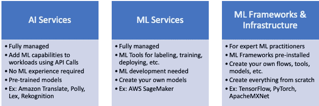

机器学习栈

**Bucket 2** ML 服务主要是 AWS SageMaker 的所有口味，AWS 的 ML 旗舰，用户需要 ML 知识来使用 SageMaker 的工具标记数据，构建，训练，部署，操作定制 ML 模型。AWS SageMaker 是完全托管的，这意味着用户不需要担心基础设施，因为 AWS 会做繁重的工作。

**Bucket 3** ML 框架&面向高级用户的基础设施。AWS 将为他们提供预装了 TensorFlow、PyTorch、MXNet 等主要开源框架的容器和计算基础设施。他们可以从头开始建立自己的模型。

*****ML 工作负载*** 是端到端的机器学习过程如下图所示。**

**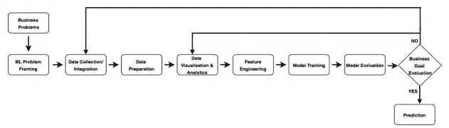**

**端到端的机器学习过程。来源: [AWS ML 白皮书](https://d1.awsstatic.com/whitepapers/architecture/wellarchitected-Machine-Learning-Lens.pdf)**

**AWS 的白皮书详细介绍了流程中每个步骤的最佳实践。前 3 个步骤是关于业务需求、定义 ML 问题和收集数据。**

**第一步是**业务目标识别**这基本上是后退一步，问自己为什么要这样做，这里是否需要 ML，应该监控哪些关键绩效指标(KPI)。**

**然后是 **ML 问题框架步骤**，定义输入，给出 ML 模型和期望的输出。这一步你要知道是分类还是回归还是聚类问题等等。**

**在**数据收集步骤**之后，您确认数据可用性并将其收集到数据湖中。我在下图中总结了这些步骤的 AWS 最佳实践。**

**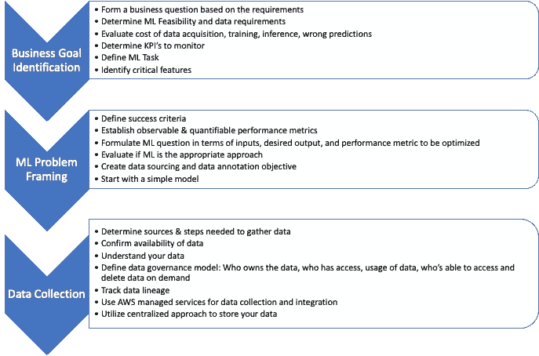**

**ML 构建流程前 3 步的 AWS 最佳实践**

**一旦您收集了 ML 模型的数据，就到了**数据准备步骤。**这一步非常重要，你应该花很多时间，因为**

> *****ML 模型的好坏取决于用来训练它们的数据*** 。**

**在这里，您应该利用 AWS SageMaker 等 AWS 服务来标记和准备您的数据，或者利用 AWS GroundTruth 来标记原始数据并生成高质量的训练数据集。您还可以利用 AWS Glue，它是一个完全托管的提取、转换和加载(ETL)服务。如果你需要 Hadoop 或 ApacheSpark 或 HBase 框架，那么你可以使用 AWS EMR。**

**一旦你的数据准备好了，**可视化&分析步骤**将帮助你更好地理解和识别你的数据模式。AWS 提供了一套可视化工具，如 AWS SageMaker，您可以在其中托管 Jupyter 笔记本并使用 seaborn 或 matplotlib 或 plotly 等库。AWS Athena 是一个完全托管的服务，可以查询您的 S3 数据湖，AWS Kinesis 数据分析提供实时分析功能。最后，AWS QuickSight 是一个商业智能(BI)工具，为故事板提供安全的共享和协作。**

**现在到了**特征工程步骤**，在该步骤中，您考虑数据集中的每个属性，并决定它与您的模型的相关程度，是否需要转换或提取。在这一步中，您可能会遇到维数灾难，因为您有大量的相关要素，并且想要减少它们。最好使用带有 AWS SageMaker 的 Jupyter notebook 或 SageMaker Processing 中的内置数据处理容器来完成特征工程。**

**这 3 个步骤的 AWS 最佳实践总结如下。**

**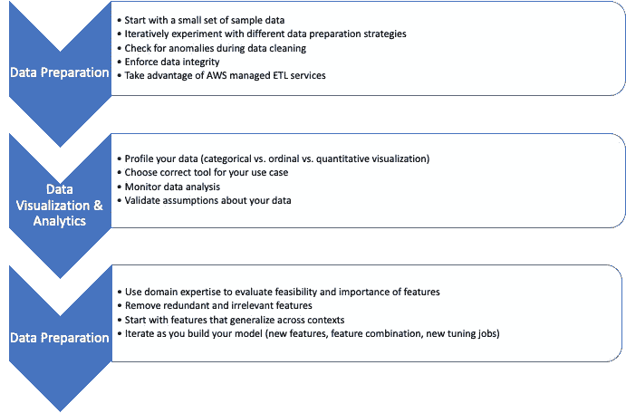**

**ML 构建流程后三步的 AWS 最佳实践**

**ML 构建过程的最后 3 步是有趣的，在这里你将看到你所有努力的结果。**

**现在你已经有了一个干净的数据集，所以是时候进行**模型训练步骤**了，在这里你选择适合你的业务问题的最大似然算法。您必须调整您的模型的超参数，以实现低训练误差，并避免过度拟合&欠拟合。常用的超参数的一些例子是学习率、时期数、隐藏层、隐藏单元和激活函数。您将使用 AWS SageMaker 完成所有这些工作，其中您的所有数据都在 S3 数据湖中，并且您可以调用 SageMaker 的 API 进行培训。您还可以利用 AWS SageMaker 调试器来警告您模型训练问题，如梯度值变得过大或过小。根据你的专业水平，你可以使用 AWS 深度学习 AMI 或深度学习容器，并在其上运行开源框架，如 TensorFlow、PyTorch、MXNet、Horovod 和 Keras。**

**上一步是**模型&业务评估**，用于确定模型的性能和准确性是否能让你实现业务目标。您可以使用历史数据或实时数据评估您的模型。在这两种情况下，您的模型将会看到以前在训练中从未看到过的数据。对于评估，您应该利用 AWS SageMaker、AWS 深度学习 AMI 或 AWS EMR。如果你对结果不满意，你可以随时调整和重新训练你的模型。对模型的结果感到满意后，就该在生产中部署它了。**

**最后，是进行推理的时候了，您的模型正在部署中，您希望从中获得一个预测。**模型部署**选项包括 AWS SageMaker，您可以通过 API 调用进行推理，您可以使用非常灵活且可定制的 AWS SageMaker 推理管道。不要忘记使用 SageMaker 模型监视器，该监视器持续监视生产中的 ML 模型的输入数据漂移和模型质量偏差。如果您正在使用 edge 或物联网(IoT)设备，请利用 AWS SageMaker Neo 在 edge 设备上进行编译。您还可以使用 AWS 弹性推理，它允许您将低成本的 GPU 推理加速附加到您正在使用的任何 EC2 或 SageMaker 上。**

**ML 流程最后 3 个步骤的 AWS 最佳实践总结如下。**

**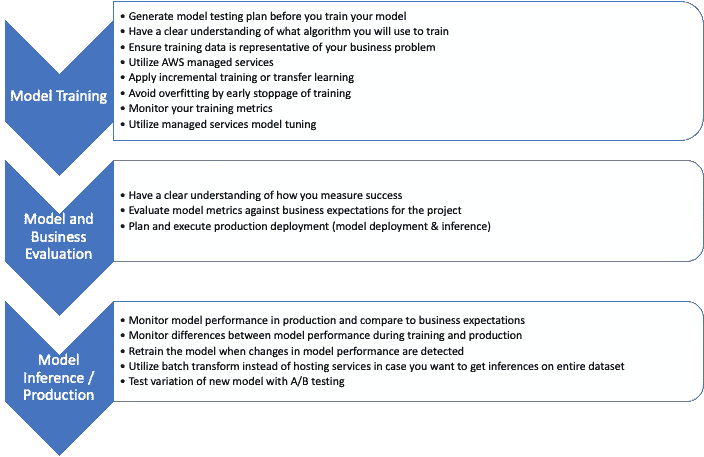**

**ML 构建流程最后 3 步的 AWS 最佳实践**

# **一般设计原则和参考架构**

**在本文的这一部分，AWS 确定了一组通用设计原则，以促进良好的 ML 云设计。让我们看看他们。**

*   ****通过高质量数据的可用性实现敏捷性****
*   ****从简单开始，通过实验进化****
*   ****将模特培训&评估与模特主持**分离**
*   ****检测数据漂移****
*   ****自动化培训&评估流程****
*   ****偏好更高的抽象以加速结果****

**然后，本文介绍了一些常见的场景，并展示了它们的 AWS 参考架构实现。我将把每个场景分解成业务问题、实现和参考架构。**

## ****场景 1:使用 AWS AI 服务构建智能应用****

****业务问题**零售店希望捕捉和分析客户人口统计数据，以提高客户参与度和体验。**

****实现**使用多个 AWS AI 服务层，几乎不需要 ML 知识。**

****参考架构**利用 AWS Rekognition 进行面部分析，向 AWS Athena 发送数据以分析面部属性数据，最后通过 AWS QuickSight 可视化分析数据。请注意，所有这些都是完全托管的 AWS 人工智能服务，具有预先训练的模型。下面显示的参考架构也可以应用于文本或音频分析，但在这些情况下，您应该使用 AWS 转录(音频分析)或 AWS 理解(文本分析)而不是 AWS 识别。**

**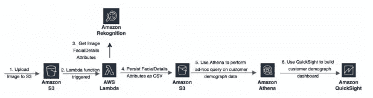**

**参考架构:客户人口统计分析。来源: [AWS ML 白皮书](https://d1.awsstatic.com/whitepapers/architecture/wellarchitected-Machine-Learning-Lens.pdf)**

**基于相同参考架构构建的是媒体分析用例。假设您想要上传一个媒体文件，并使用多个 AWS AI 服务来进行视频和音频分析。最终目标是一个可搜索的元数据库。AWS 的人员推荐以下参考架构，他们使用 AWS Step 函数来编排媒体分析流程，并使用 AWS ElasticSearch 来使内容可搜索。**

**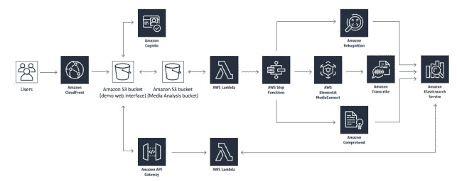**

**参考架构:媒体分析。来源: [AWS ML 白皮书](https://d1.awsstatic.com/whitepapers/architecture/wellarchitected-Machine-Learning-Lens.pdf)**

## **场景 2:使用托管 ML 服务构建定制 ML 模型**

****业务问题**你想在 AWS 上建立自己的模型，因为没有一个 AWS 人工智能服务能满足你的需求。你要控制数据准备&分析、模型训练&评估、模型推断的步骤。**

****实施** AWS SageMaker 可以端到端地完成所有这些功能，同时完全由 AWS 管理。AWS Lambda 支持事件驱动架构，并将 ML 流程的不同阶段连接在一起。**

****参考架构**假设亚马逊 S3 充当原始数据、建模数据、增强数据和转换数据的数据湖。AWS 推荐以下参考架构，用于构建您自己的模型以及从摄取到推断的流程。**

**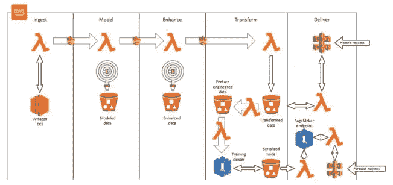**

**参考架构:使用 SageMaker 构建自己的 ML。来源: [AWS ML 白皮书](https://d1.awsstatic.com/whitepapers/architecture/wellarchitected-Machine-Learning-Lens.pdf)**

## **场景 3:用于数据处理的托管 ETL 服务**

****业务问题**您正在开展一项有针对性的营销活动，并希望通过电子邮件和短信向消费者发送信息。您需要一个 ML 模型来根据历史消费者购买模式识别正确的客户。**

****实现** AWS Pinpoint 是一个托管服务，可以通过各种渠道发送目标消息。在 AWS EMR 上利用 Spark 或 Hadoop。**

****参考架构**使用多种服务的 AWS 推荐流程如下所示。**

**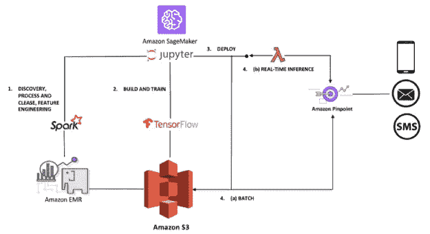**

**参考架构:使用 AWS Pinpoint 的定向活动。来源: [AWS ML 白皮书](https://d1.awsstatic.com/whitepapers/architecture/wellarchitected-Machine-Learning-Lens.pdf)**

## **场景 4:边缘和多平台上的机器学习**

****业务问题**在你计算能力有限的边缘考虑物联网和设备。例如，您想在边上建立一个鸟类物种标识。**

****实现** AWS 物联网 Greengrass 在边缘设备上实现机器学习。AWS 物联网 Greengrass 使用在云中创建、训练和优化的模型，可以轻松地在设备上本地执行 ML 推理。**

****参考架构**展示了 AWS DeepLens，这是 AWS 的相机，带有预训练的 ML 模型。请记住，AWS 通过 AWS SageMaker Neo 支持英特尔和 Invidia 等多种硬件平台，check 的 AWS 网站提供物联网支持的设备。SageMaker Neo 有编译器和运行时。针对特定硬件进行了优化。**

****

**参考架构:边缘的鸟类物种识别。来源: [AWS ML 白皮书](https://d1.awsstatic.com/whitepapers/architecture/wellarchitected-Machine-Learning-Lens.pdf)**

## **场景 5:模型部署方法**

****业务问题**建立模型后，你应该有一个简单的方法来推断模型并得到预测。**

****实现**使用 AWS SageMaker 端点，这些是 HTTPS 端点，您可以使用它们对您的模型进行 API 调用。**

**参考架构 AWS 根据您的需求推荐了 4 种部署模型，我总结如下。**

**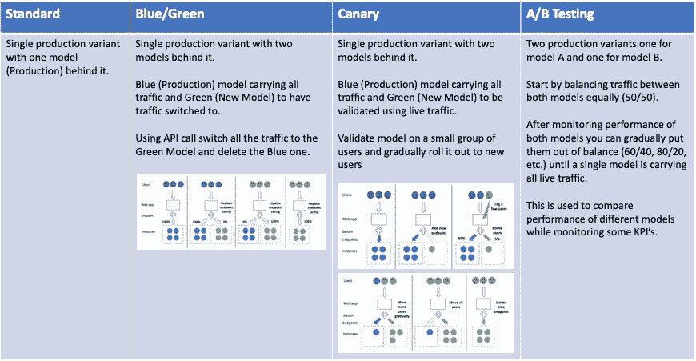**

**参考架构:AWS 部署模型。图片来源: [AWS ML 白皮书](https://d1.awsstatic.com/whitepapers/architecture/wellarchitected-Machine-Learning-Lens.pdf)**

# **从 ML 的角度来看，架构良好的框架的 5 个支柱**

**AWS 通常在云中有 5 个架构良好的框架支柱，本文的这一部分从机器学习的角度来看这 5 个支柱。我将以问答的形式对它们进行总结。**

**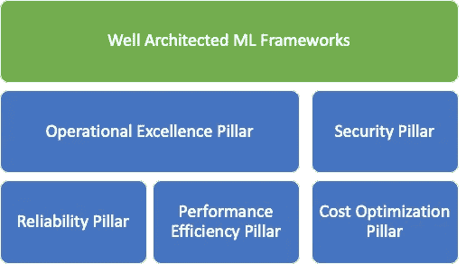**

**ML 架构良好的框架的 5 大支柱**

## ****卓越运营支柱****

**这是运行、监控和洞察系统以交付业务价值并持续改进支持流程和程序的能力。**

*   *****你是如何让你的团队做好运营和支持机器学习工作负载的准备的？*****

**确保 ML 模型有效集成到生产环境中并满足业务目标的最佳实践包括确保团队之间的交叉协作，以及培训所有负责支持和维护机器学习工作负载的资源达到基本熟练水平。**

*   *****您如何记录模型创建活动？*****

**为了更清楚地支持和使用模型版本，请记录模型创建过程，尤其是与所做的假设、模型所需的数据预处理/后处理以及将系统或应用程序与模型版本集成相关的过程。SageMaker 笔记本和 SageMaker Studio 提供托管笔记本环境，数据科学家可以在其中记录他们的开发过程和实验。这些笔记本可以与源代码控制系统集成，并成为为每个部署的模型创建的文档的标准部分。**

*   *****你是如何追踪模特血统的？*****

**SageMaker 实验允许您组织和跟踪 ML 模型的迭代。SageMaker Experiments 自动捕获每个模型的输入参数、配置和输出工件，并将它们存储为实验。这避免了使用手动跟踪或者构建定制的跟踪解决方案来管理为模型开发的每个迭代创建和利用的输入和输出工件的众多版本。**

*   *****你是如何为你的 ML 工作负载自动化开发和部署管道的？*****

**创建管道的一般准则包括使用编排层(如 AWS CodePipeline ),并结合负责执行管道内各阶段的逻辑。使用 AWS Lambda 创建和执行基于函数的逻辑，因为它的运营开销低，无需管理服务器。**

*   *****您是如何监控和记录模型托管活动的？*****

**SageMaker 自动监控核心系统指标，还包括为您的托管模型设置自动扩展功能的能力，以根据需求动态调整支持端点的底层计算。SageMaker Model Monitor 能够监控生产中的 ML 模型，并在出现数据质量问题时发出警报。最佳实践包括创建一种机制，使用服务来聚合和分析模型预测端点指标，如 Amazon Elasticsearch，内置对 Kibana 的支持，用于仪表板和可视化。**

*   *****你怎么知道什么时候用新的或者更新的数据重新训练 ML 模型？*****

**最佳实践是表示模型性能和准确性的已定义指标，确保有一种机制来定期捕获这些指标以进行分析和基于指标阈值发出警报，并评估是否适合重新训练模型。SageMaker Model Monitor 可以在数据分布发生变化时检测模型漂移，并使用 AWS CloudWatch 发布指标。**

*   *****您如何在模型开发、模型训练和模型托管的迭代之间整合知识？*****

**这包括所有维度的模型评估:业务评估、ML 模型评估和系统评估。通过提供对收集的关键运营指标的集中可见性，团队可以持续审查并对您的运营进行回顾性分析。**

## **安全支柱**

**这是在提供业务价值的同时保护信息、系统和资产的能力。**

*   *****你如何控制对自己 ML 工作量的访问？*****

**对 ML 流程各阶段使用的所有资源的访问，包括数据、算法、超参数、经过训练的模型工件和基础设施，必须通过基于最低特权的访问进行严格控制。这可以使用 AWS IAM 轻松完成。**

*   *****您如何保护和监控对 ML 工作负载中使用的敏感数据的访问？*****

**使用亚马逊 S3 上的 AWS Lake Formation 实现了集中式数据湖。保护和监控亚马逊 S3 上的数据湖是通过使用各种服务和功能的组合来加密传输中的数据和静态数据，并监控访问，包括粒度 AWS IAM 策略、S3 存储桶策略、S3 访问日志、AWS CloudWatch 和 CloudTrail。构建大数据存储解决方案(数据湖)以获得最大的灵活性讨论了如何使用这些不同的功能来构建安全的数据湖。**

*   *****你是如何保护训练有素的 ML 模特的？*****

**在训练阶段结束时生成的 ML 模型通常保存在亚马逊 S3 中。使用私人 VPC 端点将在您的 VPC 内训练的模型上传到亚马逊 S3。这确保了模型在 AWS 网络内安全地传输到亚马逊 S3。当使用 Amazon SageMaker 训练一个模型时，该服务会加密传输中和静态的模型工件和其他系统工件。SageMaker 托管端点使用 IAM 为保护您的模型和调用提供了额外的安全性。这使您能够控制哪些 IAM 用户、IAM 角色、源 VPC 或 IP 可以对您的模型执行推理。**

## **可靠性支柱**

**这是系统通过动态获取计算资源来缓解问题，从而从任何类型的服务中断中恢复的能力。**

*   *****你如何管理你的机器学习模型和预测端点的变化？*****

**创建一种机制，以便能够跟踪对模型所做的更改以及对预测端点所做的更改。如果新型号的性能不如预期，这样可以更快地排除故障并恢复到以前的型号版本。部署新型号时，AWS 推荐标准 A/B 测试策略。使用 AWS 弹性容器注册中心(ECR)来托管所有的容器图像。**

*   *****如何在您的工作负载中协调 ML 模型的变更？*****

**遵循已定义的变更管理策略来引入变更，并将它们传达给受影响的团队，并实现这些变更的可追溯性。以治理和控制应用程序级变更的相同方式管理新模型版本的部署。ML 模型的变更管理策略必须考虑如何传达和部署变更，以帮助避免服务中断以及模型性能和准确性下降。**

*   *****您如何扩展端点托管模型进行预测？*****

**您必须包括对端点的监控，以确定触发添加或删除资源来支持当前需求的阈值。一旦收到扩展的触发信号，必须准备好解决方案来扩展支持该端点的后端资源。对端点执行负载测试，以便能够验证它们有效伸缩和可靠提供预测的能力。**

*   *****如何从一个训练好的 ML 模型的失败或无意丢失中恢复？*****

**意外删除是一个问题，为了保护模型工件不被意外删除，请确保模型工件受到保护，方法是只允许使用工件所需的最低权限，实现额外的机制，如 MFA 以供特权用户删除，并根据您定义的灾难恢复策略的要求存储工件的辅助副本。此外，实现工件版本化策略允许恢复特定的版本化工件。**

*   *****您如何从模型托管资源的故障或意外丢失中恢复？*****

**最佳实践是确保负责承载模型预测的端点可以完全恢复到业务定义的特定版本或时间点。恢复模型端点的能力要求用于创建该端点的所有组件和配置都包括在受管版本控制策略中，以在任何组件不可用时实现完全恢复。**

## **绩效效率支柱**

**这集中于计算资源的有效使用以满足需求，以及如何随着需求的变化和技术的发展保持这种效率。**

*   *****您如何选择最合适的实例类型来训练和托管您的模型？*****

**数据大小、数据类型和算法的选择对哪种配置最有效有明显的影响。当重复训练同一个模型时，强烈建议在一系列实例类型中执行初始测试，以发现高性能和经济高效的配置。建议将 GPU 实例用于大多数深度学习目的，因为在 GPU 上训练新模型比在 CPU 上更快。当您有多个 GPU 实例时，或者如果您使用跨多个 GPU 实例的分布式培训，您可以进行次线性扩展。然而，重要的是要注意，在 GPU 上训练最有效的算法可能不一定需要 GPU 来进行有效的推理。**

*   *****您如何在保持最佳性能的同时扩展 ML 工作负载？*****

**SageMaker 代表您管理您的生产计算基础架构，以执行运行状况检查、应用安全补丁和进行其他日常维护，所有这些都通过内置的 CloudWatch 监控和日志记录来实现。SageMaker Model Monitor 持续监控生产中的 ML 模型，检测诸如数据漂移等会降低模型性能的偏差，并提醒您采取补救措施。此外，SageMaker 主机使用应用程序自动伸缩功能，自动伸缩到您的应用程序所需的性能。**

**您可以选择使用亚马逊弹性推理(EI)进行扩展，以增加吞吐量并减少针对深度学习模型的实时推理的延迟。Amazon 弹性推理使您能够将 GPU 支持的推理加速附加到任何 Amazon EC2 实例上。**

## **成本优化支柱**

**这是建立和运行成本感知系统的能力，以实现业务成果和最小化成本，从而使您的企业最大化其投资回报。**

*   *****如何优化数据标注成本？*****

**利用 AWS SageMaker Ground Truth，它通过 Amazon Mechanical Turk、第三方供应商或他们自己的员工使用人工标注器来简化数据标注任务。SageMaker Ground Truth 实时从这些人工注释中学习，并应用主动学习来自动标记剩余数据集的大部分，从而减少人工审查的需要。与单独的人工注释相比，这降低了成本。**

*   *****你如何在 ML 实验中优化成本？*****

**SageMaker notebook 实例提供了一个托管的 Jupyter 环境，可用于探索小样本数据。当您不经常使用笔记本实例时，请停止它们。在可行的情况下，提交你的工作，停止它们，并在你需要它们的时候重启它们。存储是持久的，您可以使用生命周期配置来自动化软件包安装或存储库同步。**

**查看 AWS 机器学习市场，该市场提供了不断增长的机器学习算法和模型目录。来自 AWS Marketplace 的模型被直接部署到 Amazon SageMaker，并允许您快速构建 ML 应用程序。这为您节省了与模型开发相关的成本和时间。**

*   *****你如何为 ML 培训选择最划算的资源？*****

**使用 SageMaker Training API 创建一个托管实例集群。在训练集群中使用多个实例可以实现分布式训练，从而缩短训练时间。训练完成时，训练群集中的所有实例都会自动终止。在处理大量训练数据时，Amazon SageMaker 管道模式比 Amazon SageMaker 文件模式提供了更好的读取吞吐量。**

*   *****如何优化 ML 推理的成本？*****

**首先要考虑延迟、吞吐量和成本。同样，建议您从小规模开始，先横向扩展，然后纵向扩展。利用推理端点的自动缩放。当您的模型不需要实时预测时，请使用批量预测。**

*****最后*** ，这是对第一个 AWS ML 良好架构框架的全面总结。我试图用一种易读的格式来总结它，以适应从初学者到高级的所有 ML 专业水平。ML 可能有趣而复杂，但是，遵循这些 AWS 推荐的最佳实践将帮助您构建更好的模型，进一步了解 ML，并成为更好的 ML 专家。我希望你喜欢阅读这篇文章。**