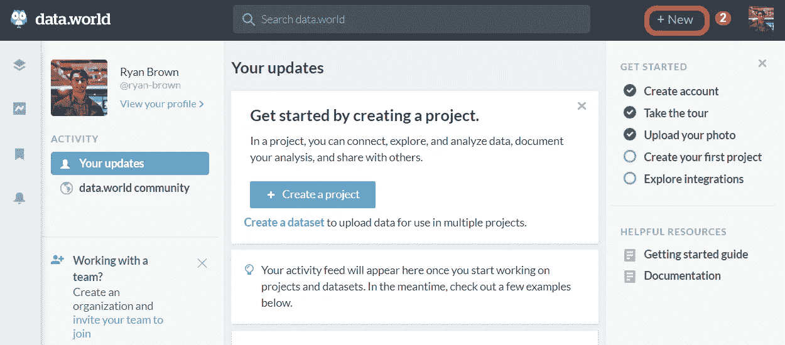
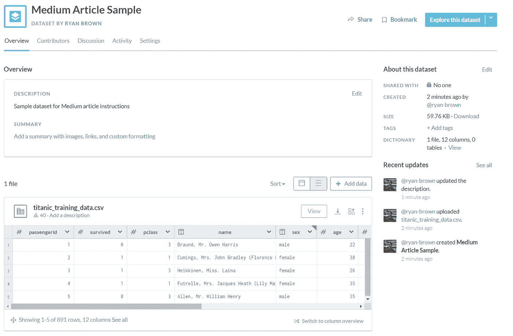
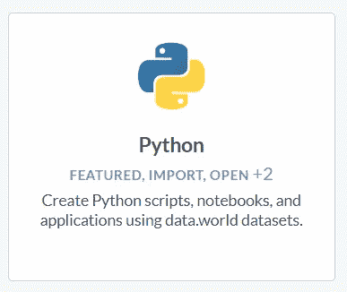
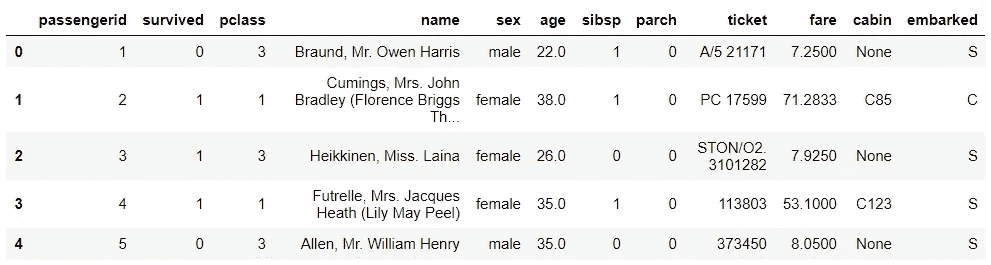
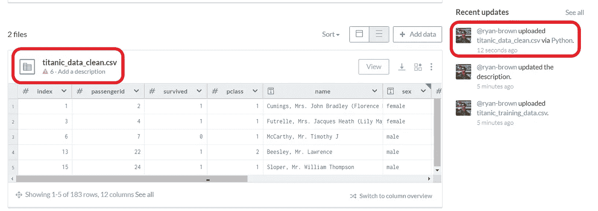
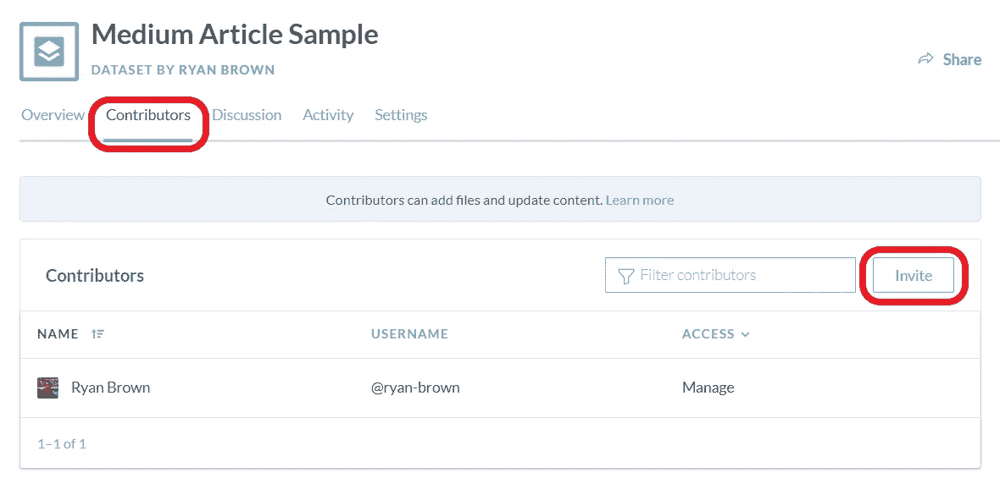

# 想用 python 轻松集成数据？

> 原文：<https://towardsdatascience.com/want-to-easily-integrate-data-with-python-e9d808f88455?source=collection_archive---------51----------------------->


克里斯托夫·高尔在 [Unsplash](https://unsplash.com/s/photos/coding?utm_source=unsplash&utm_medium=referral&utm_content=creditCopyText) 上拍摄的照片

## 与 data.world 的 5 分钟数据集成

# 介绍

**想象一下:**你和几个同事正在用 python 开发一个数据科学项目。您没有费心将数据输入或输出与 SQL/python 数据库集成联系起来，因为没有那么多的数据转手。但是，还是有足够的。csv 文件被创建和更新，以至于很难通过电子邮件发送、备份或将其放在驱动器文件夹中。

在过去的几个月里，我个人多次遇到这种情况。我不想经历整个 SQL 集成过程，但是文件传输仍然很繁琐。

我最近发现有一种更简单的方法，没有平台集成经验的人可以在短短 5 分钟内完成设置。解决方法: [**data.world**](https://data.world/home/) 。

data.world 是一个企业数据目录，拥有世界上最大的开放数据社区，个人使用免费。您可以将各种数据、代码和分析上传到数据集或项目中。

# 设置您的帐户

第一步是创建一个免费帐户。你可以在 data.world/login 使用谷歌、脸书、GitHub 或 Twitter 来做这件事。您将看到这样一个页面:



作者图片

点击*“+新建”*，然后点击*“创建新数据集”*。选择一个名称和一些其他设置，然后*“创建数据集”*。我把我的命名为“中等文章样本”。您可以现在添加描述和数据，也可以以后再添加。我添加了 [Kaggle 的泰坦尼克号比赛](https://www.kaggle.com/c/titanic/overview)的训练数据。



作者图片

接下来，转到[data.world/integrations](https://data.world/integrations)(或点击屏幕左下方的*“整合”*图标)。在过滤器搜索栏中键入“python ”,或者向下滚动直到看到它。点开它，点击*“启用集成”*，然后*“授权 Python”*。



作者图片

现在集成已经完成，您可以点击*“开始”*并按照[那里](https://datadotworld.github.io/data.world-py/python.html)的步骤操作。我也将把它们包含在本文中。

# 安装软件包

1.使用命令行(或 jupyter 笔记本)，从 PyPI 安装 data.world 包。

```
pip install datadotworld[pandas]
```

2.使用命令行配置包。你需要你的 data.world API 令牌，在这里找到(点击*“获取令牌】*)。现在您已经准备好使用这个包了！

```
dw configure
```

3.在笔记本或脚本中导入包。

```
import datadotworld as dw
```

# 使用软件包

使用 datadotworld 包可以做很多事情，但这里有一些我们正在寻找的基本数据集成的基础。

首先，您可以读取数据集中的所有文件，并获取特定文件作为数据帧(根据文件类型，您可能需要将其作为表或原始数据导入；更多关于那个[这里](https://pypi.org/project/datadotworld/)。注意，表名都是小写的，用下划线代替空格。

```
dataset = dw.load_dataset('ryan-brown/medium-article-sample')
df = ds.dataframes['titanic_training_data']
```

如果您使用的是 Windows，编码可能会有问题；我创建了一个快速函数，利用了 datadotworld 的。查询函数从数据集中读取特定的表。

```
def dw_get(dataset_name, table_name):
    results = dw.query(dataset_name, "SELECT * FROM `{}`".format(table_name)) df = results.dataframe
    return dfdf = dw_get('ryan-brown/medium-article-sample', 'titanic_training_data')
```

无论哪种方式，您现在都可以在笔记本中创建一个数据框架，您可以对其进行清理、处理和分析。假设我决定用 NaN 值填充 drop“ticket”列和所有行来清理数据。我现在有以下数据框架:



作者图片

我准备更新数据集上的文件，供我的同事在项目分析中使用。这样做很容易——只需将数据帧作为. csv 文件保存在工作目录中，然后调用 datadotworld api 客户端并上传文件。

```
df.to_csv('titanic_data_clean.csv',index=False)
client = dw.api_client()client.upload_files('ryan-brown/medium-article-sample', files=['titanic_data_clean.csv'])
```

请注意，我决定给它一个不同于 titanic_training_data.csv 的名称，这样它将在数据集中显示为一个新文件。但是，如果我决定将其命名为 titanic_training_data.csv，它将替换数据集中旧的 titanic_training_data.csv 文件(同时仍然保留您可能添加的任何标签或描述)。

现在我们已经上传了新数据，让我们来看看数据。世界数据集:



作者图片

您可以看到清理后的数据在那里，在右边有一个更新，表明我使用 python 添加了数据。就这么简单。

要授予对等用户访问权限，以便您可以协作处理和上传数据，请单击数据集的*“Contributors”*选项卡，然后单击*“Invite”*通过电子邮件或用户名邀请他们。



作者图片

这只是 datadotworld 包可以做的许多事情的一小部分，这个站点可以作为一个整体使用；你可以在[这里](https://data.world/blog/turbocharge-your-data-acquisition-using-the-data-world-python-library/)写的一篇很棒的文章中查看这个库的更多特性。