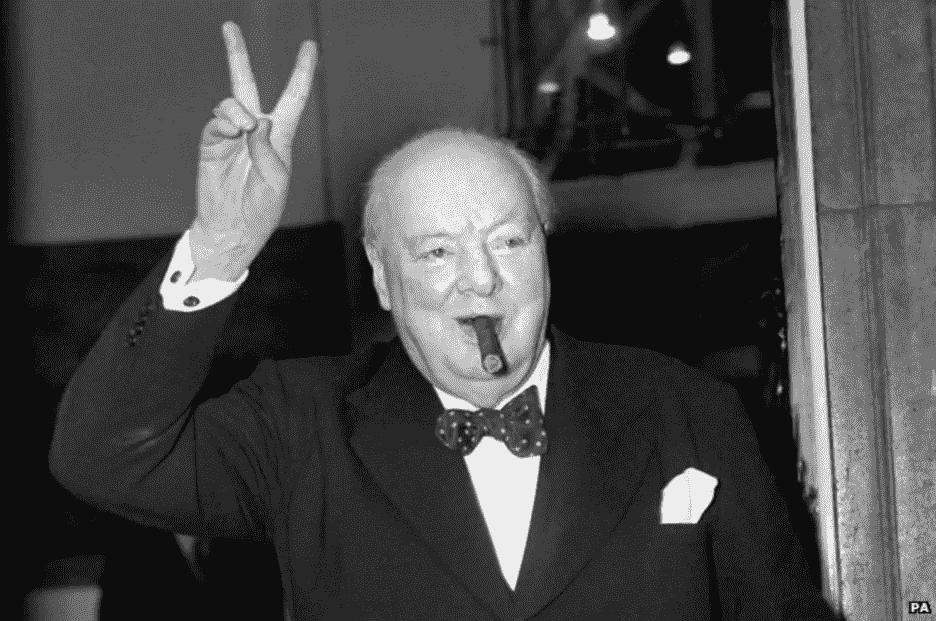

# 你的数据科学项目需要一个成功的条件。

> 原文：<https://towardsdatascience.com/want-to-get-hired-build-a-project-with-a-win-condition-6526d90a247d?source=collection_archive---------57----------------------->

## 离开一个项目很难，但是你需要知道什么时候去做。

温斯顿·丘吉尔，大概是在完成他的第一个数据科学项目之后。来源:https://www.flickr.com/photos/levanrami/45544041992

在[sharpes minds](http://sharpestminds.com)数据科学导师项目工作最酷的事情之一是，我们有机会看到人们建立了什么项目，以及哪些项目让他们被雇用。

我们反复学到的最重要的一点是，最好的项目根本不是项目:它们是产品。

在这篇文章中，我想解释构建一个产品意味着什么，以及构建产品如何能帮助你在你的项目准备好发布之前弄清楚它必须有多好(并且给雇主留下深刻印象！).

# 什么是产品？

数据科学产品是**一个有用例**的项目。理想情况下，这是你自己会用到的东西。

它可以是推荐系统、仪表板或分类器。但是不管它最终是什么，它应该对某人有用——而且你对那个人是谁的想法越具体越好。

专注于有用性和构建产品使得为你的项目定义一个“赢”的条件成为可能:模型性能的水平(准确性、召回率、AUC 分数等)使得你的模型“对实际目的来说足够好”。

获胜条件是大多数数据科学项目中最常见的缺失因素。这真的很糟糕，因为它们是公司需要你能够弄清楚的最重要的事情之一。

作为一名数据科学家，你不会下载数据集，清理它们，并根据某个经理从高层给你的损失函数调整模型。通常情况下，你必须想出这个损失函数，并计算出在你有一个可以出货的产品之前，它必须有多好。

因此，公司——尤其是招聘经理——会在面试中花费大量时间寻找你能够找出成功条件的暗示。如果你的项目不包括一个，你基本上就失去了勾选这个框的最好机会。

以下是如何选择一个。

# 设置您的获胜条件

您的获胜条件将有两个组成部分:您想要优化的指标，以及一个阈值，超过该阈值，您认为该指标将被优化。

但是只有当你对你的项目有一个清晰的用例时，你才能弄清楚这些事情。

例如，假设您正在构建一个时尚推荐系统，以帮助人们找到匹配的衬衫和裤子。如果您的绩效指标高出 1%，这有什么关系吗？用户能够区分 0.99 AUC 和 0.98 AUC 吗？

大概不会。所以不要让你的获胜条件 0.99 AUC。你花在模型上的时间可以更好地用来做其他事情，比如收集更多的数据，改善你的可视化，或者解决一个完全不同的问题。

但是假设你正在建立一个癌症诊断工具。那 1%可以拯救生命。因此，每个百分点的性能都非常有价值，绝对值得投入大量资金来调整您的模型。

成功的条件并不总是简单的指标。如果你的项目是为网上购物者建立一个时尚推荐系统，那么成品不是一个算法——而是一个应用程序。如果您的项目是构建一个仪表板，使其易于发现某些趋势，那么您的成功条件就是该仪表板的部署。

下面的[是一个如何做到这一点的很好的例子](https://friendshipify.com/index)，直接来自[一个敏锐的学员的](https://www.linkedin.com/in/deandraalvear/)项目:这是一个应用程序，让两个对音乐有不同品味的朋友通过考虑他们的偏好来妥协他们想听什么。因为这是一个有趣的、面向消费者的应用程序，应用程序的界面和结构与模型一样重要，所以更平衡的时间投资(和获胜条件)更有意义。此外，对音乐的品味是非常主观的，用户不太可能注意到哪怕是模型损失值的 5%的改善。

向招聘经理解释这些权衡是一种很好的方式，可以表明你的重点在哪里:不是像 Kaggle 一样的柔术模式，而是为真实的人和真实的用例提供真正的价值。

作为一个临别的提示:定义你的成功条件的时间是在你开始你的项目之前，以避免陷入永无止境的优化和调整的漩涡的风险，这将导致你浪费时间去做那些没有真正价值的事情。

没有一个明确的成功条件就着手一个项目是浪费你的时间和公司的钱去解决不需要解决的问题。大多数公司担心这种风险是可以理解的，作为求职者脱颖而出的最佳方式之一是通过展示你可以将业务问题与数据科学问题联系起来，正面解决这一问题。

这一切都始于成功的条件。

你可以在推特上关注我，地址是 [@ **jeremiecharris**](https://twitter.com/jeremiecharris)