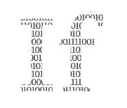

# 想入门函数式编程？输入 Scala。

> 原文：<https://towardsdatascience.com/want-to-get-started-in-functional-programming-enter-scala-ea71e5cfe5f8?source=collection_archive---------16----------------------->

## 意见

## 如果你厌倦了 Java 或 Python，这可能会让你的职业生涯更上一层楼


Scala 可能是成为函数式程序员的下一步。妮可·沃尔夫在 [Unsplash](https://unsplash.com/s/photos/programmer?utm_source=unsplash&utm_medium=referral&utm_content=creditCopyText) 上的照片

 如果 你还没有使用 Scala，你不是唯一一个:根据 [StackOverflow](https://insights.stackoverflow.com/survey/2020#overview) 的数据，截至去年，不到 4%的程序员在使用这种语言。这使它在最常用的语言中排名第 22，JavaScript 和 HTML 是前两名。

然而，使用 Scala 的程序员似乎从中受益。它不仅在 StackOverflow 最受欢迎的语言中排名第 14 位。这明显高于使用排名 22。

从经济上来说，了解这门语言似乎是有回报的:在全球范围内，只有 Perl 程序员的薪水高于 Scala 程序员，两者的年薪都在 7.6 万美元左右。在美国，Scala 的薪资最高，程序员的年薪预计约为 15 万美元。我觉得没问题！

为什么一些编程语言比其他语言更受欢迎或更有利可图，有不同的原因。在 Scala 的例子中，主要原因是它让程序员很容易学习[函数式编程](/why-developers-are-falling-in-love-with-functional-programming-13514df4048e)，而不像面向对象编程那样放弃已知和喜爱的[范例](https://www.geeksforgeeks.org/introduction-of-programming-paradigms/)。

函数式编程在过去几年里越来越受欢迎，因为它非常适合处理大数据量、实现机器学习算法等等。由于此类技术的可扩展性非常好，对它们的投资已经为无数行业的公司带来了收入。这就是为什么 Scala 程序员的高薪是合理的。

[](/how-to-make-your-python-code-more-functional-b82dad274707) [## 如何让您的 Python 代码更具功能性

### 以及为什么这会使您的代码更加健壮、可测试和可维护

towardsdatascience.com](/how-to-make-your-python-code-more-functional-b82dad274707) 

# 统一面向对象和函数式编程

Scala 当然不是市场上唯一的多范例语言。例如，Python 支持面向对象和函数式编程。在 Java 中，函数式编程原则上是[可能的](https://medium.com/better-programming/functional-programming-with-java-an-introduction-daa783355731)，尽管它最初是作为面向对象的编程语言而设计的。

然而，Scala 的特别之处在于它寻求*无缝集成*面向对象和函数式编程。通常，这两种范式表现为彼此的对立面:在函数式代码中，你只会发现纯函数。在面向对象的代码中，你也会遇到不纯的函数。

在函数式代码中，所有变量都是不可变的，也就是说，它们的值一旦固定就不会再改变。在面向对象的代码中，您可以随时更改变量值。在功能代码中，你不会发现任何[副作用](/why-developers-are-falling-in-love-with-functional-programming-13514df4048e)；在面向对象的代码中，您可能会不时遇到它们。

这并不意味着没有很多方法可以在主要面向对象的代码中包含更多的函数式编程。在许多语言中，您可以在常规代码中使用从函数式编程中窃取的基本概念。例如，在 [Python](https://docs.python.org/3/howto/functional.html) 中，构建迭代器、生成器和匿名函数相当容易。

但是 Scala 反过来也是这样做的:它使得开发人员可以非常容易地编写主要是函数性的代码，然后可以用面向对象的代码来修补函数性的代码过于繁琐的地方。这是对纯函数式编程的一个很好的妥协，例如，像[用户定义的 I/O](https://stackoverflow.com/questions/3850368/how-do-functional-languages-model-side-effects) 这样的东西是不容易实现的。


Scala 入门并不像听起来那么难。照片由[普里西拉·杜·普里兹](https://unsplash.com/@priscilladupreez?utm_source=unsplash&utm_medium=referral&utm_content=creditCopyText)在 [Unsplash](https://unsplash.com/s/photos/programmer?utm_source=unsplash&utm_medium=referral&utm_content=creditCopyText) 上拍摄

# Scala 中的快速入门

像许多其他语言一样，有两种方式使用 Scala:使用 IDE 或者命令行。就我个人而言，我是一个命令行爱好者，但最终还是要看个人喜好。

然而，在这两种情况下，你都必须[下载](https://www.scala-lang.org/download/)并安装 Scala。但是，有时您只想先涉猎一下，而不安装任何东西，或者按照我将在下面几节中介绍的内容进行操作——我鼓励您这样做。好消息是，你可以使用 [Scastie](https://scastie.scala-lang.org) 或 [ScalaFiddle](https://scalafiddle.io) 在浏览器中编写和运行你的代码。

这两个网站都适合像下面这样的小项目，在那里你不会加载很多库。如果你需要加载很重的东西，那么 ScalaFiddle 可能是更好的选择，因为它处理库的效率很高。

不言而喻，至少目前，浏览器代码项目不应该太大。如果你已经喜欢上了 Scala，并且想要构建更大的东西，那么在你的机器上安装 Scala 将是更好的选择。

也就是说，如果你现在没有时间跟进，这完全没问题。到这个故事结束时，你仍然能够理解发生了什么，并对如何用 Scala 编码有一个基本的了解。

[](/functional-programming-is-awesome-c94bcd150ae6) [## 函数式编程太棒了

### 为什么函数式编程正在兴起

towardsdatascience.com](/functional-programming-is-awesome-c94bcd150ae6) 

# Scala 的“你好，世界！”

转到 [Scastie](https://scastie.scala-lang.org) 或 [ScalaFiddle](https://scalafiddle.io) ，键入:

```
println("Hello, world!")
```

然后按“运行”。你会发现就这么简单。

好吧，如果你想在本地机器上运行一个真正的脚本，你需要一些样板代码。但是我们一会儿就会讲到。首先，我们需要了解一些基础知识。

## 值和变量

您可以使用`val`前缀来分配不可变变量——在 Scala 中它们被称为值:

```
val Greeting = "Hello, World!"
println(Greeting)
```

因为值是不可变的，所以你不能给它们重新赋值。如果你试图这么做，编译器会抛出一个错误。你猜对了:这就是函数式编程！

不过，如果你需要重新分配任务，还有一个选择:使用前缀`var`，然后就到此为止。


Scala 既是面向对象的，也是函数式的。照片由[7 档](https://unsplash.com/@7shifts?utm_source=unsplash&utm_medium=referral&utm_content=creditCopyText)上的[档](https://unsplash.com/s/photos/programmer?utm_source=unsplash&utm_medium=referral&utm_content=creditCopyText)拍摄

## 功能和方法

在 Scala 中，函数的构造非常容易:

```
val GreetMe = (name: String) => println("Hi, " + name + "!")
GreetMe("Rhea")
```

这将按预期返回`Hi, Rhea!`。在`=`之前的部分定义了函数的名字，然后是它的参数，在`=>`之后你会发现函数体。

您可以通过省略名称定义来定义匿名函数，这非常符合函数式编程的风格。根本不是函数式的是你可以定义没有参数的函数——在函数式编程中，你总是需要一个参数。

还有一些方法，与函数非常相似:

```
def GreetMe2(name: String): Unit = {
    val greeting = "Hi, " + name + "!"
    println("Hi, " + name + "!")
}
GreetMe2("Rhea")
```

它们非常类似于函数，但是它们的语法有点不同。需要指定一个输出类型，就像本例中花括号前面的`Unit`。

在更理论的层面上，函数是方法的[推广](https://www.tutorialspoint.com/scala/scala_functions.htm)。这是因为方法总是类的一部分。函数可以是类的一部分，但不是必须的；如果它们碰巧是一个方法的一部分，它们就被称为方法。

## 类别和对象

类的定义如下(这个我直接从 Scala 的[之旅复制过来的):](https://docs.scala-lang.org/tour/basics.html)

```
class Greeter(prefix: String, suffix: String) {
    def greet(name: String): Unit = 
        println(prefix + name + suffix) 
}
```

然后我可以用下面的方法定义这个类的一个实例:

```
val GreetMe3 = new Greeter("Hello, ", "!") 
GreetMe.greet("Rhea")
```

在类中调用方法`greet`的方式与在 Python 或其他语言中的方式相同。

Scala 中的对象是它们自己定义的实例:

```
object HowManyGreets {
    private var counter = 0
    def greet(): Int = {
        counter += 1
        counter
    }
}
```

与类不同，它们不能带任何参数。但是，当你调用它们的方法时，它们会返回一些东西:

```
val onegreet: Int = HowManyGreets.greet()
println(onegreet)    *// outputs 1*
val twogreets: Int = HowManyGreets.greet()
println(twogreets)    *// outputs 2*
```

[](https://medium.com/@olxc/switching-from-oop-to-functional-programming-4187698d4d3) [## 从面向对象编程转换到函数式编程

### 为什么函数式编程这么难？

medium.com](https://medium.com/@olxc/switching-from-oop-to-functional-programming-4187698d4d3) 

## 把所有的放在一起

有一个特殊的对象，main 方法，它是每个 Scala 程序的入口点。这类似于 Python、Java 或 C 和 C++，在这里你也会遇到 main 方法。

所以我们来写一个可以问候我的 main 方法:

```
object Main {
  def main(name: String): Unit =
    println("Hello, "+ name + "!")
}
val greettheworld: Unit = Main.main("World")    *// Hello, World!*
```

完美！如果您在命令行或 IDE 上工作，您可以将这段代码保存为`Hello.scala`。然后像这样编译并执行它(`$`表示这发生在您的 shell 中):

```
$ scalac Hello.scala
$ scala Hello
```

恭喜你！你不仅理解了如何用 Scala 编写你的第一个小程序。您还了解了一些关于构成该程序的概念的背景知识。


Scala 非常适合函数式编程。由 [DISRUPTIVO](https://unsplash.com/@sejadisruptivo?utm_source=unsplash&utm_medium=referral&utm_content=creditCopyText) 在 [Unsplash](https://unsplash.com/s/photos/programmer?utm_source=unsplash&utm_medium=referral&utm_content=creditCopyText) 上拍摄的照片

# Scala 中的函数化:高阶函数和嵌套方法

我们已经在 Scala 中遇到了一些函数式编程的基本概念，例如，不可变变量和匿名函数。函数式编程中经常出现的其他现象是接受或返回其他函数的函数，以及在彼此内部定义的方法。

这些事情在面向对象编程中也是可能的。但是在函数式编程中，它们是自然出现的，而且经常发生。在面向对象编程中，这些现象有些少见。

## 高阶函数

说你在一遍又一遍的做类似的操作。通常更容易的是定义一个函数来做这些操作共有的所有事情，以及在每个操作中做不同事情的子函数。

例如，假设我们试图在一个列表上执行不同的操作。也许我们想给每个元素加 2，或者我们想把每个元素平方。您可以编写一个函数`calcAnything`，它可以对一个函数执行任何计算。然后，编写不同的函数来将 2 相加或对元素求平方:

```
object CalcSomething {private def calcAnything(numberslist: List[Double], calcFunction:     Double => Double): List[Double] =
    numberslist.map(calcFunction)def add2(numberslist: List[Double]): List[Double] =
    calcAnything(numberslist, number => number + 2)def square(numberslist: List[Double]): List[Double] =
    calcAnything(numberslist, number => number * number)}
```

`calcAnything`中的`map`函数负责列表上的操作。我们可以像以前一样调用这些函数:

```
val newList = List(1.2, 4.5, 3.6)val squared: List[Double] = CalcSomething.square(newList)
println(squared)    *// output: List(1.44, 20.25, 12.96)*val plustwo: List[Double] = CalcSomething.add2(newList)
println(plustwo)    *// output: List(3.2, 6.5, 5.6)*
```

注意，当`plustwo`被执行时，操作按照开始时的定义在列表上执行。这是函数式编程的直接结果:像`val`这样的变量是不可变的。如果您想顺序应用这些操作，您需要使用`squared`作为`add2`的参数。

同样，我们可以定义返回其他函数的函数。如果你有兴趣深入了解，Scala 文档[中有一个很好的例子。为了简洁起见，我在这里不再进一步阐述。](https://docs.scala-lang.org/tour/higher-order-functions.html#)

## 嵌套方法

像许多其他语言一样，您可以在彼此内部定义函数。一个简单的例子是计算特定数字之前所有整数的和:

```
def bigSum(x: Int): Int = {
    def sum(x: Int, summator: Int): Int = {
        if (x < 1) summator
        else sum(x - 1, x + summator)
    }  
    sum(x, 0)
}println("Sum of 0 to 8: " + bigSum(8))    *// outputs 36*
println("Sum of 0 to 100: " + bigSum(100))     *// outputs 5050*
println("Sum of 0 to 0: " + bigSum(0))    *// outputs 0*
```

你可以用[高斯和公式](http://mathcentral.uregina.ca/qq/database/qq.02.06/jo1.html)来验证这一点:任意整数序列的和达到一个整数 *n* 就是 *S = n⋆(n-1)/2* 。

[](/why-developers-are-falling-in-love-with-functional-programming-13514df4048e) [## 为什么开发人员会爱上函数式编程

### 从 Python 到 Haskell，这种趋势不会很快消失

towardsdatascience.com](/why-developers-are-falling-in-love-with-functional-programming-13514df4048e) 

# 在 Scala 中实现面向对象:类、副作用等等

如果你知道 Java、Python、C++或者其他主要的编程语言，你不可能没有听说过面向对象编程。我相信在整篇文章中，你已经认识到了一些概念！

从带有前缀`object`的 main 方法开始，一直到类和类中的方法，面向对象编程的基本要素都出现在 Scala 中。副作用，即没有明确声明的函数的参数，也很容易实现:例如，可以定义一个没有任何参数的函数——但是从技术上讲，每个函数都需要某种类型的参数，即使它只是`self`！

如果你是一个专门的函数式程序员，你唯一不能回避的面向对象的东西就是 main 方法。但是如果你的舒适区在面向对象的领域，你也会被覆盖。

# 是什么让 Scala 从其他语言中脱颖而出

当今大多数流行的编程语言都是从面向对象开始的，现在随着需求的增长，集成了越来越多的函数式编程的特性。想一想 [Python](/how-to-make-your-python-code-more-functional-b82dad274707) 、 [Java](https://medium.com/better-programming/functional-programming-with-java-an-introduction-daa783355731) 或 [Perl](http://functional-perl.org) 的更多上下文。另一方面，Scala 从第一天起就准备集成两者。

它不是唯一一种以混合编程范式开始的语言。例如，围棋也使用了许多不同的方法。Go 的[构成](https://talks.golang.org/2012/splash.article)和简单性使得它对于微服务、系统架构和此类问题令人惊叹。

在光谱的另一端是 [Rust](/thought-you-loved-python-wait-until-you-meet-rust-64a06d976ce) :作为一门语言，它比 Scala 更难学，比 Go 更难学。像 Scala 和 Go 一样，它混合了范例，但也有一些自己独特的特性。了解所有这些意味着你可以轻松地花两周时间来提高效率。

Rust 用于许多与 Scala 相同的问题，如大数据处理、机器学习、并行编程等。但是，如果你想快速提高工作效率，并且不被沉重的术语淹没(或者你听说过幺半群、arity 或 foldables 吗？)，Scala 可能是更好的选择。

如果你不怕数学术语和其他怪癖，那么 Rust 也值得一试。如果你打算长期从事函数式编程，这一点尤其适用。然而，对于函数式编程的初学者，我推荐 Scala。


与他人一起学习新的语言尤其令人鼓舞。由[布鲁克·卡吉尔](https://unsplash.com/@brookecagle?utm_source=unsplash&utm_medium=referral&utm_content=creditCopyText)在 [Unsplash](https://unsplash.com/s/photos/programmer?utm_source=unsplash&utm_medium=referral&utm_content=creditCopyText) 拍摄的照片

# 从哪里了解更多信息

如果这篇文章促使你下载 Scala 并亲自尝试，那么 Scala 的[入门](https://docs.scala-lang.org/getting-started/index.html)页面是你需要去的地方。

Scala 附带了非常优秀的文档。该网站还为你提供了一些不错的在线资源，值得一试。

如果你是一个动手学习者(我知道我是)，那么[这两个](https://www.scala-exercises.org/scala_tutorial/terms_and_types) [教程](https://allaboutscala.com)值得一试。要获得更加结构化的方法和大量简洁的示例，请查看 Scala 的[之旅](https://docs.scala-lang.org/tour/tour-of-scala.html)。为了更深入的了解，请查看 Scala 书籍。

# 底线:Scala 对你的职业生涯来说不仅仅是有利可图

如果你在 Scala 中升级游戏，这可能会导致薪水的大幅提升。但这只是事情的一面。

Scala 为您提供了足够多的面向对象编程，让您感觉似曾相识。同时，这也是按照自己的进度了解函数式编程的一个很好的方式。

函数式编程对于大数据、机器学习等任何事情都是极好的。这些领域的需求不会很快停止。

还不确定 Scala 是否是主导函数式编程的语言。我更愿意将 Scala 视为学习一个极其重要的编程范式的基础。

无论您坚持使用 Scala，回到 Python 或 Java 并在代码中添加更多的函数片段，还是转向 Rust 等更复杂的语言，这完全取决于您。即使你不坚持使用 Scala，它也可能是你掌握函数式编程的敲门砖。