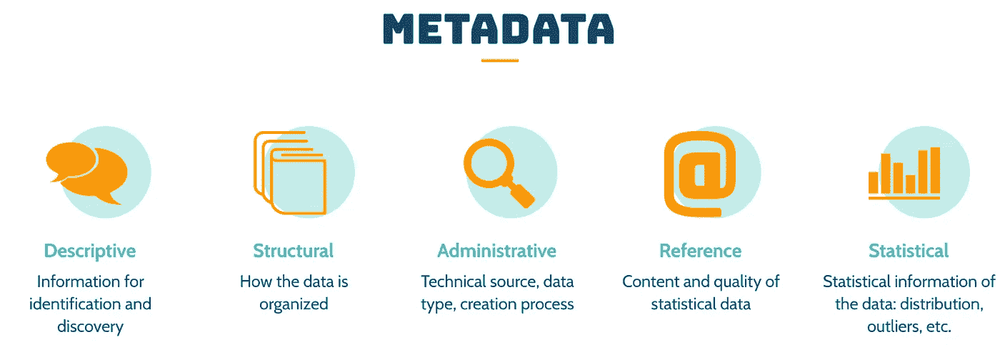
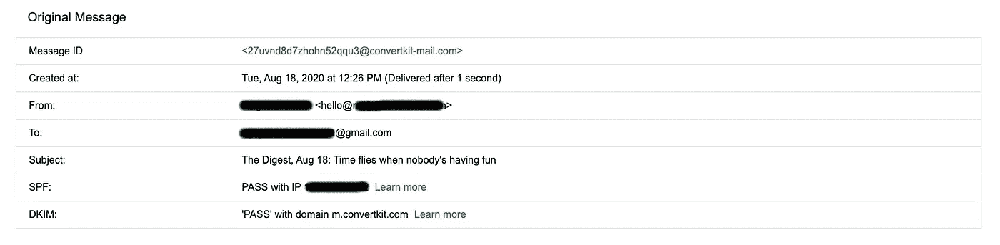
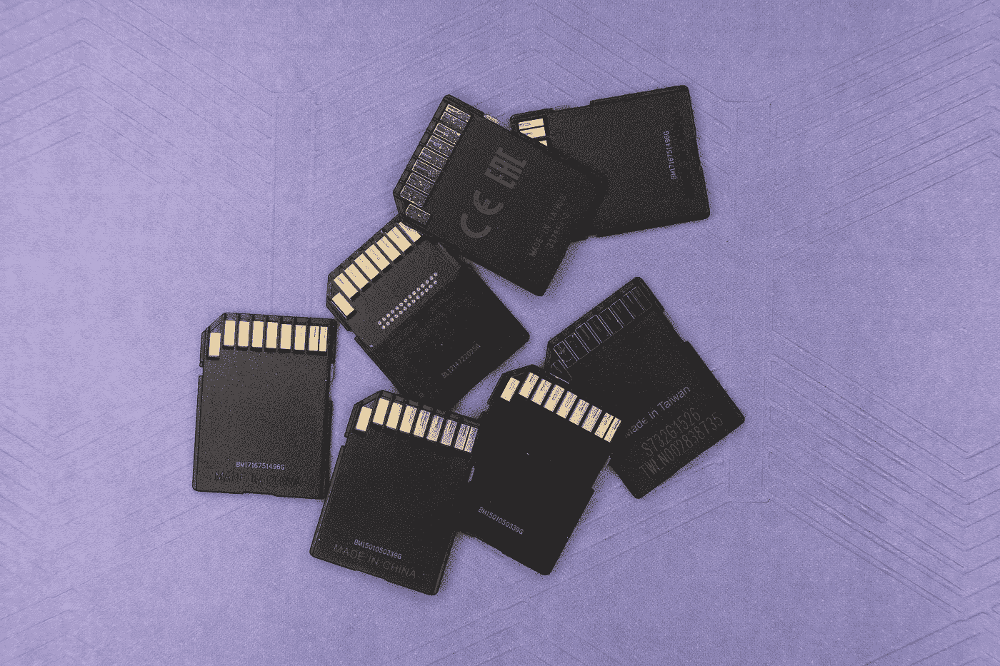
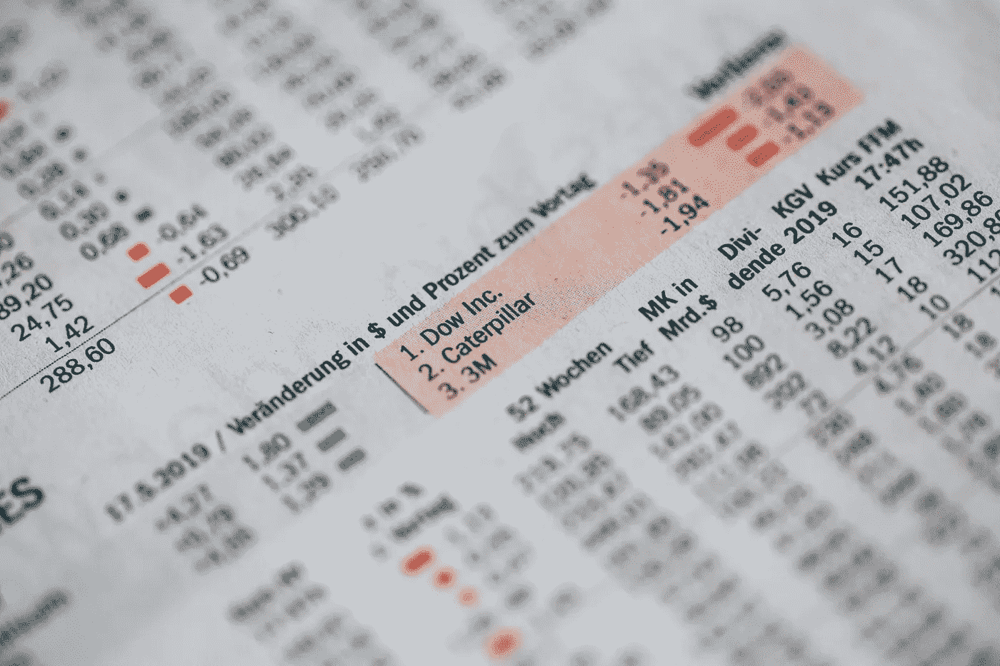

# 想掌握自己的数据？这就是你应该关心元数据的原因

> 原文：<https://towardsdatascience.com/want-to-master-your-data-heres-why-you-should-care-about-metadata-8fcd7754c3b8?source=collection_archive---------33----------------------->

## 比了解自己更了解自己的数据


[马太·亨利](https://unsplash.com/@matthewhenry?utm_source=unsplash&utm_medium=referral&utm_content=creditCopyText)在 [Unsplash](https://unsplash.com/?utm_source=unsplash&utm_medium=referral&utm_content=creditCopyText) 上拍照

E 不管你是数据科学家、数据工程师还是对数据感兴趣的人，[了解你的数据](https://3danim8.wordpress.com/2016/09/20/how-to-achieve-better-data-comprehension-part-1/)是你不想忽视的一件事。我们通常把数据看成是数字、文本或者图像，但数据不仅仅是这些。

我们应该将数据视为一个独立的实体。数据可以做自我介绍，[讲故事](https://www.forbes.com/sites/brentdykes/2016/03/31/data-storytelling-the-essential-data-science-skill-everyone-needs/)，可视化趋势。为了达到这些结果，您必须首先了解您的数据。不仅仅是它是如何形成的或它的起源，而是它将如何随着时间的推移而改变，以及它的可用性。其中一些信息就是我们所说的元数据。

为什么[元数据](https://www.opendatasoft.com/blog/2016/08/25/what-is-metadata-and-why-is-it-important-data)如此重要？为什么我们必须在掌握数据之前掌握元数据？今天，我将向您展示我们如何在数据业务中利用元数据。

# 元数据到底是什么？

根据[维基百科](https://en.wikipedia.org/wiki/Metadata)，元数据是“*提供其他数据*信息的数据”。是**“关于数据的数据”**。这听起来很简单，不是吗？所有数据都包含特定事物的信息。对于元数据，那个特定的东西是另一个数据。

然而，元数据本身的定义也各不相同。它可以是数据集的名称、创建信息或数据点的[统计分布](https://en.wikipedia.org/wiki/Probability_distribution)。它可以是与数据属性相关的任何内容。也就是说，所有数据都必须拥有元数据。但这并不总是详尽的情况。

> 没有元数据的数据总是不完整的。



元数据的类型。归功于作者。

我们使用数据是希望提取有用的见解，以及数据理解的目的。元数据有助于我们维护数据的完整性，验证事实的来源，或者保持稳定的数据质量。



电子邮件元数据的一个例子。归功于作者。

然而，在某些情况下，数据用户忽略了元数据的作用。他们认为它只是标签，它带来的价值是有限的。接下来我们将看到元数据如何与数据的另一个重要方面相关联:[数据质量](https://profisee.com/data-quality-what-why-how-who/)。

# 数据质量

再次，[维基百科](https://en.wikipedia.org/wiki/Data_quality)说:“*数据质量是指定性或定量信息片段的状态*”一般来说，当“无论数据用户是谁，数据都符合预期的用例”时，就被认为是高质量的。

数据是有价值的信息来源，但是没有人愿意使用一堆垃圾。你越想从数据中提取信息，数据质量就越重要。在大数据的世界里，这也成为一个瓶颈。



马库斯·温克勒在 [Unsplash](https://unsplash.com/?utm_source=unsplash&utm_medium=referral&utm_content=creditCopyText) 上拍摄的照片

随着数据越来越大，元数据也越来越多。我们不习惯处理大量的元数据。既然它需要一种特殊的处理，我们必须考虑它同时是数据而不是数据。元数据不是独立的信息，而是数据的附件。我们有可能将其扩展为对数据质量的评估。

> 数据是有价值的信息来源，但是没有人愿意使用一堆垃圾

在培养大数据管道的高数据质量的共同努力中，科技公司对这个新课题给予了很多关注。从检测异常到自动警报系统，我们希望尽可能少地限制错误数据的影响。没有数据理解，或者准确地说，没有元数据，我们无法做到这一点。

[](https://eng.uber.com/monitoring-data-quality-at-scale/) [## 利用统计建模大规模监控数据质量

### 糟糕的数据无法做出好的商业决策。在优步，我们使用汇总和匿名数据来指导…

eng.uber.com](https://eng.uber.com/monitoring-data-quality-at-scale/) 

数据质量反映在许多方面，但最常见的是数值的正确性。想象你绘制了一个学期内大学生成绩的直方图。直方图是这些值的统计表示，它描述了您的数据。它变成了元数据。您可能要解释的是分数的分布，然后您可以得出结论，它是否适合您的用例。


[使用直方图了解您的数据](https://statisticsbyjim.com/basics/histograms/)

事先要问很多关于数据值的问题。这些值随着时间的推移是稳定的吗？有没有异常值？如果是，我们应该如何处理这些异常值？通过回答这些问题，我们获得了一些见解，不是信息方面的，而是数据方面的。我们可以创造元数据，有用的元数据。这只是通过元数据断言数据质量的原始步骤。我们将在下一节详细讨论如何利用我们可以生成的元数据。

# 如何利用元数据

有些人可能会被我们从数据集中提取的各种统计数据所淹没。其他人可能会忽略这些额外的信息，认为它们是无用的。诚然，我们不需要每次处理数据时都绘制直方图，但这很有帮助。为了利用有洞察力的元数据，数据用户必须首先回答三个重要问题:

*   ***什么:*** *你想验证你的数据质量吗？有些数据需要严格的稳定性，而有些数据需要注意是否正确。对于每一种数据，我们将提取的信息作为元数据。统计分布、长期趋势、差异等。这就是我们所说的**元数据策略**。在处理数据和元数据时，我们的存储和人力资源有限。所以，一定要慎重考虑重点放在哪里。*
*   ***如何:*** *我们如何衡量数据质量？*这些操作遵循元数据策略。我们可以选择测量整个数据库，或者一些表，或者一组特定的列。值的总数、字符串的最大/最小长度、缺失数据的比例。我们决定衡量什么取决于我们如何使用这些数据来产生结果。
*   ***何时:*** 数据随时间变化。当我们通过元数据提取洞察力时，我们正在跟踪这些转变。我们什么时候跟踪元数据？每天？每小时吗？每个季度？这取决于多少粒度足以解决数据质量问题。我们根据数据变化的速度来调整我们的衡量标准。例如，每一分钟或每一秒钟都需要跟踪股票市场数据。天气数据每小时都在变化，而航空数据可能需要几个月或几年的时间才能改变。



股票市场数据需要每分钟都被跟踪。马库斯·斯皮斯克在 [Unsplash](https://unsplash.com/?utm_source=unsplash&utm_medium=referral&utm_content=creditCopyText) 上的照片

元数据有着悠久的历史，但我们最近才发现它对[数据管理](https://www.ngdata.com/what-is-data-management/)的贡献，尤其是对数据质量的贡献。元数据本身不能改变数据的结果，但它在我们的原始数据和它的使用之间增加了一个安全和管理层。您甚至可能在不知不觉中使用元数据来发现您的数据。

当数据很小时，数据质量可能无关紧要，但是当处理大量数据时，数据质量就变得至关重要。元数据帮助我们跟踪这种增长，并确保数据按照应有的方式发展。由于未能利用元数据，我们无法理解您的数据。

# 元数据该怎么处理？

如果您希望掌握您的数据，您应该开始系统地处理元数据。基于我们上面看到的框架，你为自己选择一个合适的数据策略。还没有什么新奇的东西。它始于您希望如何使用您的数据，以及您如何控制其使用质量。 ***一切始于目标。***

ETL 过程中有一个阶段叫做 [**探索性数据分析**](https://en.wikipedia.org/wiki/Exploratory_data_analysis) 。我觉得更多地了解你们数据的统计方面很有意思。它似乎接近我们希望通过元数据了解的内容。

我总是看到我的数据科学家和/或数据分析师朋友在对他们的原始数据做任何事情之前先从 EDA 开始。所以我认为这肯定是一个重要的步骤，我想知道它是如何与我的元数据框架相联系的。他们有很多共同之处。

首先是目的。EDA 中的“探索性”部分与元数据的发现目标不谋而合。其次是他们如何看待数据的统计方面，以评估其未来的用途。综上所述，EDA 实际上是一个必不可少的步骤，因为它类似于基于元数据的数据质量评估。

您已经有了数据策略和数据评估，现在是您决定如何处理所有这些信息的时候了。在数据质量控制人员看来，数据将如何被使用决定了它是否正当和可信。

```
***Key takeaways:*** - Build your data strategy based on data usability
- Apply an EDA - Exploratory Data Analysis to evaluate the data
- Decide on whether you have a solid confidence on your data
```

# 结论

我已经分享了我对元数据的一些观点。对我来说，它和数据本身一样有价值。那些利用这些价值的人是理解他们的数据的人。误用我们不理解的东西更容易。元数据为我们提供了更清晰的数据视图，此外还有数据质量、完整性和可用性。

我的名字叫 Nam Nguyen，我写的主要是关于大数据的文章。享受你的阅读？请在 Medium 和 Twitter 上关注我，了解更多更新。