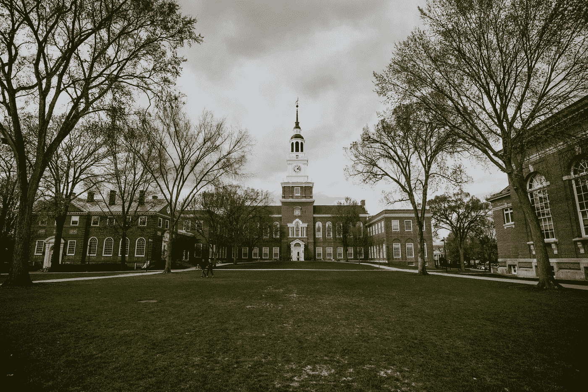

# 我的数据科学硕士学位值得吗？

> 原文：<https://towardsdatascience.com/was-my-data-science-masters-degree-worth-it-6b524dd35b33?source=collection_archive---------12----------------------->

## 一连串的课程，现实生活中的收获，以及这一切是否最终值得



罗尼·库尔茨在 [Unsplash](https://unsplash.com/s/photos/campus?utm_source=unsplash&utm_medium=referral&utm_content=creditCopyText) 上拍摄的照片。

# 目录

1.  介绍
2.  数据科学
3.  课程
4.  职业
5.  摘要
6.  参考

# 介绍

我去了南方卫理公会大学(SMU)攻读我的[数据科学硕士学位](https://datascience.smu.edu/)【2】。这个决定是在做了几年分析化学家后做出的。虽然我本科主修生物学，辅修化学和汉语，但我一直专注于研究科学和实验设计。当我发现自己不满足于做一名化学家时，我开始寻找其他的职业，以及如何才能达到相应的职业。我研究了数据分析、软件工程和数据科学。在我目前的工作岗位上，我已经从这三个可能的职业中演绎了相似的概念，但我甚至连一次面试的机会都没有。为了解决我的问题，我不得不最终寻找正规教育。下面，我将讨论数据科学对我来说意味着什么，我在大学里学的课程，以及这些经历是否适用于今天并最终值得。

# 数据科学

*我已经编写了几篇关于数据科学的文章，以及该领域、机器学习和数据分析之间的差异和相似之处，以及对在线学习的影响。除了我将在本文末尾列出的具体文章之外，请随意查看我的个人资料。*

根据我的经验，数据科学可以最好地概括为一个领域，在这个领域中，通过使用来自工具和语言的库和包，传统的统计和数学实现了自动化，例如:

```
Python, R, sklearn (scikit-learn), TensorFlow, Keras, and pandas. 
```

虽然该领域不断变化，但解决问题、编程、统计和业务理解等共同主题处于数据科学核心的最前沿。对我来说，可能有几个地方我可以获得所有这些技能。我申请了数据科学学位，因为我没有接受过正式的 it 本科教育，我想提升自己，并在竞争激烈的就业市场中具有竞争力。

# 课程


Max Duzij 在[Unsplash](https://unsplash.com/s/photos/programming?utm_source=unsplash&utm_medium=referral&utm_content=creditCopyText)【3】上的照片。

虽然我会列出 SMU 大学的具体课程，但大多数课程在类似的大学和项目中会有重叠。在我的项目中，不仅有各种各样的课程，还有两个主要的专业:机器学习和商业分析。第一部分侧重于数据科学的编码方面以及所使用的公共库，而第二部分强调项目设计的重要性，以及它将如何为您未来的数据公司带来商业价值。如果你想在同一所或不同的大学找到类似的课程，我还会强调哪些课程是我认为对现实生活最有益和最有用的。

我将首先谈论核心课程，然后将包括选修课。

**核心班级:**

*   *数据科学的统计基础*

这是您首先学习的课程之一，因为为了学习数据科学的有趣和有趣的算法，您需要在初级数据科学和统计学方面有坚实的基础。本课程的关键要点是统计抽样、方差分析(ANOVA)、回归和结果交流，主要工具是 SAS 和 r。

> 我很惊讶这门课有多棒，我强烈建议在学习任何数据科学之前先学习统计学。例如，当面试官问你如何开发方差分析时，你会认为你只需要专注于编写深度学习算法，这也会让你在面试中变得更受欢迎。

*   *做数据科学*

另一门课是在我的课程开始时上的，这门课强调了探索性数据分析(EDA)在任何数据科学项目的第一部分是多么重要。要真正开始使用像随机森林或 K-means 这样的算法，你需要有一个你理解的可用数据集，EDA 可以帮助你有一个强大的数据集，你可以在其上运行模型。

*   *应用统计学:推理与建模*

这门课重在统计，也许是学生最纠结的地方。这里的目标不是编程，而是回归、时间序列和商业应用案例。我在这里学到的一件有趣的事情是使用自回归移动平均模型(ARIMA)预测股票市场。

*   *文件组织&数据库管理*

虽然之前的课程以统计为目标，同时使用 SAS 和 R 等工具和语言，但本课程涵盖了 SQL、Python 和 GitHub。

> 设置您的数据科学项目不是从数据集开始，而是从使用 SQL 查询开发数据集开始。

*   *机器学习 I*

也许是最有趣的核心课程，这门课程讲述了所有常见的机器学习算法，如支持向量机(SVM)、多项式朴素贝叶斯和逻辑回归。

*   *信息可视化*

学会如何将你的复杂结果传达给利益相关者是很重要的，所以学会如何可视化可以在很大程度上帮助解决这个问题。大多数工作你可以使用 Tableau、Google Data Studio 等工具，甚至可以用 Python 编写自己的程序，使用 matplotlib 等流行的库，用 Java 编写代码。

*   *量化世界*

本课程总结了您所学的所有基础知识，并总结了如何处理数据、清理数据、执行 EDA 以及对数据集建模。这也是你开始你的顶点项目的地方，在其他大学也可能被称为你的论文。

**选修课:**

我不会去特别在这些，但他们提到了 SMU 的网站。我认为这里最重要的课程是自然语言处理(NLP)。根据我的经验，一些数据科学家会避开它，但是在你的工作中，你很可能会遇到文本数据，并且必须处理大量的文本数据。这实际上是我最喜欢的数据科学方面，可以帮助分析文档、分类文本和返回情感。以下是我参加的课程中包含的选修课:

*   云计算
*   机器学习 2
*   统计抽样
*   自然语言处理
*   商业分析
*   R 时间序列分析
*   数据和网络

# 职业


照片由[克里斯蒂娜@ wocintechchat.com](https://unsplash.com/@wocintechchat?utm_source=unsplash&utm_medium=referral&utm_content=creditCopyText)在[Unsplash](https://unsplash.com/s/photos/business-woman?utm_source=unsplash&utm_medium=referral&utm_content=creditCopyText)【4】上拍摄。

> 为了回答这个问题，我的数据科学硕士学位值得吗？是的。

这个项目的第一个好处是我可以在工作的时候在线完成。教育可能相当昂贵，所以我非常高兴知道我仍然在学习的同时赚钱。我确实为每堂课做了现场视频交流，并参加了现场活动，这使我在职业生涯中获得了这个学位的下一个好处。参加这个项目的会议，除了和来自知名公司的同学一起工作，我很快建立了我的数据科学家网络。其中一次会议实际上是我们不得不介绍的课程— *顶点*。在那里，我和另外两个同学介绍了我们关于如何对假新闻进行分类的话题，这都是因为我的学位和各自的研究。

在我的简历上有这么大的一个项目和出版物是非常有价值的，我可以向其他数据科学家和我采访的人进行交流和描述。因为我在高教育水平下获得了一个纯粹专注于数据科学的学位，所以我能够在 Indeed，HomeAway (Vrbo)以及现在我工作的地方找到工作，这是一家位于德克萨斯州奥斯汀的成功创业公司，名为 ScaleFactor 。如果没有成功完成这个项目，我不知道我会在哪里。它让我成为一名受过教育的专业数据科学家。

# 摘要

虽然由于各种原因，这条道路可能不是每个人的最佳选择，但我相信对我来说，这是我成为数据科学家的原因。一路上，我学到了很多，建立了令人敬畏的关系，甚至交了更好的朋友。*所以是的，这是值得的*。我希望这篇文章对你有用，感谢你的阅读！请从我这里找到这些文章，它们包括数据科学、数据分析、机器学习的差异和相似之处，以及下面分别在线学习数据科学的影响和结果[5]、[6]和[7]。

[](/data-science-vs-data-analysis-heres-the-difference-4d3da0a90f4) [## 数据科学与数据分析。区别就在这里。

### 数据科学家和数据分析师的主要区别和相同点是什么？阅读下面的概述…

towardsdatascience.com](/data-science-vs-data-analysis-heres-the-difference-4d3da0a90f4) [](/data-science-vs-machine-learning-heres-the-difference-530883d6de3a) [## 数据科学 vs 机器学习。区别就在这里。

### 数据科学家和机器学习工程师的主要区别和相同点是什么？阅读以下内容，了解…

towardsdatascience.com](/data-science-vs-machine-learning-heres-the-difference-530883d6de3a) [](/yes-you-can-become-a-data-scientist-online-heres-how-dc73c7faae0f) [## 是的，你可以在网上成为一名数据科学家。以下是方法。

### 在线学习的专业数据科学家指导您在家开始数据科学生涯

towardsdatascience.com](/yes-you-can-become-a-data-scientist-online-heres-how-dc73c7faae0f) 

# 参考

[1]照片由[罗尼·库尔兹](https://unsplash.com/@ronnikurtz?utm_source=unsplash&utm_medium=referral&utm_content=creditCopyText)在[Unsplash](https://unsplash.com/s/photos/campus?utm_source=unsplash&utm_medium=referral&utm_content=creditCopyText)(2019)拍摄

[2]南方卫理公会大学，[在线数据科学硕士](https://datascience.smu.edu/)，(2020)

[3]Max Duzij 在 [Unsplash](https://unsplash.com/s/photos/programming?utm_source=unsplash&utm_medium=referral&utm_content=creditCopyText) 上拍摄的照片，(2019)

[4]照片由[克里斯蒂娜@ wocintechchat.com](https://unsplash.com/@wocintechchat?utm_source=unsplash&utm_medium=referral&utm_content=creditCopyText)在[Unsplash](https://unsplash.com/s/photos/business-woman?utm_source=unsplash&utm_medium=referral&utm_content=creditCopyText)(2019)上拍摄

[5] M.Przybyla，[数据科学家 vs 数据分析师。区别就在这里。](/data-science-vs-data-analysis-heres-the-difference-4d3da0a90f4)(2020 年)

[6] M.Przybyla，[数据科学 vs 机器学习。区别就在这里。](/data-science-vs-machine-learning-heres-the-difference-530883d6de3a)(2020 年)

[7] M.Przybyla，[是的，你可以在网上成为一名数据科学家。以下是方法。](/yes-you-can-become-a-data-scientist-online-heres-how-dc73c7faae0f)(2020 年)